# Linear Regression


## Conceptual Exercises

### Exercise 1.

Recall the model for the `Advertising` data:

$$sales = \beta_0 + \beta_1 \times TV + \beta_2 \times radio + \beta_3 \times newspaper + \epsilon$$

After fitting the model, we found out this results:

|             | Coefficient | Std. error | t-statistic |  p-value  |
|:-----------:|:-----------:|:----------:|:-----------:|:---------:|
|  Intercept  |   2.939     |   0.3119   |    9.42     |  < 0.001  |
|  TV         |   0.046     |   0.0014   |   32.81     |  < 0.001  |
|  radio      |   0.189     |   0.0086   |   21.89     |  < 0.001  |
|  newspaper  |   -0.001    |   0.0059   |  -0.18      |   0.8599  |
Table: Least square coefficient estimates of the linear model

The null hypotheses to which the p-values given in the table correspond is 

$$H_0 : \beta_0 = \beta_1 = \beta_2 = \beta_3 = 0$$

versus

$$H_1 : \beta_0 \neq 0, \beta_1 \neq 0, \beta_2 \neq 0 ~\text{and}~ \beta_3 \neq 0$$

This p-values means that the two features _TV_ and _radio_ are significant for the `Advertising` data. However, the feature _newspaper_ is not statistically significant. So, this varible does not have an influence on the _sales_. 

### Exercise 2.

In both the $K$ nearest neighbors regression and classification, the beginning point is to identifies the $K$ points that are the closest to a given points $x_0$. Let call this set $\mathcal{N}_0$. But, the quantity of interest is to not same. In the regression setting, we are interested by the estimation of $\hat{f}(x_0)$. This is done by averaging the values of the $K$ closest points of $x_0$.
$$\hat{f}(x_0) = \frac{1}{K}\sum_{x_i \in \mathcal{N}_0} y_i$$

In the classification setting, we first aim to predict the probability of belonging to some class $j$. This is done by counting the proportion of the $K$ closest points of $x_0$ that belong to the class $j$.

$$\mathbb{P}(Y = j \mid X = x_0) = \frac{1}{K}\sum_{x_i \in \mathcal{N}_0}\mathcal{1}(y_i = j)$$

Finally, using the Bayes rules, we classify $x_0$ in the class with the largest probability.

### Exercise 3.

The linear model is:

$$Y = \widehat{\beta}_0 + \sum_{i = 1}^{5}\widehat{\beta}_iX_i.$$

* *Question (a)*

For a fixed value of _IQ_ ($X_2$) and _GPA_ ($X_1$), females earn more on average than males because the coefficient of _Gender_ ($X_3$) is positive. However, for a fixed value of _IQ_ ($X_2$) and _GPA_ ($X_1$), males earn more on average than females provided that the _GPA_ is high enough (larger than 3.5) because the coefficient of the interaction between _GPA_ and _Gender_ ($X_5$) is negative.

* *Question (b)*

The salary of a woman with IQ of 110 and a GPA of 4.0 is (in thousands of dollars):

$$Y = 50 + 20\times 4.0 + 0.07\times 110 + 35\times 1 + 0.01\times 4.0\times 110 - 10\times 4.0\times 1 = 137.1.$$

* *Question (c)*

With only the value of $\widehat{\beta}_4$, we can not conclude on the evidence of an GPA/IQ interaction effect on the starting salary after graduation even if this value is very small. To test that, we should compute the F-statistic and the corresponding p-value. If the p-value is very low (usually under 0.05), there is a clear evidence of the relationship between the GPA/IQ interaction and the salary. 

### Exercise 4.

* *Question (a) and (b)*

The true relationship between $X$ and $Y$ is linear. So, the cubic regression model will overfit. For the training, we expect the RSS for the cubic model to be lower than the one of the linear model because it will follow the noise more closely. However, on the test set, it should be the opposite. 

* *Question (c) and (d)*

The true relationship between $X$ and $Y$ is not linear. As before, the cubic regression should have a lower train RSS because this model is more flexible than the linear model. However, we can not tell which one will be lower for the test set because it depends on "how far the data is from linear". If the true relationship is almost linear, the test RSS will be lower for the linear model and conversely, if the true relationship is closer to the cubic model, the test RSS will be lower for the cubic model. 

### Exercise 5.

$$ \widehat{y}_i = x_i\widehat{\beta} = x_i \frac{\sum_{j=1}^n x_jy_j}{\sum_{k=1}^n x^2_k} = \sum_{j=1}^n\frac{x_jx_i}{\sum_{k=1}^n x^2_k}y_j$$

So, $a_j = \frac{x_jx_i}{\sum_{k=1}^n x^2_k}$. We interpret this result by saying that the fitted values from linear regression are linear combinations of the response values.

### Exercise 6.

The simple linear model is: $y_i = \beta_0 + \beta_1x_i$. The estimator of $\beta_0$ and $\beta_1$ are:

$$\widehat{\beta_0} = \bar{y} - \widehat{\beta_1}\bar{x} \quad\text{and}\quad \widehat{\beta_1} = \frac{\sum_{i=1}^n (x_i - \bar{x})(y_i - \bar{y})}{\sum_{i=1}^n (x_i - \bar{x})^2}$$

Let's predict the value of $y_i$ for $x_i = \bar{x}$.

$$\widehat{\beta_0} + \widehat{\beta_1}\bar{x} = \bar{y} - \widehat{\beta_1}\bar{x} + \widehat{\beta_1}\bar{x} = \bar{y}$$

So, the least squares line always passes through the point $(\bar{x}, \bar{y})$.

### Exercise 7.

Assume that $\bar{x} = \bar{y} = 0$. 

$$R^2 = 1 - \frac{\sum(y_i - \widehat{y}_i)^2}{\sum y_i^2} = \frac{\sum y_i^2 - \sum y_i^2 + 2\sum y_i\widehat{y}_i - \sum\widehat{y}_i^2}{\sum y_i^2}$$

We know that $\widehat{y}_i = x_i\widehat{\beta}$. So

$$ R^2 = \frac{2\sum y_ix_i\widehat{\beta} - \sum x_i^2\widehat{\beta^2}}{\sum y_i^2} = \widehat{\beta}\frac{2\sum y_ix_i - \sum x_i^2\widehat{\beta}}{\sum y_i^2}$$

Replace $\widehat{\beta}$ by $\frac{\sum y_ix_i}{\sum x_i^2}$, and $\sum x_i^2\widehat{\beta} = \sum x_iy_i$. Finally,

$$R^2 = \frac{2(\sum x_iy_i)^2 - (\sum x_iy_i)^2}{\sum x_i^2\sum y_i^2} = \frac{(\sum x_iy_i)^2}{\sum x_i^2\sum y_i^2} = Corr^2$$

In the case of simple linear regression of $Y$ onto $X$, the $R^2$ statistic is equal to the square of the correlation between $X$ and $Y$.


## Applied Exercises

### Exercise 8.

This exercise is about fitting a simple linear model to the `Auto` dataset. It contains 392 observations of 9 variables about vehicles. For a description of the variables, please refer to **R** by typing `help(Auto)` after loading the package `ISLR`. 


* *Question (a)*


```r
lm_model <- lm(mpg ~ horsepower, data = auto)
lm_model %>% summary() %>% print_summary_lm()
```

Results of the linear model on the **auto** dataset.<ul><li> *Formula*: mpg ~ horsepower </li><li> *Residuals* </li><div style="overflow-x:auto;">
<table class="table table-striped table-hover table-condensed table-responsive" style="margin-left: auto; margin-right: auto;">
 <thead>
  <tr>
   <th style="text-align:left;"> Name </th>
   <th style="text-align:right;"> NA_num </th>
   <th style="text-align:right;"> Unique </th>
   <th style="text-align:right;"> Range </th>
   <th style="text-align:right;"> Mean </th>
   <th style="text-align:right;"> Variance </th>
   <th style="text-align:right;"> Minimum </th>
   <th style="text-align:right;"> Q05 </th>
   <th style="text-align:right;"> Q10 </th>
   <th style="text-align:right;"> Q25 </th>
   <th style="text-align:right;"> Q50 </th>
   <th style="text-align:right;"> Q75 </th>
   <th style="text-align:right;"> Q90 </th>
   <th style="text-align:right;"> Q95 </th>
   <th style="text-align:right;"> Maximum </th>
  </tr>
 </thead>
<tbody>
  <tr>
   <td style="text-align:left;"> Residuals </td>
   <td style="text-align:right;"> 0 </td>
   <td style="text-align:right;"> 333 </td>
   <td style="text-align:right;"> 30.5 </td>
   <td style="text-align:right;"> 0 </td>
   <td style="text-align:right;"> 24 </td>
   <td style="text-align:right;"> -13.57 </td>
   <td style="text-align:right;"> -6.99 </td>
   <td style="text-align:right;"> -5.97 </td>
   <td style="text-align:right;"> -3.26 </td>
   <td style="text-align:right;"> -0.34 </td>
   <td style="text-align:right;"> 2.76 </td>
   <td style="text-align:right;"> 7.11 </td>
   <td style="text-align:right;"> 8.77 </td>
   <td style="text-align:right;"> 16.92 </td>
  </tr>
</tbody>
</table>
</div>

<li> *Coefficients* </li><div style="overflow-x:auto;">
<table class="table table-striped table-hover table-condensed table-responsive" style="margin-left: auto; margin-right: auto;">
 <thead>
  <tr>
   <th style="text-align:left;"> Variable </th>
   <th style="text-align:right;"> Estimate </th>
   <th style="text-align:right;"> Std. Error </th>
   <th style="text-align:right;"> t value </th>
   <th style="text-align:left;"> Pr(&gt;|t|) </th>
  </tr>
 </thead>
<tbody>
  <tr>
   <td style="text-align:left;"> (Intercept) </td>
   <td style="text-align:right;"> 39.93586 </td>
   <td style="text-align:right;"> 0.71750 </td>
   <td style="text-align:right;"> 55.65984 </td>
   <td style="text-align:left;"> &lt; 2.22e-16 </td>
  </tr>
  <tr>
   <td style="text-align:left;"> horsepower </td>
   <td style="text-align:right;"> -0.15784 </td>
   <td style="text-align:right;"> 0.00645 </td>
   <td style="text-align:right;"> -24.48914 </td>
   <td style="text-align:left;"> &lt; 2.22e-16 </td>
  </tr>
</tbody>
</table>
</div>

<li> *Residual standard error*: 4.906 on 390 degrees of freedom. </li><li> *Multiple $R^2$*: 0.606.</li><li> *Adjusted $R^2$*: 0.605.</li><li> *F-statistic*: 599.718 on 1 and 390, p-value: <2e-16. </li></ul>

We test the hypothesis $H_0: \beta_1 = 0$. We use the F-statistic to determine whether or not we should reject the null hypothesis. As the p-value associated with the the F-statistic is very low, there is a clear evidence of a relationship between _mpg_ and _horsepower_. There are two measures of model accuracy to characterize how strong is the relationship between the response and the variable, the RSE and the $R^2$. For the linear model, the RSE is 4.91 _mpg_. The mean value for _mpg_ is 23.45, it indicates a percentage error of roughly 21%. Then, the $R^2$ statistic is equal to 0.61. So, _horsepower_ explains roughly 61% of the variance in _mpg_. The variable _horsepower_ has a negative relationship with the response _mpg_ because $\beta_1 < 0$. The predicted value of _mpg_ for _horsepower_ = 98 is 24.47. The 95% confidence interval is (23.97, 24.96) and the 95% prediction interval is (14.81, 34.12).

* *Question (b)*

<div class="figure" style="text-align: center">
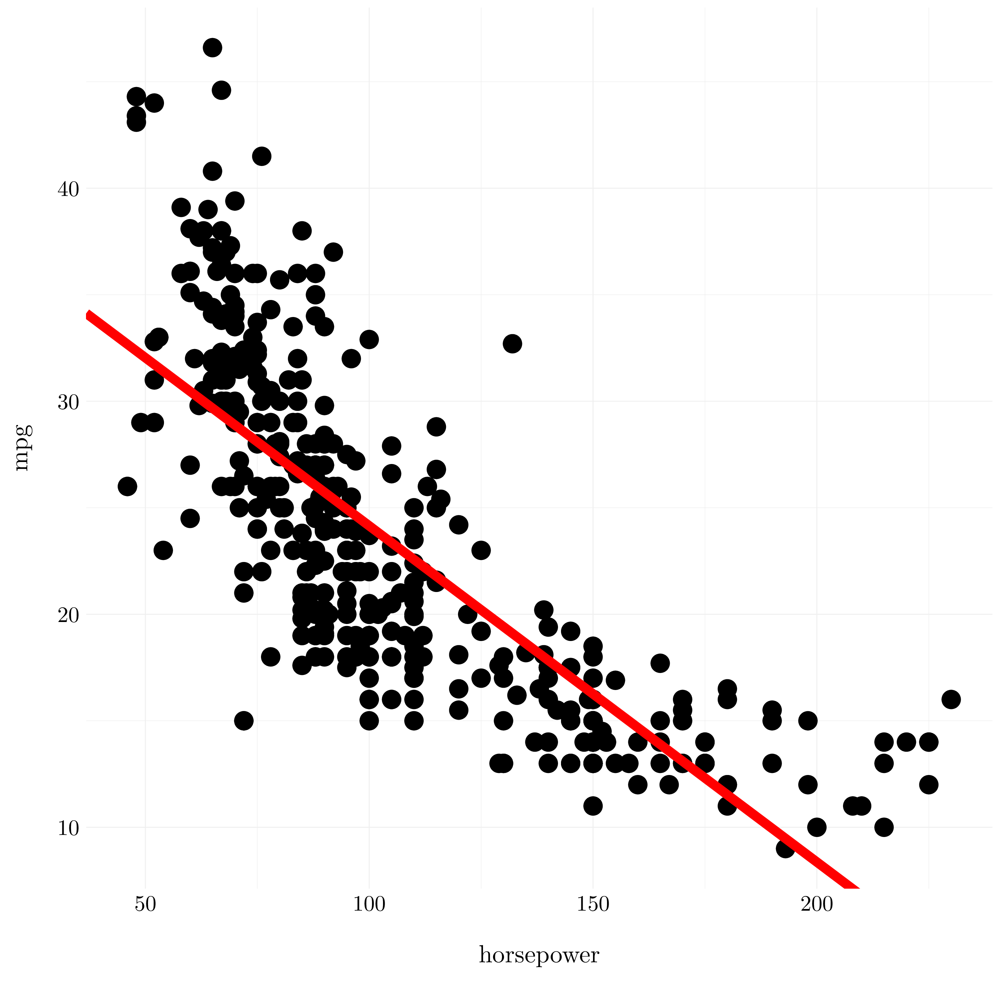
<p class="caption">(\#fig:ex8b)Least square regression plot for the *auto* dataset.</p>
</div>

* *Question (c)*

<div class="figure" style="text-align: center">
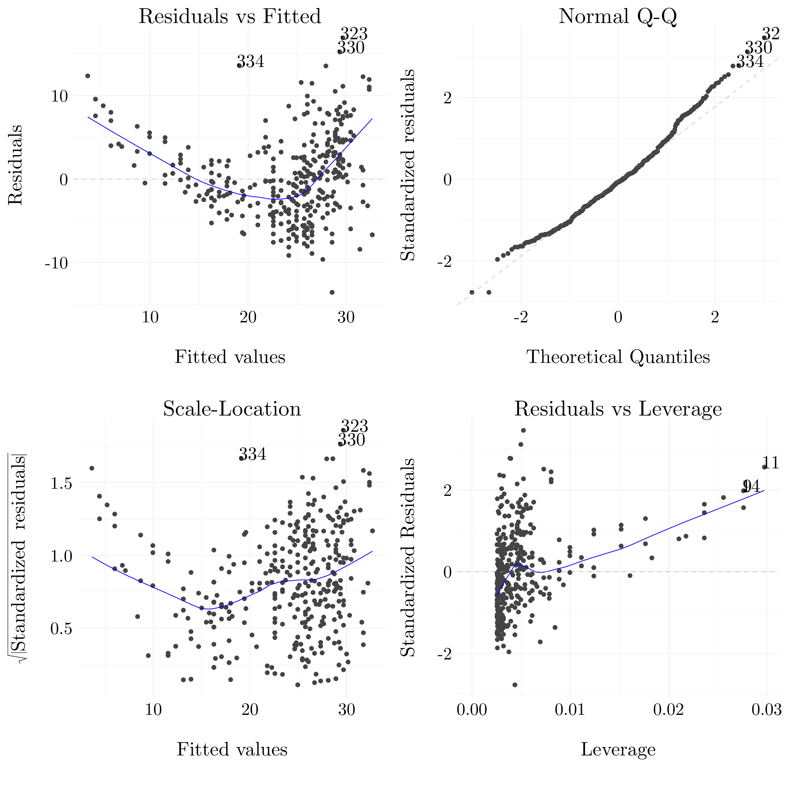
<p class="caption">(\#fig:ex8c)Diagnostic plots of the least square regression fit.</p>
</div>

The plot of the fitted values agains the residuals shows a non-linear pattern in the data. So, non-linear transformation of the data, such as a quadratic transformation, could improve the fit. It does not seem to have another trouble with the fit, maybe one observation with a quite large Cook distance but that's all.

### Exercise 9.

This exercise is about fitting a multiple linear model to the `Auto` dataset. It contains 392 observations of 9 variables about vehicles. For a description of the variables, please refer to **R** by typing `help(Auto)` after loading the package `ISLR`. 


* *Question (a)*

<div class="figure" style="text-align: center">
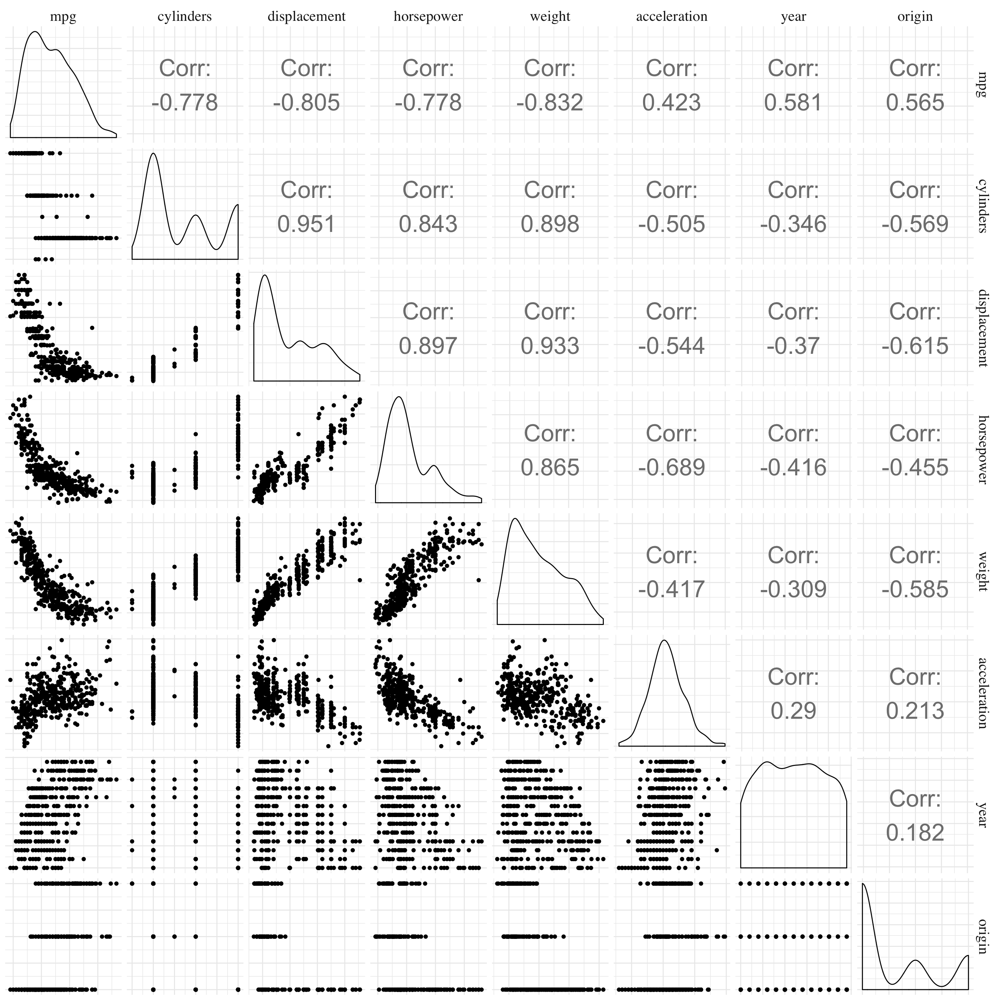
<p class="caption">(\#fig:ex9a)Scatterplot matrix.</p>
</div>

* *Question (b)*

<center>
<div class="figure" style="text-align: center">
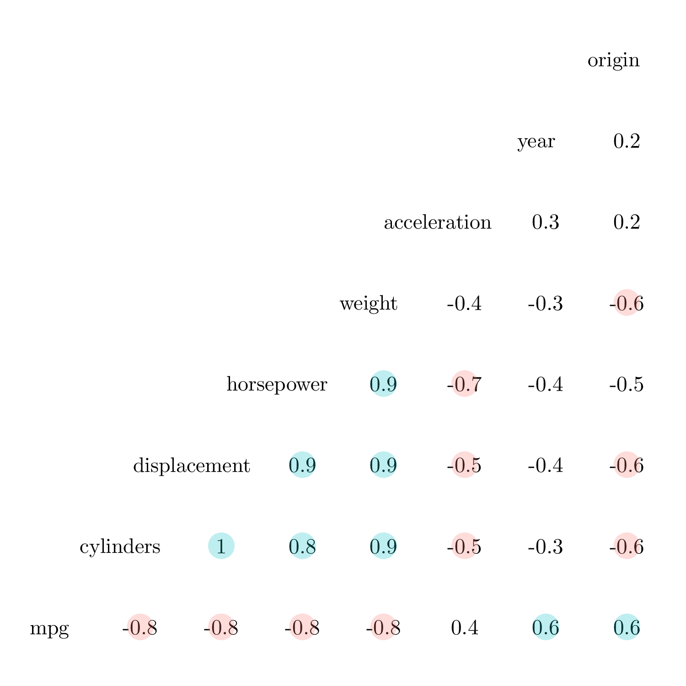
<p class="caption">(\#fig:ex9b)Correlation plot.</p>
</div>
</center>

* *Question (c)*


```r
lm_model <- lm(mpg ~ ., data = auto)
lm_model %>% summary() %>% print_summary_lm()
```

Results of the linear model on the **auto** dataset.<ul><li> *Formula*: mpg ~ . </li><li> *Residuals* </li><div style="overflow-x:auto;">
<table class="table table-striped table-hover table-condensed table-responsive" style="margin-left: auto; margin-right: auto;">
 <thead>
  <tr>
   <th style="text-align:left;"> Name </th>
   <th style="text-align:right;"> NA_num </th>
   <th style="text-align:right;"> Unique </th>
   <th style="text-align:right;"> Range </th>
   <th style="text-align:right;"> Mean </th>
   <th style="text-align:right;"> Variance </th>
   <th style="text-align:right;"> Minimum </th>
   <th style="text-align:right;"> Q05 </th>
   <th style="text-align:right;"> Q10 </th>
   <th style="text-align:right;"> Q25 </th>
   <th style="text-align:right;"> Q50 </th>
   <th style="text-align:right;"> Q75 </th>
   <th style="text-align:right;"> Q90 </th>
   <th style="text-align:right;"> Q95 </th>
   <th style="text-align:right;"> Maximum </th>
  </tr>
 </thead>
<tbody>
  <tr>
   <td style="text-align:left;"> Residuals </td>
   <td style="text-align:right;"> 0 </td>
   <td style="text-align:right;"> 392 </td>
   <td style="text-align:right;"> 22.65 </td>
   <td style="text-align:right;"> 0 </td>
   <td style="text-align:right;"> 10.88 </td>
   <td style="text-align:right;"> -9.59 </td>
   <td style="text-align:right;"> -5.09 </td>
   <td style="text-align:right;"> -3.79 </td>
   <td style="text-align:right;"> -2.16 </td>
   <td style="text-align:right;"> -0.12 </td>
   <td style="text-align:right;"> 1.87 </td>
   <td style="text-align:right;"> 3.79 </td>
   <td style="text-align:right;"> 5.27 </td>
   <td style="text-align:right;"> 13.06 </td>
  </tr>
</tbody>
</table>
</div>

<li> *Coefficients* </li><div style="overflow-x:auto;">
<table class="table table-striped table-hover table-condensed table-responsive" style="margin-left: auto; margin-right: auto;">
 <thead>
  <tr>
   <th style="text-align:left;"> Variable </th>
   <th style="text-align:right;"> Estimate </th>
   <th style="text-align:right;"> Std. Error </th>
   <th style="text-align:right;"> t value </th>
   <th style="text-align:left;"> Pr(&gt;|t|) </th>
  </tr>
 </thead>
<tbody>
  <tr>
   <td style="text-align:left;"> (Intercept) </td>
   <td style="text-align:right;"> -17.21843 </td>
   <td style="text-align:right;"> 4.64429 </td>
   <td style="text-align:right;"> -3.70744 </td>
   <td style="text-align:left;"> 0.00024018 </td>
  </tr>
  <tr>
   <td style="text-align:left;"> cylinders </td>
   <td style="text-align:right;"> -0.49338 </td>
   <td style="text-align:right;"> 0.32328 </td>
   <td style="text-align:right;"> -1.52615 </td>
   <td style="text-align:left;"> 0.12779647 </td>
  </tr>
  <tr>
   <td style="text-align:left;"> displacement </td>
   <td style="text-align:right;"> 0.01990 </td>
   <td style="text-align:right;"> 0.00752 </td>
   <td style="text-align:right;"> 2.64743 </td>
   <td style="text-align:left;"> 0.00844465 </td>
  </tr>
  <tr>
   <td style="text-align:left;"> horsepower </td>
   <td style="text-align:right;"> -0.01695 </td>
   <td style="text-align:right;"> 0.01379 </td>
   <td style="text-align:right;"> -1.22951 </td>
   <td style="text-align:left;"> 0.21963282 </td>
  </tr>
  <tr>
   <td style="text-align:left;"> weight </td>
   <td style="text-align:right;"> -0.00647 </td>
   <td style="text-align:right;"> 0.00065 </td>
   <td style="text-align:right;"> -9.92879 </td>
   <td style="text-align:left;"> &lt; 2.22e-16 </td>
  </tr>
  <tr>
   <td style="text-align:left;"> acceleration </td>
   <td style="text-align:right;"> 0.08058 </td>
   <td style="text-align:right;"> 0.09884 </td>
   <td style="text-align:right;"> 0.81517 </td>
   <td style="text-align:left;"> 0.41547802 </td>
  </tr>
  <tr>
   <td style="text-align:left;"> year </td>
   <td style="text-align:right;"> 0.75077 </td>
   <td style="text-align:right;"> 0.05097 </td>
   <td style="text-align:right;"> 14.72880 </td>
   <td style="text-align:left;"> &lt; 2.22e-16 </td>
  </tr>
  <tr>
   <td style="text-align:left;"> origin </td>
   <td style="text-align:right;"> 1.42614 </td>
   <td style="text-align:right;"> 0.27814 </td>
   <td style="text-align:right;"> 5.12749 </td>
   <td style="text-align:left;"> 4.6657e-07 </td>
  </tr>
</tbody>
</table>
</div>

<li> *Residual standard error*: 3.328 on 384 degrees of freedom. </li><li> *Multiple $R^2$*: 0.821.</li><li> *Adjusted $R^2$*: 0.818.</li><li> *F-statistic*: 252.428 on 7 and 384, p-value: <2e-16. </li></ul>

We have fitted a multiple regression model of _mpg_ onto all the other variables in the `auto` dataset. In order to say that there is a relationship between the features and the response, we should test the hypothesis of all $\beta_i = 0$. For the model, the p-value associated with the F-statistic is less than $2\times 10^{-16}$. So, there is a clear evidence of a relationship between _mpg_ and the features. There are four variables that have a statistically significant relationship with the reponse (because they have a very low p-value). These variables are _displacement_, _weight_, _year_ and _origin_. The coefficient for the _year_ variable suggest that the _mpg_ grows with the year, so recent cars consume less than old cars.

* *Question (d)*

<div class="figure" style="text-align: center">
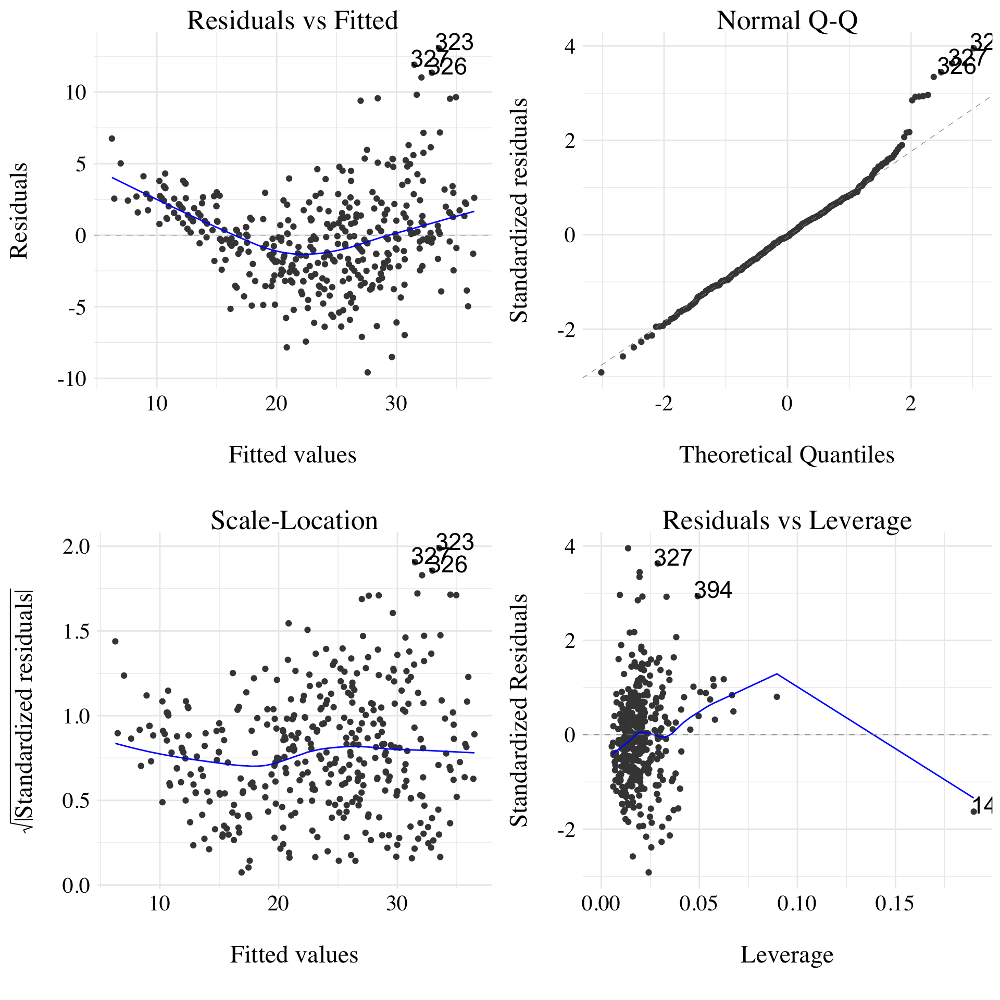
<p class="caption">(\#fig:ex9d)Diagnotistic plots of the multiple least square regression fit.</p>
</div>

There is a little trend in the residuals, meaning that the linear model may not be the best model to fit on the data. Moreover, the variance of error terms seems to be non-constant. Based on this two observations, some transformation of the data could be a good idea. There is no outliers, but the point 14 appears to be a high leverage point.

* *Question (e)*


```r
# Recall that cylinders:year stands for the inclusion of the interaction term between 
# cylinders and years in the regression. cylinders*year adds the cylinders, year and 
# cylinders:year to the model. .:. adds all the interactions to the model and .*. adds 
# all the variable and their interaction to the model.
lm_model_int <- lm(mpg ~ .*., data = auto)
lm_model_int %>% summary() %>% print_summary_lm()
```

Results of the linear model on the **auto** dataset.<ul><li> *Formula*: mpg ~ . * . </li><li> *Residuals* </li><div style="overflow-x:auto;">
<table class="table table-striped table-hover table-condensed table-responsive" style="margin-left: auto; margin-right: auto;">
 <thead>
  <tr>
   <th style="text-align:left;"> Name </th>
   <th style="text-align:right;"> NA_num </th>
   <th style="text-align:right;"> Unique </th>
   <th style="text-align:right;"> Range </th>
   <th style="text-align:right;"> Mean </th>
   <th style="text-align:right;"> Variance </th>
   <th style="text-align:right;"> Minimum </th>
   <th style="text-align:right;"> Q05 </th>
   <th style="text-align:right;"> Q10 </th>
   <th style="text-align:right;"> Q25 </th>
   <th style="text-align:right;"> Q50 </th>
   <th style="text-align:right;"> Q75 </th>
   <th style="text-align:right;"> Q90 </th>
   <th style="text-align:right;"> Q95 </th>
   <th style="text-align:right;"> Maximum </th>
  </tr>
 </thead>
<tbody>
  <tr>
   <td style="text-align:left;"> Residuals </td>
   <td style="text-align:right;"> 0 </td>
   <td style="text-align:right;"> 392 </td>
   <td style="text-align:right;"> 18.77 </td>
   <td style="text-align:right;"> 0 </td>
   <td style="text-align:right;"> 6.74 </td>
   <td style="text-align:right;"> -7.63 </td>
   <td style="text-align:right;"> -4.12 </td>
   <td style="text-align:right;"> -3.2 </td>
   <td style="text-align:right;"> -1.45 </td>
   <td style="text-align:right;"> 0.06 </td>
   <td style="text-align:right;"> 1.27 </td>
   <td style="text-align:right;"> 2.73 </td>
   <td style="text-align:right;"> 4 </td>
   <td style="text-align:right;"> 11.14 </td>
  </tr>
</tbody>
</table>
</div>

<li> *Coefficients* </li><div style="overflow-x:auto;">
<table class="table table-striped table-hover table-condensed table-responsive" style="margin-left: auto; margin-right: auto;">
 <thead>
  <tr>
   <th style="text-align:left;"> Variable </th>
   <th style="text-align:right;"> Estimate </th>
   <th style="text-align:right;"> Std. Error </th>
   <th style="text-align:right;"> t value </th>
   <th style="text-align:left;"> Pr(&gt;|t|) </th>
  </tr>
 </thead>
<tbody>
  <tr>
   <td style="text-align:left;"> (Intercept) </td>
   <td style="text-align:right;"> 35.47889 </td>
   <td style="text-align:right;"> 53.13579 </td>
   <td style="text-align:right;"> 0.66770 </td>
   <td style="text-align:left;"> 0.5047479 </td>
  </tr>
  <tr>
   <td style="text-align:left;"> cylinders </td>
   <td style="text-align:right;"> 6.98858 </td>
   <td style="text-align:right;"> 8.24797 </td>
   <td style="text-align:right;"> 0.84731 </td>
   <td style="text-align:left;"> 0.3973815 </td>
  </tr>
  <tr>
   <td style="text-align:left;"> displacement </td>
   <td style="text-align:right;"> -0.47854 </td>
   <td style="text-align:right;"> 0.18935 </td>
   <td style="text-align:right;"> -2.52722 </td>
   <td style="text-align:left;"> 0.0119207 </td>
  </tr>
  <tr>
   <td style="text-align:left;"> horsepower </td>
   <td style="text-align:right;"> 0.50343 </td>
   <td style="text-align:right;"> 0.34700 </td>
   <td style="text-align:right;"> 1.45082 </td>
   <td style="text-align:left;"> 0.1476933 </td>
  </tr>
  <tr>
   <td style="text-align:left;"> weight </td>
   <td style="text-align:right;"> 0.00413 </td>
   <td style="text-align:right;"> 0.01759 </td>
   <td style="text-align:right;"> 0.23490 </td>
   <td style="text-align:left;"> 0.8144183 </td>
  </tr>
  <tr>
   <td style="text-align:left;"> acceleration </td>
   <td style="text-align:right;"> -5.85917 </td>
   <td style="text-align:right;"> 2.17362 </td>
   <td style="text-align:right;"> -2.69558 </td>
   <td style="text-align:left;"> 0.0073536 </td>
  </tr>
  <tr>
   <td style="text-align:left;"> year </td>
   <td style="text-align:right;"> 0.69743 </td>
   <td style="text-align:right;"> 0.60967 </td>
   <td style="text-align:right;"> 1.14395 </td>
   <td style="text-align:left;"> 0.2533996 </td>
  </tr>
  <tr>
   <td style="text-align:left;"> origin </td>
   <td style="text-align:right;"> -20.89557 </td>
   <td style="text-align:right;"> 7.09709 </td>
   <td style="text-align:right;"> -2.94424 </td>
   <td style="text-align:left;"> 0.0034459 </td>
  </tr>
  <tr>
   <td style="text-align:left;"> cylinders:displacement </td>
   <td style="text-align:right;"> -0.00338 </td>
   <td style="text-align:right;"> 0.00646 </td>
   <td style="text-align:right;"> -0.52412 </td>
   <td style="text-align:left;"> 0.6005130 </td>
  </tr>
  <tr>
   <td style="text-align:left;"> cylinders:horsepower </td>
   <td style="text-align:right;"> 0.01161 </td>
   <td style="text-align:right;"> 0.02420 </td>
   <td style="text-align:right;"> 0.47993 </td>
   <td style="text-align:left;"> 0.6315682 </td>
  </tr>
  <tr>
   <td style="text-align:left;"> cylinders:weight </td>
   <td style="text-align:right;"> 0.00036 </td>
   <td style="text-align:right;"> 0.00090 </td>
   <td style="text-align:right;"> 0.39918 </td>
   <td style="text-align:left;"> 0.6899953 </td>
  </tr>
  <tr>
   <td style="text-align:left;"> cylinders:acceleration </td>
   <td style="text-align:right;"> 0.27787 </td>
   <td style="text-align:right;"> 0.16642 </td>
   <td style="text-align:right;"> 1.66969 </td>
   <td style="text-align:left;"> 0.0958433 </td>
  </tr>
  <tr>
   <td style="text-align:left;"> cylinders:year </td>
   <td style="text-align:right;"> -0.17413 </td>
   <td style="text-align:right;"> 0.09714 </td>
   <td style="text-align:right;"> -1.79250 </td>
   <td style="text-align:left;"> 0.0738852 </td>
  </tr>
  <tr>
   <td style="text-align:left;"> cylinders:origin </td>
   <td style="text-align:right;"> 0.40217 </td>
   <td style="text-align:right;"> 0.49262 </td>
   <td style="text-align:right;"> 0.81638 </td>
   <td style="text-align:left;"> 0.4148169 </td>
  </tr>
  <tr>
   <td style="text-align:left;"> displacement:horsepower </td>
   <td style="text-align:right;"> -0.00008 </td>
   <td style="text-align:right;"> 0.00029 </td>
   <td style="text-align:right;"> -0.29434 </td>
   <td style="text-align:left;"> 0.7686659 </td>
  </tr>
  <tr>
   <td style="text-align:left;"> displacement:weight </td>
   <td style="text-align:right;"> 0.00002 </td>
   <td style="text-align:right;"> 0.00001 </td>
   <td style="text-align:right;"> 1.68205 </td>
   <td style="text-align:left;"> 0.0934193 </td>
  </tr>
  <tr>
   <td style="text-align:left;"> displacement:acceleration </td>
   <td style="text-align:right;"> -0.00348 </td>
   <td style="text-align:right;"> 0.00334 </td>
   <td style="text-align:right;"> -1.04107 </td>
   <td style="text-align:left;"> 0.2985339 </td>
  </tr>
  <tr>
   <td style="text-align:left;"> displacement:year </td>
   <td style="text-align:right;"> 0.00593 </td>
   <td style="text-align:right;"> 0.00239 </td>
   <td style="text-align:right;"> 2.48202 </td>
   <td style="text-align:left;"> 0.0135156 </td>
  </tr>
  <tr>
   <td style="text-align:left;"> displacement:origin </td>
   <td style="text-align:right;"> 0.02398 </td>
   <td style="text-align:right;"> 0.01947 </td>
   <td style="text-align:right;"> 1.23200 </td>
   <td style="text-align:left;"> 0.2187484 </td>
  </tr>
  <tr>
   <td style="text-align:left;"> horsepower:weight </td>
   <td style="text-align:right;"> -0.00002 </td>
   <td style="text-align:right;"> 0.00003 </td>
   <td style="text-align:right;"> -0.67321 </td>
   <td style="text-align:left;"> 0.5012433 </td>
  </tr>
  <tr>
   <td style="text-align:left;"> horsepower:acceleration </td>
   <td style="text-align:right;"> -0.00721 </td>
   <td style="text-align:right;"> 0.00372 </td>
   <td style="text-align:right;"> -1.93920 </td>
   <td style="text-align:left;"> 0.0532521 </td>
  </tr>
  <tr>
   <td style="text-align:left;"> horsepower:year </td>
   <td style="text-align:right;"> -0.00584 </td>
   <td style="text-align:right;"> 0.00394 </td>
   <td style="text-align:right;"> -1.48218 </td>
   <td style="text-align:left;"> 0.1391606 </td>
  </tr>
  <tr>
   <td style="text-align:left;"> horsepower:origin </td>
   <td style="text-align:right;"> 0.00223 </td>
   <td style="text-align:right;"> 0.02930 </td>
   <td style="text-align:right;"> 0.07619 </td>
   <td style="text-align:left;"> 0.9393091 </td>
  </tr>
  <tr>
   <td style="text-align:left;"> weight:acceleration </td>
   <td style="text-align:right;"> 0.00023 </td>
   <td style="text-align:right;"> 0.00023 </td>
   <td style="text-align:right;"> 1.02518 </td>
   <td style="text-align:left;"> 0.3059597 </td>
  </tr>
  <tr>
   <td style="text-align:left;"> weight:year </td>
   <td style="text-align:right;"> -0.00022 </td>
   <td style="text-align:right;"> 0.00021 </td>
   <td style="text-align:right;"> -1.05568 </td>
   <td style="text-align:left;"> 0.2918156 </td>
  </tr>
  <tr>
   <td style="text-align:left;"> weight:origin </td>
   <td style="text-align:right;"> -0.00058 </td>
   <td style="text-align:right;"> 0.00159 </td>
   <td style="text-align:right;"> -0.36379 </td>
   <td style="text-align:left;"> 0.7162292 </td>
  </tr>
  <tr>
   <td style="text-align:left;"> acceleration:year </td>
   <td style="text-align:right;"> 0.05562 </td>
   <td style="text-align:right;"> 0.02558 </td>
   <td style="text-align:right;"> 2.17427 </td>
   <td style="text-align:left;"> 0.0303306 </td>
  </tr>
  <tr>
   <td style="text-align:left;"> acceleration:origin </td>
   <td style="text-align:right;"> 0.45832 </td>
   <td style="text-align:right;"> 0.15666 </td>
   <td style="text-align:right;"> 2.92555 </td>
   <td style="text-align:left;"> 0.0036547 </td>
  </tr>
  <tr>
   <td style="text-align:left;"> year:origin </td>
   <td style="text-align:right;"> 0.13926 </td>
   <td style="text-align:right;"> 0.07399 </td>
   <td style="text-align:right;"> 1.88212 </td>
   <td style="text-align:left;"> 0.0606197 </td>
  </tr>
</tbody>
</table>
</div>

<li> *Residual standard error*: 2.695 on 363 degrees of freedom. </li><li> *Multiple $R^2$*: 0.889.</li><li> *Adjusted $R^2$*: 0.881.</li><li> *F-statistic*: 104.2 on 28 and 363, p-value: <2e-16. </li></ul>

Three interactions appears to be statistically significant, _displacement:year_, _acceleration:origin_ and _acceleration:year_ because they have p-value smaller than 0.05. 

* *Question (f)*


```r
lm_model_squ <- lm(mpg ~ . + I(horsepower^2), data = auto)
lm_model_squ %>% summary() %>% print_summary_lm()
```

Results of the linear model on the **auto** dataset.<ul><li> *Formula*: mpg ~ . + I(horsepower^2) </li><li> *Residuals* </li><div style="overflow-x:auto;">
<table class="table table-striped table-hover table-condensed table-responsive" style="margin-left: auto; margin-right: auto;">
 <thead>
  <tr>
   <th style="text-align:left;"> Name </th>
   <th style="text-align:right;"> NA_num </th>
   <th style="text-align:right;"> Unique </th>
   <th style="text-align:right;"> Range </th>
   <th style="text-align:right;"> Mean </th>
   <th style="text-align:right;"> Variance </th>
   <th style="text-align:right;"> Minimum </th>
   <th style="text-align:right;"> Q05 </th>
   <th style="text-align:right;"> Q10 </th>
   <th style="text-align:right;"> Q25 </th>
   <th style="text-align:right;"> Q50 </th>
   <th style="text-align:right;"> Q75 </th>
   <th style="text-align:right;"> Q90 </th>
   <th style="text-align:right;"> Q95 </th>
   <th style="text-align:right;"> Maximum </th>
  </tr>
 </thead>
<tbody>
  <tr>
   <td style="text-align:left;"> Residuals </td>
   <td style="text-align:right;"> 0 </td>
   <td style="text-align:right;"> 392 </td>
   <td style="text-align:right;"> 20.55 </td>
   <td style="text-align:right;"> 0 </td>
   <td style="text-align:right;"> 8.82 </td>
   <td style="text-align:right;"> -8.55 </td>
   <td style="text-align:right;"> -4.62 </td>
   <td style="text-align:right;"> -3.6 </td>
   <td style="text-align:right;"> -1.73 </td>
   <td style="text-align:right;"> -0.22 </td>
   <td style="text-align:right;"> 1.59 </td>
   <td style="text-align:right;"> 3.22 </td>
   <td style="text-align:right;"> 5.26 </td>
   <td style="text-align:right;"> 12 </td>
  </tr>
</tbody>
</table>
</div>

<li> *Coefficients* </li><div style="overflow-x:auto;">
<table class="table table-striped table-hover table-condensed table-responsive" style="margin-left: auto; margin-right: auto;">
 <thead>
  <tr>
   <th style="text-align:left;"> Variable </th>
   <th style="text-align:right;"> Estimate </th>
   <th style="text-align:right;"> Std. Error </th>
   <th style="text-align:right;"> t value </th>
   <th style="text-align:left;"> Pr(&gt;|t|) </th>
  </tr>
 </thead>
<tbody>
  <tr>
   <td style="text-align:left;"> (Intercept) </td>
   <td style="text-align:right;"> 1.32366 </td>
   <td style="text-align:right;"> 4.62477 </td>
   <td style="text-align:right;"> 0.28621 </td>
   <td style="text-align:left;"> 0.77487184 </td>
  </tr>
  <tr>
   <td style="text-align:left;"> cylinders </td>
   <td style="text-align:right;"> 0.34891 </td>
   <td style="text-align:right;"> 0.30483 </td>
   <td style="text-align:right;"> 1.14459 </td>
   <td style="text-align:left;"> 0.25309407 </td>
  </tr>
  <tr>
   <td style="text-align:left;"> displacement </td>
   <td style="text-align:right;"> -0.00756 </td>
   <td style="text-align:right;"> 0.00737 </td>
   <td style="text-align:right;"> -1.02598 </td>
   <td style="text-align:left;"> 0.30554979 </td>
  </tr>
  <tr>
   <td style="text-align:left;"> horsepower </td>
   <td style="text-align:right;"> -0.31946 </td>
   <td style="text-align:right;"> 0.03434 </td>
   <td style="text-align:right;"> -9.30168 </td>
   <td style="text-align:left;"> &lt; 2.22e-16 </td>
  </tr>
  <tr>
   <td style="text-align:left;"> weight </td>
   <td style="text-align:right;"> -0.00327 </td>
   <td style="text-align:right;"> 0.00068 </td>
   <td style="text-align:right;"> -4.82000 </td>
   <td style="text-align:left;"> 2.0735e-06 </td>
  </tr>
  <tr>
   <td style="text-align:left;"> acceleration </td>
   <td style="text-align:right;"> -0.33060 </td>
   <td style="text-align:right;"> 0.09918 </td>
   <td style="text-align:right;"> -3.33315 </td>
   <td style="text-align:left;"> 0.00094235 </td>
  </tr>
  <tr>
   <td style="text-align:left;"> year </td>
   <td style="text-align:right;"> 0.73534 </td>
   <td style="text-align:right;"> 0.04599 </td>
   <td style="text-align:right;"> 15.98852 </td>
   <td style="text-align:left;"> &lt; 2.22e-16 </td>
  </tr>
  <tr>
   <td style="text-align:left;"> origin </td>
   <td style="text-align:right;"> 1.01441 </td>
   <td style="text-align:right;"> 0.25455 </td>
   <td style="text-align:right;"> 3.98505 </td>
   <td style="text-align:left;"> 8.0778e-05 </td>
  </tr>
  <tr>
   <td style="text-align:left;"> I(horsepower^2) </td>
   <td style="text-align:right;"> 0.00101 </td>
   <td style="text-align:right;"> 0.00011 </td>
   <td style="text-align:right;"> 9.44884 </td>
   <td style="text-align:left;"> &lt; 2.22e-16 </td>
  </tr>
</tbody>
</table>
</div>

<li> *Residual standard error*: 3.001 on 383 degrees of freedom. </li><li> *Multiple $R^2$*: 0.855.</li><li> *Adjusted $R^2$*: 0.852.</li><li> *F-statistic*: 282.813 on 8 and 383, p-value: <2e-16. </li></ul>

If we add the square transformation of the _horsepower_ variable to the model, the model seems to be significative (the p-value  of the F-statistic is still very low). The RSE is smaller for this model than for the linear model, however, it is still larger than the one of the model with all the interactions.

### Exercise 10.

This exercise is about fitting a multiple linear model to the `Carseats` dataset. It contains 400 observations of 11 variables about sales of child car seats at different stores. For a description of the variables, please refer to **R** by typing `help(Carseats)` after loading the package `ISLR`. 


* *Question (a)*


```r
lm_model <- lm(Sales ~ Price + Urban + US, data = carseats)
lm_model %>% summary() %>% print_summary_lm()
```

Results of the linear model on the **carseats** dataset.<ul><li> *Formula*: Sales ~ Price + Urban + US </li><li> *Residuals* </li><div style="overflow-x:auto;">
<table class="table table-striped table-hover table-condensed table-responsive" style="margin-left: auto; margin-right: auto;">
 <thead>
  <tr>
   <th style="text-align:left;"> Name </th>
   <th style="text-align:right;"> NA_num </th>
   <th style="text-align:right;"> Unique </th>
   <th style="text-align:right;"> Range </th>
   <th style="text-align:right;"> Mean </th>
   <th style="text-align:right;"> Variance </th>
   <th style="text-align:right;"> Minimum </th>
   <th style="text-align:right;"> Q05 </th>
   <th style="text-align:right;"> Q10 </th>
   <th style="text-align:right;"> Q25 </th>
   <th style="text-align:right;"> Q50 </th>
   <th style="text-align:right;"> Q75 </th>
   <th style="text-align:right;"> Q90 </th>
   <th style="text-align:right;"> Q95 </th>
   <th style="text-align:right;"> Maximum </th>
  </tr>
 </thead>
<tbody>
  <tr>
   <td style="text-align:left;"> Residuals </td>
   <td style="text-align:right;"> 0 </td>
   <td style="text-align:right;"> 400 </td>
   <td style="text-align:right;"> 13.98 </td>
   <td style="text-align:right;"> 0 </td>
   <td style="text-align:right;"> 6.07 </td>
   <td style="text-align:right;"> -6.92 </td>
   <td style="text-align:right;"> -3.93 </td>
   <td style="text-align:right;"> -3.19 </td>
   <td style="text-align:right;"> -1.62 </td>
   <td style="text-align:right;"> -0.06 </td>
   <td style="text-align:right;"> 1.58 </td>
   <td style="text-align:right;"> 3.18 </td>
   <td style="text-align:right;"> 4.24 </td>
   <td style="text-align:right;"> 7.06 </td>
  </tr>
</tbody>
</table>
</div>

<li> *Coefficients* </li><div style="overflow-x:auto;">
<table class="table table-striped table-hover table-condensed table-responsive" style="margin-left: auto; margin-right: auto;">
 <thead>
  <tr>
   <th style="text-align:left;"> Variable </th>
   <th style="text-align:right;"> Estimate </th>
   <th style="text-align:right;"> Std. Error </th>
   <th style="text-align:right;"> t value </th>
   <th style="text-align:left;"> Pr(&gt;|t|) </th>
  </tr>
 </thead>
<tbody>
  <tr>
   <td style="text-align:left;"> (Intercept) </td>
   <td style="text-align:right;"> 13.04347 </td>
   <td style="text-align:right;"> 0.65101 </td>
   <td style="text-align:right;"> 20.03567 </td>
   <td style="text-align:left;"> &lt; 2.22e-16 </td>
  </tr>
  <tr>
   <td style="text-align:left;"> Price </td>
   <td style="text-align:right;"> -0.05446 </td>
   <td style="text-align:right;"> 0.00524 </td>
   <td style="text-align:right;"> -10.38923 </td>
   <td style="text-align:left;"> &lt; 2.22e-16 </td>
  </tr>
  <tr>
   <td style="text-align:left;"> UrbanYes </td>
   <td style="text-align:right;"> -0.02192 </td>
   <td style="text-align:right;"> 0.27165 </td>
   <td style="text-align:right;"> -0.08068 </td>
   <td style="text-align:left;"> 0.93574 </td>
  </tr>
  <tr>
   <td style="text-align:left;"> USYes </td>
   <td style="text-align:right;"> 1.20057 </td>
   <td style="text-align:right;"> 0.25904 </td>
   <td style="text-align:right;"> 4.63467 </td>
   <td style="text-align:left;"> 4.8602e-06 </td>
  </tr>
</tbody>
</table>
</div>

<li> *Residual standard error*: 2.472 on 396 degrees of freedom. </li><li> *Multiple $R^2$*: 0.239.</li><li> *Adjusted $R^2$*: 0.234.</li><li> *F-statistic*: 41.519 on 3 and 396, p-value: <2e-16. </li></ul>

* *Question (b)*

The variable _Price_ seems to be very significative (p-value very close to 0) and its coefficient is negative (-0.0544588). So, a \$100 increase in price company charges for car seats is associated with an average decrease in sales by around 5446 units. The p-value of the coefficient for the dummy variable _UrbanYes_ is very close to 1. So, this indicates that there is no statistical evidence of a difference in unit sales (in thousands) of child car seats between the stores that are in urban or rural location. Finally, the variable _USYes_ is also significative and its coefficient is positive (1.2005727). So, if the store is in the US will increase the sales by around 1201 units.

* *Question (c)*

The fitted model is:

$$ y_i = \beta_0 + \beta_1x_{1, i} + \beta_2x_{2, i} + \beta_3x_{3, i} + \epsilon_i$$ 

where

* $y_i$ represents the _Sales_ (Unit sales in thousands at each location);

* $x_{1, i}$ represents the _Price_ (Price company charges for seats at each site);

* $x_{2, i} = 1$ if the store is in an urban location, $0$ is the store is in an rural location (_UrbanYes_);

* $x_{3, i} = 1$ if the store is in the US, $0$ if not (_USYes_).

* *Question (d)*

We can reject the null hypothesis for the variable _Price_ and _USYes_ (cf. question (b)).

* *Question (e)*


```r
lm_model2 <- lm(Sales ~ Price + US, data = carseats)
lm_model2 %>% summary() %>% print_summary_lm()
```

Results of the linear model on the **carseats** dataset.<ul><li> *Formula*: Sales ~ Price + US </li><li> *Residuals* </li><div style="overflow-x:auto;">
<table class="table table-striped table-hover table-condensed table-responsive" style="margin-left: auto; margin-right: auto;">
 <thead>
  <tr>
   <th style="text-align:left;"> Name </th>
   <th style="text-align:right;"> NA_num </th>
   <th style="text-align:right;"> Unique </th>
   <th style="text-align:right;"> Range </th>
   <th style="text-align:right;"> Mean </th>
   <th style="text-align:right;"> Variance </th>
   <th style="text-align:right;"> Minimum </th>
   <th style="text-align:right;"> Q05 </th>
   <th style="text-align:right;"> Q10 </th>
   <th style="text-align:right;"> Q25 </th>
   <th style="text-align:right;"> Q50 </th>
   <th style="text-align:right;"> Q75 </th>
   <th style="text-align:right;"> Q90 </th>
   <th style="text-align:right;"> Q95 </th>
   <th style="text-align:right;"> Maximum </th>
  </tr>
 </thead>
<tbody>
  <tr>
   <td style="text-align:left;"> Residuals </td>
   <td style="text-align:right;"> 0 </td>
   <td style="text-align:right;"> 400 </td>
   <td style="text-align:right;"> 13.98 </td>
   <td style="text-align:right;"> 0 </td>
   <td style="text-align:right;"> 6.07 </td>
   <td style="text-align:right;"> -6.93 </td>
   <td style="text-align:right;"> -3.94 </td>
   <td style="text-align:right;"> -3.17 </td>
   <td style="text-align:right;"> -1.63 </td>
   <td style="text-align:right;"> -0.06 </td>
   <td style="text-align:right;"> 1.58 </td>
   <td style="text-align:right;"> 3.17 </td>
   <td style="text-align:right;"> 4.23 </td>
   <td style="text-align:right;"> 7.05 </td>
  </tr>
</tbody>
</table>
</div>

<li> *Coefficients* </li><div style="overflow-x:auto;">
<table class="table table-striped table-hover table-condensed table-responsive" style="margin-left: auto; margin-right: auto;">
 <thead>
  <tr>
   <th style="text-align:left;"> Variable </th>
   <th style="text-align:right;"> Estimate </th>
   <th style="text-align:right;"> Std. Error </th>
   <th style="text-align:right;"> t value </th>
   <th style="text-align:left;"> Pr(&gt;|t|) </th>
  </tr>
 </thead>
<tbody>
  <tr>
   <td style="text-align:left;"> (Intercept) </td>
   <td style="text-align:right;"> 13.03079 </td>
   <td style="text-align:right;"> 0.63098 </td>
   <td style="text-align:right;"> 20.65179 </td>
   <td style="text-align:left;"> &lt; 2.22e-16 </td>
  </tr>
  <tr>
   <td style="text-align:left;"> Price </td>
   <td style="text-align:right;"> -0.05448 </td>
   <td style="text-align:right;"> 0.00523 </td>
   <td style="text-align:right;"> -10.41612 </td>
   <td style="text-align:left;"> &lt; 2.22e-16 </td>
  </tr>
  <tr>
   <td style="text-align:left;"> USYes </td>
   <td style="text-align:right;"> 1.19964 </td>
   <td style="text-align:right;"> 0.25846 </td>
   <td style="text-align:right;"> 4.64148 </td>
   <td style="text-align:left;"> 4.7072e-06 </td>
  </tr>
</tbody>
</table>
</div>

<li> *Residual standard error*: 2.469 on 397 degrees of freedom. </li><li> *Multiple $R^2$*: 0.239.</li><li> *Adjusted $R^2$*: 0.235.</li><li> *F-statistic*: 62.431 on 2 and 397, p-value: <2e-16. </li></ul>

* *Question (f)*

The two models fit equally well on the data, they have the same $R^2$ (this is another argument for dropping the variable _Urban_). However, we can consider that the second model is better because it uses less features.

* *Question (g)*

<table class="table table-striped table-hover table-condensed table-responsive" style="margin-left: auto; margin-right: auto;">
<caption>(\#tab:ex10g)95% confidence intervals for the coefficients</caption>
 <thead>
  <tr>
   <th style="text-align:left;">   </th>
   <th style="text-align:right;"> 2.5 % </th>
   <th style="text-align:right;"> 97.5 % </th>
  </tr>
 </thead>
<tbody>
  <tr>
   <td style="text-align:left;"> (Intercept) </td>
   <td style="text-align:right;"> 11.7903202 </td>
   <td style="text-align:right;"> 14.2712653 </td>
  </tr>
  <tr>
   <td style="text-align:left;"> Price </td>
   <td style="text-align:right;"> -0.0647598 </td>
   <td style="text-align:right;"> -0.0441954 </td>
  </tr>
  <tr>
   <td style="text-align:left;"> USYes </td>
   <td style="text-align:right;"> 0.6915196 </td>
   <td style="text-align:right;"> 1.7077663 </td>
  </tr>
</tbody>
</table>

* *Question (h)*

<div class="figure" style="text-align: center">
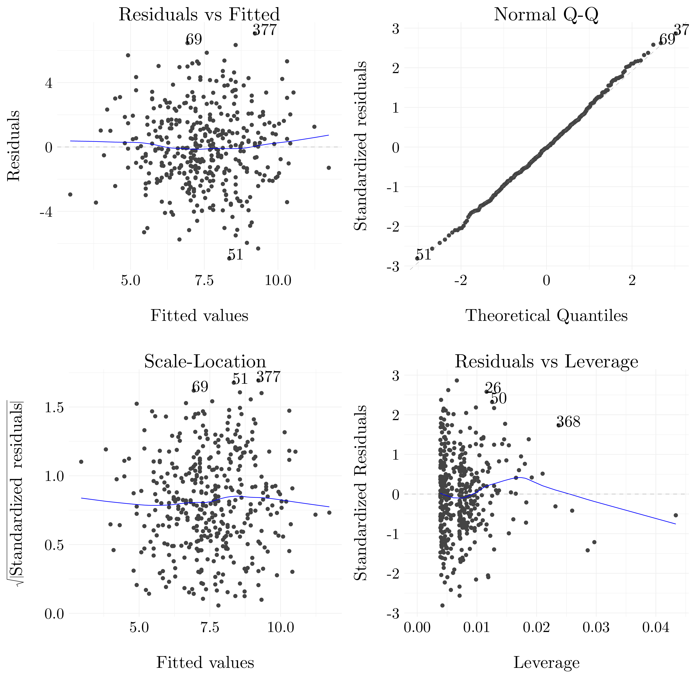
<p class="caption">(\#fig:ex10h)Diagnotistic plots of the multiple least square regression fit.</p>
</div>

After looking at the different diagnostic plots, there is no particular evidence of outliers or high leverage observations in the model. However, the linear model may not be the better model for this data.

### Exercise 11.

This exercise is about the t-statistic on models without intercept. For that, we will generate some data with the following "very" simple model:

$$y = 2x + \epsilon \quad\text{where}\quad \epsilon \sim \mathcal{N}(0,1).$$


```r
set.seed(42)
x <- rnorm(100)
y <- 2*x + rnorm(100)
```

* *Question (a)*


```r
lm_model_no_inter <- lm(y ~ x + 0)
lm_model_no_inter %>% summary() %>% print_summary_lm()
```

<ul><li> *Formula*: y ~ x + 0 </li><li> *Residuals* </li><div style="overflow-x:auto;">
<table class="table table-striped table-hover table-condensed table-responsive" style="margin-left: auto; margin-right: auto;">
 <thead>
  <tr>
   <th style="text-align:left;"> Name </th>
   <th style="text-align:right;"> NA_num </th>
   <th style="text-align:right;"> Unique </th>
   <th style="text-align:right;"> Range </th>
   <th style="text-align:right;"> Mean </th>
   <th style="text-align:right;"> Variance </th>
   <th style="text-align:right;"> Minimum </th>
   <th style="text-align:right;"> Q05 </th>
   <th style="text-align:right;"> Q10 </th>
   <th style="text-align:right;"> Q25 </th>
   <th style="text-align:right;"> Q50 </th>
   <th style="text-align:right;"> Q75 </th>
   <th style="text-align:right;"> Q90 </th>
   <th style="text-align:right;"> Q95 </th>
   <th style="text-align:right;"> Maximum </th>
  </tr>
 </thead>
<tbody>
  <tr>
   <td style="text-align:left;"> Residuals </td>
   <td style="text-align:right;"> 0 </td>
   <td style="text-align:right;"> 100 </td>
   <td style="text-align:right;"> 4.75 </td>
   <td style="text-align:right;"> -0.09 </td>
   <td style="text-align:right;"> 0.82 </td>
   <td style="text-align:right;"> -1.98 </td>
   <td style="text-align:right;"> -1.49 </td>
   <td style="text-align:right;"> -1.3 </td>
   <td style="text-align:right;"> -0.59 </td>
   <td style="text-align:right;"> -0.07 </td>
   <td style="text-align:right;"> 0.45 </td>
   <td style="text-align:right;"> 1.13 </td>
   <td style="text-align:right;"> 1.4 </td>
   <td style="text-align:right;"> 2.77 </td>
  </tr>
</tbody>
</table>
</div>

<li> *Coefficients* </li><div style="overflow-x:auto;">
<table class="table table-striped table-hover table-condensed table-responsive" style="margin-left: auto; margin-right: auto;">
 <thead>
  <tr>
   <th style="text-align:left;"> Variable </th>
   <th style="text-align:right;"> Estimate </th>
   <th style="text-align:right;"> Std. Error </th>
   <th style="text-align:right;"> t value </th>
   <th style="text-align:left;"> Pr(&gt;|t|) </th>
  </tr>
 </thead>
<tbody>
  <tr>
   <td style="text-align:left;"> x </td>
   <td style="text-align:right;"> 2.02449 </td>
   <td style="text-align:right;"> 0.0876 </td>
   <td style="text-align:right;"> 23.11114 </td>
   <td style="text-align:left;"> &lt; 2.22e-16 </td>
  </tr>
</tbody>
</table>
</div>

<li> *Residual standard error*: 0.908 on 99 degrees of freedom. </li><li> *Multiple $R^2$*: 0.844.</li><li> *Adjusted $R^2$*: 0.842.</li><li> *F-statistic*: 534.125 on 1 and 99, p-value: <2e-16. </li></ul>

The p-value associated with the null hypothesis $\beta = 0$ is very close to 0, so there is a strong evidence that the coefficient is statistically different from 0. The estimation of $\beta$ is 2.0244855 which is very close to the true value.

* *Question (b)*


```r
lm_model_no_inter2 <- lm(x ~ y + 0)
lm_model_no_inter2 %>% summary() %>% print_summary_lm()
```

<ul><li> *Formula*: x ~ y + 0 </li><li> *Residuals* </li><div style="overflow-x:auto;">
<table class="table table-striped table-hover table-condensed table-responsive" style="margin-left: auto; margin-right: auto;">
 <thead>
  <tr>
   <th style="text-align:left;"> Name </th>
   <th style="text-align:right;"> NA_num </th>
   <th style="text-align:right;"> Unique </th>
   <th style="text-align:right;"> Range </th>
   <th style="text-align:right;"> Mean </th>
   <th style="text-align:right;"> Variance </th>
   <th style="text-align:right;"> Minimum </th>
   <th style="text-align:right;"> Q05 </th>
   <th style="text-align:right;"> Q10 </th>
   <th style="text-align:right;"> Q25 </th>
   <th style="text-align:right;"> Q50 </th>
   <th style="text-align:right;"> Q75 </th>
   <th style="text-align:right;"> Q90 </th>
   <th style="text-align:right;"> Q95 </th>
   <th style="text-align:right;"> Maximum </th>
  </tr>
 </thead>
<tbody>
  <tr>
   <td style="text-align:left;"> Residuals </td>
   <td style="text-align:right;"> 0 </td>
   <td style="text-align:right;"> 100 </td>
   <td style="text-align:right;"> 2.4 </td>
   <td style="text-align:right;"> 0.04 </td>
   <td style="text-align:right;"> 0.17 </td>
   <td style="text-align:right;"> -1.57 </td>
   <td style="text-align:right;"> -0.6 </td>
   <td style="text-align:right;"> -0.49 </td>
   <td style="text-align:right;"> -0.21 </td>
   <td style="text-align:right;"> 0.07 </td>
   <td style="text-align:right;"> 0.32 </td>
   <td style="text-align:right;"> 0.55 </td>
   <td style="text-align:right;"> 0.66 </td>
   <td style="text-align:right;"> 0.83 </td>
  </tr>
</tbody>
</table>
</div>

<li> *Coefficients* </li><div style="overflow-x:auto;">
<table class="table table-striped table-hover table-condensed table-responsive" style="margin-left: auto; margin-right: auto;">
 <thead>
  <tr>
   <th style="text-align:left;"> Variable </th>
   <th style="text-align:right;"> Estimate </th>
   <th style="text-align:right;"> Std. Error </th>
   <th style="text-align:right;"> t value </th>
   <th style="text-align:left;"> Pr(&gt;|t|) </th>
  </tr>
 </thead>
<tbody>
  <tr>
   <td style="text-align:left;"> y </td>
   <td style="text-align:right;"> 0.41671 </td>
   <td style="text-align:right;"> 0.01803 </td>
   <td style="text-align:right;"> 23.11114 </td>
   <td style="text-align:left;"> &lt; 2.22e-16 </td>
  </tr>
</tbody>
</table>
</div>

<li> *Residual standard error*: 0.412 on 99 degrees of freedom. </li><li> *Multiple $R^2$*: 0.844.</li><li> *Adjusted $R^2$*: 0.842.</li><li> *F-statistic*: 534.125 on 1 and 99, p-value: <2e-16. </li></ul>

The value of the t-statistic is the same than for the previous model. So, we can reject the null hypothesis and the estimation of $\beta$ is, as before, quite close to the true value.

* *Question (c)*

We can write the model from the question (a) as $Y= \beta_1X + \epsilon$ and the one from the question (b) as $X = \beta_2Y + \epsilon$. The least square estimation of the parameters leads to $\widehat{\beta}_1 = (X^\top X)^{-1}X^\top Y$ and $\widehat{\beta}_2 = (Y^\top Y)^{-1}Y^\top X$. Moreover, we have that $X^\top Y = Y^\top X$. So, we have that:

$$\widehat{\beta}_1 = (X^\top X)^{-1}X^\top Y = Y^\top X(X^\top X)^{-1} = (Y^\top Y)\widehat{\beta}_2(X^\top X)^{-1}.$$

And finally, the relationship between $\widehat{\beta}_1$ and $\widehat{\beta}_2$ is:

$$\frac{\widehat{\beta}_1}{\widehat{\beta}_2} = (Y^\top Y)(X^\top X)^{-1},$$

which can be reduce to $\frac{Var(Y)}{Var(X)}$ in the univariate case.

* *Question (d)*


```r
t_stat <- (sqrt(100 - 1) * sum(x * y)) / (sqrt(sum(x * x)*sum(y * y) - sum(x * y)**2))
```

Numerically, we found out that the t-statistic is 23.111142 which is coherent with the result given by the `lm` funtion.

Algebraically, the derivations are pretty straightforward:
\begin{align}
\frac{\widehat{\beta}}{SE(\widehat{\beta})} &= \frac{\sum x_iy_i}{\sum x_i^2} \sqrt{\frac{(n-1)\sum x_i^2}{\sum (y_i - x_i\widehat{\beta})^2}} \\
&= \frac{\sqrt{n-1}\sum x_iy_i}{\sqrt{x_i^2}\sqrt{\sum y_i^2 - 2\frac{\sum x_iy_i}{\sum x_i^2}\sum x_iy_i + \left(\frac{\sum x_iy_i}{\sum x_i^2}\right)^2\sum x_i^2}} \\
&= \frac{\sqrt{n-1}\sum x_iy_i}{\sqrt{x_i^2}\sqrt{\sum y_i^2 - 2\frac{\left(\sum x_iy_i\right)^2}{\sum x_i^2} + \left(\frac{\sum x_iy_i}{\sum x_i^2}\right)^2\sum x_i^2}} \\
&= \frac{\sqrt{n-1}\sum x_iy_i}{\sqrt{\sum x_i^2\sum y_i^2 - 2\left(\sum x_iy_i\right)^2 + \left(\sum x_iy_i\right)^2}} \\
&= \frac{\sqrt{n-1}\sum x_iy_i}{\sqrt{\sum x_i^2\sum y_i^2 - \left(\sum x_iy_i\right)^2}}
\end{align}

* *Question (e)*

We can exchange $X$ and $Y$ in the formula of the t-statistic given in (d) without changing the results (which is the t-statistic). So, the t-statistic for the regression of $Y$ onto $X$ is the same as the t-statistic for the regression of $X$ onto $Y$.

* *Question (f)*


```r
lm_model <- lm(y ~ x)
lm_model %>% summary() %>% print_summary_lm()
```

<ul><li> *Formula*: y ~ x </li><li> *Residuals* </li><div style="overflow-x:auto;">
<table class="table table-striped table-hover table-condensed table-responsive" style="margin-left: auto; margin-right: auto;">
 <thead>
  <tr>
   <th style="text-align:left;"> Name </th>
   <th style="text-align:right;"> NA_num </th>
   <th style="text-align:right;"> Unique </th>
   <th style="text-align:right;"> Range </th>
   <th style="text-align:right;"> Mean </th>
   <th style="text-align:right;"> Variance </th>
   <th style="text-align:right;"> Minimum </th>
   <th style="text-align:right;"> Q05 </th>
   <th style="text-align:right;"> Q10 </th>
   <th style="text-align:right;"> Q25 </th>
   <th style="text-align:right;"> Q50 </th>
   <th style="text-align:right;"> Q75 </th>
   <th style="text-align:right;"> Q90 </th>
   <th style="text-align:right;"> Q95 </th>
   <th style="text-align:right;"> Maximum </th>
  </tr>
 </thead>
<tbody>
  <tr>
   <td style="text-align:left;"> Residuals </td>
   <td style="text-align:right;"> 0 </td>
   <td style="text-align:right;"> 100 </td>
   <td style="text-align:right;"> 4.75 </td>
   <td style="text-align:right;"> 0 </td>
   <td style="text-align:right;"> 0.82 </td>
   <td style="text-align:right;"> -1.89 </td>
   <td style="text-align:right;"> -1.4 </td>
   <td style="text-align:right;"> -1.21 </td>
   <td style="text-align:right;"> -0.51 </td>
   <td style="text-align:right;"> 0.01 </td>
   <td style="text-align:right;"> 0.54 </td>
   <td style="text-align:right;"> 1.21 </td>
   <td style="text-align:right;"> 1.49 </td>
   <td style="text-align:right;"> 2.86 </td>
  </tr>
</tbody>
</table>
</div>

<li> *Coefficients* </li><div style="overflow-x:auto;">
<table class="table table-striped table-hover table-condensed table-responsive" style="margin-left: auto; margin-right: auto;">
 <thead>
  <tr>
   <th style="text-align:left;"> Variable </th>
   <th style="text-align:right;"> Estimate </th>
   <th style="text-align:right;"> Std. Error </th>
   <th style="text-align:right;"> t value </th>
   <th style="text-align:left;"> Pr(&gt;|t|) </th>
  </tr>
 </thead>
<tbody>
  <tr>
   <td style="text-align:left;"> (Intercept) </td>
   <td style="text-align:right;"> -0.08837 </td>
   <td style="text-align:right;"> 0.09088 </td>
   <td style="text-align:right;"> -0.97237 </td>
   <td style="text-align:left;"> 0.33326 </td>
  </tr>
  <tr>
   <td style="text-align:left;"> x </td>
   <td style="text-align:right;"> 2.02716 </td>
   <td style="text-align:right;"> 0.08767 </td>
   <td style="text-align:right;"> 23.12391 </td>
   <td style="text-align:left;"> &lt; 2e-16 </td>
  </tr>
</tbody>
</table>
</div>

<li> *Residual standard error*: 0.908 on 98 degrees of freedom. </li><li> *Multiple $R^2$*: 0.845.</li><li> *Adjusted $R^2$*: 0.844.</li><li> *F-statistic*: 534.715 on 1 and 98, p-value: <2e-16. </li></ul>


```r
lm_model2 <- lm(x ~ y)
lm_model2 %>% summary() %>% print_summary_lm()
```

<ul><li> *Formula*: x ~ y </li><li> *Residuals* </li><div style="overflow-x:auto;">
<table class="table table-striped table-hover table-condensed table-responsive" style="margin-left: auto; margin-right: auto;">
 <thead>
  <tr>
   <th style="text-align:left;"> Name </th>
   <th style="text-align:right;"> NA_num </th>
   <th style="text-align:right;"> Unique </th>
   <th style="text-align:right;"> Range </th>
   <th style="text-align:right;"> Mean </th>
   <th style="text-align:right;"> Variance </th>
   <th style="text-align:right;"> Minimum </th>
   <th style="text-align:right;"> Q05 </th>
   <th style="text-align:right;"> Q10 </th>
   <th style="text-align:right;"> Q25 </th>
   <th style="text-align:right;"> Q50 </th>
   <th style="text-align:right;"> Q75 </th>
   <th style="text-align:right;"> Q90 </th>
   <th style="text-align:right;"> Q95 </th>
   <th style="text-align:right;"> Maximum </th>
  </tr>
 </thead>
<tbody>
  <tr>
   <td style="text-align:left;"> Residuals </td>
   <td style="text-align:right;"> 0 </td>
   <td style="text-align:right;"> 100 </td>
   <td style="text-align:right;"> 2.4 </td>
   <td style="text-align:right;"> 0 </td>
   <td style="text-align:right;"> 0.17 </td>
   <td style="text-align:right;"> -1.61 </td>
   <td style="text-align:right;"> -0.64 </td>
   <td style="text-align:right;"> -0.53 </td>
   <td style="text-align:right;"> -0.25 </td>
   <td style="text-align:right;"> 0.03 </td>
   <td style="text-align:right;"> 0.27 </td>
   <td style="text-align:right;"> 0.51 </td>
   <td style="text-align:right;"> 0.62 </td>
   <td style="text-align:right;"> 0.79 </td>
  </tr>
</tbody>
</table>
</div>

<li> *Coefficients* </li><div style="overflow-x:auto;">
<table class="table table-striped table-hover table-condensed table-responsive" style="margin-left: auto; margin-right: auto;">
 <thead>
  <tr>
   <th style="text-align:left;"> Variable </th>
   <th style="text-align:right;"> Estimate </th>
   <th style="text-align:right;"> Std. Error </th>
   <th style="text-align:right;"> t value </th>
   <th style="text-align:left;"> Pr(&gt;|t|) </th>
  </tr>
 </thead>
<tbody>
  <tr>
   <td style="text-align:left;"> (Intercept) </td>
   <td style="text-align:right;"> 0.04188 </td>
   <td style="text-align:right;"> 0.04119 </td>
   <td style="text-align:right;"> 1.01655 </td>
   <td style="text-align:left;"> 0.31187 </td>
  </tr>
  <tr>
   <td style="text-align:left;"> y </td>
   <td style="text-align:right;"> 0.41689 </td>
   <td style="text-align:right;"> 0.01803 </td>
   <td style="text-align:right;"> 23.12391 </td>
   <td style="text-align:left;"> &lt; 2e-16 </td>
  </tr>
</tbody>
</table>
</div>

<li> *Residual standard error*: 0.412 on 98 degrees of freedom. </li><li> *Multiple $R^2$*: 0.845.</li><li> *Adjusted $R^2$*: 0.844.</li><li> *F-statistic*: 534.715 on 1 and 98, p-value: <2e-16. </li></ul>

Considering the two tables, we can argue that the t-statistic for $H_0 : \beta_1 = 0$ is the same for both regressions.

### Exercise 12.

This exercise involves simple linear regression without an intercept.

* *Question (a)*

If we regress $Y$ onto $X$ without an intercept, we found that: $\widehat{\beta}_1 = \sum x_iy_i / \sum x_i^2$.

If we regress $X$ onto $Y$ without an intercept, we found that: $\widehat{\beta}_2 = \sum x_iy_i / \sum y_i^2$.

So, for $\widehat{\beta}_1$ to be equal to $\widehat{\beta}_2$, we should have $\sum x_i^2 = \sum y_i^2$.

First, assume that $\mathbb{E}(X) = \mathbb{E}(Y)$. So, $\widehat{\beta}_1 = \widehat{\beta}_2 \iff \text{Var}(X) = \text{Var}(Y)$. If there is a linear relationship between $X$ and $Y$, it should exists $a \in \mathbb{R}$ such that $Y = aX$. And then
\begin{align}
\text{Var}(X) = \text{Var}(Y) &\iff \text{Var}(X) = \text{Var}(aX) \\
&\iff \text{Var}(X) = a^2\text{Var}(X) \\
&\iff a = 1 \text{ or } a = -1.
\end{align}

Second, remove the assumption. If $\sum x_i^2 = \sum y_i^2$, then 

$$\text{Var}(X) + \mathbb{E}(X)^2 = \text{Var}(Y) + \mathbb{E}(Y)^2.$$ 

Again, if we assume linear relationship between $X$ and $Y$, it should exists $a \in \mathbb{R}$ such that $Y = aX$. And then
\begin{align}
\text{Var}(X) + \mathbb{E}(X)^2 = \text{Var}(Y) + \mathbb{E}(Y)^2 &\iff \text{Var}(X) + \mathbb{E}(X)^2 = a^2\left(\text{Var}(X) + \mathbb{E}(X)^2\right)\\
&\iff a = 1 \text{ or } a = -1.
\end{align}

Finally, if we do not assume a particular relationship between $X$ and $Y$, we can simulate two random variables that appears to be i.i.d. but if we regress one on each other, we found out the same coefficients estimate (see question (c)).

* *Question (b)*

See exercise 11.

* *Question (c)*


```r
x <- rnorm(10000, 2, 2)
y <- rnorm(10000, sqrt(6), sqrt(2))
```


```r
lm(y ~ x + 0) %>% summary() %>% print_summary_lm()
```

<ul><li> *Formula*: y ~ x + 0 </li><li> *Residuals* </li><div style="overflow-x:auto;">
<table class="table table-striped table-hover table-condensed table-responsive" style="margin-left: auto; margin-right: auto;">
 <thead>
  <tr>
   <th style="text-align:left;"> Name </th>
   <th style="text-align:right;"> NA_num </th>
   <th style="text-align:right;"> Unique </th>
   <th style="text-align:right;"> Range </th>
   <th style="text-align:right;"> Mean </th>
   <th style="text-align:right;"> Variance </th>
   <th style="text-align:right;"> Minimum </th>
   <th style="text-align:right;"> Q05 </th>
   <th style="text-align:right;"> Q10 </th>
   <th style="text-align:right;"> Q25 </th>
   <th style="text-align:right;"> Q50 </th>
   <th style="text-align:right;"> Q75 </th>
   <th style="text-align:right;"> Q90 </th>
   <th style="text-align:right;"> Q95 </th>
   <th style="text-align:right;"> Maximum </th>
  </tr>
 </thead>
<tbody>
  <tr>
   <td style="text-align:left;"> Residuals </td>
   <td style="text-align:right;"> 0 </td>
   <td style="text-align:right;"> 10000 </td>
   <td style="text-align:right;"> 16.3 </td>
   <td style="text-align:right;"> 1.25 </td>
   <td style="text-align:right;"> 3.55 </td>
   <td style="text-align:right;"> -6.02 </td>
   <td style="text-align:right;"> -1.89 </td>
   <td style="text-align:right;"> -1.13 </td>
   <td style="text-align:right;"> -0.01 </td>
   <td style="text-align:right;"> 1.25 </td>
   <td style="text-align:right;"> 2.52 </td>
   <td style="text-align:right;"> 3.64 </td>
   <td style="text-align:right;"> 4.34 </td>
   <td style="text-align:right;"> 10.27 </td>
  </tr>
</tbody>
</table>
</div>

<li> *Coefficients* </li><div style="overflow-x:auto;">
<table class="table table-striped table-hover table-condensed table-responsive" style="margin-left: auto; margin-right: auto;">
 <thead>
  <tr>
   <th style="text-align:left;"> Variable </th>
   <th style="text-align:right;"> Estimate </th>
   <th style="text-align:right;"> Std. Error </th>
   <th style="text-align:right;"> t value </th>
   <th style="text-align:left;"> Pr(&gt;|t|) </th>
  </tr>
 </thead>
<tbody>
  <tr>
   <td style="text-align:left;"> x </td>
   <td style="text-align:right;"> 0.60567 </td>
   <td style="text-align:right;"> 0.008 </td>
   <td style="text-align:right;"> 75.66767 </td>
   <td style="text-align:left;"> &lt; 2.22e-16 </td>
  </tr>
</tbody>
</table>
</div>

<li> *Residual standard error*: 2.261 on 9999 degrees of freedom. </li><li> *Multiple $R^2$*: 0.364.</li><li> *Adjusted $R^2$*: 0.364.</li><li> *F-statistic*: 5725.596 on 1 and 9999, p-value: <2e-16. </li></ul>


```r
lm(x ~ y + 0) %>% summary() %>% print_summary_lm()
```

<ul><li> *Formula*: x ~ y + 0 </li><li> *Residuals* </li><div style="overflow-x:auto;">
<table class="table table-striped table-hover table-condensed table-responsive" style="margin-left: auto; margin-right: auto;">
 <thead>
  <tr>
   <th style="text-align:left;"> Name </th>
   <th style="text-align:right;"> NA_num </th>
   <th style="text-align:right;"> Unique </th>
   <th style="text-align:right;"> Range </th>
   <th style="text-align:right;"> Mean </th>
   <th style="text-align:right;"> Variance </th>
   <th style="text-align:right;"> Minimum </th>
   <th style="text-align:right;"> Q05 </th>
   <th style="text-align:right;"> Q10 </th>
   <th style="text-align:right;"> Q25 </th>
   <th style="text-align:right;"> Q50 </th>
   <th style="text-align:right;"> Q75 </th>
   <th style="text-align:right;"> Q90 </th>
   <th style="text-align:right;"> Q95 </th>
   <th style="text-align:right;"> Maximum </th>
  </tr>
 </thead>
<tbody>
  <tr>
   <td style="text-align:left;"> Residuals </td>
   <td style="text-align:right;"> 0 </td>
   <td style="text-align:right;"> 10000 </td>
   <td style="text-align:right;"> 17.97 </td>
   <td style="text-align:right;"> 0.51 </td>
   <td style="text-align:right;"> 4.81 </td>
   <td style="text-align:right;"> -8.95 </td>
   <td style="text-align:right;"> -3.12 </td>
   <td style="text-align:right;"> -2.32 </td>
   <td style="text-align:right;"> -0.96 </td>
   <td style="text-align:right;"> 0.53 </td>
   <td style="text-align:right;"> 1.96 </td>
   <td style="text-align:right;"> 3.3 </td>
   <td style="text-align:right;"> 4.15 </td>
   <td style="text-align:right;"> 9.02 </td>
  </tr>
</tbody>
</table>
</div>

<li> *Coefficients* </li><div style="overflow-x:auto;">
<table class="table table-striped table-hover table-condensed table-responsive" style="margin-left: auto; margin-right: auto;">
 <thead>
  <tr>
   <th style="text-align:left;"> Variable </th>
   <th style="text-align:right;"> Estimate </th>
   <th style="text-align:right;"> Std. Error </th>
   <th style="text-align:right;"> t value </th>
   <th style="text-align:left;"> Pr(&gt;|t|) </th>
  </tr>
 </thead>
<tbody>
  <tr>
   <td style="text-align:left;"> y </td>
   <td style="text-align:right;"> 0.60118 </td>
   <td style="text-align:right;"> 0.00795 </td>
   <td style="text-align:right;"> 75.66767 </td>
   <td style="text-align:left;"> &lt; 2.22e-16 </td>
  </tr>
</tbody>
</table>
</div>

<li> *Residual standard error*: 2.252 on 9999 degrees of freedom. </li><li> *Multiple $R^2$*: 0.364.</li><li> *Adjusted $R^2$*: 0.364.</li><li> *F-statistic*: 5725.596 on 1 and 9999, p-value: <2e-16. </li></ul>

### Exercise 13.

* *Question (a)*


```r
set.seed(42)
x <- rnorm(n = 100, mean = 0, sd = 1)
```

* *Question (b)*


```r
eps <- rnorm(n = 100, mean = 0, sd = sqrt(0.25))
```

* *Question (c)*


```r
y <- -1 + 0.5*x + eps
df <- tibble(x, y)
```

The length of the vector `y` is 100 (same as `x` and `eps`). The true value of $\beta_0$ is -1 and the one of $\beta_1$ is 0.5.

* *Question (d)*

<div class="figure" style="text-align: center">
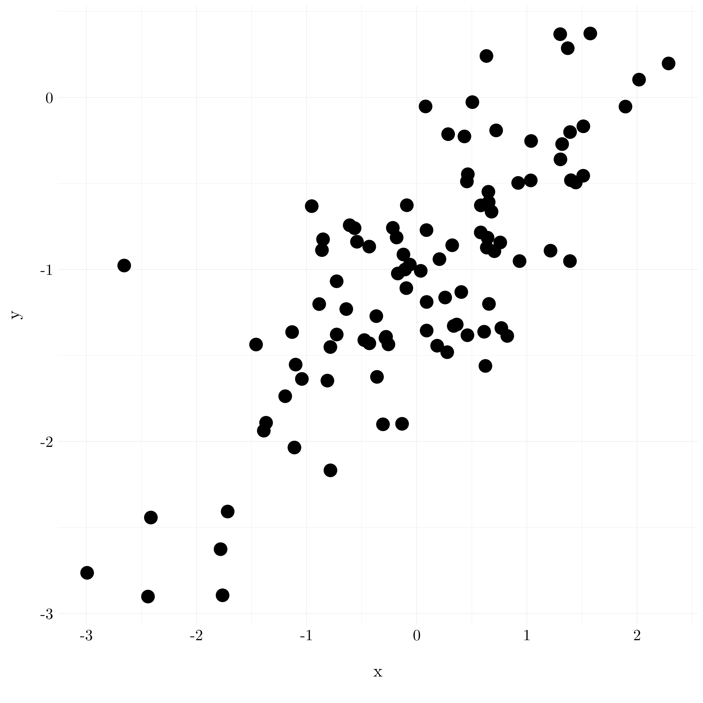
<p class="caption">(\#fig:ex13d)Scatterplot of y against x.</p>
</div>

* *Question (e)*


```r
lm <- lm(y ~ x)
lm %>% summary() %>% print_summary_lm()
```

<ul><li> *Formula*: y ~ x </li><li> *Residuals* </li><div style="overflow-x:auto;">
<table class="table table-striped table-hover table-condensed table-responsive" style="margin-left: auto; margin-right: auto;">
 <thead>
  <tr>
   <th style="text-align:left;"> Name </th>
   <th style="text-align:right;"> NA_num </th>
   <th style="text-align:right;"> Unique </th>
   <th style="text-align:right;"> Range </th>
   <th style="text-align:right;"> Mean </th>
   <th style="text-align:right;"> Variance </th>
   <th style="text-align:right;"> Minimum </th>
   <th style="text-align:right;"> Q05 </th>
   <th style="text-align:right;"> Q10 </th>
   <th style="text-align:right;"> Q25 </th>
   <th style="text-align:right;"> Q50 </th>
   <th style="text-align:right;"> Q75 </th>
   <th style="text-align:right;"> Q90 </th>
   <th style="text-align:right;"> Q95 </th>
   <th style="text-align:right;"> Maximum </th>
  </tr>
 </thead>
<tbody>
  <tr>
   <td style="text-align:left;"> Residuals </td>
   <td style="text-align:right;"> 0 </td>
   <td style="text-align:right;"> 100 </td>
   <td style="text-align:right;"> 2.38 </td>
   <td style="text-align:right;"> 0 </td>
   <td style="text-align:right;"> 0.2 </td>
   <td style="text-align:right;"> -0.94 </td>
   <td style="text-align:right;"> -0.7 </td>
   <td style="text-align:right;"> -0.61 </td>
   <td style="text-align:right;"> -0.25 </td>
   <td style="text-align:right;"> 0.01 </td>
   <td style="text-align:right;"> 0.27 </td>
   <td style="text-align:right;"> 0.61 </td>
   <td style="text-align:right;"> 0.74 </td>
   <td style="text-align:right;"> 1.43 </td>
  </tr>
</tbody>
</table>
</div>

<li> *Coefficients* </li><div style="overflow-x:auto;">
<table class="table table-striped table-hover table-condensed table-responsive" style="margin-left: auto; margin-right: auto;">
 <thead>
  <tr>
   <th style="text-align:left;"> Variable </th>
   <th style="text-align:right;"> Estimate </th>
   <th style="text-align:right;"> Std. Error </th>
   <th style="text-align:right;"> t value </th>
   <th style="text-align:left;"> Pr(&gt;|t|) </th>
  </tr>
 </thead>
<tbody>
  <tr>
   <td style="text-align:left;"> (Intercept) </td>
   <td style="text-align:right;"> -1.04418 </td>
   <td style="text-align:right;"> 0.04544 </td>
   <td style="text-align:right;"> -22.97996 </td>
   <td style="text-align:left;"> &lt; 2.22e-16 </td>
  </tr>
  <tr>
   <td style="text-align:left;"> x </td>
   <td style="text-align:right;"> 0.51358 </td>
   <td style="text-align:right;"> 0.04383 </td>
   <td style="text-align:right;"> 11.71686 </td>
   <td style="text-align:left;"> &lt; 2.22e-16 </td>
  </tr>
</tbody>
</table>
</div>

<li> *Residual standard error*: 0.454 on 98 degrees of freedom. </li><li> *Multiple $R^2$*: 0.583.</li><li> *Adjusted $R^2$*: 0.579.</li><li> *F-statistic*: 137.285 on 1 and 98, p-value: <2e-16. </li></ul>

The estimation of the coefficients are very closed to the true ones, and both are statistically significative. However, the $R^2$ is quite poor (around 0.5), which seems to mean that the model does not explain the data very well.

* *Question (f)*

<div class="figure" style="text-align: center">
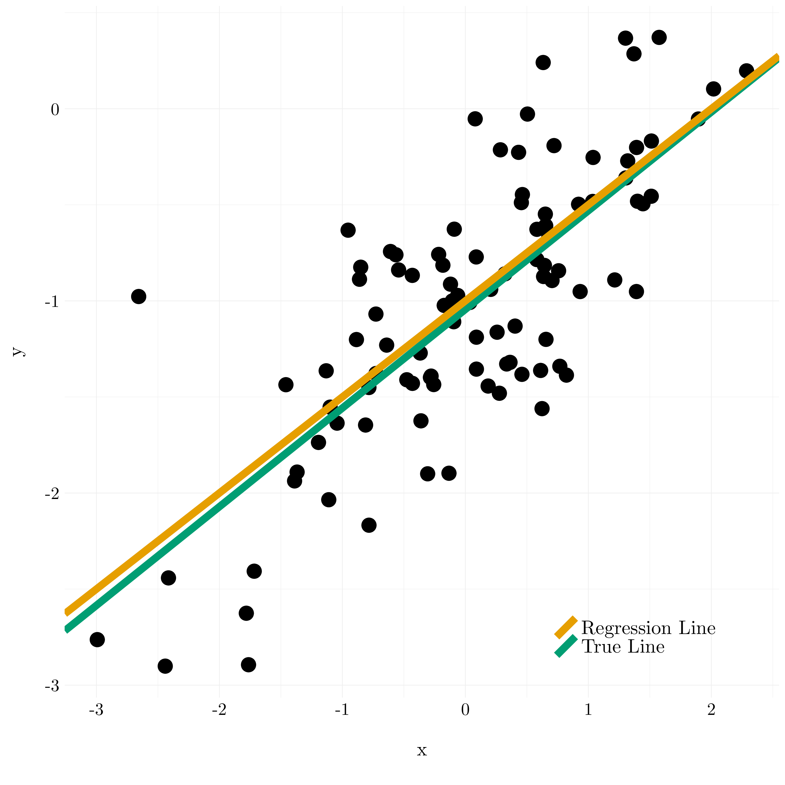
<p class="caption">(\#fig:ex13f)Results of the linear regression of y against x.</p>
</div>

* *Question (g)*


```r
lm_square <- lm(y ~ x + I(x^2))
lm_square %>% summary() %>% print_summary_lm()
```

<ul><li> *Formula*: y ~ x + I(x^2) </li><li> *Residuals* </li><div style="overflow-x:auto;">
<table class="table table-striped table-hover table-condensed table-responsive" style="margin-left: auto; margin-right: auto;">
 <thead>
  <tr>
   <th style="text-align:left;"> Name </th>
   <th style="text-align:right;"> NA_num </th>
   <th style="text-align:right;"> Unique </th>
   <th style="text-align:right;"> Range </th>
   <th style="text-align:right;"> Mean </th>
   <th style="text-align:right;"> Variance </th>
   <th style="text-align:right;"> Minimum </th>
   <th style="text-align:right;"> Q05 </th>
   <th style="text-align:right;"> Q10 </th>
   <th style="text-align:right;"> Q25 </th>
   <th style="text-align:right;"> Q50 </th>
   <th style="text-align:right;"> Q75 </th>
   <th style="text-align:right;"> Q90 </th>
   <th style="text-align:right;"> Q95 </th>
   <th style="text-align:right;"> Maximum </th>
  </tr>
 </thead>
<tbody>
  <tr>
   <td style="text-align:left;"> Residuals </td>
   <td style="text-align:right;"> 0 </td>
   <td style="text-align:right;"> 100 </td>
   <td style="text-align:right;"> 2.36 </td>
   <td style="text-align:right;"> 0 </td>
   <td style="text-align:right;"> 0.2 </td>
   <td style="text-align:right;"> -0.95 </td>
   <td style="text-align:right;"> -0.7 </td>
   <td style="text-align:right;"> -0.62 </td>
   <td style="text-align:right;"> -0.25 </td>
   <td style="text-align:right;"> 0 </td>
   <td style="text-align:right;"> 0.27 </td>
   <td style="text-align:right;"> 0.6 </td>
   <td style="text-align:right;"> 0.74 </td>
   <td style="text-align:right;"> 1.41 </td>
  </tr>
</tbody>
</table>
</div>

<li> *Coefficients* </li><div style="overflow-x:auto;">
<table class="table table-striped table-hover table-condensed table-responsive" style="margin-left: auto; margin-right: auto;">
 <thead>
  <tr>
   <th style="text-align:left;"> Variable </th>
   <th style="text-align:right;"> Estimate </th>
   <th style="text-align:right;"> Std. Error </th>
   <th style="text-align:right;"> t value </th>
   <th style="text-align:left;"> Pr(&gt;|t|) </th>
  </tr>
 </thead>
<tbody>
  <tr>
   <td style="text-align:left;"> (Intercept) </td>
   <td style="text-align:right;"> -1.04812 </td>
   <td style="text-align:right;"> 0.05627 </td>
   <td style="text-align:right;"> -18.62702 </td>
   <td style="text-align:left;"> &lt; 2e-16 </td>
  </tr>
  <tr>
   <td style="text-align:left;"> x </td>
   <td style="text-align:right;"> 0.51513 </td>
   <td style="text-align:right;"> 0.04591 </td>
   <td style="text-align:right;"> 11.21951 </td>
   <td style="text-align:left;"> &lt; 2e-16 </td>
  </tr>
  <tr>
   <td style="text-align:left;"> I(x^2) </td>
   <td style="text-align:right;"> 0.00362 </td>
   <td style="text-align:right;"> 0.03020 </td>
   <td style="text-align:right;"> 0.11990 </td>
   <td style="text-align:left;"> 0.90481 </td>
  </tr>
</tbody>
</table>
</div>

<li> *Residual standard error*: 0.456 on 97 degrees of freedom. </li><li> *Multiple $R^2$*: 0.584.</li><li> *Adjusted $R^2$*: 0.575.</li><li> *F-statistic*: 67.959 on 2 and 97, p-value: <2e-16. </li></ul>

Based on the table, there is no evidence that the quadratic term improves the model fit. In particular, the p-value for the coefficient of the quadratic term is very high, and thus this term is not statistically significative. Moreover, the $R^2$ does not increase a lot when we add the quadratic term.

* *Question (h), (i) and (j)*


<div class="figure" style="text-align: center">
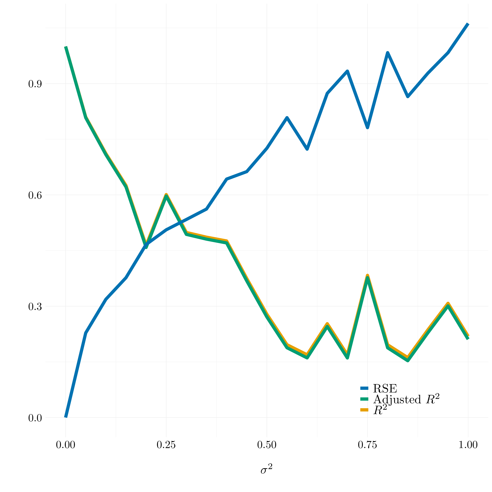
<p class="caption">(\#fig:ex13hi)Different results for the $R^2$, the adjusted $R^2$ and the RSE</p>
</div>

As we see on the graph, the $R^2$ and the adjusted $R^2$ will decresase when the variance of the noise increase, and conversely for the residual standard errors. This phenomena could be predicted because the more noise we add the less we can recover the true underlying function.

<div class="figure" style="text-align: center">
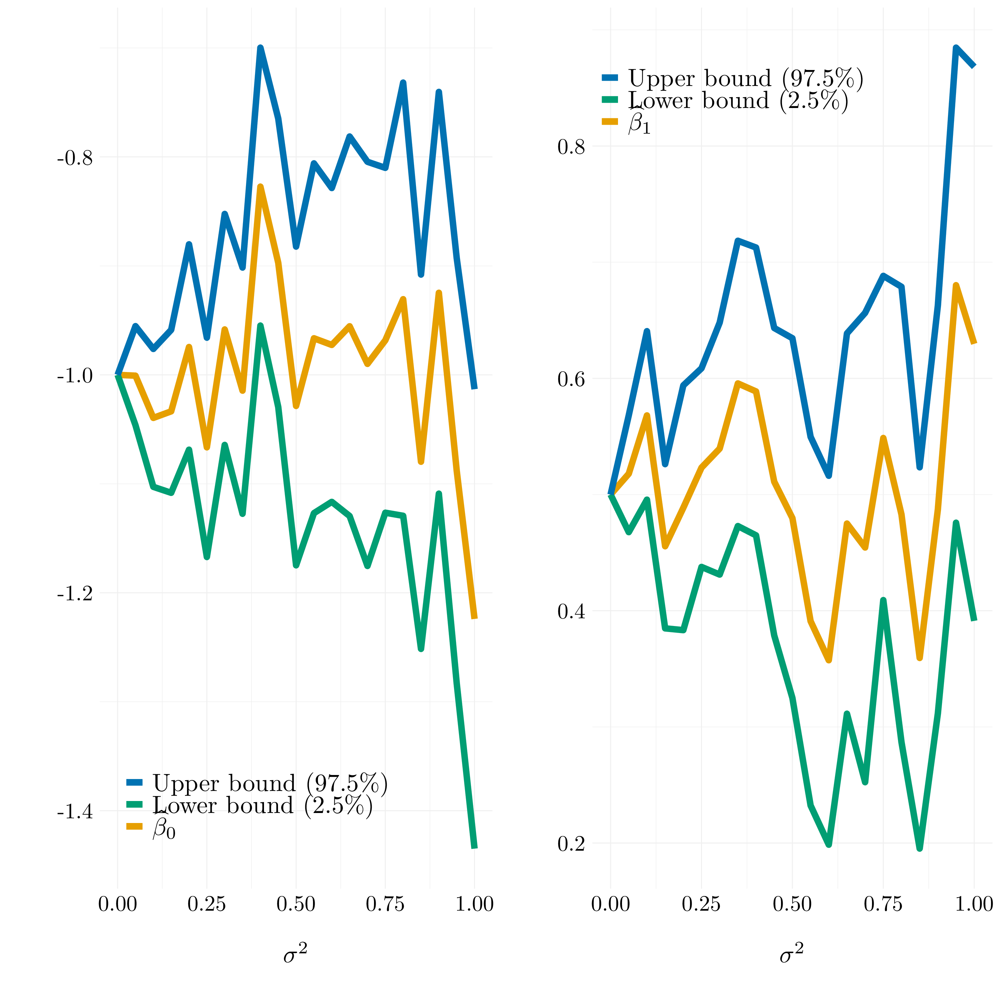
<p class="caption">(\#fig:ex13j)Confidence intervals for the estimated coefficients</p>
</div>

The confidence intervals for the two coefficients show the same phenomena than the $R^2$, the adjusted $R^2$ and the residual standard errors. The more the variance of the noise increases, the more difficult it is to estimate the coefficients, and to have a good confidence interval on it. In fact, the confidence interval is larger for large noise and the coefficient can be further from the true one.

### Exercise 14.

This exercise is about the problem of collinearity in the features.

* *Question (a)*


```r
set.seed(42)
x1 <- runif(100)
x2 <- 0.5*x1 + rnorm(100)/10
y <- 2 + 2*x1 + 0.3*x2 + rnorm(100)
```

The linear model is the following:

$$ Y = \beta_0 + \beta_1X_1 + \beta_2X_2 + \epsilon \text{ where } \beta_0 = 2,~ \beta_1 = 2,~ \beta_2 = 0.3 \text{ and } \epsilon \sim \mathcal{N}(0, 1).$$

* *Question (b)*


```r
ggplot() + 
  geom_point(aes(x = x1, y = x2), size = 6) +
  annotate("text", x = 0.1, y = 0.6, label = paste('Correlation:', round(cor(x1, x2), 2)), size = 8, col = 'red') +
  xlab("$X_1$") +
  ylab("$X_2$") +
  theme_custom()
```

<div class="figure" style="text-align: center">
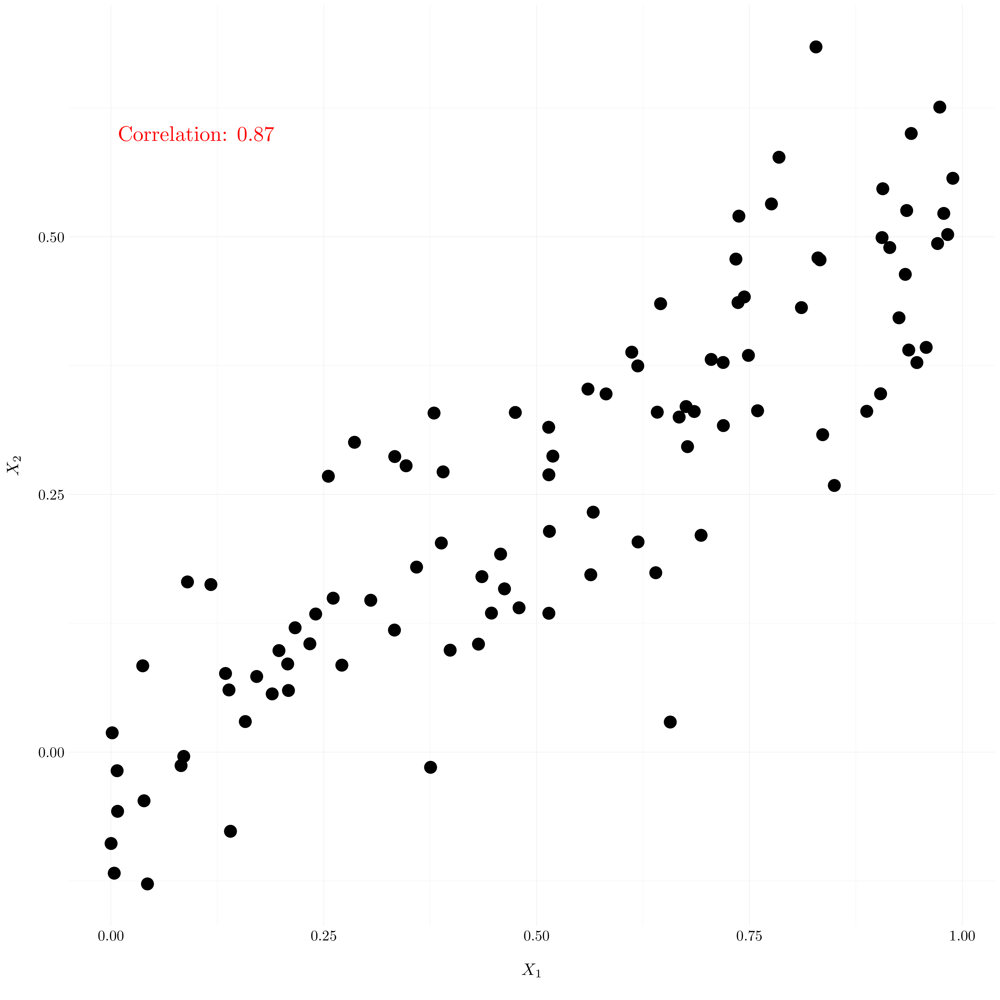
<p class="caption">(\#fig:ex14b)Scatterplot of $X_1$ against $X_2$.</p>
</div>

* *Question (c)*


```r
lm <- lm(y ~ x1 + x2)
lm %>% summary() %>% print_summary_lm()
```

<ul><li> *Formula*: y ~ x1 + x2 </li><li> *Residuals* </li><div style="overflow-x:auto;">
<table class="table table-striped table-hover table-condensed table-responsive" style="margin-left: auto; margin-right: auto;">
 <thead>
  <tr>
   <th style="text-align:left;"> Name </th>
   <th style="text-align:right;"> NA_num </th>
   <th style="text-align:right;"> Unique </th>
   <th style="text-align:right;"> Range </th>
   <th style="text-align:right;"> Mean </th>
   <th style="text-align:right;"> Variance </th>
   <th style="text-align:right;"> Minimum </th>
   <th style="text-align:right;"> Q05 </th>
   <th style="text-align:right;"> Q10 </th>
   <th style="text-align:right;"> Q25 </th>
   <th style="text-align:right;"> Q50 </th>
   <th style="text-align:right;"> Q75 </th>
   <th style="text-align:right;"> Q90 </th>
   <th style="text-align:right;"> Q95 </th>
   <th style="text-align:right;"> Maximum </th>
  </tr>
 </thead>
<tbody>
  <tr>
   <td style="text-align:left;"> Residuals </td>
   <td style="text-align:right;"> 0 </td>
   <td style="text-align:right;"> 100 </td>
   <td style="text-align:right;"> 4.18 </td>
   <td style="text-align:right;"> 0 </td>
   <td style="text-align:right;"> 0.87 </td>
   <td style="text-align:right;"> -2.1 </td>
   <td style="text-align:right;"> -1.38 </td>
   <td style="text-align:right;"> -1.26 </td>
   <td style="text-align:right;"> -0.66 </td>
   <td style="text-align:right;"> -0.03 </td>
   <td style="text-align:right;"> 0.65 </td>
   <td style="text-align:right;"> 1.27 </td>
   <td style="text-align:right;"> 1.41 </td>
   <td style="text-align:right;"> 2.08 </td>
  </tr>
</tbody>
</table>
</div>

<li> *Coefficients* </li><div style="overflow-x:auto;">
<table class="table table-striped table-hover table-condensed table-responsive" style="margin-left: auto; margin-right: auto;">
 <thead>
  <tr>
   <th style="text-align:left;"> Variable </th>
   <th style="text-align:right;"> Estimate </th>
   <th style="text-align:right;"> Std. Error </th>
   <th style="text-align:right;"> t value </th>
   <th style="text-align:left;"> Pr(&gt;|t|) </th>
  </tr>
 </thead>
<tbody>
  <tr>
   <td style="text-align:left;"> (Intercept) </td>
   <td style="text-align:right;"> 2.04617 </td>
   <td style="text-align:right;"> 0.19102 </td>
   <td style="text-align:right;"> 10.71198 </td>
   <td style="text-align:left;"> &lt; 2e-16 </td>
  </tr>
  <tr>
   <td style="text-align:left;"> x1 </td>
   <td style="text-align:right;"> 1.55979 </td>
   <td style="text-align:right;"> 0.63982 </td>
   <td style="text-align:right;"> 2.43787 </td>
   <td style="text-align:left;"> 0.016595 </td>
  </tr>
  <tr>
   <td style="text-align:left;"> x2 </td>
   <td style="text-align:right;"> 0.98083 </td>
   <td style="text-align:right;"> 1.02652 </td>
   <td style="text-align:right;"> 0.95549 </td>
   <td style="text-align:left;"> 0.341706 </td>
  </tr>
</tbody>
</table>
</div>

<li> *Residual standard error*: 0.941 on 97 degrees of freedom. </li><li> *Multiple $R^2$*: 0.32.</li><li> *Adjusted $R^2$*: 0.306.</li><li> *F-statistic*: 22.802 on 2 and 97, p-value: 7.64e-09. </li></ul>

The value of $\widehat{\beta}_0$ is 2.0461711 which is quite close to the true value of $\beta_0$. However, both the value of $\widehat{\beta}_1$ (1.5597949) and $\widehat{\beta}_2$ (0.9808272) appear to be quite far from their true value even if we obviously know that the true relationship between $Y$, $X_1$ and $X_2$ is linear. Thanks to the p-value, we can reject the null hypothesis only for $\beta_1$, and so $\beta_2$ does not seem to be statistically significant. Finaly, the $R^2$ is not very good.

* *Question (d)*


```r
lm_1 <- lm(y ~ x1)
lm_1 %>% summary() %>% print_summary_lm()
```

<ul><li> *Formula*: y ~ x1 </li><li> *Residuals* </li><div style="overflow-x:auto;">
<table class="table table-striped table-hover table-condensed table-responsive" style="margin-left: auto; margin-right: auto;">
 <thead>
  <tr>
   <th style="text-align:left;"> Name </th>
   <th style="text-align:right;"> NA_num </th>
   <th style="text-align:right;"> Unique </th>
   <th style="text-align:right;"> Range </th>
   <th style="text-align:right;"> Mean </th>
   <th style="text-align:right;"> Variance </th>
   <th style="text-align:right;"> Minimum </th>
   <th style="text-align:right;"> Q05 </th>
   <th style="text-align:right;"> Q10 </th>
   <th style="text-align:right;"> Q25 </th>
   <th style="text-align:right;"> Q50 </th>
   <th style="text-align:right;"> Q75 </th>
   <th style="text-align:right;"> Q90 </th>
   <th style="text-align:right;"> Q95 </th>
   <th style="text-align:right;"> Maximum </th>
  </tr>
 </thead>
<tbody>
  <tr>
   <td style="text-align:left;"> Residuals </td>
   <td style="text-align:right;"> 0 </td>
   <td style="text-align:right;"> 100 </td>
   <td style="text-align:right;"> 4.11 </td>
   <td style="text-align:right;"> 0 </td>
   <td style="text-align:right;"> 0.87 </td>
   <td style="text-align:right;"> -1.97 </td>
   <td style="text-align:right;"> -1.42 </td>
   <td style="text-align:right;"> -1.22 </td>
   <td style="text-align:right;"> -0.69 </td>
   <td style="text-align:right;"> -0.02 </td>
   <td style="text-align:right;"> 0.56 </td>
   <td style="text-align:right;"> 1.24 </td>
   <td style="text-align:right;"> 1.59 </td>
   <td style="text-align:right;"> 2.14 </td>
  </tr>
</tbody>
</table>
</div>

<li> *Coefficients* </li><div style="overflow-x:auto;">
<table class="table table-striped table-hover table-condensed table-responsive" style="margin-left: auto; margin-right: auto;">
 <thead>
  <tr>
   <th style="text-align:left;"> Variable </th>
   <th style="text-align:right;"> Estimate </th>
   <th style="text-align:right;"> Std. Error </th>
   <th style="text-align:right;"> t value </th>
   <th style="text-align:left;"> Pr(&gt;|t|) </th>
  </tr>
 </thead>
<tbody>
  <tr>
   <td style="text-align:left;"> (Intercept) </td>
   <td style="text-align:right;"> 2.02128 </td>
   <td style="text-align:right;"> 0.18915 </td>
   <td style="text-align:right;"> 10.68623 </td>
   <td style="text-align:left;"> &lt; 2.22e-16 </td>
  </tr>
  <tr>
   <td style="text-align:left;"> x1 </td>
   <td style="text-align:right;"> 2.09295 </td>
   <td style="text-align:right;"> 0.31293 </td>
   <td style="text-align:right;"> 6.68812 </td>
   <td style="text-align:left;"> 1.4022e-09 </td>
  </tr>
</tbody>
</table>
</div>

<li> *Residual standard error*: 0.94 on 98 degrees of freedom. </li><li> *Multiple $R^2$*: 0.313.</li><li> *Adjusted $R^2$*: 0.306.</li><li> *F-statistic*: 44.731 on 1 and 98, p-value: 1.4e-09. </li></ul>

The estimated coefficients are both statistically significant. The residual standard error and the $R^2$ are the same than for the model with $X_2$. We can reject the null hypothesis.

* *Question (e)*


```r
lm_2 <- lm(y ~ x2)
lm_2 %>% summary() %>% print_summary_lm()
```

<ul><li> *Formula*: y ~ x2 </li><li> *Residuals* </li><div style="overflow-x:auto;">
<table class="table table-striped table-hover table-condensed table-responsive" style="margin-left: auto; margin-right: auto;">
 <thead>
  <tr>
   <th style="text-align:left;"> Name </th>
   <th style="text-align:right;"> NA_num </th>
   <th style="text-align:right;"> Unique </th>
   <th style="text-align:right;"> Range </th>
   <th style="text-align:right;"> Mean </th>
   <th style="text-align:right;"> Variance </th>
   <th style="text-align:right;"> Minimum </th>
   <th style="text-align:right;"> Q05 </th>
   <th style="text-align:right;"> Q10 </th>
   <th style="text-align:right;"> Q25 </th>
   <th style="text-align:right;"> Q50 </th>
   <th style="text-align:right;"> Q75 </th>
   <th style="text-align:right;"> Q90 </th>
   <th style="text-align:right;"> Q95 </th>
   <th style="text-align:right;"> Maximum </th>
  </tr>
 </thead>
<tbody>
  <tr>
   <td style="text-align:left;"> Residuals </td>
   <td style="text-align:right;"> 0 </td>
   <td style="text-align:right;"> 100 </td>
   <td style="text-align:right;"> 4.72 </td>
   <td style="text-align:right;"> 0 </td>
   <td style="text-align:right;"> 0.92 </td>
   <td style="text-align:right;"> -2.45 </td>
   <td style="text-align:right;"> -1.46 </td>
   <td style="text-align:right;"> -1.23 </td>
   <td style="text-align:right;"> -0.7 </td>
   <td style="text-align:right;"> -0.06 </td>
   <td style="text-align:right;"> 0.66 </td>
   <td style="text-align:right;"> 1.23 </td>
   <td style="text-align:right;"> 1.58 </td>
   <td style="text-align:right;"> 2.27 </td>
  </tr>
</tbody>
</table>
</div>

<li> *Coefficients* </li><div style="overflow-x:auto;">
<table class="table table-striped table-hover table-condensed table-responsive" style="margin-left: auto; margin-right: auto;">
 <thead>
  <tr>
   <th style="text-align:left;"> Variable </th>
   <th style="text-align:right;"> Estimate </th>
   <th style="text-align:right;"> Std. Error </th>
   <th style="text-align:right;"> t value </th>
   <th style="text-align:left;"> Pr(&gt;|t|) </th>
  </tr>
 </thead>
<tbody>
  <tr>
   <td style="text-align:left;"> (Intercept) </td>
   <td style="text-align:right;"> 2.29744 </td>
   <td style="text-align:right;"> 0.16483 </td>
   <td style="text-align:right;"> 13.93816 </td>
   <td style="text-align:left;"> &lt; 2.22e-16 </td>
  </tr>
  <tr>
   <td style="text-align:left;"> x2 </td>
   <td style="text-align:right;"> 3.16330 </td>
   <td style="text-align:right;"> 0.51481 </td>
   <td style="text-align:right;"> 6.14463 </td>
   <td style="text-align:left;"> 1.7269e-08 </td>
  </tr>
</tbody>
</table>
</div>

<li> *Residual standard error*: 0.964 on 98 degrees of freedom. </li><li> *Multiple $R^2$*: 0.278.</li><li> *Adjusted $R^2$*: 0.271.</li><li> *F-statistic*: 37.756 on 1 and 98, p-value: 1.73e-08. </li></ul>

The estimated coefficients are both statistically significant. The residual standard error and the $R^2$ are a little smaller than for the model with $X_1$. We can reject the null hypothesis.

* *Question (f)*

At a first sight, the different results can contradict each other, because it result to very different coefficients estimation and statistical significance. But, if we look at the true model, we see that $X_1$ and $X_2$ are very correlated. So, they explained the same variance in the data. In the complete model, they more or less share the explication of the variance but as they can explain the same amount of variance, the model with only $X_1$ or $X_2$ will lead to the same results. Another problem that can arrive in this case is that the matrix $X^\prime X$ may not be invertible.

* *Question (g)*


```r
x1 <- c(x1, 0.1)
x2 <- c(x2, 0.8)
y <- c(y, 6)
```

* *Question (h)*


```r
lm <- lm(y ~ x1 + x2)
lm %>% summary() %>% print_summary_lm()
```

<ul><li> *Formula*: y ~ x1 + x2 </li><li> *Residuals* </li><div style="overflow-x:auto;">
<table class="table table-striped table-hover table-condensed table-responsive" style="margin-left: auto; margin-right: auto;">
 <thead>
  <tr>
   <th style="text-align:left;"> Name </th>
   <th style="text-align:right;"> NA_num </th>
   <th style="text-align:right;"> Unique </th>
   <th style="text-align:right;"> Range </th>
   <th style="text-align:right;"> Mean </th>
   <th style="text-align:right;"> Variance </th>
   <th style="text-align:right;"> Minimum </th>
   <th style="text-align:right;"> Q05 </th>
   <th style="text-align:right;"> Q10 </th>
   <th style="text-align:right;"> Q25 </th>
   <th style="text-align:right;"> Q50 </th>
   <th style="text-align:right;"> Q75 </th>
   <th style="text-align:right;"> Q90 </th>
   <th style="text-align:right;"> Q95 </th>
   <th style="text-align:right;"> Maximum </th>
  </tr>
 </thead>
<tbody>
  <tr>
   <td style="text-align:left;"> Residuals </td>
   <td style="text-align:right;"> 0 </td>
   <td style="text-align:right;"> 101 </td>
   <td style="text-align:right;"> 4.45 </td>
   <td style="text-align:right;"> 0 </td>
   <td style="text-align:right;"> 0.91 </td>
   <td style="text-align:right;"> -2.34 </td>
   <td style="text-align:right;"> -1.41 </td>
   <td style="text-align:right;"> -1.26 </td>
   <td style="text-align:right;"> -0.71 </td>
   <td style="text-align:right;"> -0.03 </td>
   <td style="text-align:right;"> 0.72 </td>
   <td style="text-align:right;"> 1.27 </td>
   <td style="text-align:right;"> 1.69 </td>
   <td style="text-align:right;"> 2.11 </td>
  </tr>
</tbody>
</table>
</div>

<li> *Coefficients* </li><div style="overflow-x:auto;">
<table class="table table-striped table-hover table-condensed table-responsive" style="margin-left: auto; margin-right: auto;">
 <thead>
  <tr>
   <th style="text-align:left;"> Variable </th>
   <th style="text-align:right;"> Estimate </th>
   <th style="text-align:right;"> Std. Error </th>
   <th style="text-align:right;"> t value </th>
   <th style="text-align:left;"> Pr(&gt;|t|) </th>
  </tr>
 </thead>
<tbody>
  <tr>
   <td style="text-align:left;"> (Intercept) </td>
   <td style="text-align:right;"> 2.14668 </td>
   <td style="text-align:right;"> 0.19109 </td>
   <td style="text-align:right;"> 11.23357 </td>
   <td style="text-align:left;"> &lt; 2.22e-16 </td>
  </tr>
  <tr>
   <td style="text-align:left;"> x1 </td>
   <td style="text-align:right;"> 0.61282 </td>
   <td style="text-align:right;"> 0.51998 </td>
   <td style="text-align:right;"> 1.17854 </td>
   <td style="text-align:left;"> 0.2414353 </td>
  </tr>
  <tr>
   <td style="text-align:left;"> x2 </td>
   <td style="text-align:right;"> 2.57296 </td>
   <td style="text-align:right;"> 0.80975 </td>
   <td style="text-align:right;"> 3.17746 </td>
   <td style="text-align:left;"> 0.0019877 </td>
  </tr>
</tbody>
</table>
</div>

<li> *Residual standard error*: 0.964 on 98 degrees of freedom. </li><li> *Multiple $R^2$*: 0.323.</li><li> *Adjusted $R^2$*: 0.309.</li><li> *F-statistic*: 23.327 on 2 and 98, p-value: 5.18e-09. </li></ul>

The new point changes the significance of the coefficient for this model. Now, $\beta_1$ is not significant anymore, while $\beta_2$ is. The other values do not seem to change. We do not have an increasing of the RSE, so the new point is not an outlier. The leverage statistic of the new point is 0.1 while the average leverage is 0.03. So, the new point is a high-leverage point.


```r
# Fit the model with only X_1
lm_1 <- lm(y ~ x1)
lm_1 %>% summary() %>% print_summary_lm()
```

<ul><li> *Formula*: y ~ x1 </li><li> *Residuals* </li><div style="overflow-x:auto;">
<table class="table table-striped table-hover table-condensed table-responsive" style="margin-left: auto; margin-right: auto;">
 <thead>
  <tr>
   <th style="text-align:left;"> Name </th>
   <th style="text-align:right;"> NA_num </th>
   <th style="text-align:right;"> Unique </th>
   <th style="text-align:right;"> Range </th>
   <th style="text-align:right;"> Mean </th>
   <th style="text-align:right;"> Variance </th>
   <th style="text-align:right;"> Minimum </th>
   <th style="text-align:right;"> Q05 </th>
   <th style="text-align:right;"> Q10 </th>
   <th style="text-align:right;"> Q25 </th>
   <th style="text-align:right;"> Q50 </th>
   <th style="text-align:right;"> Q75 </th>
   <th style="text-align:right;"> Q90 </th>
   <th style="text-align:right;"> Q95 </th>
   <th style="text-align:right;"> Maximum </th>
  </tr>
 </thead>
<tbody>
  <tr>
   <td style="text-align:left;"> Residuals </td>
   <td style="text-align:right;"> 0 </td>
   <td style="text-align:right;"> 101 </td>
   <td style="text-align:right;"> 5.7 </td>
   <td style="text-align:right;"> 0 </td>
   <td style="text-align:right;"> 1 </td>
   <td style="text-align:right;"> -2.04 </td>
   <td style="text-align:right;"> -1.48 </td>
   <td style="text-align:right;"> -1.26 </td>
   <td style="text-align:right;"> -0.73 </td>
   <td style="text-align:right;"> -0.08 </td>
   <td style="text-align:right;"> 0.54 </td>
   <td style="text-align:right;"> 1.25 </td>
   <td style="text-align:right;"> 1.73 </td>
   <td style="text-align:right;"> 3.66 </td>
  </tr>
</tbody>
</table>
</div>

<li> *Coefficients* </li><div style="overflow-x:auto;">
<table class="table table-striped table-hover table-condensed table-responsive" style="margin-left: auto; margin-right: auto;">
 <thead>
  <tr>
   <th style="text-align:left;"> Variable </th>
   <th style="text-align:right;"> Estimate </th>
   <th style="text-align:right;"> Std. Error </th>
   <th style="text-align:right;"> t value </th>
   <th style="text-align:left;"> Pr(&gt;|t|) </th>
  </tr>
 </thead>
<tbody>
  <tr>
   <td style="text-align:left;"> (Intercept) </td>
   <td style="text-align:right;"> 2.14814 </td>
   <td style="text-align:right;"> 0.19968 </td>
   <td style="text-align:right;"> 10.75791 </td>
   <td style="text-align:left;"> &lt; 2.22e-16 </td>
  </tr>
  <tr>
   <td style="text-align:left;"> x1 </td>
   <td style="text-align:right;"> 1.92083 </td>
   <td style="text-align:right;"> 0.33196 </td>
   <td style="text-align:right;"> 5.78629 </td>
   <td style="text-align:left;"> 8.4547e-08 </td>
  </tr>
</tbody>
</table>
</div>

<li> *Residual standard error*: 1.007 on 99 degrees of freedom. </li><li> *Multiple $R^2$*: 0.253.</li><li> *Adjusted $R^2$*: 0.245.</li><li> *F-statistic*: 33.481 on 1 and 99, p-value: 8.45e-08. </li></ul>

The new point changes a lot the RSE and the $R^2$. So, it should be consider as an outlier in this case. The leverage statistic of the new point is 0.03 while the average leverage is 0.02. So, the new point is a high-leverage point.


```r
# Fit the model with only X_2
lm_2 <- lm(y ~ x2)
lm_2 %>% summary() %>% print_summary_lm()
```

<ul><li> *Formula*: y ~ x2 </li><li> *Residuals* </li><div style="overflow-x:auto;">
<table class="table table-striped table-hover table-condensed table-responsive" style="margin-left: auto; margin-right: auto;">
 <thead>
  <tr>
   <th style="text-align:left;"> Name </th>
   <th style="text-align:right;"> NA_num </th>
   <th style="text-align:right;"> Unique </th>
   <th style="text-align:right;"> Range </th>
   <th style="text-align:right;"> Mean </th>
   <th style="text-align:right;"> Variance </th>
   <th style="text-align:right;"> Minimum </th>
   <th style="text-align:right;"> Q05 </th>
   <th style="text-align:right;"> Q10 </th>
   <th style="text-align:right;"> Q25 </th>
   <th style="text-align:right;"> Q50 </th>
   <th style="text-align:right;"> Q75 </th>
   <th style="text-align:right;"> Q90 </th>
   <th style="text-align:right;"> Q95 </th>
   <th style="text-align:right;"> Maximum </th>
  </tr>
 </thead>
<tbody>
  <tr>
   <td style="text-align:left;"> Residuals </td>
   <td style="text-align:right;"> 0 </td>
   <td style="text-align:right;"> 101 </td>
   <td style="text-align:right;"> 4.68 </td>
   <td style="text-align:right;"> 0 </td>
   <td style="text-align:right;"> 0.92 </td>
   <td style="text-align:right;"> -2.47 </td>
   <td style="text-align:right;"> -1.47 </td>
   <td style="text-align:right;"> -1.2 </td>
   <td style="text-align:right;"> -0.68 </td>
   <td style="text-align:right;"> -0.05 </td>
   <td style="text-align:right;"> 0.68 </td>
   <td style="text-align:right;"> 1.23 </td>
   <td style="text-align:right;"> 1.55 </td>
   <td style="text-align:right;"> 2.22 </td>
  </tr>
</tbody>
</table>
</div>

<li> *Coefficients* </li><div style="overflow-x:auto;">
<table class="table table-striped table-hover table-condensed table-responsive" style="margin-left: auto; margin-right: auto;">
 <thead>
  <tr>
   <th style="text-align:left;"> Variable </th>
   <th style="text-align:right;"> Estimate </th>
   <th style="text-align:right;"> Std. Error </th>
   <th style="text-align:right;"> t value </th>
   <th style="text-align:left;"> Pr(&gt;|t|) </th>
  </tr>
 </thead>
<tbody>
  <tr>
   <td style="text-align:left;"> (Intercept) </td>
   <td style="text-align:right;"> 2.26526 </td>
   <td style="text-align:right;"> 0.16278 </td>
   <td style="text-align:right;"> 13.91614 </td>
   <td style="text-align:left;"> &lt; 2.22e-16 </td>
  </tr>
  <tr>
   <td style="text-align:left;"> x2 </td>
   <td style="text-align:right;"> 3.32847 </td>
   <td style="text-align:right;"> 0.49570 </td>
   <td style="text-align:right;"> 6.71473 </td>
   <td style="text-align:left;"> 1.1974e-09 </td>
  </tr>
</tbody>
</table>
</div>

<li> *Residual standard error*: 0.966 on 99 degrees of freedom. </li><li> *Multiple $R^2$*: 0.313.</li><li> *Adjusted $R^2$*: 0.306.</li><li> *F-statistic*: 45.088 on 1 and 99, p-value: 1.2e-09. </li></ul>

The new point improve this model. So, this point is not an outlier. The leverage statistic of the new point is 0.02 while the average leverage is 0.02. So, the new point is not a high-leverage point.

### Exercise 15.

This exercise is about the `Boston` dataset. We would like to predict per capita crime rate based on the other features. It contains 506 observations of 14 variables of suburbs in Boston. For a description of the variables, please refer to **R** by typing `help(Boston)` after loading the pacakge `MASS`.


```r
boston <- as_tibble(Boston)
variable <- c("zn", "indus", "chas", "nox", "rm", "age", "dis", "rad", "tax", "ptratio", "black", "lstat", "medv")
```

* *Question (a)*


```r
lm_list <- vector("list", length = length(boston)-1)
for(i in seq(1, length(boston)-1)){
  name <- variable[i]
  lm_list[[i]] <- lm(boston$crim ~ boston[[name]])
}
names(lm_list) <- variable
```

<details><summary>Variable `zn`</summary><p><ul><li> *Formula*: boston$crim ~ boston[[name]] </li><li> *Residuals* </li><div style="overflow-x:auto;">
<table class="table table-striped table-hover table-condensed table-responsive" style="margin-left: auto; margin-right: auto;">
 <thead>
  <tr>
   <th style="text-align:left;"> Name </th>
   <th style="text-align:right;"> NA_num </th>
   <th style="text-align:right;"> Unique </th>
   <th style="text-align:right;"> Range </th>
   <th style="text-align:right;"> Mean </th>
   <th style="text-align:right;"> Variance </th>
   <th style="text-align:right;"> Minimum </th>
   <th style="text-align:right;"> Q05 </th>
   <th style="text-align:right;"> Q10 </th>
   <th style="text-align:right;"> Q25 </th>
   <th style="text-align:right;"> Q50 </th>
   <th style="text-align:right;"> Q75 </th>
   <th style="text-align:right;"> Q90 </th>
   <th style="text-align:right;"> Q95 </th>
   <th style="text-align:right;"> Maximum </th>
  </tr>
 </thead>
<tbody>
  <tr>
   <td style="text-align:left;"> Residuals </td>
   <td style="text-align:right;"> 0 </td>
   <td style="text-align:right;"> 505 </td>
   <td style="text-align:right;"> 88.95 </td>
   <td style="text-align:right;"> 0 </td>
   <td style="text-align:right;"> 71.01 </td>
   <td style="text-align:right;"> -4.43 </td>
   <td style="text-align:right;"> -4.4 </td>
   <td style="text-align:right;"> -4.37 </td>
   <td style="text-align:right;"> -4.22 </td>
   <td style="text-align:right;"> -2.62 </td>
   <td style="text-align:right;"> 1.25 </td>
   <td style="text-align:right;"> 6.3 </td>
   <td style="text-align:right;"> 11.34 </td>
   <td style="text-align:right;"> 84.52 </td>
  </tr>
</tbody>
</table>
</div>

<li> *Coefficients* </li><div style="overflow-x:auto;">
<table class="table table-striped table-hover table-condensed table-responsive" style="margin-left: auto; margin-right: auto;">
 <thead>
  <tr>
   <th style="text-align:left;"> Variable </th>
   <th style="text-align:right;"> Estimate </th>
   <th style="text-align:right;"> Std. Error </th>
   <th style="text-align:right;"> t value </th>
   <th style="text-align:left;"> Pr(&gt;|t|) </th>
  </tr>
 </thead>
<tbody>
  <tr>
   <td style="text-align:left;"> (Intercept) </td>
   <td style="text-align:right;"> 4.45369 </td>
   <td style="text-align:right;"> 0.41722 </td>
   <td style="text-align:right;"> 10.67475 </td>
   <td style="text-align:left;"> &lt; 2.22e-16 </td>
  </tr>
  <tr>
   <td style="text-align:left;"> boston[[name]] </td>
   <td style="text-align:right;"> -0.07393 </td>
   <td style="text-align:right;"> 0.01609 </td>
   <td style="text-align:right;"> -4.59378 </td>
   <td style="text-align:left;"> 5.5065e-06 </td>
  </tr>
</tbody>
</table>
</div>

<li> *Residual standard error*: 8.435 on 504 degrees of freedom. </li><li> *Multiple $R^2$*: 0.04.</li><li> *Adjusted $R^2$*: 0.038.</li><li> *F-statistic*: 21.103 on 1 and 504, p-value: 5.51e-06. </li></ul></p></details><details><summary>Variable `indus`</summary><p><ul><li> *Formula*: boston$crim ~ boston[[name]] </li><li> *Residuals* </li><div style="overflow-x:auto;">
<table class="table table-striped table-hover table-condensed table-responsive" style="margin-left: auto; margin-right: auto;">
 <thead>
  <tr>
   <th style="text-align:left;"> Name </th>
   <th style="text-align:right;"> NA_num </th>
   <th style="text-align:right;"> Unique </th>
   <th style="text-align:right;"> Range </th>
   <th style="text-align:right;"> Mean </th>
   <th style="text-align:right;"> Variance </th>
   <th style="text-align:right;"> Minimum </th>
   <th style="text-align:right;"> Q05 </th>
   <th style="text-align:right;"> Q10 </th>
   <th style="text-align:right;"> Q25 </th>
   <th style="text-align:right;"> Q50 </th>
   <th style="text-align:right;"> Q75 </th>
   <th style="text-align:right;"> Q90 </th>
   <th style="text-align:right;"> Q95 </th>
   <th style="text-align:right;"> Maximum </th>
  </tr>
 </thead>
<tbody>
  <tr>
   <td style="text-align:left;"> Residuals </td>
   <td style="text-align:right;"> 0 </td>
   <td style="text-align:right;"> 505 </td>
   <td style="text-align:right;"> 93.78 </td>
   <td style="text-align:right;"> 0 </td>
   <td style="text-align:right;"> 61.76 </td>
   <td style="text-align:right;"> -11.97 </td>
   <td style="text-align:right;"> -7.79 </td>
   <td style="text-align:right;"> -5.54 </td>
   <td style="text-align:right;"> -2.7 </td>
   <td style="text-align:right;"> -0.74 </td>
   <td style="text-align:right;"> 0.71 </td>
   <td style="text-align:right;"> 3.59 </td>
   <td style="text-align:right;"> 8.63 </td>
   <td style="text-align:right;"> 81.81 </td>
  </tr>
</tbody>
</table>
</div>

<li> *Coefficients* </li><div style="overflow-x:auto;">
<table class="table table-striped table-hover table-condensed table-responsive" style="margin-left: auto; margin-right: auto;">
 <thead>
  <tr>
   <th style="text-align:left;"> Variable </th>
   <th style="text-align:right;"> Estimate </th>
   <th style="text-align:right;"> Std. Error </th>
   <th style="text-align:right;"> t value </th>
   <th style="text-align:left;"> Pr(&gt;|t|) </th>
  </tr>
 </thead>
<tbody>
  <tr>
   <td style="text-align:left;"> (Intercept) </td>
   <td style="text-align:right;"> -2.06374 </td>
   <td style="text-align:right;"> 0.66723 </td>
   <td style="text-align:right;"> -3.09301 </td>
   <td style="text-align:left;"> 0.0020913 </td>
  </tr>
  <tr>
   <td style="text-align:left;"> boston[[name]] </td>
   <td style="text-align:right;"> 0.50978 </td>
   <td style="text-align:right;"> 0.05102 </td>
   <td style="text-align:right;"> 9.99085 </td>
   <td style="text-align:left;"> &lt; 2.22e-16 </td>
  </tr>
</tbody>
</table>
</div>

<li> *Residual standard error*: 7.866 on 504 degrees of freedom. </li><li> *Multiple $R^2$*: 0.165.</li><li> *Adjusted $R^2$*: 0.164.</li><li> *F-statistic*: 99.817 on 1 and 504, p-value: <2e-16. </li></ul></p></details><details><summary>Variable `chas`</summary><p><ul><li> *Formula*: boston$crim ~ boston[[name]] </li><li> *Residuals* </li><div style="overflow-x:auto;">
<table class="table table-striped table-hover table-condensed table-responsive" style="margin-left: auto; margin-right: auto;">
 <thead>
  <tr>
   <th style="text-align:left;"> Name </th>
   <th style="text-align:right;"> NA_num </th>
   <th style="text-align:right;"> Unique </th>
   <th style="text-align:right;"> Range </th>
   <th style="text-align:right;"> Mean </th>
   <th style="text-align:right;"> Variance </th>
   <th style="text-align:right;"> Minimum </th>
   <th style="text-align:right;"> Q05 </th>
   <th style="text-align:right;"> Q10 </th>
   <th style="text-align:right;"> Q25 </th>
   <th style="text-align:right;"> Q50 </th>
   <th style="text-align:right;"> Q75 </th>
   <th style="text-align:right;"> Q90 </th>
   <th style="text-align:right;"> Q95 </th>
   <th style="text-align:right;"> Maximum </th>
  </tr>
 </thead>
<tbody>
  <tr>
   <td style="text-align:left;"> Residuals </td>
   <td style="text-align:right;"> 0 </td>
   <td style="text-align:right;"> 505 </td>
   <td style="text-align:right;"> 88.97 </td>
   <td style="text-align:right;"> 0 </td>
   <td style="text-align:right;"> 73.76 </td>
   <td style="text-align:right;"> -3.74 </td>
   <td style="text-align:right;"> -3.72 </td>
   <td style="text-align:right;"> -3.71 </td>
   <td style="text-align:right;"> -3.66 </td>
   <td style="text-align:right;"> -3.44 </td>
   <td style="text-align:right;"> 0.02 </td>
   <td style="text-align:right;"> 7.11 </td>
   <td style="text-align:right;"> 12.04 </td>
   <td style="text-align:right;"> 85.23 </td>
  </tr>
</tbody>
</table>
</div>

<li> *Coefficients* </li><div style="overflow-x:auto;">
<table class="table table-striped table-hover table-condensed table-responsive" style="margin-left: auto; margin-right: auto;">
 <thead>
  <tr>
   <th style="text-align:left;"> Variable </th>
   <th style="text-align:right;"> Estimate </th>
   <th style="text-align:right;"> Std. Error </th>
   <th style="text-align:right;"> t value </th>
   <th style="text-align:left;"> Pr(&gt;|t|) </th>
  </tr>
 </thead>
<tbody>
  <tr>
   <td style="text-align:left;"> (Intercept) </td>
   <td style="text-align:right;"> 3.74445 </td>
   <td style="text-align:right;"> 0.39611 </td>
   <td style="text-align:right;"> 9.45302 </td>
   <td style="text-align:left;"> &lt; 2e-16 </td>
  </tr>
  <tr>
   <td style="text-align:left;"> boston[[name]] </td>
   <td style="text-align:right;"> -1.89278 </td>
   <td style="text-align:right;"> 1.50612 </td>
   <td style="text-align:right;"> -1.25673 </td>
   <td style="text-align:left;"> 0.20943 </td>
  </tr>
</tbody>
</table>
</div>

<li> *Residual standard error*: 8.597 on 504 degrees of freedom. </li><li> *Multiple $R^2$*: 0.003.</li><li> *Adjusted $R^2$*: 0.001.</li><li> *F-statistic*: 1.579 on 1 and 504, p-value: 0.209. </li></ul></p></details><details><summary>Variable `nox`</summary><p><ul><li> *Formula*: boston$crim ~ boston[[name]] </li><li> *Residuals* </li><div style="overflow-x:auto;">
<table class="table table-striped table-hover table-condensed table-responsive" style="margin-left: auto; margin-right: auto;">
 <thead>
  <tr>
   <th style="text-align:left;"> Name </th>
   <th style="text-align:right;"> NA_num </th>
   <th style="text-align:right;"> Unique </th>
   <th style="text-align:right;"> Range </th>
   <th style="text-align:right;"> Mean </th>
   <th style="text-align:right;"> Variance </th>
   <th style="text-align:right;"> Minimum </th>
   <th style="text-align:right;"> Q05 </th>
   <th style="text-align:right;"> Q10 </th>
   <th style="text-align:right;"> Q25 </th>
   <th style="text-align:right;"> Q50 </th>
   <th style="text-align:right;"> Q75 </th>
   <th style="text-align:right;"> Q90 </th>
   <th style="text-align:right;"> Q95 </th>
   <th style="text-align:right;"> Maximum </th>
  </tr>
 </thead>
<tbody>
  <tr>
   <td style="text-align:left;"> Residuals </td>
   <td style="text-align:right;"> 0 </td>
   <td style="text-align:right;"> 506 </td>
   <td style="text-align:right;"> 94.1 </td>
   <td style="text-align:right;"> 0 </td>
   <td style="text-align:right;"> 60.87 </td>
   <td style="text-align:right;"> -12.37 </td>
   <td style="text-align:right;"> -5.88 </td>
   <td style="text-align:right;"> -4.96 </td>
   <td style="text-align:right;"> -2.74 </td>
   <td style="text-align:right;"> -0.97 </td>
   <td style="text-align:right;"> 0.56 </td>
   <td style="text-align:right;"> 3.41 </td>
   <td style="text-align:right;"> 9.41 </td>
   <td style="text-align:right;"> 81.73 </td>
  </tr>
</tbody>
</table>
</div>

<li> *Coefficients* </li><div style="overflow-x:auto;">
<table class="table table-striped table-hover table-condensed table-responsive" style="margin-left: auto; margin-right: auto;">
 <thead>
  <tr>
   <th style="text-align:left;"> Variable </th>
   <th style="text-align:right;"> Estimate </th>
   <th style="text-align:right;"> Std. Error </th>
   <th style="text-align:right;"> t value </th>
   <th style="text-align:left;"> Pr(&gt;|t|) </th>
  </tr>
 </thead>
<tbody>
  <tr>
   <td style="text-align:left;"> (Intercept) </td>
   <td style="text-align:right;"> -13.71988 </td>
   <td style="text-align:right;"> 1.69948 </td>
   <td style="text-align:right;"> -8.07299 </td>
   <td style="text-align:left;"> 5.0768e-15 </td>
  </tr>
  <tr>
   <td style="text-align:left;"> boston[[name]] </td>
   <td style="text-align:right;"> 31.24853 </td>
   <td style="text-align:right;"> 2.99919 </td>
   <td style="text-align:right;"> 10.41899 </td>
   <td style="text-align:left;"> &lt; 2.22e-16 </td>
  </tr>
</tbody>
</table>
</div>

<li> *Residual standard error*: 7.81 on 504 degrees of freedom. </li><li> *Multiple $R^2$*: 0.177.</li><li> *Adjusted $R^2$*: 0.176.</li><li> *F-statistic*: 108.555 on 1 and 504, p-value: <2e-16. </li></ul></p></details><details><summary>Variable `rm`</summary><p><ul><li> *Formula*: boston$crim ~ boston[[name]] </li><li> *Residuals* </li><div style="overflow-x:auto;">
<table class="table table-striped table-hover table-condensed table-responsive" style="margin-left: auto; margin-right: auto;">
 <thead>
  <tr>
   <th style="text-align:left;"> Name </th>
   <th style="text-align:right;"> NA_num </th>
   <th style="text-align:right;"> Unique </th>
   <th style="text-align:right;"> Range </th>
   <th style="text-align:right;"> Mean </th>
   <th style="text-align:right;"> Variance </th>
   <th style="text-align:right;"> Minimum </th>
   <th style="text-align:right;"> Q05 </th>
   <th style="text-align:right;"> Q10 </th>
   <th style="text-align:right;"> Q25 </th>
   <th style="text-align:right;"> Q50 </th>
   <th style="text-align:right;"> Q75 </th>
   <th style="text-align:right;"> Q90 </th>
   <th style="text-align:right;"> Q95 </th>
   <th style="text-align:right;"> Maximum </th>
  </tr>
 </thead>
<tbody>
  <tr>
   <td style="text-align:left;"> Residuals </td>
   <td style="text-align:right;"> 0 </td>
   <td style="text-align:right;"> 506 </td>
   <td style="text-align:right;"> 93.8 </td>
   <td style="text-align:right;"> 0 </td>
   <td style="text-align:right;"> 70.43 </td>
   <td style="text-align:right;"> -6.6 </td>
   <td style="text-align:right;"> -4.98 </td>
   <td style="text-align:right;"> -4.64 </td>
   <td style="text-align:right;"> -3.95 </td>
   <td style="text-align:right;"> -2.65 </td>
   <td style="text-align:right;"> 0.99 </td>
   <td style="text-align:right;"> 6.92 </td>
   <td style="text-align:right;"> 11.26 </td>
   <td style="text-align:right;"> 87.2 </td>
  </tr>
</tbody>
</table>
</div>

<li> *Coefficients* </li><div style="overflow-x:auto;">
<table class="table table-striped table-hover table-condensed table-responsive" style="margin-left: auto; margin-right: auto;">
 <thead>
  <tr>
   <th style="text-align:left;"> Variable </th>
   <th style="text-align:right;"> Estimate </th>
   <th style="text-align:right;"> Std. Error </th>
   <th style="text-align:right;"> t value </th>
   <th style="text-align:left;"> Pr(&gt;|t|) </th>
  </tr>
 </thead>
<tbody>
  <tr>
   <td style="text-align:left;"> (Intercept) </td>
   <td style="text-align:right;"> 20.48180 </td>
   <td style="text-align:right;"> 3.36447 </td>
   <td style="text-align:right;"> 6.08767 </td>
   <td style="text-align:left;"> 2.2720e-09 </td>
  </tr>
  <tr>
   <td style="text-align:left;"> boston[[name]] </td>
   <td style="text-align:right;"> -2.68405 </td>
   <td style="text-align:right;"> 0.53204 </td>
   <td style="text-align:right;"> -5.04482 </td>
   <td style="text-align:left;"> 6.3467e-07 </td>
  </tr>
</tbody>
</table>
</div>

<li> *Residual standard error*: 8.401 on 504 degrees of freedom. </li><li> *Multiple $R^2$*: 0.048.</li><li> *Adjusted $R^2$*: 0.046.</li><li> *F-statistic*: 25.45 on 1 and 504, p-value: 6.35e-07. </li></ul></p></details><details><summary>Variable `age`</summary><p><ul><li> *Formula*: boston$crim ~ boston[[name]] </li><li> *Residuals* </li><div style="overflow-x:auto;">
<table class="table table-striped table-hover table-condensed table-responsive" style="margin-left: auto; margin-right: auto;">
 <thead>
  <tr>
   <th style="text-align:left;"> Name </th>
   <th style="text-align:right;"> NA_num </th>
   <th style="text-align:right;"> Unique </th>
   <th style="text-align:right;"> Range </th>
   <th style="text-align:right;"> Mean </th>
   <th style="text-align:right;"> Variance </th>
   <th style="text-align:right;"> Minimum </th>
   <th style="text-align:right;"> Q05 </th>
   <th style="text-align:right;"> Q10 </th>
   <th style="text-align:right;"> Q25 </th>
   <th style="text-align:right;"> Q50 </th>
   <th style="text-align:right;"> Q75 </th>
   <th style="text-align:right;"> Q90 </th>
   <th style="text-align:right;"> Q95 </th>
   <th style="text-align:right;"> Maximum </th>
  </tr>
 </thead>
<tbody>
  <tr>
   <td style="text-align:left;"> Residuals </td>
   <td style="text-align:right;"> 0 </td>
   <td style="text-align:right;"> 506 </td>
   <td style="text-align:right;"> 89.64 </td>
   <td style="text-align:right;"> 0 </td>
   <td style="text-align:right;"> 64.78 </td>
   <td style="text-align:right;"> -6.79 </td>
   <td style="text-align:right;"> -6.16 </td>
   <td style="text-align:right;"> -5.6 </td>
   <td style="text-align:right;"> -4.26 </td>
   <td style="text-align:right;"> -1.23 </td>
   <td style="text-align:right;"> 1.53 </td>
   <td style="text-align:right;"> 4.65 </td>
   <td style="text-align:right;"> 9.91 </td>
   <td style="text-align:right;"> 82.85 </td>
  </tr>
</tbody>
</table>
</div>

<li> *Coefficients* </li><div style="overflow-x:auto;">
<table class="table table-striped table-hover table-condensed table-responsive" style="margin-left: auto; margin-right: auto;">
 <thead>
  <tr>
   <th style="text-align:left;"> Variable </th>
   <th style="text-align:right;"> Estimate </th>
   <th style="text-align:right;"> Std. Error </th>
   <th style="text-align:right;"> t value </th>
   <th style="text-align:left;"> Pr(&gt;|t|) </th>
  </tr>
 </thead>
<tbody>
  <tr>
   <td style="text-align:left;"> (Intercept) </td>
   <td style="text-align:right;"> -3.77791 </td>
   <td style="text-align:right;"> 0.94398 </td>
   <td style="text-align:right;"> -4.00208 </td>
   <td style="text-align:left;"> 7.2217e-05 </td>
  </tr>
  <tr>
   <td style="text-align:left;"> boston[[name]] </td>
   <td style="text-align:right;"> 0.10779 </td>
   <td style="text-align:right;"> 0.01274 </td>
   <td style="text-align:right;"> 8.46282 </td>
   <td style="text-align:left;"> 2.8549e-16 </td>
  </tr>
</tbody>
</table>
</div>

<li> *Residual standard error*: 8.057 on 504 degrees of freedom. </li><li> *Multiple $R^2$*: 0.124.</li><li> *Adjusted $R^2$*: 0.123.</li><li> *F-statistic*: 71.619 on 1 and 504, p-value: 2.85e-16. </li></ul></p></details><details><summary>Variable `dis`</summary><p><ul><li> *Formula*: boston$crim ~ boston[[name]] </li><li> *Residuals* </li><div style="overflow-x:auto;">
<table class="table table-striped table-hover table-condensed table-responsive" style="margin-left: auto; margin-right: auto;">
 <thead>
  <tr>
   <th style="text-align:left;"> Name </th>
   <th style="text-align:right;"> NA_num </th>
   <th style="text-align:right;"> Unique </th>
   <th style="text-align:right;"> Range </th>
   <th style="text-align:right;"> Mean </th>
   <th style="text-align:right;"> Variance </th>
   <th style="text-align:right;"> Minimum </th>
   <th style="text-align:right;"> Q05 </th>
   <th style="text-align:right;"> Q10 </th>
   <th style="text-align:right;"> Q25 </th>
   <th style="text-align:right;"> Q50 </th>
   <th style="text-align:right;"> Q75 </th>
   <th style="text-align:right;"> Q90 </th>
   <th style="text-align:right;"> Q95 </th>
   <th style="text-align:right;"> Maximum </th>
  </tr>
 </thead>
<tbody>
  <tr>
   <td style="text-align:left;"> Residuals </td>
   <td style="text-align:right;"> 0 </td>
   <td style="text-align:right;"> 506 </td>
   <td style="text-align:right;"> 88.38 </td>
   <td style="text-align:right;"> 0 </td>
   <td style="text-align:right;"> 63.32 </td>
   <td style="text-align:right;"> -6.71 </td>
   <td style="text-align:right;"> -5.9 </td>
   <td style="text-align:right;"> -5.44 </td>
   <td style="text-align:right;"> -4.13 </td>
   <td style="text-align:right;"> -1.53 </td>
   <td style="text-align:right;"> 1.52 </td>
   <td style="text-align:right;"> 4.9 </td>
   <td style="text-align:right;"> 9.32 </td>
   <td style="text-align:right;"> 81.67 </td>
  </tr>
</tbody>
</table>
</div>

<li> *Coefficients* </li><div style="overflow-x:auto;">
<table class="table table-striped table-hover table-condensed table-responsive" style="margin-left: auto; margin-right: auto;">
 <thead>
  <tr>
   <th style="text-align:left;"> Variable </th>
   <th style="text-align:right;"> Estimate </th>
   <th style="text-align:right;"> Std. Error </th>
   <th style="text-align:right;"> t value </th>
   <th style="text-align:left;"> Pr(&gt;|t|) </th>
  </tr>
 </thead>
<tbody>
  <tr>
   <td style="text-align:left;"> (Intercept) </td>
   <td style="text-align:right;"> 9.49926 </td>
   <td style="text-align:right;"> 0.73040 </td>
   <td style="text-align:right;"> 13.00561 </td>
   <td style="text-align:left;"> &lt; 2.22e-16 </td>
  </tr>
  <tr>
   <td style="text-align:left;"> boston[[name]] </td>
   <td style="text-align:right;"> -1.55090 </td>
   <td style="text-align:right;"> 0.16833 </td>
   <td style="text-align:right;"> -9.21346 </td>
   <td style="text-align:left;"> &lt; 2.22e-16 </td>
  </tr>
</tbody>
</table>
</div>

<li> *Residual standard error*: 7.965 on 504 degrees of freedom. </li><li> *Multiple $R^2$*: 0.144.</li><li> *Adjusted $R^2$*: 0.142.</li><li> *F-statistic*: 84.888 on 1 and 504, p-value: <2e-16. </li></ul></p></details><details><summary>Variable `rad`</summary><p><ul><li> *Formula*: boston$crim ~ boston[[name]] </li><li> *Residuals* </li><div style="overflow-x:auto;">
<table class="table table-striped table-hover table-condensed table-responsive" style="margin-left: auto; margin-right: auto;">
 <thead>
  <tr>
   <th style="text-align:left;"> Name </th>
   <th style="text-align:right;"> NA_num </th>
   <th style="text-align:right;"> Unique </th>
   <th style="text-align:right;"> Range </th>
   <th style="text-align:right;"> Mean </th>
   <th style="text-align:right;"> Variance </th>
   <th style="text-align:right;"> Minimum </th>
   <th style="text-align:right;"> Q05 </th>
   <th style="text-align:right;"> Q10 </th>
   <th style="text-align:right;"> Q25 </th>
   <th style="text-align:right;"> Q50 </th>
   <th style="text-align:right;"> Q75 </th>
   <th style="text-align:right;"> Q90 </th>
   <th style="text-align:right;"> Q95 </th>
   <th style="text-align:right;"> Maximum </th>
  </tr>
 </thead>
<tbody>
  <tr>
   <td style="text-align:left;"> Residuals </td>
   <td style="text-align:right;"> 0 </td>
   <td style="text-align:right;"> 505 </td>
   <td style="text-align:right;"> 86.6 </td>
   <td style="text-align:right;"> 0 </td>
   <td style="text-align:right;"> 45.04 </td>
   <td style="text-align:right;"> -10.16 </td>
   <td style="text-align:right;"> -7.6 </td>
   <td style="text-align:right;"> -5.08 </td>
   <td style="text-align:right;"> -1.38 </td>
   <td style="text-align:right;"> -0.14 </td>
   <td style="text-align:right;"> 0.66 </td>
   <td style="text-align:right;"> 1.7 </td>
   <td style="text-align:right;"> 3.31 </td>
   <td style="text-align:right;"> 76.43 </td>
  </tr>
</tbody>
</table>
</div>

<li> *Coefficients* </li><div style="overflow-x:auto;">
<table class="table table-striped table-hover table-condensed table-responsive" style="margin-left: auto; margin-right: auto;">
 <thead>
  <tr>
   <th style="text-align:left;"> Variable </th>
   <th style="text-align:right;"> Estimate </th>
   <th style="text-align:right;"> Std. Error </th>
   <th style="text-align:right;"> t value </th>
   <th style="text-align:left;"> Pr(&gt;|t|) </th>
  </tr>
 </thead>
<tbody>
  <tr>
   <td style="text-align:left;"> (Intercept) </td>
   <td style="text-align:right;"> -2.28716 </td>
   <td style="text-align:right;"> 0.44348 </td>
   <td style="text-align:right;"> -5.15735 </td>
   <td style="text-align:left;"> 3.6058e-07 </td>
  </tr>
  <tr>
   <td style="text-align:left;"> boston[[name]] </td>
   <td style="text-align:right;"> 0.61791 </td>
   <td style="text-align:right;"> 0.03433 </td>
   <td style="text-align:right;"> 17.99820 </td>
   <td style="text-align:left;"> &lt; 2.22e-16 </td>
  </tr>
</tbody>
</table>
</div>

<li> *Residual standard error*: 6.718 on 504 degrees of freedom. </li><li> *Multiple $R^2$*: 0.391.</li><li> *Adjusted $R^2$*: 0.39.</li><li> *F-statistic*: 323.935 on 1 and 504, p-value: <2e-16. </li></ul></p></details><details><summary>Variable `tax`</summary><p><ul><li> *Formula*: boston$crim ~ boston[[name]] </li><li> *Residuals* </li><div style="overflow-x:auto;">
<table class="table table-striped table-hover table-condensed table-responsive" style="margin-left: auto; margin-right: auto;">
 <thead>
  <tr>
   <th style="text-align:left;"> Name </th>
   <th style="text-align:right;"> NA_num </th>
   <th style="text-align:right;"> Unique </th>
   <th style="text-align:right;"> Range </th>
   <th style="text-align:right;"> Mean </th>
   <th style="text-align:right;"> Variance </th>
   <th style="text-align:right;"> Minimum </th>
   <th style="text-align:right;"> Q05 </th>
   <th style="text-align:right;"> Q10 </th>
   <th style="text-align:right;"> Q25 </th>
   <th style="text-align:right;"> Q50 </th>
   <th style="text-align:right;"> Q75 </th>
   <th style="text-align:right;"> Q90 </th>
   <th style="text-align:right;"> Q95 </th>
   <th style="text-align:right;"> Maximum </th>
  </tr>
 </thead>
<tbody>
  <tr>
   <td style="text-align:left;"> Residuals </td>
   <td style="text-align:right;"> 0 </td>
   <td style="text-align:right;"> 505 </td>
   <td style="text-align:right;"> 90.21 </td>
   <td style="text-align:right;"> 0 </td>
   <td style="text-align:right;"> 48.86 </td>
   <td style="text-align:right;"> -12.51 </td>
   <td style="text-align:right;"> -6.59 </td>
   <td style="text-align:right;"> -4.52 </td>
   <td style="text-align:right;"> -2.74 </td>
   <td style="text-align:right;"> -0.19 </td>
   <td style="text-align:right;"> 1.07 </td>
   <td style="text-align:right;"> 2.81 </td>
   <td style="text-align:right;"> 4.51 </td>
   <td style="text-align:right;"> 77.7 </td>
  </tr>
</tbody>
</table>
</div>

<li> *Coefficients* </li><div style="overflow-x:auto;">
<table class="table table-striped table-hover table-condensed table-responsive" style="margin-left: auto; margin-right: auto;">
 <thead>
  <tr>
   <th style="text-align:left;"> Variable </th>
   <th style="text-align:right;"> Estimate </th>
   <th style="text-align:right;"> Std. Error </th>
   <th style="text-align:right;"> t value </th>
   <th style="text-align:left;"> Pr(&gt;|t|) </th>
  </tr>
 </thead>
<tbody>
  <tr>
   <td style="text-align:left;"> (Intercept) </td>
   <td style="text-align:right;"> -8.52837 </td>
   <td style="text-align:right;"> 0.81581 </td>
   <td style="text-align:right;"> -10.45387 </td>
   <td style="text-align:left;"> &lt; 2.22e-16 </td>
  </tr>
  <tr>
   <td style="text-align:left;"> boston[[name]] </td>
   <td style="text-align:right;"> 0.02974 </td>
   <td style="text-align:right;"> 0.00185 </td>
   <td style="text-align:right;"> 16.09939 </td>
   <td style="text-align:left;"> &lt; 2.22e-16 </td>
  </tr>
</tbody>
</table>
</div>

<li> *Residual standard error*: 6.997 on 504 degrees of freedom. </li><li> *Multiple $R^2$*: 0.34.</li><li> *Adjusted $R^2$*: 0.338.</li><li> *F-statistic*: 259.19 on 1 and 504, p-value: <2e-16. </li></ul></p></details><details><summary>Variable `ptratio`</summary><p><ul><li> *Formula*: boston$crim ~ boston[[name]] </li><li> *Residuals* </li><div style="overflow-x:auto;">
<table class="table table-striped table-hover table-condensed table-responsive" style="margin-left: auto; margin-right: auto;">
 <thead>
  <tr>
   <th style="text-align:left;"> Name </th>
   <th style="text-align:right;"> NA_num </th>
   <th style="text-align:right;"> Unique </th>
   <th style="text-align:right;"> Range </th>
   <th style="text-align:right;"> Mean </th>
   <th style="text-align:right;"> Variance </th>
   <th style="text-align:right;"> Minimum </th>
   <th style="text-align:right;"> Q05 </th>
   <th style="text-align:right;"> Q10 </th>
   <th style="text-align:right;"> Q25 </th>
   <th style="text-align:right;"> Q50 </th>
   <th style="text-align:right;"> Q75 </th>
   <th style="text-align:right;"> Q90 </th>
   <th style="text-align:right;"> Q95 </th>
   <th style="text-align:right;"> Maximum </th>
  </tr>
 </thead>
<tbody>
  <tr>
   <td style="text-align:left;"> Residuals </td>
   <td style="text-align:right;"> 0 </td>
   <td style="text-align:right;"> 505 </td>
   <td style="text-align:right;"> 91.01 </td>
   <td style="text-align:right;"> 0 </td>
   <td style="text-align:right;"> 67.77 </td>
   <td style="text-align:right;"> -7.65 </td>
   <td style="text-align:right;"> -6.22 </td>
   <td style="text-align:right;"> -5.57 </td>
   <td style="text-align:right;"> -3.99 </td>
   <td style="text-align:right;"> -1.91 </td>
   <td style="text-align:right;"> 1.82 </td>
   <td style="text-align:right;"> 5.13 </td>
   <td style="text-align:right;"> 10.17 </td>
   <td style="text-align:right;"> 83.35 </td>
  </tr>
</tbody>
</table>
</div>

<li> *Coefficients* </li><div style="overflow-x:auto;">
<table class="table table-striped table-hover table-condensed table-responsive" style="margin-left: auto; margin-right: auto;">
 <thead>
  <tr>
   <th style="text-align:left;"> Variable </th>
   <th style="text-align:right;"> Estimate </th>
   <th style="text-align:right;"> Std. Error </th>
   <th style="text-align:right;"> t value </th>
   <th style="text-align:left;"> Pr(&gt;|t|) </th>
  </tr>
 </thead>
<tbody>
  <tr>
   <td style="text-align:left;"> (Intercept) </td>
   <td style="text-align:right;"> -17.64693 </td>
   <td style="text-align:right;"> 3.14727 </td>
   <td style="text-align:right;"> -5.60706 </td>
   <td style="text-align:left;"> 3.3953e-08 </td>
  </tr>
  <tr>
   <td style="text-align:left;"> boston[[name]] </td>
   <td style="text-align:right;"> 1.15198 </td>
   <td style="text-align:right;"> 0.16937 </td>
   <td style="text-align:right;"> 6.80143 </td>
   <td style="text-align:left;"> 2.9429e-11 </td>
  </tr>
</tbody>
</table>
</div>

<li> *Residual standard error*: 8.24 on 504 degrees of freedom. </li><li> *Multiple $R^2$*: 0.084.</li><li> *Adjusted $R^2$*: 0.082.</li><li> *F-statistic*: 46.259 on 1 and 504, p-value: 2.94e-11. </li></ul></p></details><details><summary>Variable `black`</summary><p><ul><li> *Formula*: boston$crim ~ boston[[name]] </li><li> *Residuals* </li><div style="overflow-x:auto;">
<table class="table table-striped table-hover table-condensed table-responsive" style="margin-left: auto; margin-right: auto;">
 <thead>
  <tr>
   <th style="text-align:left;"> Name </th>
   <th style="text-align:right;"> NA_num </th>
   <th style="text-align:right;"> Unique </th>
   <th style="text-align:right;"> Range </th>
   <th style="text-align:right;"> Mean </th>
   <th style="text-align:right;"> Variance </th>
   <th style="text-align:right;"> Minimum </th>
   <th style="text-align:right;"> Q05 </th>
   <th style="text-align:right;"> Q10 </th>
   <th style="text-align:right;"> Q25 </th>
   <th style="text-align:right;"> Q50 </th>
   <th style="text-align:right;"> Q75 </th>
   <th style="text-align:right;"> Q90 </th>
   <th style="text-align:right;"> Q95 </th>
   <th style="text-align:right;"> Maximum </th>
  </tr>
 </thead>
<tbody>
  <tr>
   <td style="text-align:left;"> Residuals </td>
   <td style="text-align:right;"> 0 </td>
   <td style="text-align:right;"> 506 </td>
   <td style="text-align:right;"> 100.58 </td>
   <td style="text-align:right;"> 0 </td>
   <td style="text-align:right;"> 63.02 </td>
   <td style="text-align:right;"> -13.76 </td>
   <td style="text-align:right;"> -4.87 </td>
   <td style="text-align:right;"> -3 </td>
   <td style="text-align:right;"> -2.3 </td>
   <td style="text-align:right;"> -2.09 </td>
   <td style="text-align:right;"> -1.3 </td>
   <td style="text-align:right;"> 5.76 </td>
   <td style="text-align:right;"> 11.85 </td>
   <td style="text-align:right;"> 86.82 </td>
  </tr>
</tbody>
</table>
</div>

<li> *Coefficients* </li><div style="overflow-x:auto;">
<table class="table table-striped table-hover table-condensed table-responsive" style="margin-left: auto; margin-right: auto;">
 <thead>
  <tr>
   <th style="text-align:left;"> Variable </th>
   <th style="text-align:right;"> Estimate </th>
   <th style="text-align:right;"> Std. Error </th>
   <th style="text-align:right;"> t value </th>
   <th style="text-align:left;"> Pr(&gt;|t|) </th>
  </tr>
 </thead>
<tbody>
  <tr>
   <td style="text-align:left;"> (Intercept) </td>
   <td style="text-align:right;"> 16.55353 </td>
   <td style="text-align:right;"> 1.42590 </td>
   <td style="text-align:right;"> 11.60916 </td>
   <td style="text-align:left;"> &lt; 2.22e-16 </td>
  </tr>
  <tr>
   <td style="text-align:left;"> boston[[name]] </td>
   <td style="text-align:right;"> -0.03628 </td>
   <td style="text-align:right;"> 0.00387 </td>
   <td style="text-align:right;"> -9.36695 </td>
   <td style="text-align:left;"> &lt; 2.22e-16 </td>
  </tr>
</tbody>
</table>
</div>

<li> *Residual standard error*: 7.946 on 504 degrees of freedom. </li><li> *Multiple $R^2$*: 0.148.</li><li> *Adjusted $R^2$*: 0.147.</li><li> *F-statistic*: 87.74 on 1 and 504, p-value: <2e-16. </li></ul></p></details><details><summary>Variable `lstat`</summary><p><ul><li> *Formula*: boston$crim ~ boston[[name]] </li><li> *Residuals* </li><div style="overflow-x:auto;">
<table class="table table-striped table-hover table-condensed table-responsive" style="margin-left: auto; margin-right: auto;">
 <thead>
  <tr>
   <th style="text-align:left;"> Name </th>
   <th style="text-align:right;"> NA_num </th>
   <th style="text-align:right;"> Unique </th>
   <th style="text-align:right;"> Range </th>
   <th style="text-align:right;"> Mean </th>
   <th style="text-align:right;"> Variance </th>
   <th style="text-align:right;"> Minimum </th>
   <th style="text-align:right;"> Q05 </th>
   <th style="text-align:right;"> Q10 </th>
   <th style="text-align:right;"> Q25 </th>
   <th style="text-align:right;"> Q50 </th>
   <th style="text-align:right;"> Q75 </th>
   <th style="text-align:right;"> Q90 </th>
   <th style="text-align:right;"> Q95 </th>
   <th style="text-align:right;"> Maximum </th>
  </tr>
 </thead>
<tbody>
  <tr>
   <td style="text-align:left;"> Residuals </td>
   <td style="text-align:right;"> 0 </td>
   <td style="text-align:right;"> 506 </td>
   <td style="text-align:right;"> 96.79 </td>
   <td style="text-align:right;"> 0 </td>
   <td style="text-align:right;"> 58.63 </td>
   <td style="text-align:right;"> -13.93 </td>
   <td style="text-align:right;"> -6.75 </td>
   <td style="text-align:right;"> -5.38 </td>
   <td style="text-align:right;"> -2.82 </td>
   <td style="text-align:right;"> -0.66 </td>
   <td style="text-align:right;"> 1.08 </td>
   <td style="text-align:right;"> 3.91 </td>
   <td style="text-align:right;"> 8.14 </td>
   <td style="text-align:right;"> 82.86 </td>
  </tr>
</tbody>
</table>
</div>

<li> *Coefficients* </li><div style="overflow-x:auto;">
<table class="table table-striped table-hover table-condensed table-responsive" style="margin-left: auto; margin-right: auto;">
 <thead>
  <tr>
   <th style="text-align:left;"> Variable </th>
   <th style="text-align:right;"> Estimate </th>
   <th style="text-align:right;"> Std. Error </th>
   <th style="text-align:right;"> t value </th>
   <th style="text-align:left;"> Pr(&gt;|t|) </th>
  </tr>
 </thead>
<tbody>
  <tr>
   <td style="text-align:left;"> (Intercept) </td>
   <td style="text-align:right;"> -3.33054 </td>
   <td style="text-align:right;"> 0.69376 </td>
   <td style="text-align:right;"> -4.80072 </td>
   <td style="text-align:left;"> 2.087e-06 </td>
  </tr>
  <tr>
   <td style="text-align:left;"> boston[[name]] </td>
   <td style="text-align:right;"> 0.54880 </td>
   <td style="text-align:right;"> 0.04776 </td>
   <td style="text-align:right;"> 11.49065 </td>
   <td style="text-align:left;"> &lt; 2.22e-16 </td>
  </tr>
</tbody>
</table>
</div>

<li> *Residual standard error*: 7.664 on 504 degrees of freedom. </li><li> *Multiple $R^2$*: 0.208.</li><li> *Adjusted $R^2$*: 0.206.</li><li> *F-statistic*: 132.035 on 1 and 504, p-value: <2e-16. </li></ul></p></details><details><summary>Variable `medv`</summary><p><ul><li> *Formula*: boston$crim ~ boston[[name]] </li><li> *Residuals* </li><div style="overflow-x:auto;">
<table class="table table-striped table-hover table-condensed table-responsive" style="margin-left: auto; margin-right: auto;">
 <thead>
  <tr>
   <th style="text-align:left;"> Name </th>
   <th style="text-align:right;"> NA_num </th>
   <th style="text-align:right;"> Unique </th>
   <th style="text-align:right;"> Range </th>
   <th style="text-align:right;"> Mean </th>
   <th style="text-align:right;"> Variance </th>
   <th style="text-align:right;"> Minimum </th>
   <th style="text-align:right;"> Q05 </th>
   <th style="text-align:right;"> Q10 </th>
   <th style="text-align:right;"> Q25 </th>
   <th style="text-align:right;"> Q50 </th>
   <th style="text-align:right;"> Q75 </th>
   <th style="text-align:right;"> Q90 </th>
   <th style="text-align:right;"> Q95 </th>
   <th style="text-align:right;"> Maximum </th>
  </tr>
 </thead>
<tbody>
  <tr>
   <td style="text-align:left;"> Residuals </td>
   <td style="text-align:right;"> 0 </td>
   <td style="text-align:right;"> 506 </td>
   <td style="text-align:right;"> 90.03 </td>
   <td style="text-align:right;"> 0 </td>
   <td style="text-align:right;"> 62.83 </td>
   <td style="text-align:right;"> -9.07 </td>
   <td style="text-align:right;"> -5.47 </td>
   <td style="text-align:right;"> -4.9 </td>
   <td style="text-align:right;"> -4.02 </td>
   <td style="text-align:right;"> -2.34 </td>
   <td style="text-align:right;"> 1.3 </td>
   <td style="text-align:right;"> 6.4 </td>
   <td style="text-align:right;"> 11.43 </td>
   <td style="text-align:right;"> 80.96 </td>
  </tr>
</tbody>
</table>
</div>

<li> *Coefficients* </li><div style="overflow-x:auto;">
<table class="table table-striped table-hover table-condensed table-responsive" style="margin-left: auto; margin-right: auto;">
 <thead>
  <tr>
   <th style="text-align:left;"> Variable </th>
   <th style="text-align:right;"> Estimate </th>
   <th style="text-align:right;"> Std. Error </th>
   <th style="text-align:right;"> t value </th>
   <th style="text-align:left;"> Pr(&gt;|t|) </th>
  </tr>
 </thead>
<tbody>
  <tr>
   <td style="text-align:left;"> (Intercept) </td>
   <td style="text-align:right;"> 11.79654 </td>
   <td style="text-align:right;"> 0.93419 </td>
   <td style="text-align:right;"> 12.62757 </td>
   <td style="text-align:left;"> &lt; 2.22e-16 </td>
  </tr>
  <tr>
   <td style="text-align:left;"> boston[[name]] </td>
   <td style="text-align:right;"> -0.36316 </td>
   <td style="text-align:right;"> 0.03839 </td>
   <td style="text-align:right;"> -9.45971 </td>
   <td style="text-align:left;"> &lt; 2.22e-16 </td>
  </tr>
</tbody>
</table>
</div>

<li> *Residual standard error*: 7.934 on 504 degrees of freedom. </li><li> *Multiple $R^2$*: 0.151.</li><li> *Adjusted $R^2$*: 0.149.</li><li> *F-statistic*: 89.486 on 1 and 504, p-value: <2e-16. </li></ul></p></details>

If we look at the results of the different fitted linear model, we can see that almost every variable is statistically significative (except the variable `chas`). However, We can split up the other ones into three categories based on the $R^2$. The variable with a large $R^2$ ($> 0.3$) have a larger contribution to the variance explication (`rad` and `tax`). Then, there are variables with a moderate contribution to the variance: `indus`, `nox`, `age`, `dis`, `black`, `lstat` and `medv` (between $0.1$ and $0.2$). Finally, some of them have a $R^2$ very close to $0$ (`zn`, `rm` and `ptratio`).

* *Question (b)*


```r
lm <- lm(crim ~ ., data = boston)
lm %>% summary() %>% print_summary_lm()
```

Results of the linear model on the **boston** dataset.<ul><li> *Formula*: crim ~ . </li><li> *Residuals* </li><div style="overflow-x:auto;">
<table class="table table-striped table-hover table-condensed table-responsive" style="margin-left: auto; margin-right: auto;">
 <thead>
  <tr>
   <th style="text-align:left;"> Name </th>
   <th style="text-align:right;"> NA_num </th>
   <th style="text-align:right;"> Unique </th>
   <th style="text-align:right;"> Range </th>
   <th style="text-align:right;"> Mean </th>
   <th style="text-align:right;"> Variance </th>
   <th style="text-align:right;"> Minimum </th>
   <th style="text-align:right;"> Q05 </th>
   <th style="text-align:right;"> Q10 </th>
   <th style="text-align:right;"> Q25 </th>
   <th style="text-align:right;"> Q50 </th>
   <th style="text-align:right;"> Q75 </th>
   <th style="text-align:right;"> Q90 </th>
   <th style="text-align:right;"> Q95 </th>
   <th style="text-align:right;"> Maximum </th>
  </tr>
 </thead>
<tbody>
  <tr>
   <td style="text-align:left;"> Residuals </td>
   <td style="text-align:right;"> 0 </td>
   <td style="text-align:right;"> 506 </td>
   <td style="text-align:right;"> 84.97 </td>
   <td style="text-align:right;"> 0 </td>
   <td style="text-align:right;"> 40.4 </td>
   <td style="text-align:right;"> -9.92 </td>
   <td style="text-align:right;"> -6.37 </td>
   <td style="text-align:right;"> -4.51 </td>
   <td style="text-align:right;"> -2.12 </td>
   <td style="text-align:right;"> -0.35 </td>
   <td style="text-align:right;"> 1.02 </td>
   <td style="text-align:right;"> 2.49 </td>
   <td style="text-align:right;"> 4.66 </td>
   <td style="text-align:right;"> 75.05 </td>
  </tr>
</tbody>
</table>
</div>

<li> *Coefficients* </li><div style="overflow-x:auto;">
<table class="table table-striped table-hover table-condensed table-responsive" style="margin-left: auto; margin-right: auto;">
 <thead>
  <tr>
   <th style="text-align:left;"> Variable </th>
   <th style="text-align:right;"> Estimate </th>
   <th style="text-align:right;"> Std. Error </th>
   <th style="text-align:right;"> t value </th>
   <th style="text-align:left;"> Pr(&gt;|t|) </th>
  </tr>
 </thead>
<tbody>
  <tr>
   <td style="text-align:left;"> (Intercept) </td>
   <td style="text-align:right;"> 17.03323 </td>
   <td style="text-align:right;"> 7.23490 </td>
   <td style="text-align:right;"> 2.35431 </td>
   <td style="text-align:left;"> 0.0189491 </td>
  </tr>
  <tr>
   <td style="text-align:left;"> zn </td>
   <td style="text-align:right;"> 0.04486 </td>
   <td style="text-align:right;"> 0.01873 </td>
   <td style="text-align:right;"> 2.39431 </td>
   <td style="text-align:left;"> 0.0170249 </td>
  </tr>
  <tr>
   <td style="text-align:left;"> indus </td>
   <td style="text-align:right;"> -0.06385 </td>
   <td style="text-align:right;"> 0.08341 </td>
   <td style="text-align:right;"> -0.76558 </td>
   <td style="text-align:left;"> 0.4442940 </td>
  </tr>
  <tr>
   <td style="text-align:left;"> chas </td>
   <td style="text-align:right;"> -0.74913 </td>
   <td style="text-align:right;"> 1.18015 </td>
   <td style="text-align:right;"> -0.63478 </td>
   <td style="text-align:left;"> 0.5258670 </td>
  </tr>
  <tr>
   <td style="text-align:left;"> nox </td>
   <td style="text-align:right;"> -10.31353 </td>
   <td style="text-align:right;"> 5.27554 </td>
   <td style="text-align:right;"> -1.95497 </td>
   <td style="text-align:left;"> 0.0511520 </td>
  </tr>
  <tr>
   <td style="text-align:left;"> rm </td>
   <td style="text-align:right;"> 0.43013 </td>
   <td style="text-align:right;"> 0.61283 </td>
   <td style="text-align:right;"> 0.70188 </td>
   <td style="text-align:left;"> 0.4830888 </td>
  </tr>
  <tr>
   <td style="text-align:left;"> age </td>
   <td style="text-align:right;"> 0.00145 </td>
   <td style="text-align:right;"> 0.01793 </td>
   <td style="text-align:right;"> 0.08098 </td>
   <td style="text-align:left;"> 0.9354878 </td>
  </tr>
  <tr>
   <td style="text-align:left;"> dis </td>
   <td style="text-align:right;"> -0.98718 </td>
   <td style="text-align:right;"> 0.28182 </td>
   <td style="text-align:right;"> -3.50289 </td>
   <td style="text-align:left;"> 0.0005022 </td>
  </tr>
  <tr>
   <td style="text-align:left;"> rad </td>
   <td style="text-align:right;"> 0.58821 </td>
   <td style="text-align:right;"> 0.08805 </td>
   <td style="text-align:right;"> 6.68045 </td>
   <td style="text-align:left;"> 6.4605e-11 </td>
  </tr>
  <tr>
   <td style="text-align:left;"> tax </td>
   <td style="text-align:right;"> -0.00378 </td>
   <td style="text-align:right;"> 0.00516 </td>
   <td style="text-align:right;"> -0.73319 </td>
   <td style="text-align:left;"> 0.4637927 </td>
  </tr>
  <tr>
   <td style="text-align:left;"> ptratio </td>
   <td style="text-align:right;"> -0.27108 </td>
   <td style="text-align:right;"> 0.18645 </td>
   <td style="text-align:right;"> -1.45390 </td>
   <td style="text-align:left;"> 0.1466113 </td>
  </tr>
  <tr>
   <td style="text-align:left;"> black </td>
   <td style="text-align:right;"> -0.00754 </td>
   <td style="text-align:right;"> 0.00367 </td>
   <td style="text-align:right;"> -2.05196 </td>
   <td style="text-align:left;"> 0.0407023 </td>
  </tr>
  <tr>
   <td style="text-align:left;"> lstat </td>
   <td style="text-align:right;"> 0.12621 </td>
   <td style="text-align:right;"> 0.07572 </td>
   <td style="text-align:right;"> 1.66671 </td>
   <td style="text-align:left;"> 0.0962084 </td>
  </tr>
  <tr>
   <td style="text-align:left;"> medv </td>
   <td style="text-align:right;"> -0.19889 </td>
   <td style="text-align:right;"> 0.06052 </td>
   <td style="text-align:right;"> -3.28652 </td>
   <td style="text-align:left;"> 0.0010868 </td>
  </tr>
</tbody>
</table>
</div>

<li> *Residual standard error*: 6.439 on 492 degrees of freedom. </li><li> *Multiple $R^2$*: 0.454.</li><li> *Adjusted $R^2$*: 0.44.</li><li> *F-statistic*: 31.47 on 13 and 492, p-value: <2e-16. </li></ul>

The multiple linear regression appears to be quite good on these data. The model is significative and the $R^2$ is better than the one for every univariate linear model. We can reject the null hypothesis for the features `zn`, `dis`, `rad`, `black` and `medv`. The significative variable are not the same than the one for the univariate models. This may be the result of some colinearity problems.

* *Question (c)*


```r
coefs <- tibble(variable = names(lm$coefficients), beta_multi = lm$coefficients) %>% slice(-1)
coefs$beta_uni <- lm_list %>% map(~ .x$coefficients[-1]) %>% unlist()
```

<div class="figure" style="text-align: center">
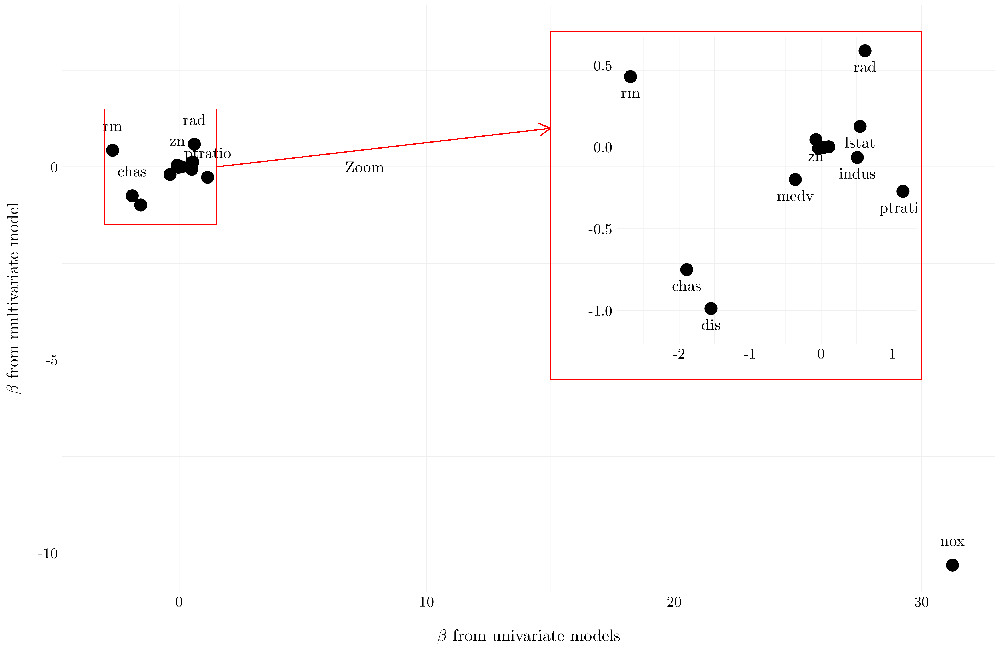
<p class="caption">(\#fig:ex15ci)Plot of the coefficients from the univariate models against the multivariate model.</p>
</div>

As we see, the estimated coefficients are very different if we fit a multivariate model or multiple univariate models.

* *Question (d)*


```r
lm_list <- vector("list", length = length(boston)-1)
for(i in seq(1, length(boston)-1)){
  name <- variable[i]
  lm_list[[i]] <- lm(boston$crim ~ boston[[name]] + I(boston[[name]]^2) + I(boston[[name]]^3))
}
names(lm_list) <- variable
```

<details><summary>Variable `zn`</summary><p><ul><li> *Formula*: boston$crim ~ boston[[name]] + I(boston[[name]]^2) + I(boston[[name]]^3) </li><li> *Residuals* </li><div style="overflow-x:auto;">
<table class="table table-striped table-hover table-condensed table-responsive" style="margin-left: auto; margin-right: auto;">
 <thead>
  <tr>
   <th style="text-align:left;"> Name </th>
   <th style="text-align:right;"> NA_num </th>
   <th style="text-align:right;"> Unique </th>
   <th style="text-align:right;"> Range </th>
   <th style="text-align:right;"> Mean </th>
   <th style="text-align:right;"> Variance </th>
   <th style="text-align:right;"> Minimum </th>
   <th style="text-align:right;"> Q05 </th>
   <th style="text-align:right;"> Q10 </th>
   <th style="text-align:right;"> Q25 </th>
   <th style="text-align:right;"> Q50 </th>
   <th style="text-align:right;"> Q75 </th>
   <th style="text-align:right;"> Q90 </th>
   <th style="text-align:right;"> Q95 </th>
   <th style="text-align:right;"> Maximum </th>
  </tr>
 </thead>
<tbody>
  <tr>
   <td style="text-align:left;"> Residuals </td>
   <td style="text-align:right;"> 0 </td>
   <td style="text-align:right;"> 505 </td>
   <td style="text-align:right;"> 88.95 </td>
   <td style="text-align:right;"> 0 </td>
   <td style="text-align:right;"> 69.68 </td>
   <td style="text-align:right;"> -4.82 </td>
   <td style="text-align:right;"> -4.79 </td>
   <td style="text-align:right;"> -4.76 </td>
   <td style="text-align:right;"> -4.61 </td>
   <td style="text-align:right;"> -1.29 </td>
   <td style="text-align:right;"> 0.47 </td>
   <td style="text-align:right;"> 5.91 </td>
   <td style="text-align:right;"> 10.94 </td>
   <td style="text-align:right;"> 84.13 </td>
  </tr>
</tbody>
</table>
</div>

<li> *Coefficients* </li><div style="overflow-x:auto;">
<table class="table table-striped table-hover table-condensed table-responsive" style="margin-left: auto; margin-right: auto;">
 <thead>
  <tr>
   <th style="text-align:left;"> Variable </th>
   <th style="text-align:right;"> Estimate </th>
   <th style="text-align:right;"> Std. Error </th>
   <th style="text-align:right;"> t value </th>
   <th style="text-align:left;"> Pr(&gt;|t|) </th>
  </tr>
 </thead>
<tbody>
  <tr>
   <td style="text-align:left;"> (Intercept) </td>
   <td style="text-align:right;"> 4.84605 </td>
   <td style="text-align:right;"> 0.43298 </td>
   <td style="text-align:right;"> 11.19220 </td>
   <td style="text-align:left;"> &lt; 2.22e-16 </td>
  </tr>
  <tr>
   <td style="text-align:left;"> boston[[name]] </td>
   <td style="text-align:right;"> -0.33219 </td>
   <td style="text-align:right;"> 0.10981 </td>
   <td style="text-align:right;"> -3.02517 </td>
   <td style="text-align:left;"> 0.0026123 </td>
  </tr>
  <tr>
   <td style="text-align:left;"> I(boston[[name]]^2) </td>
   <td style="text-align:right;"> 0.00648 </td>
   <td style="text-align:right;"> 0.00386 </td>
   <td style="text-align:right;"> 1.67912 </td>
   <td style="text-align:left;"> 0.0937505 </td>
  </tr>
  <tr>
   <td style="text-align:left;"> I(boston[[name]]^3) </td>
   <td style="text-align:right;"> -0.00004 </td>
   <td style="text-align:right;"> 0.00003 </td>
   <td style="text-align:right;"> -1.20301 </td>
   <td style="text-align:left;"> 0.2295386 </td>
  </tr>
</tbody>
</table>
</div>

<li> *Residual standard error*: 8.372 on 502 degrees of freedom. </li><li> *Multiple $R^2$*: 0.058.</li><li> *Adjusted $R^2$*: 0.053.</li><li> *F-statistic*: 10.349 on 3 and 502, p-value: 1.28e-06. </li></ul></p></details><details><summary>Variable `indus`</summary><p><ul><li> *Formula*: boston$crim ~ boston[[name]] + I(boston[[name]]^2) + I(boston[[name]]^3) </li><li> *Residuals* </li><div style="overflow-x:auto;">
<table class="table table-striped table-hover table-condensed table-responsive" style="margin-left: auto; margin-right: auto;">
 <thead>
  <tr>
   <th style="text-align:left;"> Name </th>
   <th style="text-align:right;"> NA_num </th>
   <th style="text-align:right;"> Unique </th>
   <th style="text-align:right;"> Range </th>
   <th style="text-align:right;"> Mean </th>
   <th style="text-align:right;"> Variance </th>
   <th style="text-align:right;"> Minimum </th>
   <th style="text-align:right;"> Q05 </th>
   <th style="text-align:right;"> Q10 </th>
   <th style="text-align:right;"> Q25 </th>
   <th style="text-align:right;"> Q50 </th>
   <th style="text-align:right;"> Q75 </th>
   <th style="text-align:right;"> Q90 </th>
   <th style="text-align:right;"> Q95 </th>
   <th style="text-align:right;"> Maximum </th>
  </tr>
 </thead>
<tbody>
  <tr>
   <td style="text-align:left;"> Residuals </td>
   <td style="text-align:right;"> 0 </td>
   <td style="text-align:right;"> 505 </td>
   <td style="text-align:right;"> 87.99 </td>
   <td style="text-align:right;"> 0 </td>
   <td style="text-align:right;"> 54.78 </td>
   <td style="text-align:right;"> -8.28 </td>
   <td style="text-align:right;"> -7.33 </td>
   <td style="text-align:right;"> -6.22 </td>
   <td style="text-align:right;"> -2.51 </td>
   <td style="text-align:right;"> 0.05 </td>
   <td style="text-align:right;"> 0.76 </td>
   <td style="text-align:right;"> 2.43 </td>
   <td style="text-align:right;"> 6.53 </td>
   <td style="text-align:right;"> 79.71 </td>
  </tr>
</tbody>
</table>
</div>

<li> *Coefficients* </li><div style="overflow-x:auto;">
<table class="table table-striped table-hover table-condensed table-responsive" style="margin-left: auto; margin-right: auto;">
 <thead>
  <tr>
   <th style="text-align:left;"> Variable </th>
   <th style="text-align:right;"> Estimate </th>
   <th style="text-align:right;"> Std. Error </th>
   <th style="text-align:right;"> t value </th>
   <th style="text-align:left;"> Pr(&gt;|t|) </th>
  </tr>
 </thead>
<tbody>
  <tr>
   <td style="text-align:left;"> (Intercept) </td>
   <td style="text-align:right;"> 3.66257 </td>
   <td style="text-align:right;"> 1.57398 </td>
   <td style="text-align:right;"> 2.32694 </td>
   <td style="text-align:left;"> 0.020365 </td>
  </tr>
  <tr>
   <td style="text-align:left;"> boston[[name]] </td>
   <td style="text-align:right;"> -1.96521 </td>
   <td style="text-align:right;"> 0.48199 </td>
   <td style="text-align:right;"> -4.07729 </td>
   <td style="text-align:left;"> 5.2971e-05 </td>
  </tr>
  <tr>
   <td style="text-align:left;"> I(boston[[name]]^2) </td>
   <td style="text-align:right;"> 0.25194 </td>
   <td style="text-align:right;"> 0.03932 </td>
   <td style="text-align:right;"> 6.40701 </td>
   <td style="text-align:left;"> 3.4202e-10 </td>
  </tr>
  <tr>
   <td style="text-align:left;"> I(boston[[name]]^3) </td>
   <td style="text-align:right;"> -0.00698 </td>
   <td style="text-align:right;"> 0.00096 </td>
   <td style="text-align:right;"> -7.29205 </td>
   <td style="text-align:left;"> 1.1964e-12 </td>
  </tr>
</tbody>
</table>
</div>

<li> *Residual standard error*: 7.423 on 502 degrees of freedom. </li><li> *Multiple $R^2$*: 0.26.</li><li> *Adjusted $R^2$*: 0.255.</li><li> *F-statistic*: 58.688 on 3 and 502, p-value: <2e-16. </li></ul></p></details><details><summary>Variable `chas`</summary><p><ul><li> *Formula*: boston$crim ~ boston[[name]] + I(boston[[name]]^2) + I(boston[[name]]^3) </li><li> *Residuals* </li><div style="overflow-x:auto;">
<table class="table table-striped table-hover table-condensed table-responsive" style="margin-left: auto; margin-right: auto;">
 <thead>
  <tr>
   <th style="text-align:left;"> Name </th>
   <th style="text-align:right;"> NA_num </th>
   <th style="text-align:right;"> Unique </th>
   <th style="text-align:right;"> Range </th>
   <th style="text-align:right;"> Mean </th>
   <th style="text-align:right;"> Variance </th>
   <th style="text-align:right;"> Minimum </th>
   <th style="text-align:right;"> Q05 </th>
   <th style="text-align:right;"> Q10 </th>
   <th style="text-align:right;"> Q25 </th>
   <th style="text-align:right;"> Q50 </th>
   <th style="text-align:right;"> Q75 </th>
   <th style="text-align:right;"> Q90 </th>
   <th style="text-align:right;"> Q95 </th>
   <th style="text-align:right;"> Maximum </th>
  </tr>
 </thead>
<tbody>
  <tr>
   <td style="text-align:left;"> Residuals </td>
   <td style="text-align:right;"> 0 </td>
   <td style="text-align:right;"> 505 </td>
   <td style="text-align:right;"> 88.97 </td>
   <td style="text-align:right;"> 0 </td>
   <td style="text-align:right;"> 73.76 </td>
   <td style="text-align:right;"> -3.74 </td>
   <td style="text-align:right;"> -3.72 </td>
   <td style="text-align:right;"> -3.71 </td>
   <td style="text-align:right;"> -3.66 </td>
   <td style="text-align:right;"> -3.44 </td>
   <td style="text-align:right;"> 0.02 </td>
   <td style="text-align:right;"> 7.11 </td>
   <td style="text-align:right;"> 12.04 </td>
   <td style="text-align:right;"> 85.23 </td>
  </tr>
</tbody>
</table>
</div>

<li> *Coefficients* </li><div style="overflow-x:auto;">
<table class="table table-striped table-hover table-condensed table-responsive" style="margin-left: auto; margin-right: auto;">
 <thead>
  <tr>
   <th style="text-align:left;"> Variable </th>
   <th style="text-align:right;"> Estimate </th>
   <th style="text-align:right;"> Std. Error </th>
   <th style="text-align:right;"> t value </th>
   <th style="text-align:left;"> Pr(&gt;|t|) </th>
  </tr>
 </thead>
<tbody>
  <tr>
   <td style="text-align:left;"> (Intercept) </td>
   <td style="text-align:right;"> 3.74445 </td>
   <td style="text-align:right;"> 0.39611 </td>
   <td style="text-align:right;"> 9.45302 </td>
   <td style="text-align:left;"> &lt; 2e-16 </td>
  </tr>
  <tr>
   <td style="text-align:left;"> boston[[name]] </td>
   <td style="text-align:right;"> -1.89278 </td>
   <td style="text-align:right;"> 1.50612 </td>
   <td style="text-align:right;"> -1.25673 </td>
   <td style="text-align:left;"> 0.20943 </td>
  </tr>
</tbody>
</table>
</div>

<li> *Residual standard error*: 8.597 on 504 degrees of freedom. </li><li> *Multiple $R^2$*: 0.003.</li><li> *Adjusted $R^2$*: 0.001.</li><li> *F-statistic*: 1.579 on 1 and 504, p-value: 0.209. </li></ul></p></details><details><summary>Variable `nox`</summary><p><ul><li> *Formula*: boston$crim ~ boston[[name]] + I(boston[[name]]^2) + I(boston[[name]]^3) </li><li> *Residuals* </li><div style="overflow-x:auto;">
<table class="table table-striped table-hover table-condensed table-responsive" style="margin-left: auto; margin-right: auto;">
 <thead>
  <tr>
   <th style="text-align:left;"> Name </th>
   <th style="text-align:right;"> NA_num </th>
   <th style="text-align:right;"> Unique </th>
   <th style="text-align:right;"> Range </th>
   <th style="text-align:right;"> Mean </th>
   <th style="text-align:right;"> Variance </th>
   <th style="text-align:right;"> Minimum </th>
   <th style="text-align:right;"> Q05 </th>
   <th style="text-align:right;"> Q10 </th>
   <th style="text-align:right;"> Q25 </th>
   <th style="text-align:right;"> Q50 </th>
   <th style="text-align:right;"> Q75 </th>
   <th style="text-align:right;"> Q90 </th>
   <th style="text-align:right;"> Q95 </th>
   <th style="text-align:right;"> Maximum </th>
  </tr>
 </thead>
<tbody>
  <tr>
   <td style="text-align:left;"> Residuals </td>
   <td style="text-align:right;"> 0 </td>
   <td style="text-align:right;"> 506 </td>
   <td style="text-align:right;"> 87.41 </td>
   <td style="text-align:right;"> 0 </td>
   <td style="text-align:right;"> 52.01 </td>
   <td style="text-align:right;"> -9.11 </td>
   <td style="text-align:right;"> -7.35 </td>
   <td style="text-align:right;"> -6.16 </td>
   <td style="text-align:right;"> -2.07 </td>
   <td style="text-align:right;"> -0.25 </td>
   <td style="text-align:right;"> 0.74 </td>
   <td style="text-align:right;"> 1.92 </td>
   <td style="text-align:right;"> 7.88 </td>
   <td style="text-align:right;"> 78.3 </td>
  </tr>
</tbody>
</table>
</div>

<li> *Coefficients* </li><div style="overflow-x:auto;">
<table class="table table-striped table-hover table-condensed table-responsive" style="margin-left: auto; margin-right: auto;">
 <thead>
  <tr>
   <th style="text-align:left;"> Variable </th>
   <th style="text-align:right;"> Estimate </th>
   <th style="text-align:right;"> Std. Error </th>
   <th style="text-align:right;"> t value </th>
   <th style="text-align:left;"> Pr(&gt;|t|) </th>
  </tr>
 </thead>
<tbody>
  <tr>
   <td style="text-align:left;"> (Intercept) </td>
   <td style="text-align:right;"> 233.0866 </td>
   <td style="text-align:right;"> 33.6431 </td>
   <td style="text-align:right;"> 6.92821 </td>
   <td style="text-align:left;"> 1.3119e-11 </td>
  </tr>
  <tr>
   <td style="text-align:left;"> boston[[name]] </td>
   <td style="text-align:right;"> -1279.3712 </td>
   <td style="text-align:right;"> 170.3975 </td>
   <td style="text-align:right;"> -7.50816 </td>
   <td style="text-align:left;"> 2.7584e-13 </td>
  </tr>
  <tr>
   <td style="text-align:left;"> I(boston[[name]]^2) </td>
   <td style="text-align:right;"> 2248.5440 </td>
   <td style="text-align:right;"> 279.8993 </td>
   <td style="text-align:right;"> 8.03340 </td>
   <td style="text-align:left;"> 6.8113e-15 </td>
  </tr>
  <tr>
   <td style="text-align:left;"> I(boston[[name]]^3) </td>
   <td style="text-align:right;"> -1245.7029 </td>
   <td style="text-align:right;"> 149.2816 </td>
   <td style="text-align:right;"> -8.34465 </td>
   <td style="text-align:left;"> 6.9611e-16 </td>
  </tr>
</tbody>
</table>
</div>

<li> *Residual standard error*: 7.234 on 502 degrees of freedom. </li><li> *Multiple $R^2$*: 0.297.</li><li> *Adjusted $R^2$*: 0.293.</li><li> *F-statistic*: 70.687 on 3 and 502, p-value: <2e-16. </li></ul></p></details><details><summary>Variable `rm`</summary><p><ul><li> *Formula*: boston$crim ~ boston[[name]] + I(boston[[name]]^2) + I(boston[[name]]^3) </li><li> *Residuals* </li><div style="overflow-x:auto;">
<table class="table table-striped table-hover table-condensed table-responsive" style="margin-left: auto; margin-right: auto;">
 <thead>
  <tr>
   <th style="text-align:left;"> Name </th>
   <th style="text-align:right;"> NA_num </th>
   <th style="text-align:right;"> Unique </th>
   <th style="text-align:right;"> Range </th>
   <th style="text-align:right;"> Mean </th>
   <th style="text-align:right;"> Variance </th>
   <th style="text-align:right;"> Minimum </th>
   <th style="text-align:right;"> Q05 </th>
   <th style="text-align:right;"> Q10 </th>
   <th style="text-align:right;"> Q25 </th>
   <th style="text-align:right;"> Q50 </th>
   <th style="text-align:right;"> Q75 </th>
   <th style="text-align:right;"> Q90 </th>
   <th style="text-align:right;"> Q95 </th>
   <th style="text-align:right;"> Maximum </th>
  </tr>
 </thead>
<tbody>
  <tr>
   <td style="text-align:left;"> Residuals </td>
   <td style="text-align:right;"> 0 </td>
   <td style="text-align:right;"> 506 </td>
   <td style="text-align:right;"> 105.7 </td>
   <td style="text-align:right;"> 0 </td>
   <td style="text-align:right;"> 68.97 </td>
   <td style="text-align:right;"> -18.49 </td>
   <td style="text-align:right;"> -5.13 </td>
   <td style="text-align:right;"> -4.34 </td>
   <td style="text-align:right;"> -3.47 </td>
   <td style="text-align:right;"> -2.22 </td>
   <td style="text-align:right;"> -0.01 </td>
   <td style="text-align:right;"> 6.82 </td>
   <td style="text-align:right;"> 11.58 </td>
   <td style="text-align:right;"> 87.22 </td>
  </tr>
</tbody>
</table>
</div>

<li> *Coefficients* </li><div style="overflow-x:auto;">
<table class="table table-striped table-hover table-condensed table-responsive" style="margin-left: auto; margin-right: auto;">
 <thead>
  <tr>
   <th style="text-align:left;"> Variable </th>
   <th style="text-align:right;"> Estimate </th>
   <th style="text-align:right;"> Std. Error </th>
   <th style="text-align:right;"> t value </th>
   <th style="text-align:left;"> Pr(&gt;|t|) </th>
  </tr>
 </thead>
<tbody>
  <tr>
   <td style="text-align:left;"> (Intercept) </td>
   <td style="text-align:right;"> 112.62460 </td>
   <td style="text-align:right;"> 64.51724 </td>
   <td style="text-align:right;"> 1.74565 </td>
   <td style="text-align:left;"> 0.081483 </td>
  </tr>
  <tr>
   <td style="text-align:left;"> boston[[name]] </td>
   <td style="text-align:right;"> -39.15014 </td>
   <td style="text-align:right;"> 31.31149 </td>
   <td style="text-align:right;"> -1.25034 </td>
   <td style="text-align:left;"> 0.211756 </td>
  </tr>
  <tr>
   <td style="text-align:left;"> I(boston[[name]]^2) </td>
   <td style="text-align:right;"> 4.55090 </td>
   <td style="text-align:right;"> 5.00986 </td>
   <td style="text-align:right;"> 0.90839 </td>
   <td style="text-align:left;"> 0.364109 </td>
  </tr>
  <tr>
   <td style="text-align:left;"> I(boston[[name]]^3) </td>
   <td style="text-align:right;"> -0.17448 </td>
   <td style="text-align:right;"> 0.26375 </td>
   <td style="text-align:right;"> -0.66153 </td>
   <td style="text-align:left;"> 0.508575 </td>
  </tr>
</tbody>
</table>
</div>

<li> *Residual standard error*: 8.33 on 502 degrees of freedom. </li><li> *Multiple $R^2$*: 0.068.</li><li> *Adjusted $R^2$*: 0.062.</li><li> *F-statistic*: 12.168 on 3 and 502, p-value: 1.07e-07. </li></ul></p></details><details><summary>Variable `age`</summary><p><ul><li> *Formula*: boston$crim ~ boston[[name]] + I(boston[[name]]^2) + I(boston[[name]]^3) </li><li> *Residuals* </li><div style="overflow-x:auto;">
<table class="table table-striped table-hover table-condensed table-responsive" style="margin-left: auto; margin-right: auto;">
 <thead>
  <tr>
   <th style="text-align:left;"> Name </th>
   <th style="text-align:right;"> NA_num </th>
   <th style="text-align:right;"> Unique </th>
   <th style="text-align:right;"> Range </th>
   <th style="text-align:right;"> Mean </th>
   <th style="text-align:right;"> Variance </th>
   <th style="text-align:right;"> Minimum </th>
   <th style="text-align:right;"> Q05 </th>
   <th style="text-align:right;"> Q10 </th>
   <th style="text-align:right;"> Q25 </th>
   <th style="text-align:right;"> Q50 </th>
   <th style="text-align:right;"> Q75 </th>
   <th style="text-align:right;"> Q90 </th>
   <th style="text-align:right;"> Q95 </th>
   <th style="text-align:right;"> Maximum </th>
  </tr>
 </thead>
<tbody>
  <tr>
   <td style="text-align:left;"> Residuals </td>
   <td style="text-align:right;"> 0 </td>
   <td style="text-align:right;"> 506 </td>
   <td style="text-align:right;"> 92.6 </td>
   <td style="text-align:right;"> 0 </td>
   <td style="text-align:right;"> 61.1 </td>
   <td style="text-align:right;"> -9.76 </td>
   <td style="text-align:right;"> -7.8 </td>
   <td style="text-align:right;"> -6.42 </td>
   <td style="text-align:right;"> -2.67 </td>
   <td style="text-align:right;"> -0.52 </td>
   <td style="text-align:right;"> 0.02 </td>
   <td style="text-align:right;"> 4.38 </td>
   <td style="text-align:right;"> 8.77 </td>
   <td style="text-align:right;"> 82.84 </td>
  </tr>
</tbody>
</table>
</div>

<li> *Coefficients* </li><div style="overflow-x:auto;">
<table class="table table-striped table-hover table-condensed table-responsive" style="margin-left: auto; margin-right: auto;">
 <thead>
  <tr>
   <th style="text-align:left;"> Variable </th>
   <th style="text-align:right;"> Estimate </th>
   <th style="text-align:right;"> Std. Error </th>
   <th style="text-align:right;"> t value </th>
   <th style="text-align:left;"> Pr(&gt;|t|) </th>
  </tr>
 </thead>
<tbody>
  <tr>
   <td style="text-align:left;"> (Intercept) </td>
   <td style="text-align:right;"> -2.54876 </td>
   <td style="text-align:right;"> 2.76914 </td>
   <td style="text-align:right;"> -0.92042 </td>
   <td style="text-align:left;"> 0.3577971 </td>
  </tr>
  <tr>
   <td style="text-align:left;"> boston[[name]] </td>
   <td style="text-align:right;"> 0.27365 </td>
   <td style="text-align:right;"> 0.18638 </td>
   <td style="text-align:right;"> 1.46826 </td>
   <td style="text-align:left;"> 0.1426608 </td>
  </tr>
  <tr>
   <td style="text-align:left;"> I(boston[[name]]^2) </td>
   <td style="text-align:right;"> -0.00723 </td>
   <td style="text-align:right;"> 0.00364 </td>
   <td style="text-align:right;"> -1.98779 </td>
   <td style="text-align:left;"> 0.0473773 </td>
  </tr>
  <tr>
   <td style="text-align:left;"> I(boston[[name]]^3) </td>
   <td style="text-align:right;"> 0.00006 </td>
   <td style="text-align:right;"> 0.00002 </td>
   <td style="text-align:right;"> 2.72373 </td>
   <td style="text-align:left;"> 0.0066799 </td>
  </tr>
</tbody>
</table>
</div>

<li> *Residual standard error*: 7.84 on 502 degrees of freedom. </li><li> *Multiple $R^2$*: 0.174.</li><li> *Adjusted $R^2$*: 0.169.</li><li> *F-statistic*: 35.306 on 3 and 502, p-value: <2e-16. </li></ul></p></details><details><summary>Variable `dis`</summary><p><ul><li> *Formula*: boston$crim ~ boston[[name]] + I(boston[[name]]^2) + I(boston[[name]]^3) </li><li> *Residuals* </li><div style="overflow-x:auto;">
<table class="table table-striped table-hover table-condensed table-responsive" style="margin-left: auto; margin-right: auto;">
 <thead>
  <tr>
   <th style="text-align:left;"> Name </th>
   <th style="text-align:right;"> NA_num </th>
   <th style="text-align:right;"> Unique </th>
   <th style="text-align:right;"> Range </th>
   <th style="text-align:right;"> Mean </th>
   <th style="text-align:right;"> Variance </th>
   <th style="text-align:right;"> Minimum </th>
   <th style="text-align:right;"> Q05 </th>
   <th style="text-align:right;"> Q10 </th>
   <th style="text-align:right;"> Q25 </th>
   <th style="text-align:right;"> Q50 </th>
   <th style="text-align:right;"> Q75 </th>
   <th style="text-align:right;"> Q90 </th>
   <th style="text-align:right;"> Q95 </th>
   <th style="text-align:right;"> Maximum </th>
  </tr>
 </thead>
<tbody>
  <tr>
   <td style="text-align:left;"> Residuals </td>
   <td style="text-align:right;"> 0 </td>
   <td style="text-align:right;"> 506 </td>
   <td style="text-align:right;"> 87.14 </td>
   <td style="text-align:right;"> 0 </td>
   <td style="text-align:right;"> 53.43 </td>
   <td style="text-align:right;"> -10.76 </td>
   <td style="text-align:right;"> -8.45 </td>
   <td style="text-align:right;"> -6.51 </td>
   <td style="text-align:right;"> -2.59 </td>
   <td style="text-align:right;"> 0.03 </td>
   <td style="text-align:right;"> 1.27 </td>
   <td style="text-align:right;"> 3.41 </td>
   <td style="text-align:right;"> 6.72 </td>
   <td style="text-align:right;"> 76.38 </td>
  </tr>
</tbody>
</table>
</div>

<li> *Coefficients* </li><div style="overflow-x:auto;">
<table class="table table-striped table-hover table-condensed table-responsive" style="margin-left: auto; margin-right: auto;">
 <thead>
  <tr>
   <th style="text-align:left;"> Variable </th>
   <th style="text-align:right;"> Estimate </th>
   <th style="text-align:right;"> Std. Error </th>
   <th style="text-align:right;"> t value </th>
   <th style="text-align:left;"> Pr(&gt;|t|) </th>
  </tr>
 </thead>
<tbody>
  <tr>
   <td style="text-align:left;"> (Intercept) </td>
   <td style="text-align:right;"> 30.04761 </td>
   <td style="text-align:right;"> 2.44587 </td>
   <td style="text-align:right;"> 12.28504 </td>
   <td style="text-align:left;"> &lt; 2.22e-16 </td>
  </tr>
  <tr>
   <td style="text-align:left;"> boston[[name]] </td>
   <td style="text-align:right;"> -15.55435 </td>
   <td style="text-align:right;"> 1.73597 </td>
   <td style="text-align:right;"> -8.96005 </td>
   <td style="text-align:left;"> &lt; 2.22e-16 </td>
  </tr>
  <tr>
   <td style="text-align:left;"> I(boston[[name]]^2) </td>
   <td style="text-align:right;"> 2.45207 </td>
   <td style="text-align:right;"> 0.34642 </td>
   <td style="text-align:right;"> 7.07833 </td>
   <td style="text-align:left;"> 4.9412e-12 </td>
  </tr>
  <tr>
   <td style="text-align:left;"> I(boston[[name]]^3) </td>
   <td style="text-align:right;"> -0.11860 </td>
   <td style="text-align:right;"> 0.02040 </td>
   <td style="text-align:right;"> -5.81354 </td>
   <td style="text-align:left;"> 1.0888e-08 </td>
  </tr>
</tbody>
</table>
</div>

<li> *Residual standard error*: 7.331 on 502 degrees of freedom. </li><li> *Multiple $R^2$*: 0.278.</li><li> *Adjusted $R^2$*: 0.274.</li><li> *F-statistic*: 64.374 on 3 and 502, p-value: <2e-16. </li></ul></p></details><details><summary>Variable `rad`</summary><p><ul><li> *Formula*: boston$crim ~ boston[[name]] + I(boston[[name]]^2) + I(boston[[name]]^3) </li><li> *Residuals* </li><div style="overflow-x:auto;">
<table class="table table-striped table-hover table-condensed table-responsive" style="margin-left: auto; margin-right: auto;">
 <thead>
  <tr>
   <th style="text-align:left;"> Name </th>
   <th style="text-align:right;"> NA_num </th>
   <th style="text-align:right;"> Unique </th>
   <th style="text-align:right;"> Range </th>
   <th style="text-align:right;"> Mean </th>
   <th style="text-align:right;"> Variance </th>
   <th style="text-align:right;"> Minimum </th>
   <th style="text-align:right;"> Q05 </th>
   <th style="text-align:right;"> Q10 </th>
   <th style="text-align:right;"> Q25 </th>
   <th style="text-align:right;"> Q50 </th>
   <th style="text-align:right;"> Q75 </th>
   <th style="text-align:right;"> Q90 </th>
   <th style="text-align:right;"> Q95 </th>
   <th style="text-align:right;"> Maximum </th>
  </tr>
 </thead>
<tbody>
  <tr>
   <td style="text-align:left;"> Residuals </td>
   <td style="text-align:right;"> 0 </td>
   <td style="text-align:right;"> 505 </td>
   <td style="text-align:right;"> 86.6 </td>
   <td style="text-align:right;"> 0 </td>
   <td style="text-align:right;"> 44.39 </td>
   <td style="text-align:right;"> -10.38 </td>
   <td style="text-align:right;"> -7.81 </td>
   <td style="text-align:right;"> -5.29 </td>
   <td style="text-align:right;"> -0.41 </td>
   <td style="text-align:right;"> -0.27 </td>
   <td style="text-align:right;"> 0.18 </td>
   <td style="text-align:right;"> 1.55 </td>
   <td style="text-align:right;"> 3.11 </td>
   <td style="text-align:right;"> 76.22 </td>
  </tr>
</tbody>
</table>
</div>

<li> *Coefficients* </li><div style="overflow-x:auto;">
<table class="table table-striped table-hover table-condensed table-responsive" style="margin-left: auto; margin-right: auto;">
 <thead>
  <tr>
   <th style="text-align:left;"> Variable </th>
   <th style="text-align:right;"> Estimate </th>
   <th style="text-align:right;"> Std. Error </th>
   <th style="text-align:right;"> t value </th>
   <th style="text-align:left;"> Pr(&gt;|t|) </th>
  </tr>
 </thead>
<tbody>
  <tr>
   <td style="text-align:left;"> (Intercept) </td>
   <td style="text-align:right;"> -0.60554 </td>
   <td style="text-align:right;"> 2.05011 </td>
   <td style="text-align:right;"> -0.29537 </td>
   <td style="text-align:left;"> 0.76783 </td>
  </tr>
  <tr>
   <td style="text-align:left;"> boston[[name]] </td>
   <td style="text-align:right;"> 0.51274 </td>
   <td style="text-align:right;"> 1.04360 </td>
   <td style="text-align:right;"> 0.49132 </td>
   <td style="text-align:left;"> 0.62342 </td>
  </tr>
  <tr>
   <td style="text-align:left;"> I(boston[[name]]^2) </td>
   <td style="text-align:right;"> -0.07518 </td>
   <td style="text-align:right;"> 0.14854 </td>
   <td style="text-align:right;"> -0.50610 </td>
   <td style="text-align:left;"> 0.61301 </td>
  </tr>
  <tr>
   <td style="text-align:left;"> I(boston[[name]]^3) </td>
   <td style="text-align:right;"> 0.00321 </td>
   <td style="text-align:right;"> 0.00456 </td>
   <td style="text-align:right;"> 0.70311 </td>
   <td style="text-align:left;"> 0.48231 </td>
  </tr>
</tbody>
</table>
</div>

<li> *Residual standard error*: 6.682 on 502 degrees of freedom. </li><li> *Multiple $R^2$*: 0.4.</li><li> *Adjusted $R^2$*: 0.396.</li><li> *F-statistic*: 111.573 on 3 and 502, p-value: <2e-16. </li></ul></p></details><details><summary>Variable `tax`</summary><p><ul><li> *Formula*: boston$crim ~ boston[[name]] + I(boston[[name]]^2) + I(boston[[name]]^3) </li><li> *Residuals* </li><div style="overflow-x:auto;">
<table class="table table-striped table-hover table-condensed table-responsive" style="margin-left: auto; margin-right: auto;">
 <thead>
  <tr>
   <th style="text-align:left;"> Name </th>
   <th style="text-align:right;"> NA_num </th>
   <th style="text-align:right;"> Unique </th>
   <th style="text-align:right;"> Range </th>
   <th style="text-align:right;"> Mean </th>
   <th style="text-align:right;"> Variance </th>
   <th style="text-align:right;"> Minimum </th>
   <th style="text-align:right;"> Q05 </th>
   <th style="text-align:right;"> Q10 </th>
   <th style="text-align:right;"> Q25 </th>
   <th style="text-align:right;"> Q50 </th>
   <th style="text-align:right;"> Q75 </th>
   <th style="text-align:right;"> Q90 </th>
   <th style="text-align:right;"> Q95 </th>
   <th style="text-align:right;"> Maximum </th>
  </tr>
 </thead>
<tbody>
  <tr>
   <td style="text-align:left;"> Residuals </td>
   <td style="text-align:right;"> 0 </td>
   <td style="text-align:right;"> 505 </td>
   <td style="text-align:right;"> 90.22 </td>
   <td style="text-align:right;"> 0 </td>
   <td style="text-align:right;"> 46.69 </td>
   <td style="text-align:right;"> -13.27 </td>
   <td style="text-align:right;"> -7.34 </td>
   <td style="text-align:right;"> -5.14 </td>
   <td style="text-align:right;"> -1.39 </td>
   <td style="text-align:right;"> 0.05 </td>
   <td style="text-align:right;"> 0.54 </td>
   <td style="text-align:right;"> 1.34 </td>
   <td style="text-align:right;"> 3.76 </td>
   <td style="text-align:right;"> 76.95 </td>
  </tr>
</tbody>
</table>
</div>

<li> *Coefficients* </li><div style="overflow-x:auto;">
<table class="table table-striped table-hover table-condensed table-responsive" style="margin-left: auto; margin-right: auto;">
 <thead>
  <tr>
   <th style="text-align:left;"> Variable </th>
   <th style="text-align:right;"> Estimate </th>
   <th style="text-align:right;"> Std. Error </th>
   <th style="text-align:right;"> t value </th>
   <th style="text-align:left;"> Pr(&gt;|t|) </th>
  </tr>
 </thead>
<tbody>
  <tr>
   <td style="text-align:left;"> (Intercept) </td>
   <td style="text-align:right;"> 19.18358 </td>
   <td style="text-align:right;"> 11.79555 </td>
   <td style="text-align:right;"> 1.62634 </td>
   <td style="text-align:left;"> 0.10450 </td>
  </tr>
  <tr>
   <td style="text-align:left;"> boston[[name]] </td>
   <td style="text-align:right;"> -0.15331 </td>
   <td style="text-align:right;"> 0.09568 </td>
   <td style="text-align:right;"> -1.60235 </td>
   <td style="text-align:left;"> 0.10971 </td>
  </tr>
  <tr>
   <td style="text-align:left;"> I(boston[[name]]^2) </td>
   <td style="text-align:right;"> 0.00036 </td>
   <td style="text-align:right;"> 0.00024 </td>
   <td style="text-align:right;"> 1.48766 </td>
   <td style="text-align:left;"> 0.13747 </td>
  </tr>
  <tr>
   <td style="text-align:left;"> I(boston[[name]]^3) </td>
   <td style="text-align:right;"> 0.00000 </td>
   <td style="text-align:right;"> 0.00000 </td>
   <td style="text-align:right;"> -1.16679 </td>
   <td style="text-align:left;"> 0.24385 </td>
  </tr>
</tbody>
</table>
</div>

<li> *Residual standard error*: 6.854 on 502 degrees of freedom. </li><li> *Multiple $R^2$*: 0.369.</li><li> *Adjusted $R^2$*: 0.365.</li><li> *F-statistic*: 97.805 on 3 and 502, p-value: <2e-16. </li></ul></p></details><details><summary>Variable `ptratio`</summary><p><ul><li> *Formula*: boston$crim ~ boston[[name]] + I(boston[[name]]^2) + I(boston[[name]]^3) </li><li> *Residuals* </li><div style="overflow-x:auto;">
<table class="table table-striped table-hover table-condensed table-responsive" style="margin-left: auto; margin-right: auto;">
 <thead>
  <tr>
   <th style="text-align:left;"> Name </th>
   <th style="text-align:right;"> NA_num </th>
   <th style="text-align:right;"> Unique </th>
   <th style="text-align:right;"> Range </th>
   <th style="text-align:right;"> Mean </th>
   <th style="text-align:right;"> Variance </th>
   <th style="text-align:right;"> Minimum </th>
   <th style="text-align:right;"> Q05 </th>
   <th style="text-align:right;"> Q10 </th>
   <th style="text-align:right;"> Q25 </th>
   <th style="text-align:right;"> Q50 </th>
   <th style="text-align:right;"> Q75 </th>
   <th style="text-align:right;"> Q90 </th>
   <th style="text-align:right;"> Q95 </th>
   <th style="text-align:right;"> Maximum </th>
  </tr>
 </thead>
<tbody>
  <tr>
   <td style="text-align:left;"> Residuals </td>
   <td style="text-align:right;"> 0 </td>
   <td style="text-align:right;"> 505 </td>
   <td style="text-align:right;"> 89.53 </td>
   <td style="text-align:right;"> 0 </td>
   <td style="text-align:right;"> 65.57 </td>
   <td style="text-align:right;"> -6.83 </td>
   <td style="text-align:right;"> -6.3 </td>
   <td style="text-align:right;"> -5.99 </td>
   <td style="text-align:right;"> -4.15 </td>
   <td style="text-align:right;"> -1.65 </td>
   <td style="text-align:right;"> 1.41 </td>
   <td style="text-align:right;"> 4.73 </td>
   <td style="text-align:right;"> 9.51 </td>
   <td style="text-align:right;"> 82.7 </td>
  </tr>
</tbody>
</table>
</div>

<li> *Coefficients* </li><div style="overflow-x:auto;">
<table class="table table-striped table-hover table-condensed table-responsive" style="margin-left: auto; margin-right: auto;">
 <thead>
  <tr>
   <th style="text-align:left;"> Variable </th>
   <th style="text-align:right;"> Estimate </th>
   <th style="text-align:right;"> Std. Error </th>
   <th style="text-align:right;"> t value </th>
   <th style="text-align:left;"> Pr(&gt;|t|) </th>
  </tr>
 </thead>
<tbody>
  <tr>
   <td style="text-align:left;"> (Intercept) </td>
   <td style="text-align:right;"> 477.18405 </td>
   <td style="text-align:right;"> 156.79498 </td>
   <td style="text-align:right;"> 3.04336 </td>
   <td style="text-align:left;"> 0.0024621 </td>
  </tr>
  <tr>
   <td style="text-align:left;"> boston[[name]] </td>
   <td style="text-align:right;"> -82.36054 </td>
   <td style="text-align:right;"> 27.64394 </td>
   <td style="text-align:right;"> -2.97933 </td>
   <td style="text-align:left;"> 0.0030287 </td>
  </tr>
  <tr>
   <td style="text-align:left;"> I(boston[[name]]^2) </td>
   <td style="text-align:right;"> 4.63535 </td>
   <td style="text-align:right;"> 1.60832 </td>
   <td style="text-align:right;"> 2.88210 </td>
   <td style="text-align:left;"> 0.0041196 </td>
  </tr>
  <tr>
   <td style="text-align:left;"> I(boston[[name]]^3) </td>
   <td style="text-align:right;"> -0.08476 </td>
   <td style="text-align:right;"> 0.03090 </td>
   <td style="text-align:right;"> -2.74328 </td>
   <td style="text-align:left;"> 0.0063005 </td>
  </tr>
</tbody>
</table>
</div>

<li> *Residual standard error*: 8.122 on 502 degrees of freedom. </li><li> *Multiple $R^2$*: 0.114.</li><li> *Adjusted $R^2$*: 0.108.</li><li> *F-statistic*: 21.484 on 3 and 502, p-value: 4.17e-13. </li></ul></p></details><details><summary>Variable `black`</summary><p><ul><li> *Formula*: boston$crim ~ boston[[name]] + I(boston[[name]]^2) + I(boston[[name]]^3) </li><li> *Residuals* </li><div style="overflow-x:auto;">
<table class="table table-striped table-hover table-condensed table-responsive" style="margin-left: auto; margin-right: auto;">
 <thead>
  <tr>
   <th style="text-align:left;"> Name </th>
   <th style="text-align:right;"> NA_num </th>
   <th style="text-align:right;"> Unique </th>
   <th style="text-align:right;"> Range </th>
   <th style="text-align:right;"> Mean </th>
   <th style="text-align:right;"> Variance </th>
   <th style="text-align:right;"> Minimum </th>
   <th style="text-align:right;"> Q05 </th>
   <th style="text-align:right;"> Q10 </th>
   <th style="text-align:right;"> Q25 </th>
   <th style="text-align:right;"> Q50 </th>
   <th style="text-align:right;"> Q75 </th>
   <th style="text-align:right;"> Q90 </th>
   <th style="text-align:right;"> Q95 </th>
   <th style="text-align:right;"> Maximum </th>
  </tr>
 </thead>
<tbody>
  <tr>
   <td style="text-align:left;"> Residuals </td>
   <td style="text-align:right;"> 0 </td>
   <td style="text-align:right;"> 506 </td>
   <td style="text-align:right;"> 99.89 </td>
   <td style="text-align:right;"> 0 </td>
   <td style="text-align:right;"> 62.9 </td>
   <td style="text-align:right;"> -13.1 </td>
   <td style="text-align:right;"> -4.32 </td>
   <td style="text-align:right;"> -2.99 </td>
   <td style="text-align:right;"> -2.34 </td>
   <td style="text-align:right;"> -2.13 </td>
   <td style="text-align:right;"> -1.44 </td>
   <td style="text-align:right;"> 5.87 </td>
   <td style="text-align:right;"> 11.82 </td>
   <td style="text-align:right;"> 86.79 </td>
  </tr>
</tbody>
</table>
</div>

<li> *Coefficients* </li><div style="overflow-x:auto;">
<table class="table table-striped table-hover table-condensed table-responsive" style="margin-left: auto; margin-right: auto;">
 <thead>
  <tr>
   <th style="text-align:left;"> Variable </th>
   <th style="text-align:right;"> Estimate </th>
   <th style="text-align:right;"> Std. Error </th>
   <th style="text-align:right;"> t value </th>
   <th style="text-align:left;"> Pr(&gt;|t|) </th>
  </tr>
 </thead>
<tbody>
  <tr>
   <td style="text-align:left;"> (Intercept) </td>
   <td style="text-align:right;"> 18.26370 </td>
   <td style="text-align:right;"> 2.30490 </td>
   <td style="text-align:right;"> 7.92385 </td>
   <td style="text-align:left;"> 1.4971e-14 </td>
  </tr>
  <tr>
   <td style="text-align:left;"> boston[[name]] </td>
   <td style="text-align:right;"> -0.08356 </td>
   <td style="text-align:right;"> 0.05633 </td>
   <td style="text-align:right;"> -1.48343 </td>
   <td style="text-align:left;"> 0.13859 </td>
  </tr>
  <tr>
   <td style="text-align:left;"> I(boston[[name]]^2) </td>
   <td style="text-align:right;"> 0.00021 </td>
   <td style="text-align:right;"> 0.00030 </td>
   <td style="text-align:right;"> 0.71624 </td>
   <td style="text-align:left;"> 0.47418 </td>
  </tr>
  <tr>
   <td style="text-align:left;"> I(boston[[name]]^3) </td>
   <td style="text-align:right;"> 0.00000 </td>
   <td style="text-align:right;"> 0.00000 </td>
   <td style="text-align:right;"> -0.60777 </td>
   <td style="text-align:left;"> 0.54362 </td>
  </tr>
</tbody>
</table>
</div>

<li> *Residual standard error*: 7.955 on 502 degrees of freedom. </li><li> *Multiple $R^2$*: 0.15.</li><li> *Adjusted $R^2$*: 0.145.</li><li> *F-statistic*: 29.492 on 3 and 502, p-value: <2e-16. </li></ul></p></details><details><summary>Variable `lstat`</summary><p><ul><li> *Formula*: boston$crim ~ boston[[name]] + I(boston[[name]]^2) + I(boston[[name]]^3) </li><li> *Residuals* </li><div style="overflow-x:auto;">
<table class="table table-striped table-hover table-condensed table-responsive" style="margin-left: auto; margin-right: auto;">
 <thead>
  <tr>
   <th style="text-align:left;"> Name </th>
   <th style="text-align:right;"> NA_num </th>
   <th style="text-align:right;"> Unique </th>
   <th style="text-align:right;"> Range </th>
   <th style="text-align:right;"> Mean </th>
   <th style="text-align:right;"> Variance </th>
   <th style="text-align:right;"> Minimum </th>
   <th style="text-align:right;"> Q05 </th>
   <th style="text-align:right;"> Q10 </th>
   <th style="text-align:right;"> Q25 </th>
   <th style="text-align:right;"> Q50 </th>
   <th style="text-align:right;"> Q75 </th>
   <th style="text-align:right;"> Q90 </th>
   <th style="text-align:right;"> Q95 </th>
   <th style="text-align:right;"> Maximum </th>
  </tr>
 </thead>
<tbody>
  <tr>
   <td style="text-align:left;"> Residuals </td>
   <td style="text-align:right;"> 0 </td>
   <td style="text-align:right;"> 506 </td>
   <td style="text-align:right;"> 98.59 </td>
   <td style="text-align:right;"> 0 </td>
   <td style="text-align:right;"> 57.86 </td>
   <td style="text-align:right;"> -15.23 </td>
   <td style="text-align:right;"> -6.58 </td>
   <td style="text-align:right;"> -4.93 </td>
   <td style="text-align:right;"> -2.15 </td>
   <td style="text-align:right;"> -0.49 </td>
   <td style="text-align:right;"> 0.07 </td>
   <td style="text-align:right;"> 4.03 </td>
   <td style="text-align:right;"> 8.3 </td>
   <td style="text-align:right;"> 83.35 </td>
  </tr>
</tbody>
</table>
</div>

<li> *Coefficients* </li><div style="overflow-x:auto;">
<table class="table table-striped table-hover table-condensed table-responsive" style="margin-left: auto; margin-right: auto;">
 <thead>
  <tr>
   <th style="text-align:left;"> Variable </th>
   <th style="text-align:right;"> Estimate </th>
   <th style="text-align:right;"> Std. Error </th>
   <th style="text-align:right;"> t value </th>
   <th style="text-align:left;"> Pr(&gt;|t|) </th>
  </tr>
 </thead>
<tbody>
  <tr>
   <td style="text-align:left;"> (Intercept) </td>
   <td style="text-align:right;"> 1.20097 </td>
   <td style="text-align:right;"> 2.02865 </td>
   <td style="text-align:right;"> 0.59200 </td>
   <td style="text-align:left;"> 0.554115 </td>
  </tr>
  <tr>
   <td style="text-align:left;"> boston[[name]] </td>
   <td style="text-align:right;"> -0.44907 </td>
   <td style="text-align:right;"> 0.46489 </td>
   <td style="text-align:right;"> -0.96596 </td>
   <td style="text-align:left;"> 0.334530 </td>
  </tr>
  <tr>
   <td style="text-align:left;"> I(boston[[name]]^2) </td>
   <td style="text-align:right;"> 0.05578 </td>
   <td style="text-align:right;"> 0.03012 </td>
   <td style="text-align:right;"> 1.85218 </td>
   <td style="text-align:left;"> 0.064587 </td>
  </tr>
  <tr>
   <td style="text-align:left;"> I(boston[[name]]^3) </td>
   <td style="text-align:right;"> -0.00086 </td>
   <td style="text-align:right;"> 0.00057 </td>
   <td style="text-align:right;"> -1.51702 </td>
   <td style="text-align:left;"> 0.129891 </td>
  </tr>
</tbody>
</table>
</div>

<li> *Residual standard error*: 7.629 on 502 degrees of freedom. </li><li> *Multiple $R^2$*: 0.218.</li><li> *Adjusted $R^2$*: 0.213.</li><li> *F-statistic*: 46.629 on 3 and 502, p-value: <2e-16. </li></ul></p></details><details><summary>Variable `medv`</summary><p><ul><li> *Formula*: boston$crim ~ boston[[name]] + I(boston[[name]]^2) + I(boston[[name]]^3) </li><li> *Residuals* </li><div style="overflow-x:auto;">
<table class="table table-striped table-hover table-condensed table-responsive" style="margin-left: auto; margin-right: auto;">
 <thead>
  <tr>
   <th style="text-align:left;"> Name </th>
   <th style="text-align:right;"> NA_num </th>
   <th style="text-align:right;"> Unique </th>
   <th style="text-align:right;"> Range </th>
   <th style="text-align:right;"> Mean </th>
   <th style="text-align:right;"> Variance </th>
   <th style="text-align:right;"> Minimum </th>
   <th style="text-align:right;"> Q05 </th>
   <th style="text-align:right;"> Q10 </th>
   <th style="text-align:right;"> Q25 </th>
   <th style="text-align:right;"> Q50 </th>
   <th style="text-align:right;"> Q75 </th>
   <th style="text-align:right;"> Q90 </th>
   <th style="text-align:right;"> Q95 </th>
   <th style="text-align:right;"> Maximum </th>
  </tr>
 </thead>
<tbody>
  <tr>
   <td style="text-align:left;"> Residuals </td>
   <td style="text-align:right;"> 0 </td>
   <td style="text-align:right;"> 506 </td>
   <td style="text-align:right;"> 98.08 </td>
   <td style="text-align:right;"> 0 </td>
   <td style="text-align:right;"> 42.9 </td>
   <td style="text-align:right;"> -24.43 </td>
   <td style="text-align:right;"> -6.47 </td>
   <td style="text-align:right;"> -4.42 </td>
   <td style="text-align:right;"> -1.98 </td>
   <td style="text-align:right;"> -0.44 </td>
   <td style="text-align:right;"> 0.44 </td>
   <td style="text-align:right;"> 3.59 </td>
   <td style="text-align:right;"> 7.06 </td>
   <td style="text-align:right;"> 73.65 </td>
  </tr>
</tbody>
</table>
</div>

<li> *Coefficients* </li><div style="overflow-x:auto;">
<table class="table table-striped table-hover table-condensed table-responsive" style="margin-left: auto; margin-right: auto;">
 <thead>
  <tr>
   <th style="text-align:left;"> Variable </th>
   <th style="text-align:right;"> Estimate </th>
   <th style="text-align:right;"> Std. Error </th>
   <th style="text-align:right;"> t value </th>
   <th style="text-align:left;"> Pr(&gt;|t|) </th>
  </tr>
 </thead>
<tbody>
  <tr>
   <td style="text-align:left;"> (Intercept) </td>
   <td style="text-align:right;"> 53.16554 </td>
   <td style="text-align:right;"> 3.35631 </td>
   <td style="text-align:right;"> 15.84047 </td>
   <td style="text-align:left;"> &lt; 2.22e-16 </td>
  </tr>
  <tr>
   <td style="text-align:left;"> boston[[name]] </td>
   <td style="text-align:right;"> -5.09483 </td>
   <td style="text-align:right;"> 0.43383 </td>
   <td style="text-align:right;"> -11.74379 </td>
   <td style="text-align:left;"> &lt; 2.22e-16 </td>
  </tr>
  <tr>
   <td style="text-align:left;"> I(boston[[name]]^2) </td>
   <td style="text-align:right;"> 0.15550 </td>
   <td style="text-align:right;"> 0.01719 </td>
   <td style="text-align:right;"> 9.04552 </td>
   <td style="text-align:left;"> &lt; 2.22e-16 </td>
  </tr>
  <tr>
   <td style="text-align:left;"> I(boston[[name]]^3) </td>
   <td style="text-align:right;"> -0.00149 </td>
   <td style="text-align:right;"> 0.00020 </td>
   <td style="text-align:right;"> -7.31197 </td>
   <td style="text-align:left;"> 1.0465e-12 </td>
  </tr>
</tbody>
</table>
</div>

<li> *Residual standard error*: 6.569 on 502 degrees of freedom. </li><li> *Multiple $R^2$*: 0.42.</li><li> *Adjusted $R^2$*: 0.417.</li><li> *F-statistic*: 121.272 on 3 and 502, p-value: <2e-16. </li></ul></p></details>

Some variable are statistically significative until their cubic version (`indus`, `nox`, `dis`, `ptratio` and `medv`). So, we can conclude to some non linear relationship between the response and some of the predictors. However, we should also take a look at the colinearity between the predictors because of them seem to be very correlated, and that can change a lot the results.

