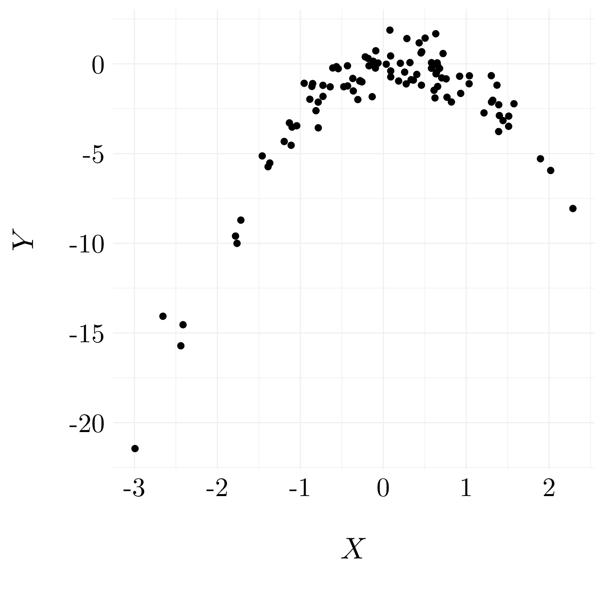

# Resampling Methods


## Conceptual Exercises

### Exercise 1.

Proof that $\alpha = \frac{\sigma_Y^2 - \sigma_{X,Y}}{\sigma_X^2 + \sigma_Y^2 - 2\sigma_{X,Y}}$ minimize $\text{Var}(\alpha X + (1 - \alpha)Y)$.

Using properties of the variance, we found that:

$$\text{Var}(\alpha X + (1 - \alpha)Y) = \alpha^2\sigma_X^2 + (1 - \alpha)^2\sigma_Y^2 + 2\alpha(1 - \alpha)\sigma_{X,Y}.$$

As we seek to minimize this quantity with respect to $\alpha$, we have to set the derivative with respect to $\alpha$ equal to $0$. 

\begin{align}
\frac{d\text{Var}(\alpha X + (1 - \alpha)Y)}{d\alpha} = 0 &\Longleftrightarrow 2\alpha\sigma_X^2 + 2(1 - \alpha)\sigma_Y^2 + 2(1 - 2\alpha)\sigma_{X,Y} = 0 \\
&\Longleftrightarrow \left(\sigma_X^2 + \sigma_Y^2 - 2\sigma_{X,Y}\right)\alpha = \sigma_Y^2 - \sigma_{X,Y} \\
&\Longleftrightarrow \alpha = \frac{\sigma_Y^2 - \sigma_{X,Y}}{\sigma_X^2 + \sigma_Y^2 - 2\sigma_{X,Y}}
\end{align}

### Exercise 2.

Suppose that we obtain a bootstrap sample from a set of $n$ observations.

* *Question (a)*

We draw one observation from a set of $n$ observations. So, the probability of getting a particular observation $j$ is $1/n$.

$$\mathbb{P}(X_j \neq S^{(1)}) = 1 - \mathbb{P}(X_j = S^{(1)}) = 1 - \frac{1}{n}, \quad\text{where}~ S^{(1)} ~\text{is the first element of the sample.}$$ 

* *Question (b)*

The bootstrap is performed **wih replacement**. So, the probability of getting a ârticular observation is $1/n$ at each drawing.

$$\mathbb{P}(X_j \neq S^{(2)}) = 1 - \mathbb{P}(X_j = S^{(2)}) = 1 - \frac{1}{n}, \quad\text{where}~ S^{(2)} ~\text{is the first element of the sample.}$$

* *Question (c)*

\begin{align}
\mathbb{P}(X_j \notin S) &= \mathbb{P}(X_j \neq S^{(1)}, \dots, X_j \neq S^{(n)}) \\
  &= \mathbb{P}(X_j \neq S^{(1)}) \times \dots \times \mathbb{P}(X_j \neq S^{(n)}) \\
  &= \left(1 -  \mathbb{P}(X_j = S^{(1)})\right) \times \dots \times \left(1 -  \mathbb{P}(X_j = S^{(n)})\right) \\
  &= \left(1 - \frac{1}{n}\right)^n
\end{align}

* *Question (d)*

\begin{align}
\mathbb{P}(X_j \in S) &= \mathbb{P}(X_j \notin S)\\
  &= 1 - \left(1 - \frac{1}{5}\right)^5 \\
  &= 0.672
\end{align}

* *Question (e)*

\begin{align}
\mathbb{P}(X_j \in S) &= \mathbb{P}(X_j \notin S)\\
  &= 1 - \left(1 - \frac{1}{100}\right)^{100} \\
  &= 0.634
\end{align}

* *Question (f)*

\begin{align}
\mathbb{P}(X_j \in S) &= \mathbb{P}(X_j \notin S)\\
  &= 1 - \left(1 - \frac{1}{10000}\right)^{10000} \\
  &= 0.632
\end{align}

* *Question (g)*


```r
prob <- function(n) return(1 - (1 - (1/n))**n)
df <- tibble(n = seq(1, 1000, by = 1), p = prob(n))
```

<center>
<div class="figure" style="text-align: center">

<p class="caption">(\#fig:ex2g)Probability that a particular observation belongs to the bootstrap sample.</p>
</div>
</center>

We observe that the probability that the $j$th observation is in the bootstrap samples seems to convergence until $0.63$.

* *Question (h)*

```r
store <- rep(NA, 1000)
for(i in 1:1000) store[i] <- sum(sample(1:100, replace = TRUE) == 4) > 0
```

This piece of code repeatedly create bootstrap samples, and each time we record whether or not the fourth observation is contained in the bootstrap sample. In mean, we found that the fourth observation is contain in 62.7% of the samples. So, we retrieve the observation that gave at the previous question.

Mathematically, we can be prove like that:
\begin{align}
1 - \left(1 - \frac{1}{n}\right)^n &= 1 - \exp\left(n\ln\left(1 - \frac{1}{n}\right)\right) \\
&\underset{n \rightarrow \infty}{=} 1 - \exp\left(n\left(-\frac{1}{n} + o\left(\frac{1}{n}\right)\right)\right) \\ 
&\underset{n \rightarrow \infty}{\longrightarrow} 1 - \exp(-1)) \approx 0.63
\end{align}

### Exercise 3.

* *Question (a)*

From page 181 of *Introduction to Statistical learning with R*:

  * Step 1: Randomly divide the set of observation in $k$ groups;
  * Step 2: Fit the method on $k-1$ groups;
  * Step 3: Compute the MSE on the remaining group;
  * Step 4: Repeat the process $k$ times, considering another test group;
  * Step 5: Estimate the test error by averaging the test errors of each fold.

* *Question (b)*

On the validation set approach:

* Advantages: More accurate test error estimation (bias and variance).
* Disadvantages: Computationnaly less efficient.

On the LOOCV:

* Advantages: Computationnaly more efficient and more accurate test error estimation (variance).
* Disadvantages: Less accurate test error estimation (bias).

### Exercise 4.

We can estimate $\widehat{Y}$ by bootstrap samples. Assume $R$ bootstrap samples. So, we obtain $R$ values for $\widehat{Y}$: $\widehat{Y}_1, \dots, \widehat{Y}_R$.
And

$$ \bar{\widehat{Y}} = \frac{1}{R}\sum_{i = 1}^R \widehat{Y}_i \quad\text{and}\quad sd(\widehat{Y}) = \left(\frac{1}{R - 1}\sum_{i=1}^R\left(\widehat{Y}_i - \bar{\widehat{Y}}\right)^2\right)^{1/2}.$$


## Applied Exercises

### Exercise 5.


```r
df <- as_tibble(Default)
```

* *Question (a)*


```r
logit_model <- glm(default ~ income + balance, data = df, family = 'binomial')
logit_model %>% summary() %>% print_summary_glm()
```

Results of the model on the **df** dataset.<ul><li> *Formula*: default ~ income + balance </li><li> *Residuals* </li><div style="overflow-x:auto;">
<table class="table table-striped table-hover table-condensed table-responsive" style="margin-left: auto; margin-right: auto;">
 <thead>
  <tr>
   <th style="text-align:left;"> Name </th>
   <th style="text-align:right;"> NA_num </th>
   <th style="text-align:right;"> Unique </th>
   <th style="text-align:right;"> Range </th>
   <th style="text-align:right;"> Mean </th>
   <th style="text-align:right;"> Variance </th>
   <th style="text-align:right;"> Minimum </th>
   <th style="text-align:right;"> Q05 </th>
   <th style="text-align:right;"> Q10 </th>
   <th style="text-align:right;"> Q25 </th>
   <th style="text-align:right;"> Q50 </th>
   <th style="text-align:right;"> Q75 </th>
   <th style="text-align:right;"> Q90 </th>
   <th style="text-align:right;"> Q95 </th>
   <th style="text-align:right;"> Maximum </th>
  </tr>
 </thead>
<tbody>
  <tr>
   <td style="text-align:left;"> Residuals </td>
   <td style="text-align:right;"> 0 </td>
   <td style="text-align:right;"> 10000 </td>
   <td style="text-align:right;"> 6.2 </td>
   <td style="text-align:right;"> -0.07 </td>
   <td style="text-align:right;"> 0.15 </td>
   <td style="text-align:right;"> -2.47 </td>
   <td style="text-align:right;"> -0.49 </td>
   <td style="text-align:right;"> -0.31 </td>
   <td style="text-align:right;"> -0.14 </td>
   <td style="text-align:right;"> -0.06 </td>
   <td style="text-align:right;"> -0.02 </td>
   <td style="text-align:right;"> -0.01 </td>
   <td style="text-align:right;"> -0.01 </td>
   <td style="text-align:right;"> 3.72 </td>
  </tr>
</tbody>
</table>
</div>

<li> *Coefficients* </li><div style="overflow-x:auto;">
<table class="table table-striped table-hover table-condensed table-responsive" style="margin-left: auto; margin-right: auto;">
 <thead>
  <tr>
   <th style="text-align:left;"> Variable </th>
   <th style="text-align:right;"> Estimate </th>
   <th style="text-align:right;"> Std. Error </th>
   <th style="text-align:right;"> z value </th>
   <th style="text-align:left;"> Pr(&gt;|z|) </th>
  </tr>
 </thead>
<tbody>
  <tr>
   <td style="text-align:left;"> (Intercept) </td>
   <td style="text-align:right;"> -11.54047 </td>
   <td style="text-align:right;"> 0.43476 </td>
   <td style="text-align:right;"> -26.54468 </td>
   <td style="text-align:left;"> &lt; 2.22e-16 </td>
  </tr>
  <tr>
   <td style="text-align:left;"> income </td>
   <td style="text-align:right;"> 0.00002 </td>
   <td style="text-align:right;"> 0.00000 </td>
   <td style="text-align:right;"> 4.17418 </td>
   <td style="text-align:left;"> 2.9906e-05 </td>
  </tr>
  <tr>
   <td style="text-align:left;"> balance </td>
   <td style="text-align:right;"> 0.00565 </td>
   <td style="text-align:right;"> 0.00023 </td>
   <td style="text-align:right;"> 24.83628 </td>
   <td style="text-align:left;"> &lt; 2.22e-16 </td>
  </tr>
</tbody>
</table>
</div>

<li> *Null deviance*: 2920.65 on 9999 degrees of freedom. </li><li> *Residual deviance*: 1578.966 on 9997 degrees of freedom. </li><li> *AIC*: 1584.966</li></ul>

* *Question (b)*

* *Question (b.i)* Split the sample.

```r
set.seed(42)
idx <- df$default %>% createDataPartition(p = 0.7, list = FALSE, times = 1)
train <- df[idx,]
test <- df[-idx,]
```

* *Question (b.ii)* Fit a logistic regression on the train set.


```r
logit_model <- glm(default ~ income + balance, data = train, family = 'binomial')
```

* *Question (b.iii)* Prediction on the test set.


```r
pred_prob <- predict(logit_model, test, type= 'response')
pred <- if_else(pred_prob > 0.5, 'Yes', 'No')
```

* *Question (b.iv)* Compute the validation set error.


```r
misclassif <- 1 - mean(test$default == pred)
```
So, there are 2.73% of misclassified on the validation set, which correponds to the validation set error.

* *Question (c)*

```r
misclassif <- vector('double', 3)
for(i in 1:3){
  set.seed(i)
  
  idx <- df$default %>% createDataPartition(p = 0.7, list = FALSE, times = 1)
  train <- df[idx,]
  test <- df[-idx,]
  
  logit_model <- glm(default ~ income + balance, data = train, family = 'binomial')
  
  pred_prob <- predict(logit_model, test, type= 'response')
  pred <- if_else(pred_prob > 0.5, 'Yes', 'No')
  misclassif[i] <- 1 - mean(test$default == pred)
}
```

The three misclassification error are respectively 2.6%, 2.77% and 2.53% on each on the validation set. These results are quite close to each others.

* *Question (d)*

```r
set.seed(42)
  
idx <- df$default %>% createDataPartition(p = 0.7, list = FALSE, times = 1)
train <- df[idx,]
test <- df[-idx,]
  
logit_model <- glm(default ~ income + balance + student, data = train, family = 'binomial')
  
pred_prob <- predict(logit_model, test, type= 'response')
pred <- if_else(pred_prob > 0.5, 'Yes', 'No')
misclassif <- 1 - mean(test$default == pred)
```

So, there are 2.83% of misclassified on the validation set, which correponds to the validation set error. This result is almost the same as the one of the model without the `student` feature. So, the inclusion of this feature does not leads to a significant reduction in the test error rate. 

### Exercise 6.


```r
df <- as_tibble(Default)
```

* *Question (a)*


```r
logit_model <- glm(default ~ income + balance, data = df, family = 'binomial')
logit_model_summary <- logit_model %>% summary()
```

The estimation of the coefficient for the `ìncome` feature is $2.0808976\times 10^{-5}$ with a standard error of $4.9851672\times 10^{-6}$. And the estimation of the coefficient for the `balance` feature is $0.0056471$ with a standard error of $2.2737314\times 10^{-4}$.

* *Question (b)*


```r
boot.fn <- function(df, index){
  return(coef(glm(default ~ income + balance, data = df, subset = index, family = 'binomial')))
}
```

* *Question (c)*


```r
set.seed(42)
bootstrap_summary <- boot::boot(data = df, statistic = boot.fn, R = 1000)
```

Using the bootstrap method, the estimation of the coefficient for the `income` feature is $2.0808976\times 10^{-5}$ with a standard error of $5.0734443\times 10^{-6}$. And the estimation of the coefficient for the `balance` feature is $0.0056471$ with a standard error of $2.2991334\times 10^{-4}$.

* *Question (d)*

The estimated standard errors obtained with the `glm` function are slightly smaller than the ones obtained using the bootstrap method. This is due to the fact that the formula for the standard errors rely on some assumptions, and more particularly on an estimation of the noise variance. As we estimate $\sigma^2$ using the RSS, we use the linearaty assumption in our model. So, there is probably a non-linear relationship in the data, and so, the residuals from a linear fit will be inflated and so will $\widehat{\sigma}^2$. Secondly, the standard formulas assume that the $x_i$ are fixed, and all the variability comes from the variation in the errors $\epsilon_i$. However, the bootstrap approach does not rely on any of these assumptions, and so it is likely giving a more accurate estimate of the standard errors of the coefficients than the `summary` function.

### Exercise 7.


```r
weekly <- as_tibble(Weekly)
```

* *Question (a)*


```r
logit_model <- glm(Direction ~ Lag1 + Lag2, data = weekly, family = 'binomial')
```

* *Question (b)*


```r
logit_model_1 <- glm(Direction ~ Lag1 + Lag2, data = weekly, subset = 2:nrow(weekly), family = 'binomial')
```

* *Question (c)*


```r
pred <- predict(logit_model_1, newdata = weekly[1, c('Lag1', 'Lag2')], type = 'response')
```

So, the prediction of the direction of the first observation is **Up** (because $\mathbb{P}(Direction = UP | Lag1, Lag2) = 0.5713923$). This observation is incorrectly classify.

* *Question (d)*


```r
errors <- vector('logical', nrow(weekly))
for(i in 1:nrow(weekly)){
  model <- glm(Direction ~ Lag1 + Lag2, data = weekly[-i,], family = 'binomial')
  pred_prob <- predict(model, newdata = weekly[i, c('Lag1', 'Lag2')], type = 'response')
  pred <- ifelse(pred_prob > .5, 'Up', 'Down')
  errors[i] <- (weekly[i, 'Direction'] != pred)
}
```

* *Question (e)*


```r
loocv_error <- mean(errors)
```

The LOOCV estimate for the test error is 0.4499541. The value of the LOOCV estimate is quite small, a bit under $0.5$. It does indicate that the linear model is not very suitable for this dataset.

### Exercise 8.

* *Question (a)*


```r
set.seed(42)
x <- rnorm(100)
y <- x - 2*x**2 + rnorm(100)
```

In this dataset, we have $n = 100$ and $p = 2$. The model used to generate the data is:
$$ Y = X - 2X^2 + \epsilon, \quad\text{where}\quad \epsilon \sim \mathcal{N}(0, 1)$$ 

* *Question (b)*

<center>

</center>

We see that there is a clear relationship between $Y$ and $X$ which is not linear.

* *Question (c)*

```r
set.seed(42)
cv_errors <- vector('numeric', 4)
for(i in 1:4){
  model <- glm(y ~ poly(x, i), data = df)
  cv_errors[i] <- cv.glm(df, model)$delta[1]
}
```

<table class="table table-striped table-hover table-condensed table-responsive" style="margin-left: auto; margin-right: auto;">
<tbody>
  <tr>
   <td style="text-align:left;font-weight: bold;"> Model </td>
   <td style="text-align:left;"> Linear </td>
   <td style="text-align:left;"> Quadratic </td>
   <td style="text-align:left;"> Cubic </td>
   <td style="text-align:left;"> Quadric </td>
  </tr>
  <tr>
   <td style="text-align:left;font-weight: bold;"> LOOCV Errors </td>
   <td style="text-align:left;"> 10.9659305 </td>
   <td style="text-align:left;"> 0.8858076 </td>
   <td style="text-align:left;"> 0.9087144 </td>
   <td style="text-align:left;"> 0.9644779 </td>
  </tr>
</tbody>
</table>

* *Question (d)*


```r
set.seed(1)
cv_errors <- vector('numeric', 4)
for(i in 1:4){
  model <- glm(y ~ poly(x, i), data = df)
  cv_errors[i] <- cv.glm(df, model)$delta[1]
}
```

<table class="table table-striped table-hover table-condensed table-responsive" style="margin-left: auto; margin-right: auto;">
<tbody>
  <tr>
   <td style="text-align:left;font-weight: bold;"> Model </td>
   <td style="text-align:left;"> Linear </td>
   <td style="text-align:left;"> Quadratic </td>
   <td style="text-align:left;"> Cubic </td>
   <td style="text-align:left;"> Quadric </td>
  </tr>
  <tr>
   <td style="text-align:left;font-weight: bold;"> LOOCV Errors </td>
   <td style="text-align:left;"> 10.9659305 </td>
   <td style="text-align:left;"> 0.8858076 </td>
   <td style="text-align:left;"> 0.9087144 </td>
   <td style="text-align:left;"> 0.9644779 </td>
  </tr>
</tbody>
</table>

The LOOCV errors are exactly the same when we use another seed because we predict every observation using all the other ones which in fact involve no randomness.

* *Question (e)*

The model which the smallest LOOCV error is the quadratic model which makes sense because data are generated using this model.

* *Question (f)*


```r
model <- lm(y ~ poly(x, 4), data = df)
model %>% summary() %>% print_summary_lm()
```

Results of the linear model on the **df** dataset.<ul><li> *Formula*: y ~ poly(x, 4) </li><li> *Residuals* </li><div style="overflow-x:auto;">
<table class="table table-striped table-hover table-condensed table-responsive" style="margin-left: auto; margin-right: auto;">
 <thead>
  <tr>
   <th style="text-align:left;"> Name </th>
   <th style="text-align:right;"> NA_num </th>
   <th style="text-align:right;"> Unique </th>
   <th style="text-align:right;"> Range </th>
   <th style="text-align:right;"> Mean </th>
   <th style="text-align:right;"> Variance </th>
   <th style="text-align:right;"> Minimum </th>
   <th style="text-align:right;"> Q05 </th>
   <th style="text-align:right;"> Q10 </th>
   <th style="text-align:right;"> Q25 </th>
   <th style="text-align:right;"> Q50 </th>
   <th style="text-align:right;"> Q75 </th>
   <th style="text-align:right;"> Q90 </th>
   <th style="text-align:right;"> Q95 </th>
   <th style="text-align:right;"> Maximum </th>
  </tr>
 </thead>
<tbody>
  <tr>
   <td style="text-align:left;"> Residuals </td>
   <td style="text-align:right;"> 0 </td>
   <td style="text-align:right;"> 100 </td>
   <td style="text-align:right;"> 4.54 </td>
   <td style="text-align:right;"> 0 </td>
   <td style="text-align:right;"> 0.8 </td>
   <td style="text-align:right;"> -1.68 </td>
   <td style="text-align:right;"> -1.44 </td>
   <td style="text-align:right;"> -1.13 </td>
   <td style="text-align:right;"> -0.59 </td>
   <td style="text-align:right;"> -0.05 </td>
   <td style="text-align:right;"> 0.57 </td>
   <td style="text-align:right;"> 1.2 </td>
   <td style="text-align:right;"> 1.54 </td>
   <td style="text-align:right;"> 2.86 </td>
  </tr>
</tbody>
</table>
</div>

<li> *Coefficients* </li><div style="overflow-x:auto;">
<table class="table table-striped table-hover table-condensed table-responsive" style="margin-left: auto; margin-right: auto;">
 <thead>
  <tr>
   <th style="text-align:left;"> Variable </th>
   <th style="text-align:right;"> Estimate </th>
   <th style="text-align:right;"> Std. Error </th>
   <th style="text-align:right;"> t value </th>
   <th style="text-align:left;"> Pr(&gt;|t|) </th>
  </tr>
 </thead>
<tbody>
  <tr>
   <td style="text-align:left;"> (Intercept) </td>
   <td style="text-align:right;"> -2.20424 </td>
   <td style="text-align:right;"> 0.09144 </td>
   <td style="text-align:right;"> -24.10521 </td>
   <td style="text-align:left;"> &lt; 2e-16 </td>
  </tr>
  <tr>
   <td style="text-align:left;"> poly(x, 4)1 </td>
   <td style="text-align:right;"> 19.51809 </td>
   <td style="text-align:right;"> 0.91443 </td>
   <td style="text-align:right;"> 21.34464 </td>
   <td style="text-align:left;"> &lt; 2e-16 </td>
  </tr>
  <tr>
   <td style="text-align:left;"> poly(x, 4)2 </td>
   <td style="text-align:right;"> -30.12292 </td>
   <td style="text-align:right;"> 0.91443 </td>
   <td style="text-align:right;"> -32.94189 </td>
   <td style="text-align:left;"> &lt; 2e-16 </td>
  </tr>
  <tr>
   <td style="text-align:left;"> poly(x, 4)3 </td>
   <td style="text-align:right;"> 0.27121 </td>
   <td style="text-align:right;"> 0.91443 </td>
   <td style="text-align:right;"> 0.29659 </td>
   <td style="text-align:left;"> 0.76743 </td>
  </tr>
  <tr>
   <td style="text-align:left;"> poly(x, 4)4 </td>
   <td style="text-align:right;"> 1.15503 </td>
   <td style="text-align:right;"> 0.91443 </td>
   <td style="text-align:right;"> 1.26312 </td>
   <td style="text-align:left;"> 0.20964 </td>
  </tr>
</tbody>
</table>
</div>

<li> *Residual standard error*: 0.914 on 95 degrees of freedom. </li><li> *Multiple $R^2$*: 0.942.</li><li> *Adjusted $R^2$*: 0.94.</li><li> *F-statistic*: 385.611 on 4 and 95, p-value: <2e-16. </li></ul>

The coefficients that are statistically significant are the ones for $X$ and $X^2$ which correspond to the results given by the cross-validation.

### Exercise 9.


```r
boston <- as_tibble(Boston)
```

* *Question (a)*


```r
mu_hat <- mean(boston$medv)
```

The estimate of the mean of `medv` is 22.5328063.

* *Question (b)*


```r
se_mu_hat <- sd(boston$medv) / sqrt(nrow(boston))
```

So, a $95\%$ confidence interval fot the mean of `medv` is $22.5328063 \pm 2\times0.4088611$. 

* *Question (c)*


```r
mean.fn <- function(data, index) return(mean(data[index]))
mu_boot <- boot(boston$medv, statistic = mean.fn, R = 1000)
```

The standard error of $\widehat{\mu}$ using the bootstrap is $0.4097547$ which is very close to $0.4088611$ (the one found in question (b)).

* *Question (d)*

Based on the bootstrap estimate, a $95\%$ confidence interval for the mean of `medv` is $[21.713297, 23.3523157]$. The one found with `t.test(boston$medv)` is $[21.729528, 23.3360846]$. Both of the intervals are very similar.

* *Question (e)*


```r
med_hat <- median(boston$medv)
```

The estimate of the median of `medv` is 21.2.

* *Question (f)*


```r
median.fn <- function(data, index) return(median(data[index]))
median_boot <- boot(boston$medv, statistic = median.fn, R = 1000)
```

The standard error of $\widehat{\mu}_{med}$ using the bootstrap is $0.3770327$ .

* *Question (g)*


```r
quant_hat <- quantile(boston$medv, probs = 0.1)
```

The estimate of the tenth percentile of `medv` is 12.75.

* *Question (h)*


```r
quant.fn <- function(data, index) return(quantile(data[index], probs = 0.1))
quant_boot <- boot(boston$medv, statistic = quant.fn, R = 1000)
```

The standard error of $\widehat{\mu}_{0.1}$ using the bootstrap is $0.4923$ .
