# Linear Model Selection and Regularization


## Conceptual Exercises

### Exercise 1.

* *Question (a)*

The model with $k$ predictors which has the smallest training RSS should be the best subset model because this model contains the $k$ predictors which give the smallest training RSS after trying all of the models with $k$ predictors. However, by luck, the model with $k$ predictors selected with forward stepwise or backward stepwise procdedure can be the same than the one from the best subset selection.

* *Question (b)*

We can not say which model with $k$ predictors has the smallest test RSS because the best subset selection can overfit (it looks god on training data) and forward and backaward selection might not lead to the same model with $k$ predictors.

* *Question (c)*

The predictors in the $k$-variable model identified by forward and backward stepwise are a subset of the predictors in the $(k+1)$-variable model identified by forward and backward stepwise selection by definition of the forward and backward stepwise selection procedure (it is the step 2.a of both algorithms). The predictors in the $k$-variable model identified by backward (resp. forward) stepwise are *not* a subset of the predictors in the $(k+1)$-variable model identified by forward (resp. backward) stepwise selection because these two procdedure are different. The predictors in the $k$-variable model identified by best subset are *not* necessarily a subset of the predictors in the $(k+1)$-variable model identified by best subset selection because for any particular $k$, the best subset selection considers all the models with $k$ predictors, so these model can be very different for two differents $k$.

### Exercise 2.

* *Question (a)*

The lasso, relative to least squares, is less flexible (because we add a constraint) and hence will give improved prediction accuracy when its increase in bias is less than its decrease in variance bacause the variance of the lasso estimator will substantially decrease and the bias will slightly increase has the $\lambda$ increase. 

* *Question (b)*

The ridge regression has the same properties relative to least squares than the lasso (but different constraints).

* *Question (c)*

Non-linear methods, relative to least squares, are more flexible and hence will give improved prediction accuracy when its increase in variance is less than its decrease in bias because non-linear methods tends to have large variance and low bias.

### Exercise 3.

Suppose we estimate the regression coefficients in a linear regression model by minimizing 

$$ \mid\mid Y - X\beta \mid\mid^2 \quad\text{subject to}\quad \mid\mid \beta \mid\mid_1 \leq s$$

for a particular value of $s$. This minimization corresponds to the Lasso regression.

* *Question (a)*

When $s$ increases from $0$, we increase the flexibility of the model. So, there is less constraint with large $s$. And, the training RSS steadily decreases with an increasing of $s$.

* *Question (b)*

The test RSS will decrease at the beginning when $s$ starts to increase from 0. And then, it will reach a minimum point and finally, restart to increase when the model overfits. 

* *Question (c)*

The fewer the constraints the larger the variance. The variance steadily increases with $s$.

* *Question (d)*

As the opposite, the fewer the constraints the smaller the bias. The bias steadily decreases with $s$.

* *Question (e)*

By definition, the irreducible error is irreducible. So, it will remain constant along the change of $s$.

### Exercise 4.

Suppose we estimate the regression coefficients in a linear regression model by minimizing 

$$ \mid\mid Y - X\beta \mid\mid^2 + \lambda\mid\mid \beta \mid\mid_2^2$$

for a particular value of $s$. This minimization corresponds to the Ridge regression.

* *Question (a)*

When $\lambda$ increases from $0$, we decrease the flexibility of the model. So, there is more constraint with large $\lambda$. And, the training RSS steadily increases with an increasing of $\lambda$.

* *Question (b)*

The test RSS will decrease at the beginning when $\lambda$ starts to increase from 0. And then, it will reach a minimum point and finally, restart to increase when the model overfits. 

* *Question (c)*

The harder the constraints the smaller the variance. The variance steadily decreases with $\lambda$.

* *Question (d)*

As the opposite, the harder the constraints the larger the bias. The bias steadily increases with $\lambda$.

* *Question (e)*

By definition, the irreducible error is irreducible. So, it will remain constant along the change of $\lambda$.

### Exercise 5.

It is well-known that ridge regression tends to give similar coefficient values to correlated variables, whereas the lasso may give quite different coefficient values to correlated variables. We will now explore this property in a very simple setting.

Suppose that $n = 2$, $p = 2$, $x_{11} = x_{12}$, $x_{21} = x_{22}$. Furthermore, suppose that $y_1 + y_2 = 0$ and $x_{11} + x_{21} = 0$ and $x_{12} + x_{22} = 0$, so that the estimate for the intercept in a least squares, ridge regression, or lasso model is zero: $\widehat{β}_0 = 0$.

* *Question (a)*

The ridge regression optimization problem is written:

$$ \arg \min_{\beta_1, \beta_2} \mathcal{L}(\beta_1, \beta_2) = \arg \min_{\beta_1, \beta_2} \left(y_1 - \beta_1x_{11} - \beta_2x_{12}\right)^2 + \left(y_2 - \beta_1x_{21} - \beta_2x_{22}\right)^2 + \lambda\left(\beta_1^2 + \beta_2^2\right)$$

* *Question (b)*

By taking the partial derivatives to $\beta_1$ and $\beta_2$ and setting to $0$.

$$\frac{\partial \mathcal{L}(\beta_1, \beta_2)}{\partial\beta_1} = 0 \Leftrightarrow -2x_{11}\left(y_1 - \beta_1x_{11} - \beta_2x_{12}\right) - 2x_{21}\left(y_2 - \beta_1x_{21} - \beta_2x_{22}\right) + 2\lambda\beta_1 = 0$$

$$\frac{\partial \mathcal{L}(\beta_1, \beta_2)}{\partial\beta_2} = 0 \Leftrightarrow -2x_{12}\left(y_1 - \beta_1x_{11} - \beta_2x_{12}\right) - 2x_{22}\left(y_2 - \beta_1x_{21} - \beta_2x_{22}\right) + 2\lambda\beta_2 = 0$$

Using $x_{11} = x_{12}$ and $x_{22} = x_{21}$, we found

$$(\beta_1 + \beta_2)(x_{11} + x_{21}) + \lambda\beta_1 = x_{11}y_1 + x_{21}y_2$$

and

$$(\beta_1 + \beta_2)(x_{12} + x_{22}) + \lambda\beta_2 = x_{11}y_1 + x_{21}y_2$$

Then, using $x_{11} + x_{21} = 0$ and $x_{12} + x_{22} = 0$, we arrive to

$$\left\{
\begin{array}{r c l}
\lambda\beta_1 &=& x_{11}y_1 + x_{21}y_2\\
\lambda\beta_2 &=& x_{11}y_1 + x_{21}y_2
\end{array}
\right. \Leftrightarrow \beta_1 = \beta_2$$

So, the ridge coefficient estimates satisfy $\widehat{\beta_1} = \widehat{\beta_2}$.

* *Question (c)*

The lasso regression optimization problem is written:

$$ \arg \min_{\beta_1, \beta_2} \mathcal{L}(\beta_1, \beta_2) = \arg \min_{\beta_1, \beta_2} \left(y_1 - \beta_1x_{11} - \beta_2x_{12}\right)^2 + \left(y_2 - \beta_1x_{21} - \beta_2x_{22}\right)^2 + \lambda\left(\mid\beta_1\mid + \mid\beta_2\mid\right)$$

* *Question (d)*

By taking the partial derivatives to $\beta_1$ and $\beta_2$ and setting to $0$.

$$\frac{\partial \mathcal{L}(\beta_1, \beta_2)}{\partial\beta_1} = 0 \Leftrightarrow -2x_{11}\left(y_1 - \beta_1x_{11} - \beta_2x_{12}\right) - 2x_{21}\left(y_2 - \beta_1x_{21} - \beta_2x_{22}\right) + \lambda\frac{\mid\beta_1\mid}{\beta_1} = 0$$

$$\frac{\partial \mathcal{L}(\beta_1, \beta_2)}{\partial\beta_2} = 0 \Leftrightarrow -2x_{12}\left(y_1 - \beta_1x_{11} - \beta_2x_{12}\right) - 2x_{22}\left(y_2 - \beta_1x_{21} - \beta_2x_{22}\right) + \lambda\frac{\mid\beta_2\mid}{\beta_2} = 0$$

Using $x_{11} = x_{12}$ and $x_{22} = x_{21}$, we found

$$(\beta_1 + \beta_2)(x_{11} + x_{21}) + \lambda\frac{\mid\beta_1\mid}{2\beta_1} = x_{11}y_1 + x_{21}y_2$$

and

$$(\beta_1 + \beta_2)(x_{12} + x_{22}) + \lambda\frac{\mid\beta_2\mid}{2\beta_2} = x_{11}y_1 + x_{21}y_2$$

Then, using $x_{11} + x_{21} = 0$ and $x_{12} + x_{22} = 0$, we arrive to

$$\left\{
\begin{array}{r c l}
\lambda\frac{\mid\beta_1\mid}{2\beta_1} &=& x_{11}y_1 + x_{21}y_2\\
\lambda\frac{\mid\beta_2\mid}{2\beta_2} &=& x_{11}y_1 + x_{21}y_2
\end{array}
\right. \Leftrightarrow \frac{\mid\beta_1\mid}{\beta_1} = \frac{\mid\beta_2\mid}{\beta_2}$$

So, the ridge coefficient estimates satisfy $\frac{\mid\beta_1\mid}{\beta_1} = \frac{\mid\beta_2\mid}{\beta_2}$. So, there are an infinite number of solutions for this equation. The only constraint is that $\beta_1$ and $\beta_2$ must have the same sign (and different of $0$).

### Exercise 6.

* *Question (a)*

The equation (6.12) with $p = 1$ is written:

$$L = \left(y_1 - \beta_1\right)^2 + \lambda\beta_1^2$$


```r
y <- 2; lambda <- 10
beta <- seq(-10, 10, 0.1)
ridge <- function(beta, y, lambda) return((y - beta)**2 + lambda*beta**2)
df <- tibble(beta = beta, L = ridge(beta, y, lambda))
```

<div class="figure" style="text-align: center">

<p class="caption">(\#fig:ex6aii)The ridge regression optimization problem is solved by (6.14)</p>
</div>

* *Question (b)*

The equation (6.13) with $p = 1$ is written:

$$L = \left(y_1 - \beta_1\right)^2 + \lambda\mid\beta_1\mid$$


```r
y <- 2; lambda <- 10
beta <- seq(-10, 10, 0.1)
ridge <- function(beta, y, lambda) return((y - beta)**2 + lambda*abs(beta))
df <- tibble(beta = beta, L = ridge(beta, y, lambda))
```

<div class="figure" style="text-align: center">

<p class="caption">(\#fig:ex6bii)The lasso regression optimization problem is solved by (6.15)</p>
</div>

### Exercise 7. 

We will now derive the Bayesian connection to the lasso and ridge regression.

* *Question (a)*

Suppose the regression model: $Y = X\beta + \epsilon$, where $\epsilon \sim \mathcal{N}(0, \sigma^2I_n)$.

The likelihood of the data can be written as:

\begin{align*}
f(Y \mid X, \beta) &= \prod_{i = 1}^{n} \frac{1}{\sqrt{2\pi\sigma^2}}\exp\left(-\frac{1}{2\sigma^2}\left(y_i - x_i\beta\right)^2\right)\\ 
  &= \left(\frac{1}{2\pi\sigma^2}\right)^{n / 2}\exp\left(-\frac{1}{2\sigma^2}\sum_{i = 1}^n \left(y_i - x_i\beta\right)^2\right)
\end{align*}

* *Question (b)*

We have the following prior on $\beta$: $p(\beta) = \frac{1}{2b}\exp(-\mid\beta\mid / b)$.

So, the posterior distribution for $\beta$ is:
\begin{align*}
p(\beta \mid Y, X) &\propto f(Y \mid X, \beta)p(\beta) \\
                   &\propto \left(\frac{1}{2\pi\sigma^2}\right)^{n / 2}\exp\left(-\frac{1}{2\sigma^2}\sum_{i = 1}^n \left(y_i - x_i\beta\right)^2\right)\frac{1}{2b}\exp(-\mid\beta\mid / b) \\
                   &\propto \frac{1}{2b}\left(\frac{1}{2\pi\sigma^2}\right)^{n / 2}\exp\left(-\frac{1}{2\sigma^2}\sum_{i = 1}^n \left(y_i - x_i\beta\right)^2 - \frac{\mid\beta\mid}{b} \right)
\end{align*}

* *Question (c)*

The mode for $\beta$ under this posterior distribution is the maximum of $p(\beta \mid, Y, X)$:

\begin{align*}
\max_\beta p(\beta \mid Y, X) &= \min_\beta \frac{1}{2\sigma^2}\sum_{i = 1}^n \left(y_i - x_i\beta\right)^2 + \frac{\mid\beta\mid}{b} \\
                              &= \min_\beta \sum_{i = 1}^n \left(y_i - x_i\beta\right)^2 + \frac{2\sigma^2}{b}\mid\beta\mid
\end{align*}

which is equivalent to the lasso regression optimization function. So, the lasso estimate if the mode for $\beta$ under this posterior distribution.

* *Question (d)*

We have the following prior on $\beta$: $p(\beta) = \prod_{i = 1}^p \frac{1}{\sqrt{2\pi c}}\exp(- \beta_i / 2c)$.

So, the posterior distriubtion for $\beta$ is:

\begin{align*}
p(\beta \mid Y, X) &\propto f(Y \mid X, \beta)p(\beta) \\
                   &\propto \left(\frac{1}{2\pi\sigma^2}\right)^{n / 2}\exp\left(-\frac{1}{2\sigma^2}\sum_{i = 1}^n \left(y_i - x_i\beta\right)^2\right)\left(\frac{1}{2\pi c}\right)^{p/2}\exp\left(- \frac{1}{2c}\sum_{i = 1}^p \beta_i^2\right) \\
                   &\propto \left(\frac{1}{2\pi c}\right)^{p/2}\left(\frac{1}{2\pi\sigma^2}\right)^{n / 2}\exp\left(-\frac{1}{2\sigma^2}\sum_{i = 1}^n \left(y_i - x_i\beta\right)^2 - \frac{1}{2c}\sum_{i = 1}^p \beta_i^2\right)
\end{align*}

* *Question (e)*

The mode for $\beta$ under this posterior distribution is the maximum of $p(\beta \mid, Y, X)$:

\begin{align*}
\max_\beta p(\beta \mid Y, X) &= \min_\beta \frac{1}{2\sigma^2}\sum_{i = 1}^n \left(y_i - x_i\beta\right)^2 + \frac{1}{2c}\sum_{i = 1}^p \beta_i^2 \\
                              &= \min_\beta \sum_{i = 1}^n \left(y_i - x_i\beta\right)^2 + \frac{\sigma^2}{b}\sum_{i = 1}^p  \beta_i^2
\end{align*}

which is equivalent to the ridge regression optimization function. As the posterior distribution is also gaussian, we know that the mode is also the mean.


## Applied Exercises

### Exercise 8.

* *Question (a)*


```r
set.seed(42)
n <- 100
X <- rnorm(n, 0, 1)
eps <- rnorm(n, 0, 1)
```

* *Question (b)*


```r
Y <- 5 + 3 * X + 0.4 * X**2 + X**3 + eps
```

* *Question (c)*


```r
X <- as_tibble(poly(X, degree = 10, raw = TRUE))
colnames(X) <- paste0("$X_{", colnames(X), "}$")
df <- X %>% add_column(Y, .before = 1)
```

First, we perform best subset selection in order to choose the best model containing the predictors $X$, $X^2, \dots, X^{10}$.


```r
reg_subset <- regsubsets(Y ~ ., data = df, nvmax = 10)
reg_subset$xnames <- str_sub(reg_subset$xnames, 2, -2)
```

<div class="figure" style="text-align: center">
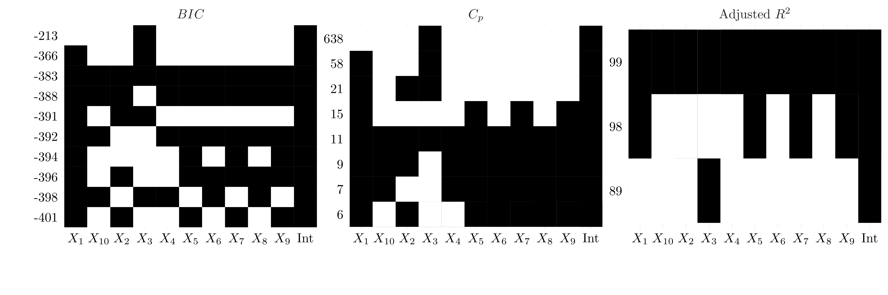
<p class="caption">(\#fig:ex8cii)Selected variables for each criteria for best subset selection.</p>
</div>

<div class="figure" style="text-align: center">

<p class="caption">(\#fig:ex8ciii)Best models according to $C_p$, $BIC$ and adjusted $R^2$ for best subset selection.</p>
</div>

<div style="overflow-x:auto;">
<table class="table table-striped table-hover table-condensed table-responsive" style="margin-left: auto; margin-right: auto;">
<caption>(\#tab:ex8civ)Coefficients for the best model according to $BIC$.</caption>
 <thead>
  <tr>
   <th style="text-align:right;"> Intercept </th>
   <th style="text-align:right;"> $X_{1}$ </th>
   <th style="text-align:right;"> $X_{2}$ </th>
   <th style="text-align:right;"> $X_{5}$ </th>
   <th style="text-align:right;"> $X_{7}$ </th>
   <th style="text-align:right;"> $X_{9}$ </th>
  </tr>
 </thead>
<tbody>
  <tr>
   <td style="text-align:right;"> 5.00352 </td>
   <td style="text-align:right;"> 3.05965 </td>
   <td style="text-align:right;"> 0.25633 </td>
   <td style="text-align:right;"> 0.81479 </td>
   <td style="text-align:right;"> -0.17204 </td>
   <td style="text-align:right;"> 0.01039 </td>
  </tr>
</tbody>
</table>
</div>

<div style="overflow-x:auto;">
<table class="table table-striped table-hover table-condensed table-responsive" style="margin-left: auto; margin-right: auto;">
<caption>(\#tab:ex8cv)Coefficients for the best model according to $C_p$.</caption>
 <thead>
  <tr>
   <th style="text-align:right;"> Intercept </th>
   <th style="text-align:right;"> $X_{1}$ </th>
   <th style="text-align:right;"> $X_{2}$ </th>
   <th style="text-align:right;"> $X_{5}$ </th>
   <th style="text-align:right;"> $X_{6}$ </th>
   <th style="text-align:right;"> $X_{7}$ </th>
   <th style="text-align:right;"> $X_{8}$ </th>
   <th style="text-align:right;"> $X_{9}$ </th>
  </tr>
 </thead>
<tbody>
  <tr>
   <td style="text-align:right;"> 4.86923 </td>
   <td style="text-align:right;"> 3.01089 </td>
   <td style="text-align:right;"> 0.65315 </td>
   <td style="text-align:right;"> 0.89162 </td>
   <td style="text-align:right;"> -0.09081 </td>
   <td style="text-align:right;"> -0.21299 </td>
   <td style="text-align:right;"> 0.01459 </td>
   <td style="text-align:right;"> 0.01568 </td>
  </tr>
</tbody>
</table>
</div>

<div style="overflow-x:auto;">
<table class="table table-striped table-hover table-condensed table-responsive" style="margin-left: auto; margin-right: auto;">
<caption>(\#tab:ex8cvi)Coefficients for the best model according to Adjusted $R^2$.</caption>
 <thead>
  <tr>
   <th style="text-align:right;"> Intercept </th>
   <th style="text-align:right;"> $X_{1}$ </th>
   <th style="text-align:right;"> $X_{2}$ </th>
   <th style="text-align:right;"> $X_{5}$ </th>
   <th style="text-align:right;"> $X_{6}$ </th>
   <th style="text-align:right;"> $X_{7}$ </th>
   <th style="text-align:right;"> $X_{8}$ </th>
   <th style="text-align:right;"> $X_{9}$ </th>
  </tr>
 </thead>
<tbody>
  <tr>
   <td style="text-align:right;"> 4.86923 </td>
   <td style="text-align:right;"> 3.01089 </td>
   <td style="text-align:right;"> 0.65315 </td>
   <td style="text-align:right;"> 0.89162 </td>
   <td style="text-align:right;"> -0.09081 </td>
   <td style="text-align:right;"> -0.21299 </td>
   <td style="text-align:right;"> 0.01459 </td>
   <td style="text-align:right;"> 0.01568 </td>
  </tr>
</tbody>
</table>
</div>

* *Question (d)*


```r
reg_subset <- regsubsets(Y ~ ., data = df, nvmax = 10, method = 'forward')
reg_subset$xnames <- str_sub(reg_subset$xnames, 2, -2)
```

<div class="figure" style="text-align: center">
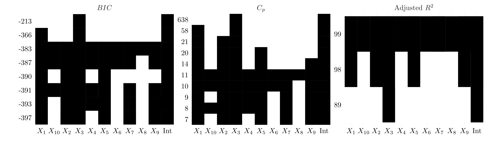
<p class="caption">(\#fig:ex8di)Selected variables for each criteria for forward selection.</p>
</div>

<div class="figure" style="text-align: center">
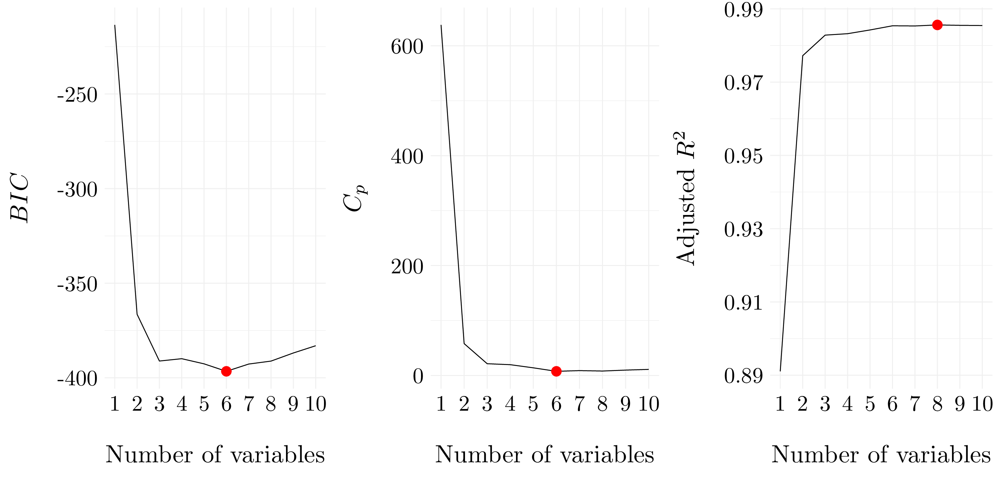
<p class="caption">(\#fig:ex8dii)Best models according to $C_p$, $BIC$ and adjusted $R^2$ for forward selection.</p>
</div>

<div style="overflow-x:auto;">
<table class="table table-striped table-hover table-condensed table-responsive" style="margin-left: auto; margin-right: auto;">
<caption>(\#tab:ex8diii)Coefficients for the best model according to $BIC$.</caption>
 <thead>
  <tr>
   <th style="text-align:right;"> Intercept </th>
   <th style="text-align:right;"> $X_{1}$ </th>
   <th style="text-align:right;"> $X_{2}$ </th>
   <th style="text-align:right;"> $X_{3}$ </th>
   <th style="text-align:right;"> $X_{5}$ </th>
   <th style="text-align:right;"> $X_{7}$ </th>
   <th style="text-align:right;"> $X_{9}$ </th>
  </tr>
 </thead>
<tbody>
  <tr>
   <td style="text-align:right;"> 5.00245 </td>
   <td style="text-align:right;"> 2.95906 </td>
   <td style="text-align:right;"> 0.25966 </td>
   <td style="text-align:right;"> 0.19189 </td>
   <td style="text-align:right;"> 0.72191 </td>
   <td style="text-align:right;"> -0.15637 </td>
   <td style="text-align:right;"> 0.00955 </td>
  </tr>
</tbody>
</table>
</div>

<div style="overflow-x:auto;">
<table class="table table-striped table-hover table-condensed table-responsive" style="margin-left: auto; margin-right: auto;">
<caption>(\#tab:ex8div)Coefficients for the best model according to $C_p$.</caption>
 <thead>
  <tr>
   <th style="text-align:right;"> Intercept </th>
   <th style="text-align:right;"> $X_{1}$ </th>
   <th style="text-align:right;"> $X_{2}$ </th>
   <th style="text-align:right;"> $X_{3}$ </th>
   <th style="text-align:right;"> $X_{5}$ </th>
   <th style="text-align:right;"> $X_{7}$ </th>
   <th style="text-align:right;"> $X_{9}$ </th>
  </tr>
 </thead>
<tbody>
  <tr>
   <td style="text-align:right;"> 5.00245 </td>
   <td style="text-align:right;"> 2.95906 </td>
   <td style="text-align:right;"> 0.25966 </td>
   <td style="text-align:right;"> 0.19189 </td>
   <td style="text-align:right;"> 0.72191 </td>
   <td style="text-align:right;"> -0.15637 </td>
   <td style="text-align:right;"> 0.00955 </td>
  </tr>
</tbody>
</table>
</div>

<div style="overflow-x:auto;">
<table class="table table-striped table-hover table-condensed table-responsive" style="margin-left: auto; margin-right: auto;">
<caption>(\#tab:ex8dv)Coefficients for the best model according to Adjusted $R^2$.</caption>
 <thead>
  <tr>
   <th style="text-align:right;"> Intercept </th>
   <th style="text-align:right;"> $X_{1}$ </th>
   <th style="text-align:right;"> $X_{2}$ </th>
   <th style="text-align:right;"> $X_{3}$ </th>
   <th style="text-align:right;"> $X_{4}$ </th>
   <th style="text-align:right;"> $X_{5}$ </th>
   <th style="text-align:right;"> $X_{7}$ </th>
   <th style="text-align:right;"> $X_{9}$ </th>
   <th style="text-align:right;"> $X_{10}$ </th>
  </tr>
 </thead>
<tbody>
  <tr>
   <td style="text-align:right;"> 4.85097 </td>
   <td style="text-align:right;"> 3.02558 </td>
   <td style="text-align:right;"> 0.81393 </td>
   <td style="text-align:right;"> -0.04738 </td>
   <td style="text-align:right;"> -0.21319 </td>
   <td style="text-align:right;"> 0.92544 </td>
   <td style="text-align:right;"> -0.2203 </td>
   <td style="text-align:right;"> 0.01611 </td>
   <td style="text-align:right;"> 0.00076 </td>
  </tr>
</tbody>
</table>
</div>


```r
reg_subset <- regsubsets(Y ~ ., data = df, nvmax = 10, method = 'backward')
reg_subset$xnames <- str_sub(reg_subset$xnames, 2, -2)
```

<div class="figure" style="text-align: center">

<p class="caption">(\#fig:ex8dvii)Selected variables for each criteria for backward selection.</p>
</div>

<div class="figure" style="text-align: center">
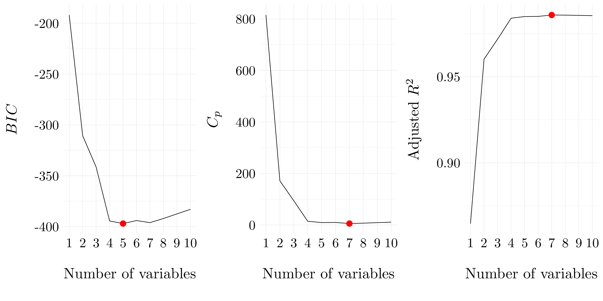
<p class="caption">(\#fig:ex8dviii)Best models according to $C_p$, $BIC$ and adjusted $R^2$ for backward selection.</p>
</div>

<div style="overflow-x:auto;">
<table class="table table-striped table-hover table-condensed table-responsive" style="margin-left: auto; margin-right: auto;">
<caption>(\#tab:ex8dix)Coefficients for the best model according to $BIC$.</caption>
 <thead>
  <tr>
   <th style="text-align:right;"> Intercept </th>
   <th style="text-align:right;"> $X_{1}$ </th>
   <th style="text-align:right;"> $X_{4}$ </th>
   <th style="text-align:right;"> $X_{5}$ </th>
   <th style="text-align:right;"> $X_{7}$ </th>
   <th style="text-align:right;"> $X_{9}$ </th>
  </tr>
 </thead>
<tbody>
  <tr>
   <td style="text-align:right;"> 5.13379 </td>
   <td style="text-align:right;"> 3.07276 </td>
   <td style="text-align:right;"> 0.04595 </td>
   <td style="text-align:right;"> 0.8142 </td>
   <td style="text-align:right;"> -0.17212 </td>
   <td style="text-align:right;"> 0.01048 </td>
  </tr>
</tbody>
</table>
</div>

<div style="overflow-x:auto;">
<table class="table table-striped table-hover table-condensed table-responsive" style="margin-left: auto; margin-right: auto;">
<caption>(\#tab:ex8dx)Coefficients for the best model according to $C_p$.</caption>
 <thead>
  <tr>
   <th style="text-align:right;"> Intercept </th>
   <th style="text-align:right;"> $X_{1}$ </th>
   <th style="text-align:right;"> $X_{4}$ </th>
   <th style="text-align:right;"> $X_{5}$ </th>
   <th style="text-align:right;"> $X_{6}$ </th>
   <th style="text-align:right;"> $X_{7}$ </th>
   <th style="text-align:right;"> $X_{8}$ </th>
   <th style="text-align:right;"> $X_{9}$ </th>
  </tr>
 </thead>
<tbody>
  <tr>
   <td style="text-align:right;"> 4.98423 </td>
   <td style="text-align:right;"> 2.96772 </td>
   <td style="text-align:right;"> 0.5976 </td>
   <td style="text-align:right;"> 0.96214 </td>
   <td style="text-align:right;"> -0.2685 </td>
   <td style="text-align:right;"> -0.24729 </td>
   <td style="text-align:right;"> 0.03118 </td>
   <td style="text-align:right;"> 0.01974 </td>
  </tr>
</tbody>
</table>
</div>

<div style="overflow-x:auto;">
<table class="table table-striped table-hover table-condensed table-responsive" style="margin-left: auto; margin-right: auto;">
<caption>(\#tab:ex8dxi)Coefficients for the best model according to Adjusted $R^2$.</caption>
 <thead>
  <tr>
   <th style="text-align:right;"> Intercept </th>
   <th style="text-align:right;"> $X_{1}$ </th>
   <th style="text-align:right;"> $X_{4}$ </th>
   <th style="text-align:right;"> $X_{5}$ </th>
   <th style="text-align:right;"> $X_{6}$ </th>
   <th style="text-align:right;"> $X_{7}$ </th>
   <th style="text-align:right;"> $X_{8}$ </th>
   <th style="text-align:right;"> $X_{9}$ </th>
  </tr>
 </thead>
<tbody>
  <tr>
   <td style="text-align:right;"> 4.98423 </td>
   <td style="text-align:right;"> 2.96772 </td>
   <td style="text-align:right;"> 0.5976 </td>
   <td style="text-align:right;"> 0.96214 </td>
   <td style="text-align:right;"> -0.2685 </td>
   <td style="text-align:right;"> -0.24729 </td>
   <td style="text-align:right;"> 0.03118 </td>
   <td style="text-align:right;"> 0.01974 </td>
  </tr>
</tbody>
</table>
</div>

* *Question (e)*

```r
set.seed(42)
lasso_cv <- cv.glmnet(as.matrix(df[-1]), df$Y, alpha = 1)
```

<div class="figure" style="text-align: center">
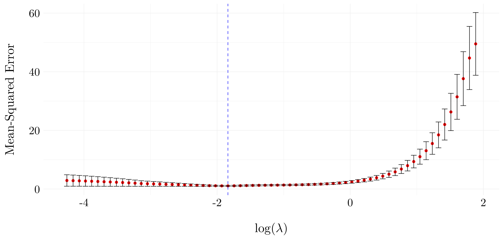
<p class="caption">(\#fig:ex8ei)Cross validation error as a function of $\lambda$.</p>
</div>


```r
lasso_model <- glmnet(as.matrix(df[-1]), df$Y, alpha = 1)
lasso_coef <- predict(lasso_model, type = 'coefficients', s = lasso_cv$lambda.min)
```

<div style="overflow-x:auto;">
<table class="table table-striped table-hover table-condensed table-responsive" style="margin-left: auto; margin-right: auto;">
<caption>(\#tab:ex8eiii)Coefficients for the model fitted by lasso.</caption>
 <thead>
  <tr>
   <th style="text-align:right;"> (Intercept) </th>
   <th style="text-align:right;"> $X_{1}$ </th>
   <th style="text-align:right;"> $X_{2}$ </th>
   <th style="text-align:right;"> $X_{3}$ </th>
   <th style="text-align:right;"> $X_{4}$ </th>
   <th style="text-align:right;"> $X_{5}$ </th>
   <th style="text-align:right;"> $X_{6}$ </th>
   <th style="text-align:right;"> $X_{7}$ </th>
   <th style="text-align:right;"> $X_{8}$ </th>
   <th style="text-align:right;"> $X_{9}$ </th>
   <th style="text-align:right;"> $X_{10}$ </th>
  </tr>
 </thead>
<tbody>
  <tr>
   <td style="text-align:right;"> 5.10693 </td>
   <td style="text-align:right;"> 3.06612 </td>
   <td style="text-align:right;"> 0.18405 </td>
   <td style="text-align:right;"> 0.91642 </td>
   <td style="text-align:right;"> 0 </td>
   <td style="text-align:right;"> 0 </td>
   <td style="text-align:right;"> 0 </td>
   <td style="text-align:right;"> 0 </td>
   <td style="text-align:right;"> 0 </td>
   <td style="text-align:right;"> 0 </td>
   <td style="text-align:right;"> 0 </td>
  </tr>
</tbody>
</table>
</div>

The lasso gives good coefficients estimation (and set to 0 all the coefficient that are not significant in the model). We can do model selection using the lasso.

* *Question (f)*


```r
set.seed(42)
Y <- 5 + 0.2 * pull(X, 7) + eps
df <- X %>% add_column(Y, .before = 1)
```

First, we perform best subset selection for the $Y$ vector with the $X$ matrix as features.


```r
reg_subset <- regsubsets(Y ~ ., data = df, nvmax = 10)
reg_subset$xnames <- str_sub(reg_subset$xnames, 2, -2)
```

<div class="figure" style="text-align: center">

<p class="caption">(\#fig:ex8fii)Selected variables for each criteria for best subset selection.</p>
</div>

<div class="figure" style="text-align: center">
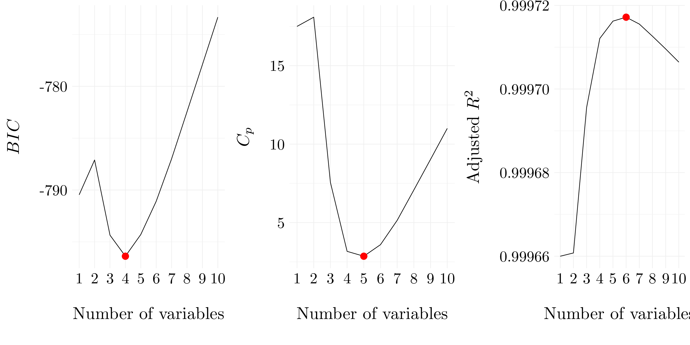
<p class="caption">(\#fig:ex8fiii)Best models according to $C_p$, $BIC$ and adjusted $R^2$ for best subset selection.</p>
</div>

<div style="overflow-x:auto;">
<table class="table table-striped table-hover table-condensed table-responsive" style="margin-left: auto; margin-right: auto;">
<caption>(\#tab:ex8fiv)Coefficients for the best model according to $BIC$.</caption>
 <thead>
  <tr>
   <th style="text-align:right;"> Intercept </th>
   <th style="text-align:right;"> $X_{3}$ </th>
   <th style="text-align:right;"> $X_{4}$ </th>
   <th style="text-align:right;"> $X_{5}$ </th>
   <th style="text-align:right;"> $X_{9}$ </th>
  </tr>
 </thead>
<tbody>
  <tr>
   <td style="text-align:right;"> 4.95872 </td>
   <td style="text-align:right;"> -1.1237 </td>
   <td style="text-align:right;"> -0.03994 </td>
   <td style="text-align:right;"> 0.9405 </td>
   <td style="text-align:right;"> 0.01203 </td>
  </tr>
</tbody>
</table>
</div>

<div style="overflow-x:auto;">
<table class="table table-striped table-hover table-condensed table-responsive" style="margin-left: auto; margin-right: auto;">
<caption>(\#tab:ex8fv)Coefficients for the best model according to $C_p$.</caption>
 <thead>
  <tr>
   <th style="text-align:right;"> Intercept </th>
   <th style="text-align:right;"> $X_{3}$ </th>
   <th style="text-align:right;"> $X_{5}$ </th>
   <th style="text-align:right;"> $X_{6}$ </th>
   <th style="text-align:right;"> $X_{9}$ </th>
   <th style="text-align:right;"> $X_{10}$ </th>
  </tr>
 </thead>
<tbody>
  <tr>
   <td style="text-align:right;"> 4.96071 </td>
   <td style="text-align:right;"> -0.90561 </td>
   <td style="text-align:right;"> 0.8318 </td>
   <td style="text-align:right;"> -0.02629 </td>
   <td style="text-align:right;"> 0.0146 </td>
   <td style="text-align:right;"> 0.00078 </td>
  </tr>
</tbody>
</table>
</div>

<div style="overflow-x:auto;">
<table class="table table-striped table-hover table-condensed table-responsive" style="margin-left: auto; margin-right: auto;">
<caption>(\#tab:ex8fvi)Coefficients for the best model according to Adjusted $R^2$.</caption>
 <thead>
  <tr>
   <th style="text-align:right;"> Intercept </th>
   <th style="text-align:right;"> $X_{2}$ </th>
   <th style="text-align:right;"> $X_{3}$ </th>
   <th style="text-align:right;"> $X_{5}$ </th>
   <th style="text-align:right;"> $X_{6}$ </th>
   <th style="text-align:right;"> $X_{8}$ </th>
   <th style="text-align:right;"> $X_{9}$ </th>
  </tr>
 </thead>
<tbody>
  <tr>
   <td style="text-align:right;"> 4.87656 </td>
   <td style="text-align:right;"> 0.22826 </td>
   <td style="text-align:right;"> -0.91874 </td>
   <td style="text-align:right;"> 0.83297 </td>
   <td style="text-align:right;"> -0.085 </td>
   <td style="text-align:right;"> 0.01372 </td>
   <td style="text-align:right;"> 0.01476 </td>
  </tr>
</tbody>
</table>
</div>

And now, we fit the lasso model on the data.


```r
set.seed(42)
lasso_cv <- cv.glmnet(as.matrix(df[-1]), df$Y, alpha = 1)
```

<div class="figure" style="text-align: center">
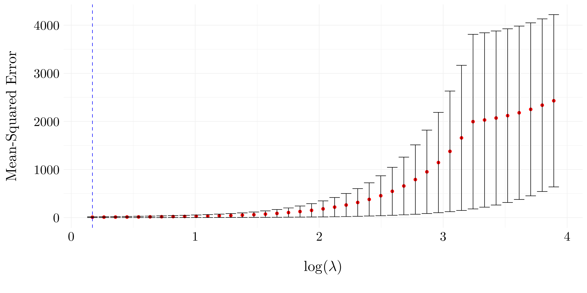
<p class="caption">(\#fig:ex8fviii)Cross validation error as a function of $\lambda$.</p>
</div>


```r
lasso_model <- glmnet(as.matrix(df[-1]), df$Y, alpha = 1)
lasso_coef <- predict(lasso_model, type = 'coefficients', s = lasso_cv$lambda.min)
```

<div style="overflow-x:auto;">
<table class="table table-striped table-hover table-condensed table-responsive" style="margin-left: auto; margin-right: auto;">
<caption>(\#tab:ex8fx)Coefficients for the model fitted by lasso.</caption>
 <thead>
  <tr>
   <th style="text-align:right;"> (Intercept) </th>
   <th style="text-align:right;"> $X_{1}$ </th>
   <th style="text-align:right;"> $X_{2}$ </th>
   <th style="text-align:right;"> $X_{3}$ </th>
   <th style="text-align:right;"> $X_{4}$ </th>
   <th style="text-align:right;"> $X_{5}$ </th>
   <th style="text-align:right;"> $X_{6}$ </th>
   <th style="text-align:right;"> $X_{7}$ </th>
   <th style="text-align:right;"> $X_{8}$ </th>
   <th style="text-align:right;"> $X_{9}$ </th>
   <th style="text-align:right;"> $X_{10}$ </th>
  </tr>
 </thead>
<tbody>
  <tr>
   <td style="text-align:right;"> 4.73572 </td>
   <td style="text-align:right;"> 0 </td>
   <td style="text-align:right;"> 0 </td>
   <td style="text-align:right;"> 0 </td>
   <td style="text-align:right;"> 0 </td>
   <td style="text-align:right;"> 0.00427 </td>
   <td style="text-align:right;"> 0 </td>
   <td style="text-align:right;"> 0.19456 </td>
   <td style="text-align:right;"> 0 </td>
   <td style="text-align:right;"> 0 </td>
   <td style="text-align:right;"> 0 </td>
  </tr>
</tbody>
</table>
</div>

The results obtained with the best subset selection are very poor compared to the ones obtained with the lasso. Indeed, we can not recover the true underlying model using the best subset selection. At the opposite, the model fit with the lasso is almost perfect. A large part of the coefficients is set to $0$ except the one of interest $\beta_7$ (and another $\beta_5$, but very close to $0$).


### Exercise 9.

In this exercise, we will predict the number of applications received (`Apps` variable) using the other variables in the `College` dataset.

* *Question (a)*


```r
set.seed(42)
df <- as_tibble(College[-1])
idx <- df$Apps %>% createDataPartition(p = 0.7, list = FALSE, times = 1)
train <- slice(df, idx); Y_train <- as.vector(train$Apps); X_train <- as.matrix(select(train, -Apps))
test <- slice(df, -idx); Y_test <- as.vector(test$Apps); X_test <- as.matrix(select(test, -Apps))
```

* *Question (b)*


```r
lm_model <- lm(Apps ~ ., data = train)
pred_lm <- predict.lm(lm_model, newdata = test)
```

The mean squared error obtained using the linear model is $1.4251116\times 10^{6}$. 

* *Question (c)*


```r
cv.out <- cv.glmnet(X_train, Y_train, alpha = 0)
ridge_mod <- glmnet(X_train, Y_train, alpha = 0, lambda = cv.out$lambda.min)
pred_ridge <- predict(ridge_mod, newx = X_test)
```

The mean squared error obtained using the ridge regression model is $1.3541858\times 10^{6}$. 

* *Question (d)*


```r
cv.out <- cv.glmnet(X_train, Y_train, alpha = 1)
lasso_mod <- glmnet(X_train, Y_train, alpha = 1, lambda = cv.out$lambda.min)
pred_lasso <- predict(lasso_mod, newx = X_test)
```

The mean squared error obtained using the ridge regression model is $1.4228908\times 10^{6}$. The number of non-zero coefficients is 14.

* *Question (e)*


```r
pcr_mod <- pcr(Apps ~ ., data = train, scale = TRUE, validation = 'CV')
pred_pcr <- predict(pcr_mod, test, ncomp = which.min(pcr_mod$validation$adj))
```

The mean squared error obtained using the PCR model is $1.4251116\times 10^{6}$. The number of components $M$ selected with cross-validation is 16.

* *Question (f)*


```r
pls_mod <- plsr(Apps ~ ., data = train, scale = TRUE, validation = 'CV')
pred_pls <- predict(pls_mod, test, ncomp = which.min(pls_mod$validation$adj))
```

The mean squared error obtained using the PCR model is $1.4230893\times 10^{6}$. The number of components $M$ selected with cross-validation is 13.

* *Question (g)*

Let's compute the $R^2$ for each model in order to compare them.

<div style="overflow-x:auto;">
| Model        | $R^2$                           | 
| ------------ |:-------------------------------:| 
| Linear       | 0.8984327   | 
| Ridge        | 0.9034876| 
| Lasso        | 0.898591|
| PCR          | 0.8984327  |
| PLS          | 0.8985768  |
Table: $R^2$ for all the models
</div>

So, all the model are quite comparable with a $R^2$ around $0.9$. None of them performs really better than the others. And as the $R^2$ is quite high, all of them are quite accurate in this case and fit the data pretty well. All the tests arrors are very similar.


### Exercise 10.

We have seen that as the number of features used in a model increases, the training error will necessarily decrease, but the test error may not. We will now explore this in a simulated dataset.

* *Question (a)*


```r
set.seed(42)
n <- 1000; p <- 20
X <- as.data.frame(matrix(rnorm(n * p), nrow = n))
beta <- runif(20, min = 0.5, max = 1)
beta[sample(1:length(beta), 5)] <- 0
Y <- as.matrix(X) %*% beta + rnorm(n)
df <- data.frame(Y, X)
```

* *Question (b)*


```r
idx <- sample(1:length(Y), size = 100)
train <- df[idx,]
test <- df[-idx,]
```

* *Question (c)*

Let's perform best subset selection on the train set. 


```r
regfit_subset <- regsubsets(Y ~ ., data = train, nvmax = 20)
model_matrix <- model.matrix(Y ~ ., data = train)
val_errors_train <- rep(NA, 20)
for (i in 1:20) {
  coefi <- coef(regfit_subset, id = i)
  pred <- model_matrix[, names(coefi)] %*% coefi
  val_errors_train[i] <- mean((train$Y - pred)**2)
}
```

<div class="figure" style="text-align: center">
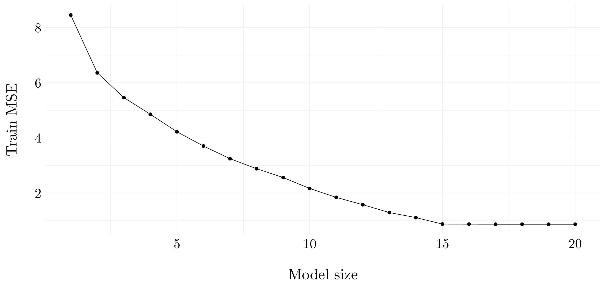
<p class="caption">(\#fig:ex10cii)Train MSE associated with the best model of each size.</p>
</div>

* *Question (d)*

Let's do the same thing on the test set.


```r
regfit_subset <- regsubsets(Y ~ ., data = train, nvmax = 20)
model_matrix <- model.matrix(Y ~ ., data = test)
val_errors_test <- rep(NA, 20)
for (i in 1:20) {
  coefi <- coef(regfit_subset, id = i)
  pred <- model_matrix[, names(coefi)] %*% coefi
  val_errors_test[i] <- mean((test$Y - pred)**2)
}
```


<div class="figure" style="text-align: center">
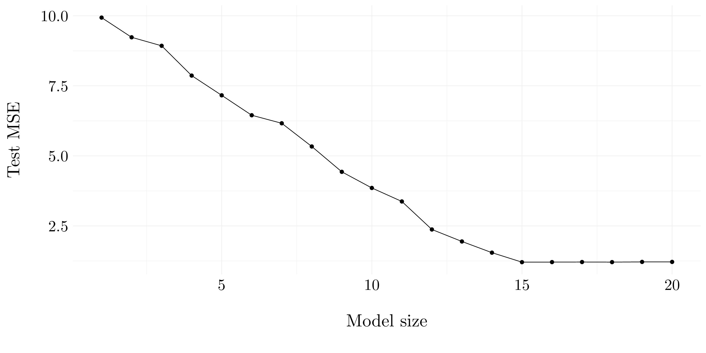
<p class="caption">(\#fig:ex10dii)Test MSE associated with the best model of each size.</p>
</div>

* *Question (e)*

The minimum value of the test MSE is 1.2052158. This minimum is reach for a model of size 15.

* *Question (f)*

The model at which the test set MSE is minimized as the same number of coefficients than the true model. Moreover, all the coefficients that are set to $0$ in the generating process are equal to $0$ in the model with the minimum test MSE. But, the coefficients are not to close to true ones (but this is probably due to the generating process).

* *Question (g)*


```r
beta <- c(0, beta)
names(beta) <- names(coef(regfit_subset, id = 20))
beta_errors <- rep(NA, 20)
for (i in 1:20) {
  coefi <- coef(regfit_subset, id = i)
  b <- merge(data.frame(beta=names(beta), beta), data.frame(beta=names(coefi),coefi), all.x = TRUE)
  b[is.na(b)] <- 0
  beta_errors[i] <- sqrt(sum((b[,2] - b[,3])**2))
}
```

<div class="figure" style="text-align: center">
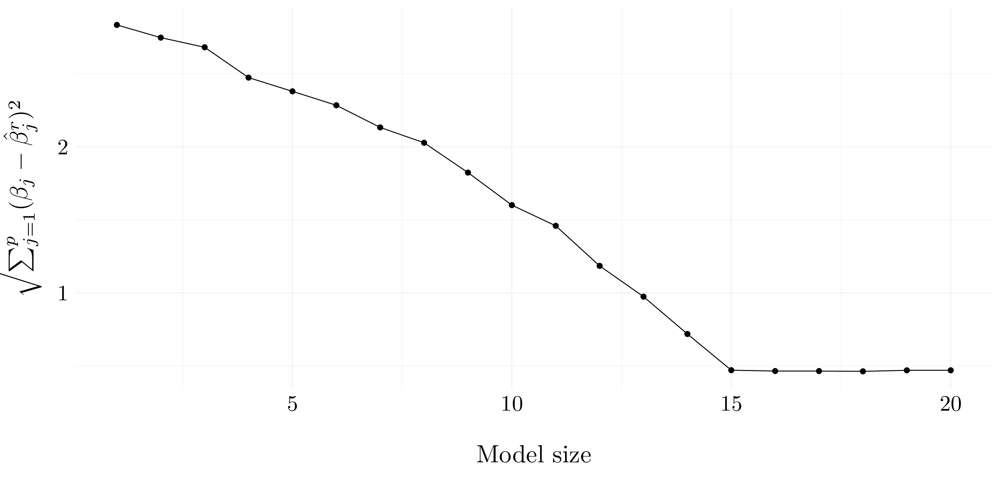
<p class="caption">(\#fig:ex10giii)Errors on the coefficients compared to the size of the model.</p>
</div>

The $\sqrt{\sum_{j=1}^p (\beta_j - \hat{\beta}_j^r)^2}$ curve looks quite the same than the test MSE. However, the minimum is not reach to the same model size.

### Exercise 11.

We will now try to predict per capita crime rate in the `Boston`data set.


```r
# Load data
df <- as_tibble(Boston)
# Split intot train and test set
set.seed(42)
idx <- sample(1:nrow(df), size = 100)
train <- df[idx,]; model_train <- model.matrix(crim ~ ., data = train)
test <- df[-idx,]; model_test <- model.matrix(crim ~ ., data = test)
```

* *Question (a)*

Let's start by best subset selection.


```r
regfit_subset <- regsubsets(crim ~ ., data = train, nvmax = ncol(train) - 1)
```

<div class="figure" style="text-align: center">
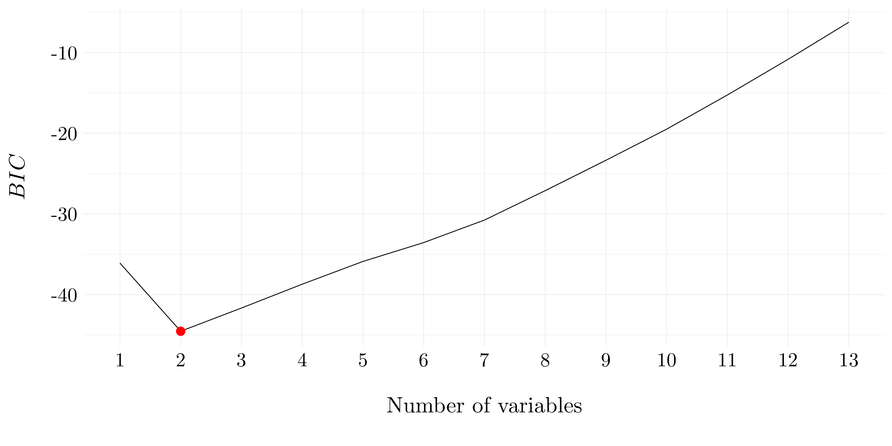
<p class="caption">(\#fig:ex11aii)Best models according to $BIC$ for best subset selection.</p>
</div>

So, it appears that the best model according to the best subset selection model has two variables.


```r
best_coeff <- coef(regfit_subset, id = 2)
pred_best <- model_test[, names(best_coeff)] %*% best_coeff
```


Then, let's perform lasso regression.


```r
set.seed(42)
lasso_cv <- cv.glmnet(x = as.matrix(train[,2:ncol(train)]), y = train[['crim']], alpha = 1)
lasso_mod <- glmnet(as.matrix(train[,2:ncol(train)]), train[['crim']], alpha = 1, lambda = lasso_cv$lambda.min)
pred_lasso <- predict(lasso_mod, newx = as.matrix(test[,2:ncol(test)]))
```

Another one is the ridge regression.


```r
set.seed(42)
ridge_cv <- cv.glmnet(x = as.matrix(train[,2:ncol(train)]), y = train[['crim']], alpha = 0)
ridge_mod <- glmnet(as.matrix(train[,2:ncol(train)]), train[['crim']], alpha = 0, lambda = ridge_cv$lambda.min)
pred_ridge <- predict(ridge_mod, newx = as.matrix(test[,2:ncol(test)]))
```

And finally, the PCR model.


```r
set.seed(42)
pcr_mod <- pcr(crim ~ ., data = train, scale = TRUE, validation = 'CV')
pred_pcr <- predict(pcr_mod, test[,2:ncol(test)], ncomp = 7)
```

* *Question (b)*

We are going to compare the different models using the MSE on the test set. 


```r
mse_best <- mean((pred_best - test$crim)**2)
mse_lasso <- mean((pred_lasso - test$crim)**2)
mse_ridge <- mean((pred_ridge - test$crim)**2)
mse_pcr <- mean((pred_pcr - test$crim)**2)
```

<div style="overflow-x:auto;">
| Model        | MSE                             | 
| ------------ |:-------------------------------:| 
| Best subset  | 41.8357193 |
| Ridge        | 42.4799642| 
| Lasso        | 40.5281645|
| PCR          | 45.7516391  |
Table: MSE for all the models
</div>

So, it appears that the lasso has the smallest MSE on the test set. Thus, we choose the lasso model as the final model.

* *Question (c)*

Our model does not involve all the features because the lasso model shrinks some coefficients towards 0.


```r
predict(lasso_mod, type = 'coefficient')
```

```
## 14 x 1 sparse Matrix of class "dgCMatrix"
##                      s0
## (Intercept) -2.57705466
## zn           .         
## indus        .         
## chas         .         
## nox          .         
## rm           .         
## age          .         
## dis          .         
## rad          0.46978606
## tax          .         
## ptratio      .         
## black        .         
## lstat        0.25150257
## medv        -0.06290058
```

