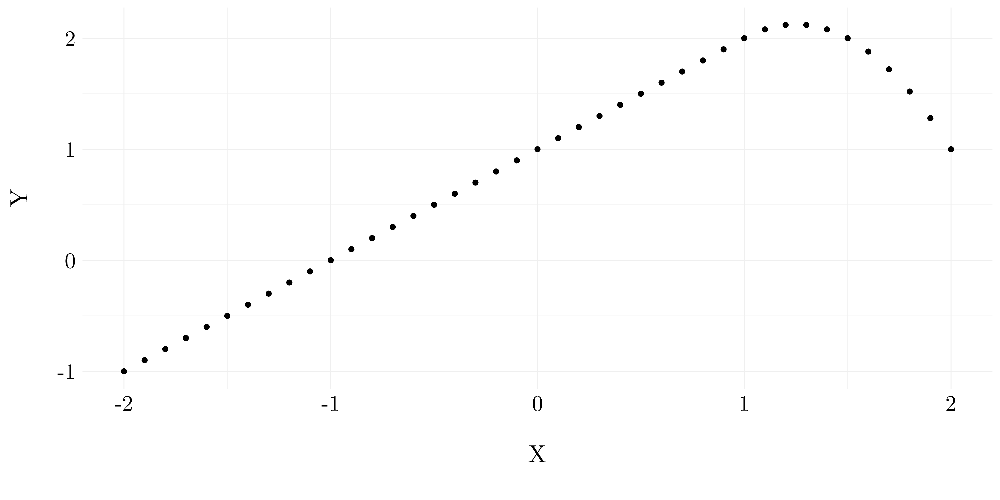
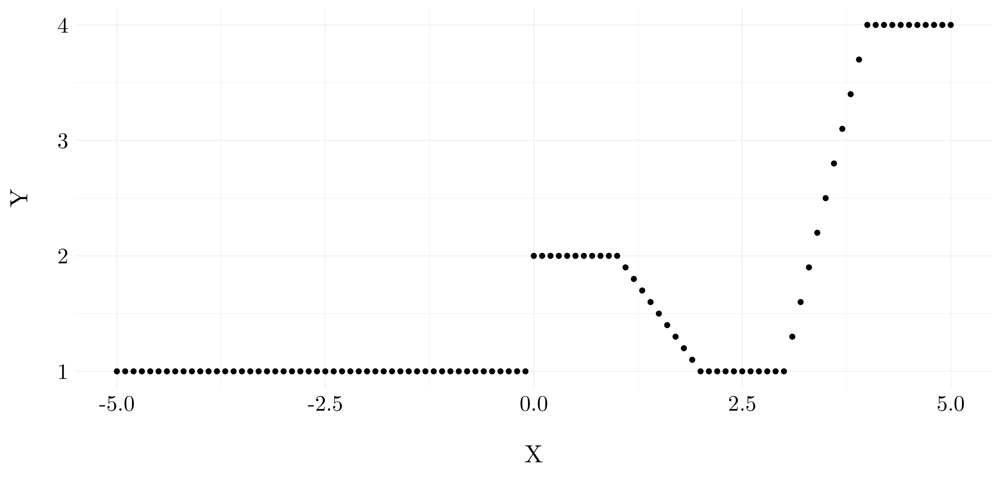
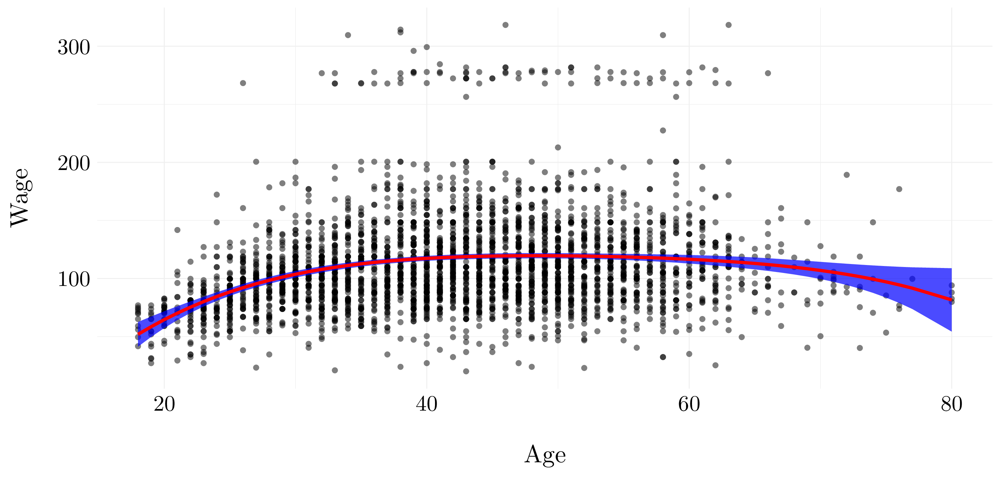
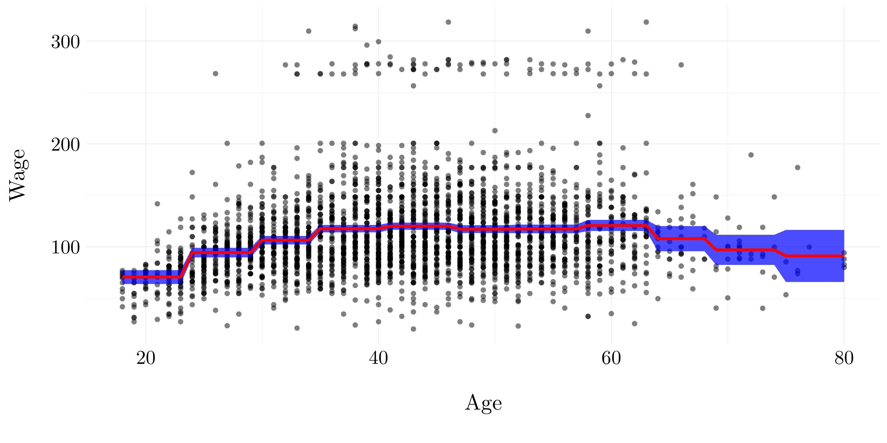
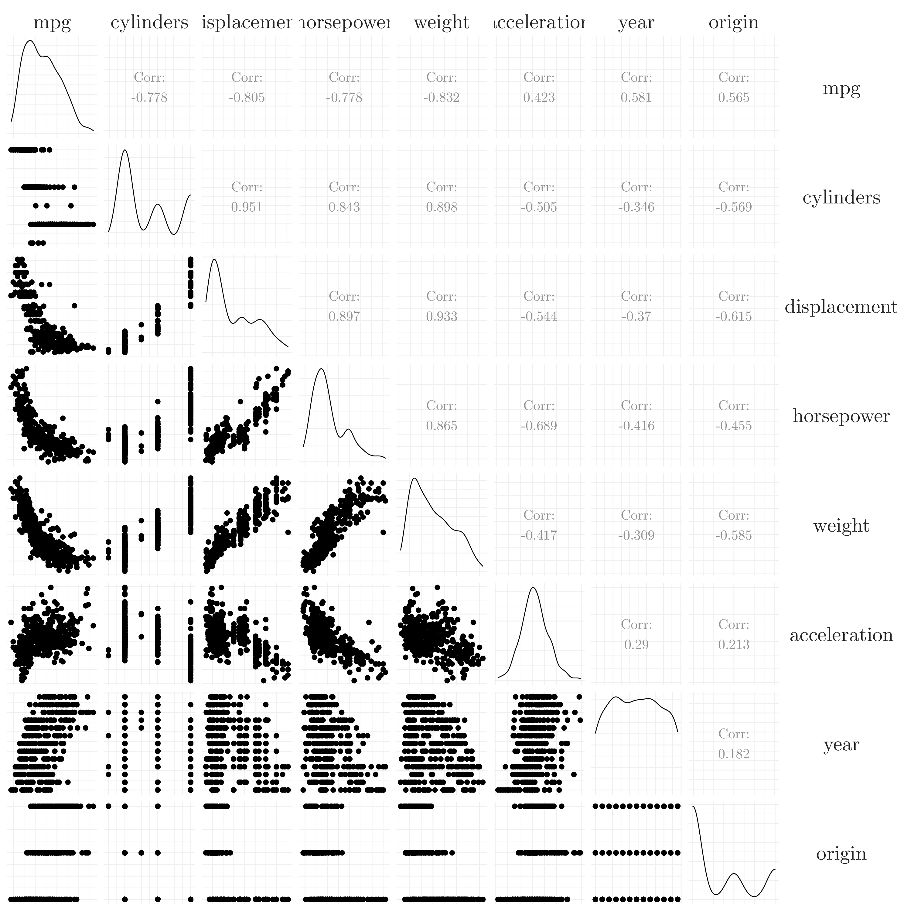
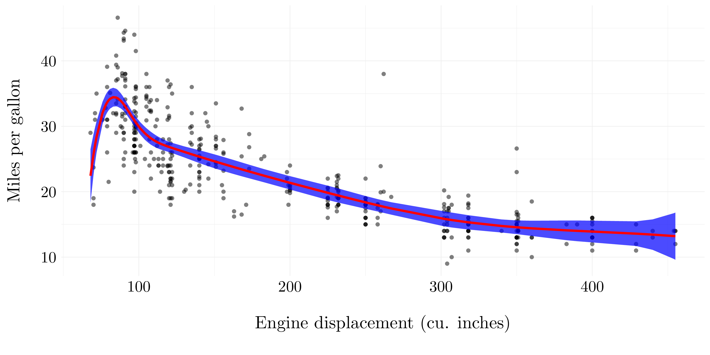
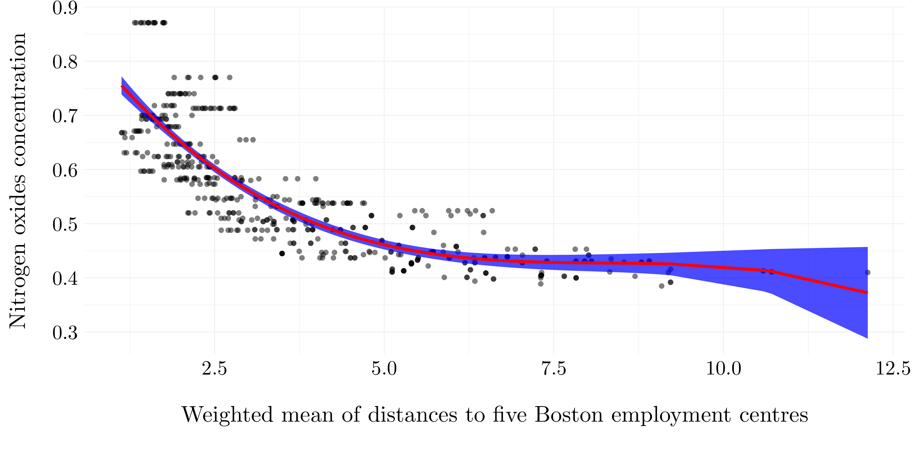
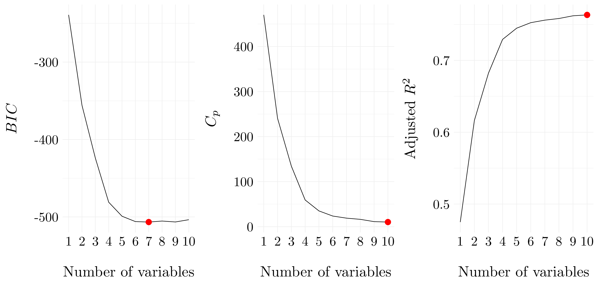
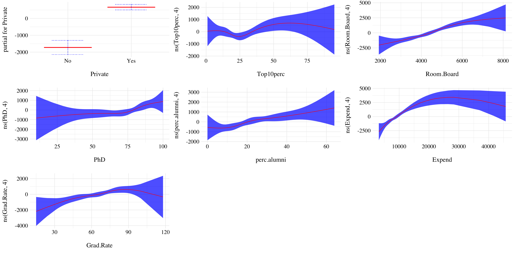

# Moving Beyond Linearity


## Conceptual exercises

### Exercise 1.

A cubic regression spline with one knot at $\xi$ can be obtained using a basis of the form $x, x^2, x^3, (x - \xi)_+^3$, where $(x - \xi)_+^3 = (x - \xi)^3$ if $x > \xi$ and equals $0$ otherwise. We will now show that a function of the form
$$ f(x) = \beta_0 + \beta_1x + \beta_2x^2 + \beta_3x^3 + \beta_4(x - \xi)_+^3 $$
is indeed a cubic regression spline, regardless of the values of $\beta_0, \beta_1, \beta_2, \beta_3$ and $\beta_4$.

* *Question (a)*

Let's define a function 
$$ f_1(x) = a_1 + b_1x + c_1x^2 + d_1x^3, \quad\text{for some real numbers}\quad a_1, b_1, c_1, d_1. $$

For all $x \leq \xi$, $(x - \xi)_+^3 = 0$, and so we have $f(x) = f_1(x)$ for all $x \leq \xi$. And $a_1 = \beta_0$, $b_1 = \beta_1$, $c_1 = \beta_2$ and $d_1 = \beta_3$.

* *Question (b)*

Let's define a function 
$$ f_2(x) = a_2 + b_2x + c_2x^2 + d_2x^3, \quad\text{for some real numbers}\quad a_2, b_2, c_2, d_2. $$

For all $x > \xi$, $(x - \xi)_+^3 = (x - \xi)^3 = x^3 - 3\xi x^2 + 3\xi^2 x - \xi^3$. Thus, we can rewrite $f(x)$ as:
$$ f(x) = (\beta_0 - \beta_4\xi^3) + (\beta_1 + 3\beta_4\xi^2)x + (\beta_2 - 3\beta_4\xi)x^2 + (\beta_3 + \beta_4)x^3.$$

Then, by identification, we found that $a_2 = \beta_0 - \beta_4\xi^3$, $b_2 = \beta_1 + 3\beta_4\xi^2$, $c_2 = \beta_2 - 3\beta_4\xi$ and $d_2 = \beta_3 + \beta_4$.

* *Question (c)*

We have that:
\begin{align*}
f_2(\xi) &=  (\beta_0 - \beta_4\xi^3) + (\beta_1 + 3\beta_4\xi^2)\xi + (\beta_2 - 3\beta_4\xi)\xi^2 + (\beta_3 + \beta_4)\xi^3 \\
         &= \beta_0 + \beta_1\xi + \beta_2\xi^2 + \beta_3\xi^3 + (-\beta_4\xi^3 + 3\beta_4\xi^3 - 3\beta_4\xi^3 + \beta_4\xi^3) \\
         &= f_1(\xi)
\end{align*}

So, $f(x)$ is continous at $\xi$.

* *Question (d)*

By taking the first derivatives:
$$f_1^\prime(x) = \beta_1 + 2\beta_2x + 3\beta_3x^2 \quad\text{and}\quad f_2^\prime(x) = (\beta_1 + 3\beta_4\xi^2) + 2(\beta_2 - 3\beta_4\xi)x + 3(\beta_3 + \beta_4)x^2.$$

And so, 
\begin{align*}
f_2^\prime(\xi) &= (\beta_1 + 3\beta_4\xi^2) + 2(\beta_2 - 3\beta_4\xi)\xi + 3(\beta_3 + \beta_4)\xi^2 \\
              &= \beta_1 + 2\beta_2\xi + 3\beta_3\xi^2 + (3\beta_4\xi^2 - 6\beta_4\xi^2 + 3\beta_4\xi^2) \\
              &= f_1^\prime(\xi)
\end{align*}

So, $f^\prime(x)$ is continuous at $\xi$.

* *Question (e)*

By taking the second derivatives:
$$f_1^{\prime\prime}(x) = 2\beta_2 + 6\beta_3x \quad\text{and}\quad f_2^{\prime\prime}(x) =  2(\beta_2 - 3\beta_4\xi) + 6(\beta_3 + \beta_4)x.$$

And so, 
\begin{align*}
f_2^{\prime\prime}(\xi) &=  2(\beta_2 - 3\beta_4\xi) + 6(\beta_3 + \beta_4)\xi \\
                        &= 2\beta_2 + 6\beta_3\xi - 6\beta_4\xi + 6\beta_4\xi \\
                        &= f_1^{\prime\prime}(\xi)
\end{align*}

So, $f^{\prime\prime}(x)$ is continuous at $\xi$.

Therefore, $f(x)$ is indeed a cubic sline.

### Exercise 2.

Suppose that a curve $\widehat{g}$ is computed to smoothly fit a set of $n$ points using the following formula:

$$ \widehat{g} = \arg\min_g \left(\sum_{i=1}^n \left(y_i - g(x_i)\right)^2 + \lambda\int \left[g^{(m)}(x)\right]^2dx\right),$$
where $g^{(m)}$ represents the $m$th derivatives of $g$ (and $g^{(0)} = g$).

* *Question (a)*

When $\lambda = \infty$ and $m = 0$, $\widehat{g}$ will be perfectly smooth and so $\int \left[g^{(0)}(x)\right]^2dx$ should be very close to $0$. Thus, we find that $\widehat{g}$ will be equal to $0$.

* *Question (b)*

When $\lambda = \infty$ and $m = 1$, $\widehat{g}$ will be perfectly smooth and so $\int \left[g^{(1)}(x)\right]^2dx$ should be very close to $0$. Thus, we find that $\widehat{g}$ will be a constant function (of the form $\widehat{g}(x) = k$).

* *Question (c)*

When $\lambda = \infty$ and $m = 2$, $\widehat{g}$ will be perfectly smooth and so $\int \left[g^{(2)}(x)\right]^2dx$ should be very close to $0$. Thus, we find that $\widehat{g}$ will be a linear function (of the form $\widehat{g}(x) = ax + b$).

* *Question (d)*

When $\lambda = \infty$ and $m = 3$, $\widehat{g}$ will be perfectly smooth and so $\int \left[g^{(3)}(x)\right]^2dx$ should be very close to $0$. Thus, we find that $\widehat{g}$ will be equal a quadratic function (of the form $\widehat{g}(x) = ax^2 + bx + c$).

* *Question (e)*

When $\lambda = 0$ and $m = 3$, we do not put any constraints on $g(x_i)$, then $\widehat{g}$ will be such that it interpolates all of the $y_i$.

### Exercise 3.

Suppose we fit a curve with basis functions:
\begin{align*}
b_1(X) &= X \\
b_2(X) &= (X - 1)^2\mathbf{1}(X \geq 1)
\end{align*}

We fit the linear regression model
$$ Y = \beta_0 + \beta_1b_1(X) + \beta_2b_2(X) + \epsilon,$$
and obtain coefficient estimates $\widehat{\beta}_0 = 1, \widehat{\beta}_1 = 1$ and $\widehat{\beta}_2 = -2$.


```r
X <- seq(-2, 2, 0.1)
Y <- 1 + X - 2 * (X - 1)**2 * (X > 1)
```

<div class="figure" style="text-align: center">

<p class="caption">(\#fig:ex3i)Sketch of the estimated curve between $X = -2$ and $X = 2$</p>
</div>

### Exercise 4. 

Suppose we fit a curve with basis functions 
\begin{align*}
b_1(X) &= \mathbf{1}(0 \leq X \leq 2) - (X - 1)\mathbf{1}(1 \leq 2) \\
b_2(X) &= (X - 3)\mathbf{1}(3 \leq X \leq 4) + \mathbf{1}(4 < X \leq 5)
\end{align*}

We fit the linear regression model
$$ Y = \beta_0 + \beta_1b_1(X) + \beta_2b_2(X) + \epsilon,$$
and obtain coefficient estimates $\widehat{\beta}_0 = 1, \widehat{\beta}_1 = 1$ and $\widehat{\beta}_2 = 3$.


```r
b1 <- function(x) (x >= 0 & x <= 2) - (x - 1) * (x >= 1 & x <= 2)
b2 <- function(x) (x - 3) * (x >= 3 & x <= 4) + (x > 4 & x <= 5)
X <- seq(-5, 5, 0.1)
Y <- 1 + b1(X) + 3 * b2(X)
```

<div class="figure" style="text-align: center">

<p class="caption">(\#fig:ex4i)Sketch of the estimated curve between $X = -5$ and $X = 5$</p>
</div>

### Exercise 5.

Consider two curves, $\widehat{g}_1$ and $\widehat{g}_2$, defined by

$$\widehat{g}_1 = \arg\min_g \left(\sum_{i=1}^n \left(y_i - g(x_i)\right)^2 + \lambda\int \left[g^{(3)}(x)\right]^2dx\right),$$

$$\widehat{g}_2 = \arg\min_g \left(\sum_{i=1}^n \left(y_i - g(x_i)\right)^2 + \lambda\int \left[g^{(4)}(x)\right]^2dx\right)$$

where $g^{(m)}$ represents the $m$th derivative of $g$.

* *Question (a)*

As $\lambda \rightarrow \infty$, $\widehat{g}_2$ will have the smaller training RSS because $\widehat{g}_2$ should be more flexible than $\widehat{g}_1$ (less constraints), so it should better fit the training data and lead to a smaller training RSS.

* *Question (b)*

As $\lambda \rightarrow \infty$,  we can not say which function will have the smaller test RSS because it depends on the true underlying function $g$. If the true function $g$ is a polynomial function with degree at most 2, then $\widehat{g}_1$ will likely have the smaller test RSS (because $\widehat{g}_2$ will overfit). Once, the true function is a polynomial function with degree larger than 3, it should be the other way round.

* *Question (c)*

For $\lambda = 0$, $\widehat{g}_1$ and $\widehat{g}_2$ become the same function, so they will have the same training and test RSS.

## Applied exercises

### Exercise 6.


```r
wage <- as_tibble(Wage)
X <- wage$age; Y <- wage$wage
```

* *Question (a)*

We aim to predict `wage` using `age` with polynomial regression of degree $d$. The degree will be chosen by cross-validation.


```r
fits <- list()
cv_error <- vector(length = 10)

set.seed(42)
for(d in 1:10){
  fits[d] <- list(lm(wage ~ poly(age, d), data = wage))
  fit <- glm(wage ~ poly(age, d), data = wage)
  cv_error[d] <- cv.glm(wage, fit, K = 10)$delta[2]
}
```

<div class="figure" style="text-align: center">

<p class="caption">(\#fig:ex6ai)Cross-validation errors according to the considered degree.</p>
</div>

So, according to cross-validation, the best degree to fit the wage is 9.

Now, we will compare the chosen degree with the one obtained by hypothesis testing using ANOVA. ANOVA tests the null hypothesis that a model $\mathcal{M}_1$ is sufficient to explain the data against the alternative hypothesis that a more complex model $\mathcal{M}_2$ is required. Careful, $\mathcal{M}_1$ and $\mathcal{M}_2$ must be nested. 


```r
do.call(anova, fits)
```

```
## Analysis of Variance Table
## 
## Model  1: wage ~ poly(age, d)
## Model  2: wage ~ poly(age, d)
## Model  3: wage ~ poly(age, d)
## Model  4: wage ~ poly(age, d)
## Model  5: wage ~ poly(age, d)
## Model  6: wage ~ poly(age, d)
## Model  7: wage ~ poly(age, d)
## Model  8: wage ~ poly(age, d)
## Model  9: wage ~ poly(age, d)
## Model 10: wage ~ poly(age, d)
##    Res.Df     RSS Df Sum of Sq        F    Pr(>F)    
## 1    2998 5022216                                    
## 2    2997 4793430  1    228786 143.7638 < 2.2e-16 ***
## 3    2996 4777674  1     15756   9.9005  0.001669 ** 
## 4    2995 4771604  1      6070   3.8143  0.050909 .  
## 5    2994 4770322  1      1283   0.8059  0.369398    
## 6    2993 4766389  1      3932   2.4709  0.116074    
## 7    2992 4763834  1      2555   1.6057  0.205199    
## 8    2991 4763707  1       127   0.0796  0.777865    
## 9    2990 4756703  1      7004   4.4014  0.035994 *  
## 10   2989 4756701  1         3   0.0017  0.967529    
## ---
## Signif. codes:  0 '***' 0.001 '**' 0.01 '*' 0.05 '.' 0.1 ' ' 1
```

Then, the results are the same than the ones from the book (p. 270). The p-value comparing the linear model to the quadratic model is essentially zero ($< 10^{-15}$), indicating that a linear fit is not sufficient. Similarly the p-value comparing the quadratic model to the cubic model is very low, so the quadratic fit is also insufficient. The p-value comparing the cubic and the quadric models is approximately $5\%$ while the degree-5 polynomial seems unnecessary because its high p-value. Hence, either a cubic or a quartic polynomial appear to provide a reasonable fit to the data, but lower- or higher-order models are not justified. These results are quite similar to the cross-validation ones. Even if the cubic or quartic polynomial have not the smallest CV errors, they are quite close to the best.

Finally, let's fit the data with a degree-4 polynomial and plot it.


```r
fit_final <- glm(wage ~ poly(age, 4), data = wage)
pred <- predict(fit_final, newdata = list(age = X), se.fit = TRUE)
```

<div class="figure" style="text-align: center">

<p class="caption">(\#fig:ex6aiv)Quadric polynomial model.</p>
</div>

* *Question (b)*

Let's fit a step function to predict `wage` using `age`, and perform cross-validation to choose the optimal number of cuts.


```r
cv_error <- vector()

set.seed(42)
for(d in 2:15){
  wage$age_cut <- cut(wage$age, d)
  fit <- glm(wage ~ age_cut, data = wage)
  cv_error[d-1] <- cv.glm(wage, fit, K = 10)$delta[2]
}
```

<div class="figure" style="text-align: center">

<p class="caption">(\#fig:ex6bi)Cross-validation errors according to the considered number of cuts.</p>
</div>

So, according to cross-validation, the best number of cuts to fit the wage is 11.

Finally, let's fit the data with 11 cuts for the `age` and plot it.


```r
wage$age_cut <- cut(wage$age, which.min(cv_error) + 1)
fit_final <- glm(wage ~ age_cut, data = wage)
pred <- predict(fit_final, newdata = list(age_cut = cut(X, which.min(cv_error) + 1)), se.fit = TRUE)
```

<div class="figure" style="text-align: center">

<p class="caption">(\#fig:ex6biii)Step model.</p>
</div>

### Exercise 7.


```r
wage <- as_tibble(Wage)
X <- wage$age; Y <- wage$wage
```

Let's explore relationships between the different variables in the `wage` dataset. For that, first, we are going to compute the correlation between the features and the ouput `wage`.

<div class="figure" style="text-align: center">

<p class="caption">(\#fig:ex7ii)Correlation plot.</p>
</div>


```r
fit_gam <- gam(wage ~ ns(age, 5) + maritl + race + education + jobclass + health, data = wage)
```


<div class="figure" style="text-align: center">

<p class="caption">(\#fig:ex7iv)Results of the GAM.</p>
</div>

The results are pretty intuitive. With other variables being fixed, `wage` tends to be highest for intermediate values of `age`, and lowest for the very young and the very old. With other variables being fixed, `wage` tends to increase with `education`. The more educated a person is, the higher their salary, on average. Same, people with very good `health` have a higher `wage` than the one with less good `health`. Moreover, information jobs are more paid than industrial ones. Finally, white and married people seems to earn more money.

### Exercise 8.


```r
auto <- as_tibble(Auto)
```

Let's explore relationship between the different variables in the `wage` dataset. For that, first, we are going to compute the correlation between the variables.

<div class="figure" style="text-align: center">

<p class="caption">(\#fig:ex8ii)Correlation plot.</p>
</div>

We are going to use the `mpg` variable as a output. Most of the other variables seem to have a non-linear relationship with the variable `mpg`. Let's use the `displacement` in order to predict the `mpg` variable.


```r
fits <- list()
cv_error <- vector(length = 10)

set.seed(42)
for(d in 1:10){
  fits[d] <- list(lm(mpg ~ bs(displacement, df = d), data = auto))
  fit <- glm(mpg ~ bs(displacement, df = d), data = auto)
  cv_error[d] <- cv.glm(auto, fit, K = 10)$delta[2]
}
```

<div class="figure" style="text-align: center">

<p class="caption">(\#fig:ex8iv)Cross-validation errors according to the degree of freedom of the B-splines.</p>
</div>


```r
fit_final <- glm(mpg ~ bs(displacement, df = 7), data = auto)
pred <- predict(fit_final, newdata = list(displacement = auto$displacement), se.fit = TRUE)
```

<div class="figure" style="text-align: center">

<p class="caption">(\#fig:ex8vi)B-spline model with 7 degree of freedom.</p>
</div>

### Exercise 9.


```r
boston <- as_tibble(Boston)
```

We uses the variables `dis` (the weighted mean of distances to five Boston employment centers) and `nox` (nitrogen oxides concentration in parts per 10 million) from the `Boston` data. We will treat `dis` as the predictor and `nox` as the response.

* *Question (a)*


```r
model_poly <- lm(nox ~ poly(dis, 3), data = boston)
```

Results of the linear model on the **boston** dataset.<ul><li> *Formula*: nox ~ poly(dis, 3) </li><li> *Residuals* </li><div style="overflow-x:auto;">
<table class="table table-striped table-hover table-condensed table-responsive" style="margin-left: auto; margin-right: auto;">
 <thead>
  <tr>
   <th style="text-align:left;"> Name </th>
   <th style="text-align:right;"> NA_num </th>
   <th style="text-align:right;"> Unique </th>
   <th style="text-align:right;"> Range </th>
   <th style="text-align:right;"> Mean </th>
   <th style="text-align:right;"> Variance </th>
   <th style="text-align:right;"> Minimum </th>
   <th style="text-align:right;"> Q05 </th>
   <th style="text-align:right;"> Q10 </th>
   <th style="text-align:right;"> Q25 </th>
   <th style="text-align:right;"> Q50 </th>
   <th style="text-align:right;"> Q75 </th>
   <th style="text-align:right;"> Q90 </th>
   <th style="text-align:right;"> Q95 </th>
   <th style="text-align:right;"> Maximum </th>
  </tr>
 </thead>
<tbody>
  <tr>
   <td style="text-align:left;"> Residuals </td>
   <td style="text-align:right;"> 0 </td>
   <td style="text-align:right;"> 418 </td>
   <td style="text-align:right;"> 0.32 </td>
   <td style="text-align:right;"> 0 </td>
   <td style="text-align:right;"> 0 </td>
   <td style="text-align:right;"> -0.12 </td>
   <td style="text-align:right;"> -0.08 </td>
   <td style="text-align:right;"> -0.07 </td>
   <td style="text-align:right;"> -0.04 </td>
   <td style="text-align:right;"> -0.01 </td>
   <td style="text-align:right;"> 0.02 </td>
   <td style="text-align:right;"> 0.09 </td>
   <td style="text-align:right;"> 0.13 </td>
   <td style="text-align:right;"> 0.19 </td>
  </tr>
</tbody>
</table>
</div>

<li> *Coefficients* </li><div style="overflow-x:auto;">
<table class="table table-striped table-hover table-condensed table-responsive" style="margin-left: auto; margin-right: auto;">
 <thead>
  <tr>
   <th style="text-align:left;"> Variable </th>
   <th style="text-align:right;"> Estimate </th>
   <th style="text-align:right;"> Std. Error </th>
   <th style="text-align:right;"> t value </th>
   <th style="text-align:left;"> Pr(&gt;|t|) </th>
  </tr>
 </thead>
<tbody>
  <tr>
   <td style="text-align:left;"> (Intercept) </td>
   <td style="text-align:right;"> 0.55470 </td>
   <td style="text-align:right;"> 0.00276 </td>
   <td style="text-align:right;"> 201.02089 </td>
   <td style="text-align:left;"> &lt; 2.22e-16 </td>
  </tr>
  <tr>
   <td style="text-align:left;"> poly(dis, 3)1 </td>
   <td style="text-align:right;"> -2.00310 </td>
   <td style="text-align:right;"> 0.06207 </td>
   <td style="text-align:right;"> -32.27107 </td>
   <td style="text-align:left;"> &lt; 2.22e-16 </td>
  </tr>
  <tr>
   <td style="text-align:left;"> poly(dis, 3)2 </td>
   <td style="text-align:right;"> 0.85633 </td>
   <td style="text-align:right;"> 0.06207 </td>
   <td style="text-align:right;"> 13.79599 </td>
   <td style="text-align:left;"> &lt; 2.22e-16 </td>
  </tr>
  <tr>
   <td style="text-align:left;"> poly(dis, 3)3 </td>
   <td style="text-align:right;"> -0.31805 </td>
   <td style="text-align:right;"> 0.06207 </td>
   <td style="text-align:right;"> -5.12396 </td>
   <td style="text-align:left;"> 4.275e-07 </td>
  </tr>
</tbody>
</table>
</div>

<li> *Residual standard error*: 0.062 on 502 degrees of freedom. </li><li> *Multiple $R^2$*: 0.715.</li><li> *Adjusted $R^2$*: 0.713.</li><li> *F-statistic*: 419.335 on 3 and 502, p-value: <2e-16. </li></ul>


```r
pred <- predict(model_poly, newdata = list(dis = boston$dis), se.fit = TRUE)
```

<div class="figure" style="text-align: center">

<p class="caption">(\#fig:ex9aiv)Cubic polynomial regression model</p>
</div>

* *Question (b)*


```r
res <- list()

set.seed(42)
for(d in 2:10){
  fit <- lm(nox ~ poly(dis, d), data = boston)
  res[[d-1]] <- list(d = d, pred = predict(fit, newdata = list(dis = boston$dis), se.fit = TRUE))
}

ggfit <- function(d, pred){
  ggplot(aes(x = dis, y = nox), data = boston) +
    geom_point(alpha = 0.5) +
    geom_ribbon(aes(ymin = pred$fit - 2*pred$se.fit, ymax = pred$fit + 2*pred$se.fit), alpha = 0.7, fill = 'blue') +
    geom_line(aes(x = boston$dis, y = pred$fit), col = 'red', lwd = 2) +
    ggtitle(paste('Degree: ', d, '(RSS = ', round(sum((boston$nox - pred$fit)**2), 2), ')')) +
    xlab('Weighted mean of distances to five Boston employment centres') +
    ylab('Nitrogen oxides concentration') +
    theme_custom()
}

plot_list <- res %>% map(~ ggfit(.x$d, .x$pred))
```

<div class="figure" style="text-align: center">

<p class="caption">(\#fig:ex9bi)Results of polynomial fits.</p>
</div>

* *Question (c)*


```r
fits <- list()
cv_error <- vector(length = 10)

set.seed(42)
for(d in 1:10){
  fits[d] <- list(lm(nox ~ poly(dis, d), data = boston))
  fit <- glm(nox ~ poly(dis, d), data = boston)
  cv_error[d] <- cv.glm(boston, fit, K = 10)$delta[2]
}
```

<div class="figure" style="text-align: center">

<p class="caption">(\#fig:ex9ci)Cross-validation errors according to the considered degree.</p>
</div>

* *Question (d)*

We fit a regression spline using four degrees of freedom to predict `nox` using `dis`. We choose the knots to be the quantile of `dis`.


```r
model_spline <- lm(nox ~ bs(dis, df = 4), data = boston)
```

Results of the linear model on the **boston** dataset.<ul><li> *Formula*: nox ~ bs(dis, df = 4) </li><li> *Residuals* </li><div style="overflow-x:auto;">
<table class="table table-striped table-hover table-condensed table-responsive" style="margin-left: auto; margin-right: auto;">
 <thead>
  <tr>
   <th style="text-align:left;"> Name </th>
   <th style="text-align:right;"> NA_num </th>
   <th style="text-align:right;"> Unique </th>
   <th style="text-align:right;"> Range </th>
   <th style="text-align:right;"> Mean </th>
   <th style="text-align:right;"> Variance </th>
   <th style="text-align:right;"> Minimum </th>
   <th style="text-align:right;"> Q05 </th>
   <th style="text-align:right;"> Q10 </th>
   <th style="text-align:right;"> Q25 </th>
   <th style="text-align:right;"> Q50 </th>
   <th style="text-align:right;"> Q75 </th>
   <th style="text-align:right;"> Q90 </th>
   <th style="text-align:right;"> Q95 </th>
   <th style="text-align:right;"> Maximum </th>
  </tr>
 </thead>
<tbody>
  <tr>
   <td style="text-align:left;"> Residuals </td>
   <td style="text-align:right;"> 0 </td>
   <td style="text-align:right;"> 420 </td>
   <td style="text-align:right;"> 0.32 </td>
   <td style="text-align:right;"> 0 </td>
   <td style="text-align:right;"> 0 </td>
   <td style="text-align:right;"> -0.12 </td>
   <td style="text-align:right;"> -0.08 </td>
   <td style="text-align:right;"> -0.07 </td>
   <td style="text-align:right;"> -0.04 </td>
   <td style="text-align:right;"> -0.01 </td>
   <td style="text-align:right;"> 0.02 </td>
   <td style="text-align:right;"> 0.09 </td>
   <td style="text-align:right;"> 0.13 </td>
   <td style="text-align:right;"> 0.19 </td>
  </tr>
</tbody>
</table>
</div>

<li> *Coefficients* </li><div style="overflow-x:auto;">
<table class="table table-striped table-hover table-condensed table-responsive" style="margin-left: auto; margin-right: auto;">
 <thead>
  <tr>
   <th style="text-align:left;"> Variable </th>
   <th style="text-align:right;"> Estimate </th>
   <th style="text-align:right;"> Std. Error </th>
   <th style="text-align:right;"> t value </th>
   <th style="text-align:left;"> Pr(&gt;|t|) </th>
  </tr>
 </thead>
<tbody>
  <tr>
   <td style="text-align:left;"> (Intercept) </td>
   <td style="text-align:right;"> 0.73447 </td>
   <td style="text-align:right;"> 0.01460 </td>
   <td style="text-align:right;"> 50.30552 </td>
   <td style="text-align:left;"> &lt; 2.22e-16 </td>
  </tr>
  <tr>
   <td style="text-align:left;"> bs(dis, df = 4)1 </td>
   <td style="text-align:right;"> -0.05810 </td>
   <td style="text-align:right;"> 0.02186 </td>
   <td style="text-align:right;"> -2.65782 </td>
   <td style="text-align:left;"> 0.008116 </td>
  </tr>
  <tr>
   <td style="text-align:left;"> bs(dis, df = 4)2 </td>
   <td style="text-align:right;"> -0.46356 </td>
   <td style="text-align:right;"> 0.02366 </td>
   <td style="text-align:right;"> -19.59614 </td>
   <td style="text-align:left;"> &lt; 2.22e-16 </td>
  </tr>
  <tr>
   <td style="text-align:left;"> bs(dis, df = 4)3 </td>
   <td style="text-align:right;"> -0.19979 </td>
   <td style="text-align:right;"> 0.04311 </td>
   <td style="text-align:right;"> -4.63395 </td>
   <td style="text-align:left;"> 4.5805e-06 </td>
  </tr>
  <tr>
   <td style="text-align:left;"> bs(dis, df = 4)4 </td>
   <td style="text-align:right;"> -0.38881 </td>
   <td style="text-align:right;"> 0.04551 </td>
   <td style="text-align:right;"> -8.54394 </td>
   <td style="text-align:left;"> &lt; 2.22e-16 </td>
  </tr>
</tbody>
</table>
</div>

<li> *Residual standard error*: 0.062 on 501 degrees of freedom. </li><li> *Multiple $R^2$*: 0.716.</li><li> *Adjusted $R^2$*: 0.714.</li><li> *F-statistic*: 316.463 on 4 and 501, p-value: <2e-16. </li></ul>


```r
pred <- predict(model_spline, newdata = list(dis = boston$dis), se.fit = TRUE)
```

<div class="figure" style="text-align: center">

<p class="caption">(\#fig:ex9div)Four degrees of freedom spline regression model</p>
</div>

* *Question (e)*


```r
res <- list()

set.seed(42)
for(d in 2:10){
  fit <- lm(nox ~ bs(dis, df = d), data = boston)
  res[[d-1]] <- list(d = d, pred = predict(fit, newdata = list(dis = boston$dis), se.fit = TRUE))
}

plot_list <- res %>% map(~ ggfit(.x$d, .x$pred))
```

<div class="figure" style="text-align: center">

<p class="caption">(\#fig:ex9ei)Results of splines fits.</p>
</div>

* *Question (f)*


```r
fits <- list()
cv_error <- vector(length = 10)

set.seed(42)
for(d in 1:10){
  fits[d] <- list(lm(nox ~ bs(dis, df = d), data = boston))
  fit <- glm(nox ~ bs(dis, df = d), data = boston)
  cv_error[d] <- cv.glm(boston, fit, K = 10)$delta[2]
}
```

<div class="figure" style="text-align: center">

<p class="caption">(\#fig:ex9fi)Cross-validation errors according to the considered degree.</p>
</div>

### Exercise 10.

We are going to analize the `College` data set.


```r
college <- as_tibble(College)
```

* *Question (a)*

Let's split the data set into training set and test set.


```r
idx <- sample(1:nrow(college), size = round(0.5 * nrow(college)))
train <- college %>% slice(idx)
test <- college %>% slice(-idx)
```


```r
reg_subset <- regsubsets(Outstate ~ ., data = train, nvmax = 10, method = 'forward')
```

<div class="figure" style="text-align: center">

<p class="caption">(\#fig:ex10aii)Selected variables for each criteria for forward selection.</p>
</div>

<div class="figure" style="text-align: center">

<p class="caption">(\#fig:ex10aiii)Best models according to $C_p$, $BIC$ and adjusted $R^2$ for forward selection.</p>
</div>

<div style="overflow-x:auto;">
<table class="table table-striped table-hover table-condensed table-responsive" style="margin-left: auto; margin-right: auto;">
<caption>(\#tab:ex10aiv)Coefficients for the best model according to $BIC$.</caption>
 <thead>
  <tr>
   <th style="text-align:right;"> (Intercept) </th>
   <th style="text-align:right;"> PrivateYes </th>
   <th style="text-align:right;"> Top10perc </th>
   <th style="text-align:right;"> Room.Board </th>
   <th style="text-align:right;"> PhD </th>
   <th style="text-align:right;"> perc.alumni </th>
   <th style="text-align:right;"> Expend </th>
   <th style="text-align:right;"> Grad.Rate </th>
  </tr>
 </thead>
<tbody>
  <tr>
   <td style="text-align:right;"> -3295.056 </td>
   <td style="text-align:right;"> 2554.948 </td>
   <td style="text-align:right;"> 21.75788 </td>
   <td style="text-align:right;"> 1.18555 </td>
   <td style="text-align:right;"> 28.6945 </td>
   <td style="text-align:right;"> 41.16226 </td>
   <td style="text-align:right;"> 0.16548 </td>
   <td style="text-align:right;"> 21.72396 </td>
  </tr>
</tbody>
</table>
</div>

<div style="overflow-x:auto;">
<table class="table table-striped table-hover table-condensed table-responsive" style="margin-left: auto; margin-right: auto;">
<caption>(\#tab:ex10av)Coefficients for the best model according to $C_p$.</caption>
 <thead>
  <tr>
   <th style="text-align:right;"> (Intercept) </th>
   <th style="text-align:right;"> PrivateYes </th>
   <th style="text-align:right;"> Apps </th>
   <th style="text-align:right;"> Accept </th>
   <th style="text-align:right;"> Top10perc </th>
   <th style="text-align:right;"> F.Undergrad </th>
   <th style="text-align:right;"> Room.Board </th>
   <th style="text-align:right;"> PhD </th>
   <th style="text-align:right;"> perc.alumni </th>
   <th style="text-align:right;"> Expend </th>
   <th style="text-align:right;"> Grad.Rate </th>
  </tr>
 </thead>
<tbody>
  <tr>
   <td style="text-align:right;"> -2959.954 </td>
   <td style="text-align:right;"> 2481.64 </td>
   <td style="text-align:right;"> -0.18079 </td>
   <td style="text-align:right;"> 0.59595 </td>
   <td style="text-align:right;"> 26.94416 </td>
   <td style="text-align:right;"> -0.1486 </td>
   <td style="text-align:right;"> 1.1412 </td>
   <td style="text-align:right;"> 26.30114 </td>
   <td style="text-align:right;"> 45.48378 </td>
   <td style="text-align:right;"> 0.16667 </td>
   <td style="text-align:right;"> 17.13799 </td>
  </tr>
</tbody>
</table>
</div>

<div style="overflow-x:auto;">
<table class="table table-striped table-hover table-condensed table-responsive" style="margin-left: auto; margin-right: auto;">
<caption>(\#tab:ex10avi)Coefficients for the best model according to Adjusted $R^2$.</caption>
 <thead>
  <tr>
   <th style="text-align:right;"> (Intercept) </th>
   <th style="text-align:right;"> PrivateYes </th>
   <th style="text-align:right;"> Apps </th>
   <th style="text-align:right;"> Accept </th>
   <th style="text-align:right;"> Top10perc </th>
   <th style="text-align:right;"> F.Undergrad </th>
   <th style="text-align:right;"> Room.Board </th>
   <th style="text-align:right;"> PhD </th>
   <th style="text-align:right;"> perc.alumni </th>
   <th style="text-align:right;"> Expend </th>
   <th style="text-align:right;"> Grad.Rate </th>
  </tr>
 </thead>
<tbody>
  <tr>
   <td style="text-align:right;"> -2959.954 </td>
   <td style="text-align:right;"> 2481.64 </td>
   <td style="text-align:right;"> -0.18079 </td>
   <td style="text-align:right;"> 0.59595 </td>
   <td style="text-align:right;"> 26.94416 </td>
   <td style="text-align:right;"> -0.1486 </td>
   <td style="text-align:right;"> 1.1412 </td>
   <td style="text-align:right;"> 26.30114 </td>
   <td style="text-align:right;"> 45.48378 </td>
   <td style="text-align:right;"> 0.16667 </td>
   <td style="text-align:right;"> 17.13799 </td>
  </tr>
</tbody>
</table>
</div>

According to BIC, a satisfactory model that uses just a subset of the predictors contatins the variables `Private`, `Top10perc`, `Room.Board`, `PhD`, `perc.alumni`, `Expend` and `Grad.Rate`.

* *Question (b)*

Let's a GAM on the training data, using out-of-state tuition as the response and the features selected in the previous question as the predictors.


```r
gam_model <- gam(Outstate ~ Private + ns(Top10perc, 4) + ns(Room.Board, 4) + 
                   ns(PhD, 4) + ns(perc.alumni, 4) + ns(Expend, 4) + ns(Grad.Rate, 4), data = train)
```

<div class="figure" style="text-align: center">

<p class="caption">(\#fig:ex10bii)Results of the GAM.</p>
</div>

We found the following results:

  * Private schools have higher of state tuition.
  * Universities that enroll the most students from top 10\% of high school class appear to have slighly less tuition than the other ones.
  * The higher the room and board costs the higher the tuition.
  * The higher the number of PhD the higher the tuition.
  * The higher the percentage of alumni the higher the tuition.
  * The tuition is the highest for universities with not to low and not to high instructional expenditure per student.
  * The tuition appears to be almost linear with the graduation rate. The more we paid to enter the university the more likely we obtain the degree.
  
* *Question (c)*


```r
pred <- predict(gam_model, newdata = test, se.fit = TRUE)
```

We found out the GAM model have a MSE of 4.0899017\times 10^{6}. Let's compare the results with a linear model.


```r
lm_model <- lm(Outstate ~ ., data = train)
pred_lm <- predict(lm_model, newdata = test, se.fit = TRUE)
```

The MSE for the linear model is 4.2630381\times 10^{6}. So, the GAM model is significally better than the linear model.

* *Question (d)*

According to the plots, most of the variables seems to have non-linear relationship with the response. `Expend` appears to be the variable with the most evidence of non-linear relationship with the response.

### Exercise 11.

In Section 7.7, it was mentioned that GAMs are generally fit using a *backfitting* approach. The idea behind backfitting is actually quite simple. We will now explore backfitting in the context of multiple linear regression.

Suppose that we would like to perform multiple linear regression, but we do not have software to do so. Instead, we only have software to perform simple linear regression. Therefore, we take the following iterative approach: we repeatedly hold all but one coefficient esti- mate fixed at its current value, and update only that coefficient estimate using a simple linear regression. The process is continued until *convergence* — that is, until the coefficient estimates stop changing.

We now try this out on a toy example.

* *Question (a)*


```r
n <- 100
X1 <- rnorm(n)
X2 <- rnorm(n)
betas <- c(0.2, 0.3, -0.8)
Y <- betas[1] + betas[2] * X1 + betas[3] * X2 + rnorm(n, 0, 0.5)
```

* *Question (b)*

Initialize $\widehat{\beta}_1$ has a random value.


```r
beta1_hat <- runif(1, 0, 1)
```

* *Question (c)*

Assume $\widehat{\beta}_1$ fixed, fit the model
$$ Y - \widehat{\beta}_1X_1 = \beta_0 + \beta_2X_2 + \epsilon.$$


```r
a <- Y - beta1_hat * X1
beta2_hat <- lm(a ~ X2)$coef[2] 
```

* *Question (d)*

Assume $\widehat{\beta}_2$ fixed, fit the model
$$ Y - \widehat{\beta}_2X_2 = \beta_0 + \beta_1X_1 + \epsilon.$$


```r
a <- Y - beta2_hat * X2
beta1_hat <- lm(a ~ X1)$coef[2]
```

* *Question (e)*


```r
betas0 <- c(0)
betas1 <- c(beta1_hat)
betas2 <- c(beta2_hat)
for(i in 1:50){
  a <- Y - betas1[length(betas1)] * X1
  betas2 <- c(betas2, lm(a ~ X2)$coef[2])
  a <- Y - betas2[length(betas2)] * X2
  betas1 <- c(betas1, lm(a ~ X1)$coef[2])
  betas0 <- c(betas0, lm(a ~ X1)$coef[1])
}
```

<div class="figure" style="text-align: center">

<p class="caption">(\#fig:ex11ei)Estimation of the coefficients</p>
</div>

* *Question (f)*

Let's perform a simple multiple linear regression and we'll compare the results with the ones found in the previous answer.


```r
lm_model <- lm(Y ~ X1 + X2)
```

<div class="figure" style="text-align: center">

<p class="caption">(\#fig:ex11fii)Estimation of the coefficients by `lm`</p>
</div>

* *Question (g)*

Two iterations seem to provide a rather good estimation of the coefficients. Moreover, after four iterations the algorithm appears to have converged.

### Exercise 12.

This problem is a continuation of the previous exercise. In a toy example with $p = 100$, show that one can approximate the multiple linear regression coefficient estimates by repeatedly performing simple linear regression in a backfitting procedure.


```r
n <- 1000
p <- 100
X <- matrix(rnorm(n * p), ncol = p, nrow = n)
betas <- rnorm(p)
Y <- X %*% betas + rnorm(n, 0, 0.2)
```


```r
d <- 50 # Number of iterations
betas_hat <- matrix(0, ncol = p, nrow = d)
MSE <- rep(0, d)
for(i in 1:d){
  for(j in 1:p){
      a <-  Y - (X[,-j] %*% betas_hat[i,-j])
      betas_hat[i:d, j] = lm(a ~ X[, j])$coef[2]
  }
  MSE[i] <- mean((Y - (X %*% betas_hat[i, ]))^2)
}
```


```r
lm_model <- lm(Y ~ -1 + X)
betas_lm <- coef(lm_model)
MSE_lm <- mean((Y - (X %*% betas_lm))**2)
```

<div class="figure" style="text-align: center">

<p class="caption">(\#fig:ex12)MSE using the backfitting approach compare to the `lm` model</p>
</div>

After four iterations it appears that the backfiting approach has the same MSE than the linear model.
