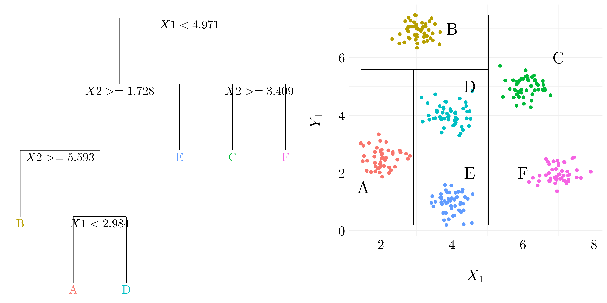
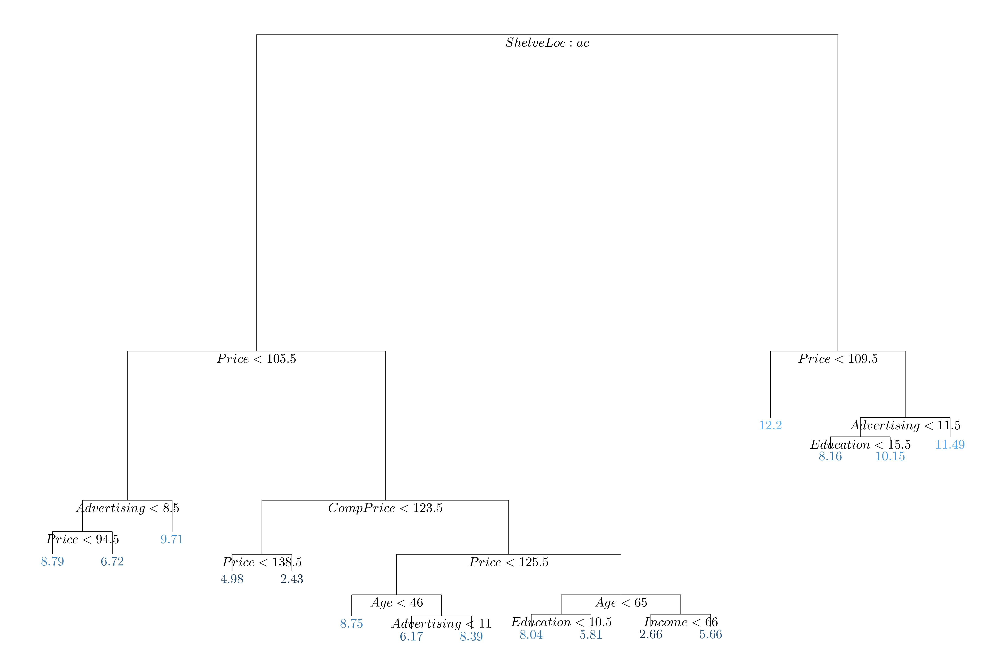
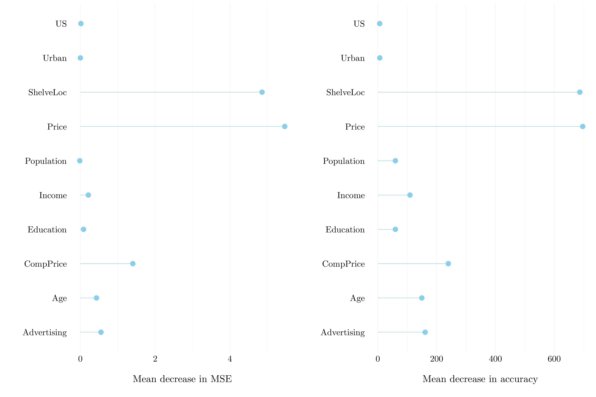
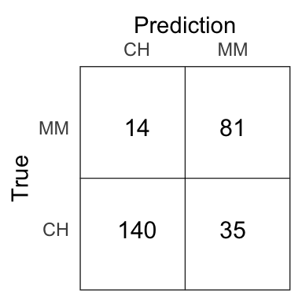
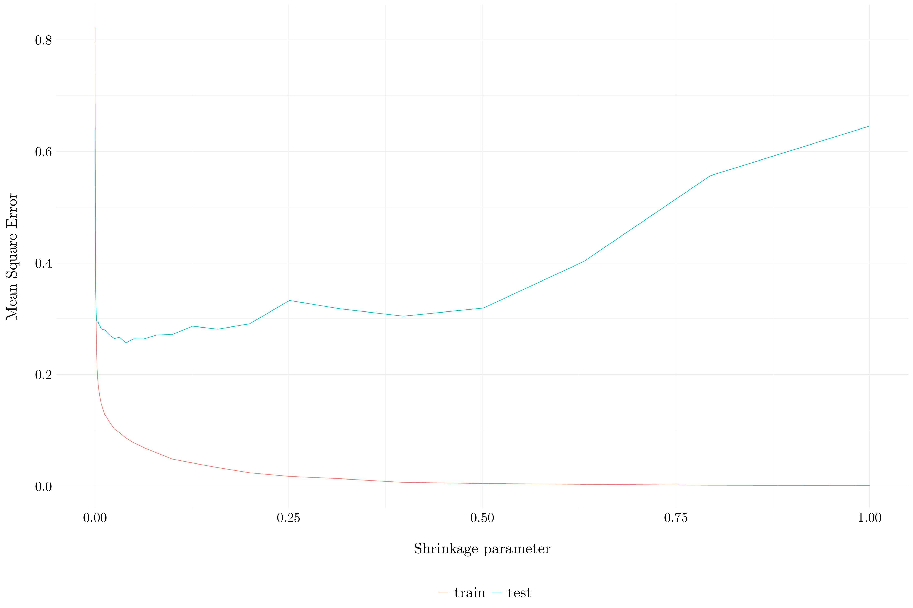
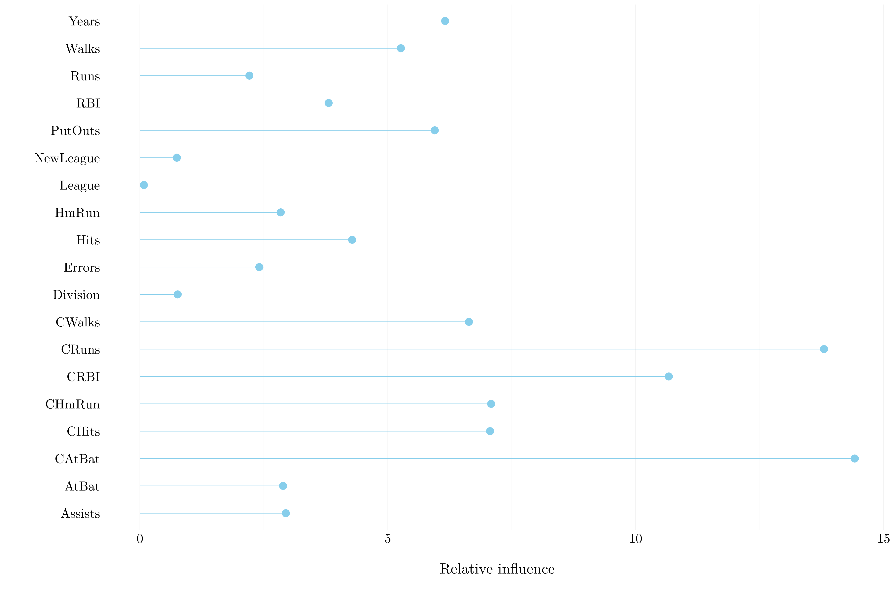
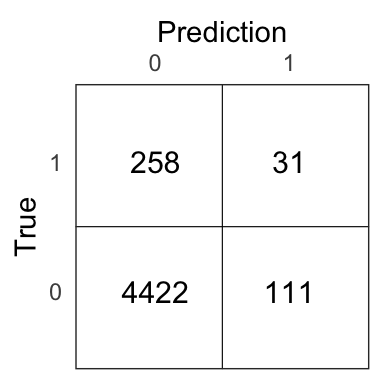

# Tree-based methods


## Conceptual exercises

### Exercise 1.

<div class="figure" style="text-align: center">

<p class="caption">(\#fig:ex1)Example of results from binary splitting.</p>
</div>

### Exercise 2.

Boosting using depth-one trees (or *stumps*) leads to an *additive* model: that is, a model of the form
$$ f(x) = \sum_{j = 1}^p f_j(X_j).$$

Consider only two predictive variables ($x = (X_1~ X_2)^\top$) and let's go through the algorithm 8.2.

Set $\widehat{f}(x) = 0$ and $r_i = y_i$ for all $i$ in the training set. As we want depth-one trees (the number of split is one) and use all the variable, $B$ (the number of trees) will going to be equal to $2$.

The first tree leads to 
$$ \widehat{f}^1(x) = a_1\mathbb{1}(X_1 < c_1) + b_1.$$
So, 
$$ \widehat{f}(x) = 0 + \lambda\widehat{f}^1(x) $$
and
$$ r_i = y_i - \lambda\widehat{f}^1(x_i). $$

We can do the same things with the other variable, and we found out 
$$ \widehat{f}^2(x) = a_2\mathbb{1}(X_2 < c_2) + b_2.$$
So, 
$$ \widehat{f}(x) = \lambda\left(\widehat{f}^1(x) + \widehat{f}^2(x)\right) $$
and
$$ r_i = y_i - \lambda\left(\widehat{f}^1(x_i) + \widehat{f}^2(x)\right). $$

Finally, by induction, we can extend this results to model with $p$ features, and so, leads to an additive model.

### Exercise 3.

Recall the following definition. Denote by $K$ the number of classes.

Gini index:
$$ G = \sum_{k = 1}^K \widehat{p}_{mk}(1 - \widehat{p}_{mk})$$

Classification error:
$$ E = 1 - \max_k \widehat{p}_{mk}$$

Cross-entropy:
$$ D = -\sum_{k = 1}^K \widehat{p}_{mk}\log\widehat{p}_{mk}$$

<div class="figure" style="text-align: center">

<p class="caption">(\#fig:ex3)Error measures</p>
</div>

### Exercise 4.

* *Question (a)*

<div class="figure" style="text-align: center">

<p class="caption">(\#fig:ex4a)Tree</p>
</div>

* *Question (b)*

<div class="figure" style="text-align: center">

<p class="caption">(\#fig:ex4b)Tree</p>
</div>

### Exercise 5.

Suppose we produce ten bootstrapped samples from a dataset containing red and green classes. We then apply a classification tree to each bootstrapped sample and, for a specific value of $X$, produce $10$ estimates of $\mathbb{P}(Red | X)$:
$$ 0.1, 0.15, 0.2, 0.2, 0.55, 0.6, 0.6, 0.65, 0.7, 0.75.$$

By majority vote, we found that the class is `Red` (four out six bootstrapped samples have $\mathbb{P}(Red | X) > 0.5$). By average probability, we found that the class is `Green` (because the mean probability among the bootstrapped samples is 0.45.

### Exercise 6.

1. Use recursive binary splitting to grow a large tree on the training data, stopping only when each terminal node has fewer than some minimum number of observations.

In order to perform recursive binary splitting, we consider all predictors $X_1, \dots, X_p$, and all possible values of the cutpoint $s$ for each of the predictors, and then choose the predictor and cutpoint such that the resulting tree has the lowest RSS. For any $j$ and $s$, we define the pair of half-planes
$$ R_1(j, s) = \{X | X_j < s\} \quad\text{and}\quad R_2(j,s) = \{X | X_j \geq s\},$$
and we seek the value of $j$ and $s$ that minimize the equation
$$ \sum_{i : x_i \in R_1(j, s)}(y_i - \widehat{y}_{R_1})^2 + \sum_{i : x_i \in R_2(j, s)}(y_i - \widehat{y}_{R_2})^2$$,
where $\widehat{y}_{R_1}$ is the mean response for the training observations in $R_1(j, s)$, and $\widehat{y}_{R_2}$ is the mean response for the training observations in $R_2(j, s)$.

Next, we repeat the process, looking for the best predictor and best cutpoint in order to split the data further so as to mnimize the RSS within each of the resulting regions. However, instead of splitting the entire predictor space, we split one of the two previously identified regions. The process continues until a stopping criterion is reached (*e.g* no region contains more than five observations).

2. Apply cost complexity pruning to the large tree in order to obtain a sequence of best subtrees, as a function of $\alpha$.

Rather than considering every possible subtree, we consider a sequence of trees indexed by a nonnegative tuning parameter $\alpha$. For each value of $\alpha$ there corresponds a subtree $T \subset T_0$ such that 
$$ \sum_{m = 1}^{|T|}\sum_{i: x_i \in R_m} (y_i - \widehat{y}_{R_m})^2 + \alpha|T|$$
is as small as possible. $|T|$ indicates the number of terminal nodes of the tree $T$, $R_m$ is the rectangle (*i.e* the subset of predictor space) corresponding to the $m$th terminal node, and $\widehat{y}_{R_m}$ is the predicted response associated with $R_m$. The tuning parameter $\alpha$ controls a trade-off between the subtree's complexity and its fit to the training data.

3. Use $K$-fold cross-validation to choose $\alpha$. That is, diivide the training observations into $K$ folds. For each $k = 1, \dots, K$:
  * Repeat steps 1 and 2 on all but the $k$th fold of the training data.
  * Evaluate the mean squared prediction error on the data in the left-out $k$th fold, as a function of $\alpha$.
Average the results for each value of $\alpha$, and pick $\alpha$ to minimize the average error.

4. Return the subtree from step 2 that corresponds to the chosen value of $\alpha$.


## Applied exercises

### Exercise 7.


```r
set.seed(42)
boston <- as_tibble(Boston)
train <- sample(1:nrow(boston), size = nrow(boston)/2)
p <- ncol(boston) - 1
mtry <- c(p, p/3, round(sqrt(p), 0))

MSE <- matrix(rep(0, length(mtry) * 500), ncol = length(mtry))
for(m in 1:length(mtry)){
    t_boston <- randomForest(medv ~ .,data = boston, subset = train,
                             xtest = select(slice(boston, -train), -medv),
                             ytest = pull(slice(boston, -train), medv),
                             mtry = mtry[m], ntree = 500)
    MSE[, m] <- t_boston$test$mse
}
```

<div class="figure" style="text-align: center">

<p class="caption">(\#fig:ex7i)Test error resulting from random forests</p>
</div>

The MSE decreaeses quickly with the number of trees. Then, the three values for `mtry` give quite the same results and have a MSE around 10 after 100 trees.

### Exercise 8.

We will seek to predict `Sales`, from `Carseats` dataset, using regression trees and related approaches, treating the response a quantitative variable.


```r
carseats <- as_tibble(Carseats)
```


* *Question (a)*


```r
idx <- sample(1:nrow(carseats), size = nrow(carseats)/3)
train <- carseats %>% slice(-idx)
test <- carseats %>% slice(idx)
```

* *Question (b)*


```r
tree_carseat <- tree(Sales ~ ., data = train)
sales_hat <- predict(tree_carseat, newdata = test)
MSE_test <- mean((test$Sales - sales_hat)**2)
```

<div class="figure" style="text-align: center">

<p class="caption">(\#fig:ex8bi)Regression tree fit on the training data</p>
</div>

The MSE on the test set is 5.369 with regression tree.

* *Question (c)*

We use cross-validation in order to determine the optimal level of tree complexity. 


```r
cv_carseat <- cv.tree(tree_carseat, FUN = prune.tree)
tree_pruned_carseat <- prune.tree(tree_carseat, best = cv_carseat$size[which.min(cv_carseat$dev)])
sales_hat_pruned <- predict(tree_pruned_carseat, newdata = test)
MSE_pruned_test <- mean((test$Sales - sales_hat_pruned)**2)
```

<div class="figure" style="text-align: center">

<p class="caption">(\#fig:ex8ci)Pruned regression tree fit on the training data</p>
</div>

The MSE on the test set is 5.539 with pruned regression tree. It does not improve the test MSE.

* *Question (d)*

Then, we use the bagging approach in order to analyze this data. Recall that bagging is simply a special case of a random forest with $m = p$.


```r
set.seed(42)
bagging_carseat <- randomForest(Sales ~ ., data = train, mtry = ncol(carseats)-1, importance = TRUE)
sales_hat_bagging <- predict(bagging_carseat, newdata = test)
MSE_bagging_test <- mean((test$Sales - sales_hat_bagging)**2)
```

The MSE on the test set is 2.832 with bagging.

<div class="figure" style="text-align: center">

<p class="caption">(\#fig:ex8di)Importance plot</p>
</div>

* *Question (e)*

Finally, we use the random forest to analyze the data.


```r
set.seed(42)
m_try <- seq(1, ncol(carseats)-1, by = 1)
rf_carseat <- m_try %>% map(function(m) randomForest(Sales ~ ., data = train, mtry = m, importance = TRUE))
sales_hat_rf <- rf_carseat %>% map(function(rf) predict(rf, newdata = test))
MSE_rf_test <- sales_hat_rf %>% map_dbl(function(predict) mean((test$Sales - predict)**2))
```

<div class="figure" style="text-align: center">

<p class="caption">(\#fig:ex8ei)MSE with respect to $m$</p>
</div>

The best $m$ is 6 for the random forest. It leads to a MSE of 2.6424074.

### Exercise 9.

We will seek to predict `Purchase`, from `OJ` dataset, using regression trees and related approaches, treating the response a qualitative variable.


```r
OJ <- as_tibble(OJ)
```

* *Question (a)*


```r
idx <- sample(1:nrow(OJ), size = 800)
train <- OJ %>% slice(idx)
test <- OJ %>% slice(-idx)
```

* *Question (b)*


```r
set.seed(42)
tree_OJ <- tree(Purchase ~ ., data = train)
```

The training error rate is 16%. The tree has 9 terminal nodes. The used variables to grown the tree are LoyalCH, PriceDiff, SpecialCH, ListPriceDiff.

* *Question (c)*


```r
tree_OJ
```

```
## node), split, n, deviance, yval, (yprob)
##       * denotes terminal node
## 
##  1) root 800 1078.00 CH ( 0.59750 0.40250 )  
##    2) LoyalCH < 0.48285 304  320.70 MM ( 0.22039 0.77961 )  
##      4) LoyalCH < 0.0356415 55    0.00 MM ( 0.00000 1.00000 ) *
##      5) LoyalCH > 0.0356415 249  290.00 MM ( 0.26908 0.73092 )  
##       10) PriceDiff < 0.235 143  132.50 MM ( 0.17483 0.82517 )  
##         20) SpecialCH < 0.5 127   96.18 MM ( 0.12598 0.87402 ) *
##         21) SpecialCH > 0.5 16   21.93 CH ( 0.56250 0.43750 ) *
##       11) PriceDiff > 0.235 106  142.30 MM ( 0.39623 0.60377 ) *
##    3) LoyalCH > 0.48285 496  454.40 CH ( 0.82863 0.17137 )  
##      6) LoyalCH < 0.764572 246  299.20 CH ( 0.70325 0.29675 )  
##       12) PriceDiff < 0.085 82  111.90 MM ( 0.42683 0.57317 )  
##         24) ListPriceDiff < 0.235 56   68.75 MM ( 0.30357 0.69643 ) *
##         25) ListPriceDiff > 0.235 26   32.10 CH ( 0.69231 0.30769 ) *
##       13) PriceDiff > 0.085 164  143.40 CH ( 0.84146 0.15854 )  
##         26) PriceDiff < 0.265 68   80.57 CH ( 0.72059 0.27941 ) *
##         27) PriceDiff > 0.265 96   50.13 CH ( 0.92708 0.07292 ) *
##      7) LoyalCH > 0.764572 250   96.29 CH ( 0.95200 0.04800 ) *
```

Consider the final node $27$. The splitting variable at this node is `PriceDiff`. The splitting value at this node is $0.265$. There are $96$ points in the subtree below this node. The deviance for all points contained in region below this node is $50.13$. The prediction at this node is `Purchase = CH`. About $93\%$ of the points in this node have `Sales = CH` and the remaining points have `Purchase = MM`.

* *Question (d)*

<div class="figure" style="text-align: center">

<p class="caption">(\#fig:ex9d)Classification tree fit on the training data</p>
</div>

`LoyalCH` is the most importante variable of the tree. If `LoyalCH < 0.03`, the tree predicts `MM`. If `LoyalCH > 0.76`, the tree predict `CH`. If `LoyalCH` lies between $0.03$ and $0.76$, the result depends on `PriceDiff`, `SpecialCh` and `ListPriceDiff`.

* *Question (e)*


```r
purchase_hat <- predict(tree_OJ, newdata = test, type = 'class')
MSE_test <- mean(test$Purchase != purchase_hat)
```

The test error rate is 18.15%.

<div class="figure" style="text-align: center">

<p class="caption">(\#fig:ex9ei)Confusion matrix for the tree model on the test set.</p>
</div>

* *Question (f)*


```r
set.seed(42)
cv_OJ <- cv.tree(tree_OJ, FUN = prune.tree)
```

* *Question (g)*

<div class="figure" style="text-align: center">

<p class="caption">(\#fig:ex9g)Cross-validation error rate with respect to the tree size</p>
</div>

* *Question (h)*

The tree that corresponds to the lowest cross-validated classification error rate is of the size 9.

* *Question (i)*


```r
tree_pruned_OJ <- prune.tree(tree_OJ, best = 5)
```

* *Question (j)*

The training error rate is 17.5% of the pruned tree.

* *Question (k)*


```r
purchase_hat_pruned <- predict(tree_pruned_OJ, newdata = test, type = 'class')
MSE_pruned_test <- mean(test$Purchase != purchase_hat_pruned)
```

The test error rate is 21.48% on the pruned tree.

### Exercise 10.

We now use boosting to predict `Salary` in the `Hitters` data set.

* *Question (a)*


```r
hitters <- as_tibble(Hitters)
hitters <- hitters %>% 
  filter(!is.na(hitters$Salary)) %>% 
  mutate(log_Salary = log(Salary))
```

* *Question (b)*


```r
train <- hitters %>% slice(1:200)
test <- hitters %>% slice(201:263)
```

* *Question (c)* and *Question (d)*


```r
set.seed(42)

lambda <- 10**seq(-5, 0, by = 0.1)
MSE_train <- rep(0, length(lambda))
MSE_test <- rep(0, length(lambda))
for(i in 1:length(lambda)){
  boost_hitters <- gbm(log_Salary ~ ., data = select(train, -Salary), 
                       distribution = 'gaussian', n.trees = 1000, shrinkage = lambda[i])
  train_pred <- predict(boost_hitters, train, n.tree = 1000)
  MSE_train[i] <- mean((train$log_Salary - train_pred)**2)
  
  test_pred <- predict(boost_hitters, test, n.tree = 1000)
  MSE_test[i] <- mean((test$log_Salary - test_pred)**2)
}
```

<div class="figure" style="text-align: center">

<p class="caption">(\#fig:ex10d)Mean Square Error</p>
</div>

The minimum test error which is 0.2564687 is obtained at $\lambda = 0.0398107$.

* *Question (e)*


```r
lm_hitters <- lm(log_Salary ~ ., data = select(train, -Salary))
lm_pred <- predict(lm_hitters, data = test)
MSE_lm <- mean((test$log_Salary - lm_pred)**2)
```

The test MSE of the linear regression model is 1.1697807.


```r
X <- model.matrix(log_Salary ~ ., data = select(train, -Salary))
Y <- train$log_Salary
X_test <- model.matrix(log_Salary ~ ., data = select(test, -Salary))
cv_out <- cv.glmnet(X, Y, alpha = 0)
ridge_hitters <- glmnet(X, Y, alpha = 0, lambda = cv_out$lambda.min)
ridge_pred <- predict(ridge_hitters, newx = X_test)
MSE_ridge <- mean((test$log_Salary - ridge_pred)**2)
```

The test MSE of the ridge regression model is 0.4568975.

The boosting model is way better than linear and ridge regression models.

* *Question (f)*


<div class="figure" style="text-align: center">

<p class="caption">(\#fig:ex10fi)Importance plot</p>
</div>

* *Question (g)*


```r
set.seed(42)
bagging_hitters <- randomForest(log_Salary ~ ., data = select(train, -Salary), 
                                mtry = ncol(hitters)-2, importance = TRUE)
salary_hat_bagging <- predict(bagging_hitters, newdata = test)
MSE_bagging_test <- mean((test$log_Salary - salary_hat_bagging)**2)
```

The MSE on the test set is 0.234 with bagging.

### Exercise 11.

* *Question (a)*


```r
caravan <- as_tibble(Caravan)
caravan$Purchase <- ifelse(caravan$Purchase == 'Yes', 1, 0)
train <- caravan %>% slice(1:1000)
test <- caravan %>% slice(1001:5822)
```

* *Question (b)*


<div class="figure" style="text-align: center">

<p class="caption">(\#fig:ex11bi)Importance plot</p>
</div>

* *Question (c)*


```r
test_pred <- predict(boost_caravan, test, n.tree = 1000, type = 'response')
test_pred <- ifelse(test_pred > 0.2, 1, 0)
```

<div class="figure" style="text-align: center">

<p class="caption">(\#fig:ex11ci)Confusion matrix for the boosting model on the test set.</p>
</div>

21.83% of people who are predicted to make a purchase actually end up making one with the boosting model.


```r
knn_model <- knn(select(train, -Purchase), select(test, -Purchase), train$Purchase, k = 5)
```

<div class="figure" style="text-align: center">

<p class="caption">(\#fig:ex11ciii)Confusion matrix for the $k$NN model on the test set.</p>
</div>

11.76% of people who are predicted to make a purchase actually end up making one with the $k$NN model.

### Exercise 12.

Check out this [Kaggle kernel](https://www.kaggle.com/stevengolo/pima-indians-diabetes-model) for a comparison of boosting, bagging and random forests with logistic regression on a diabete dataset. 
