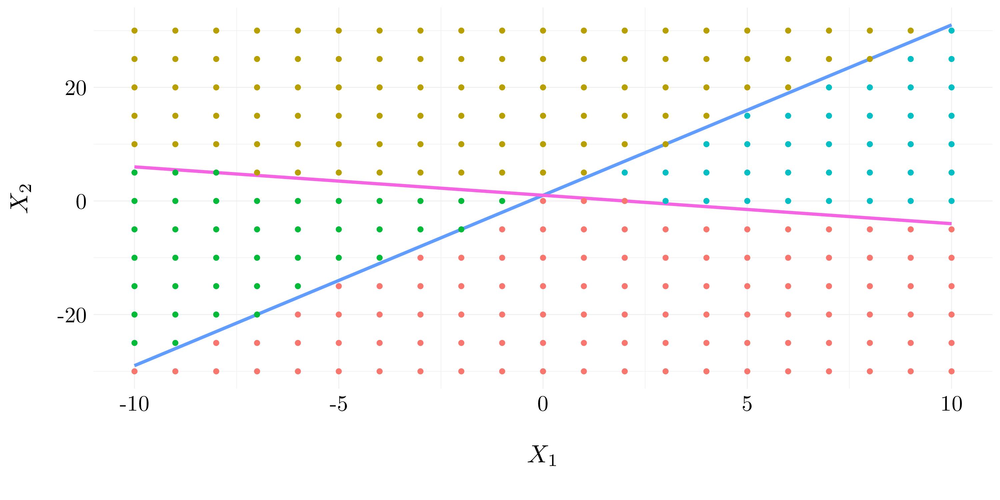
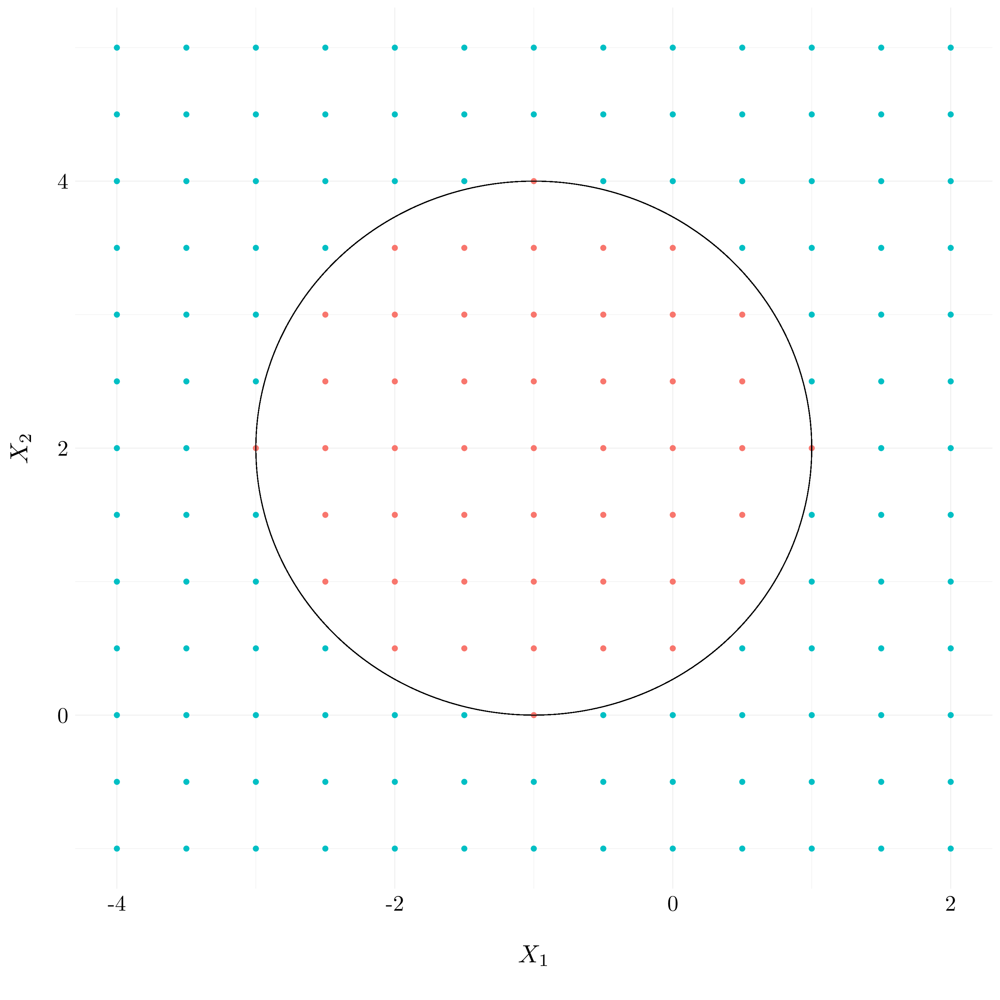
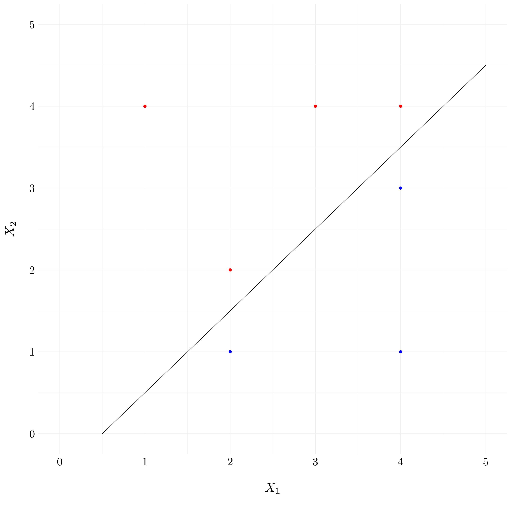
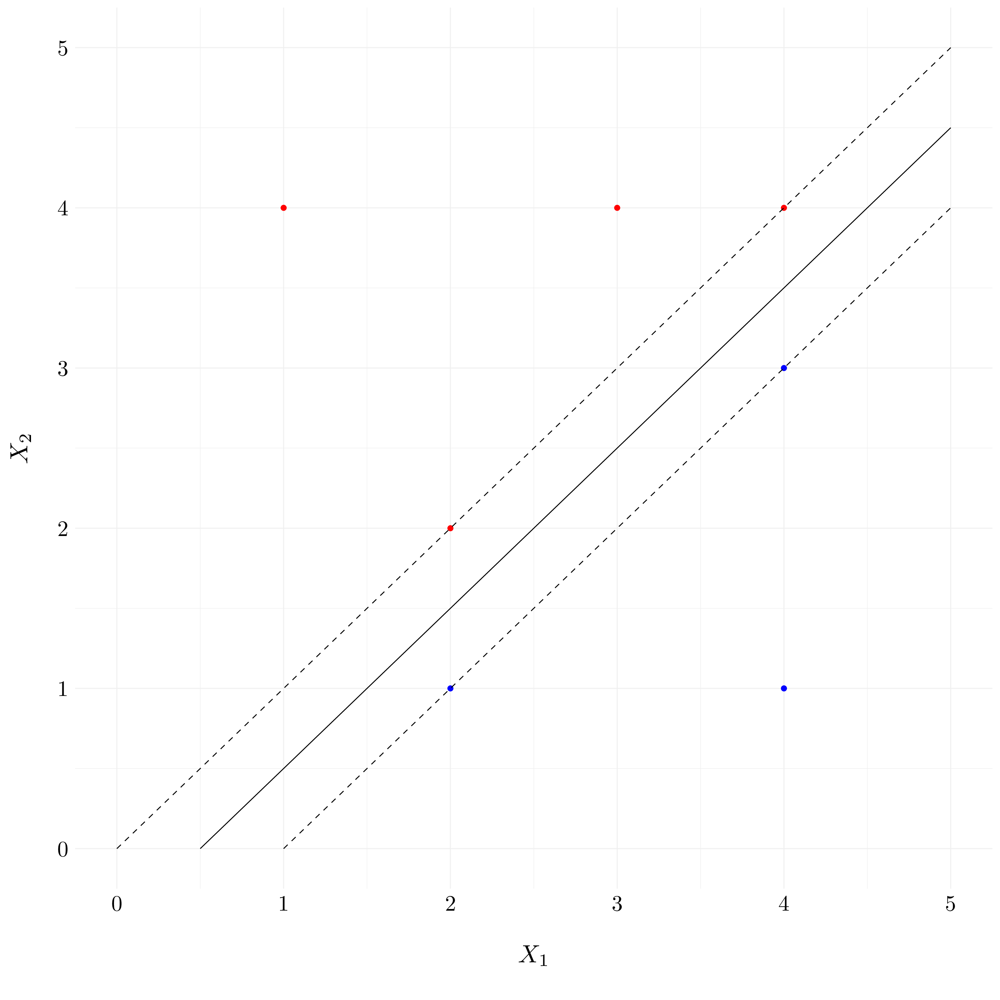
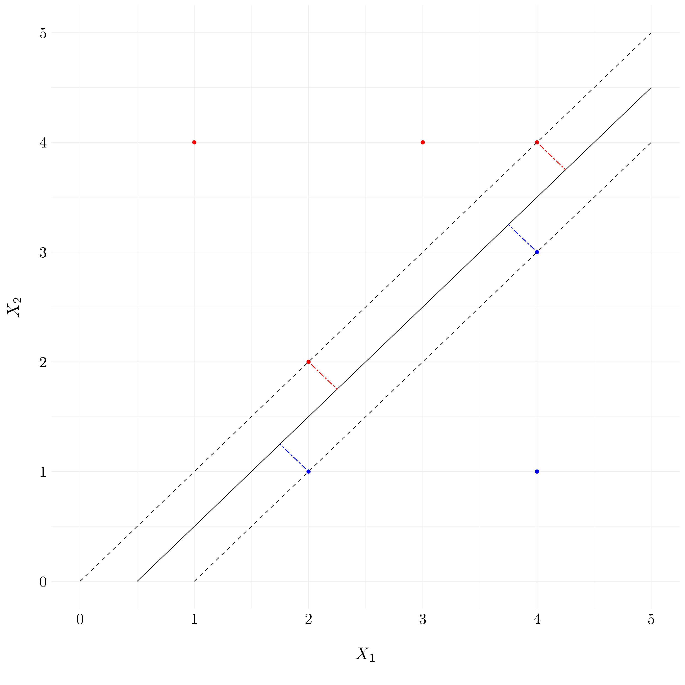
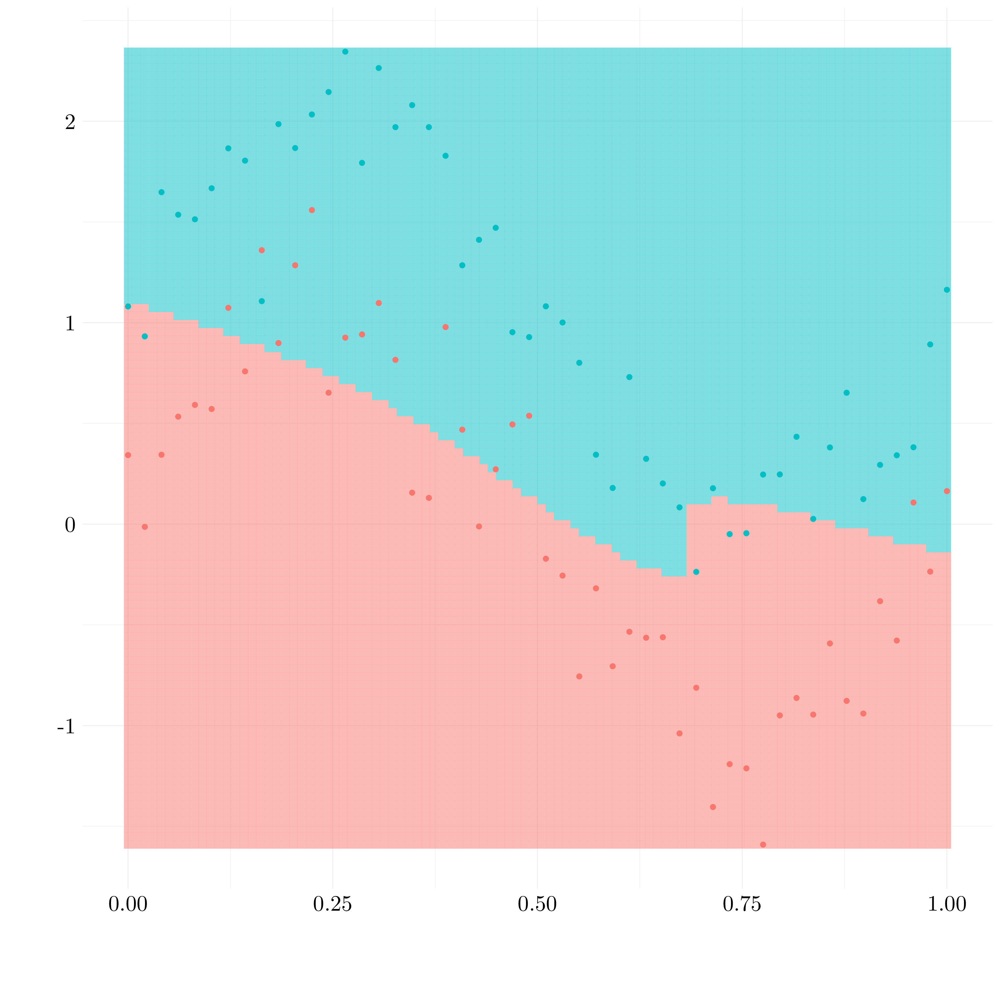
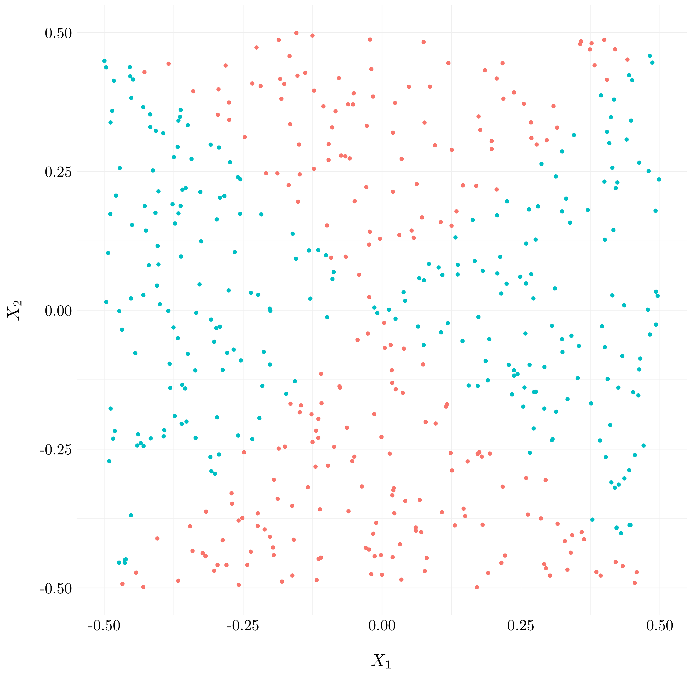
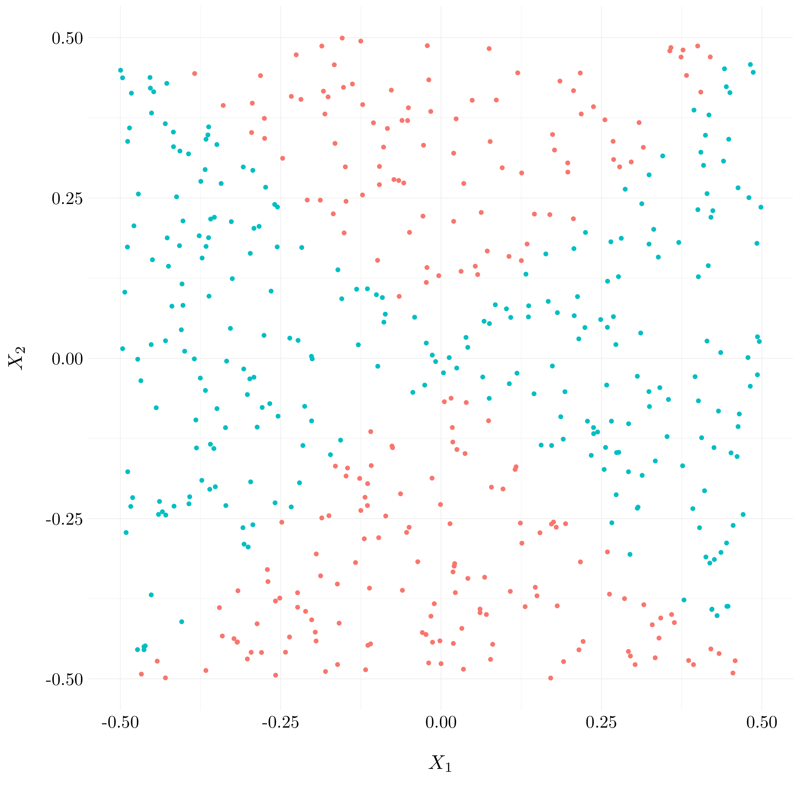
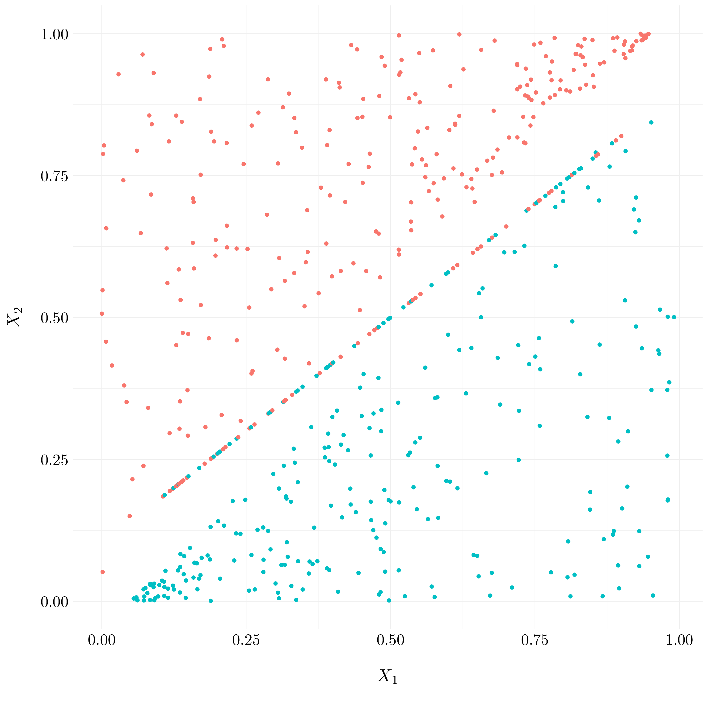
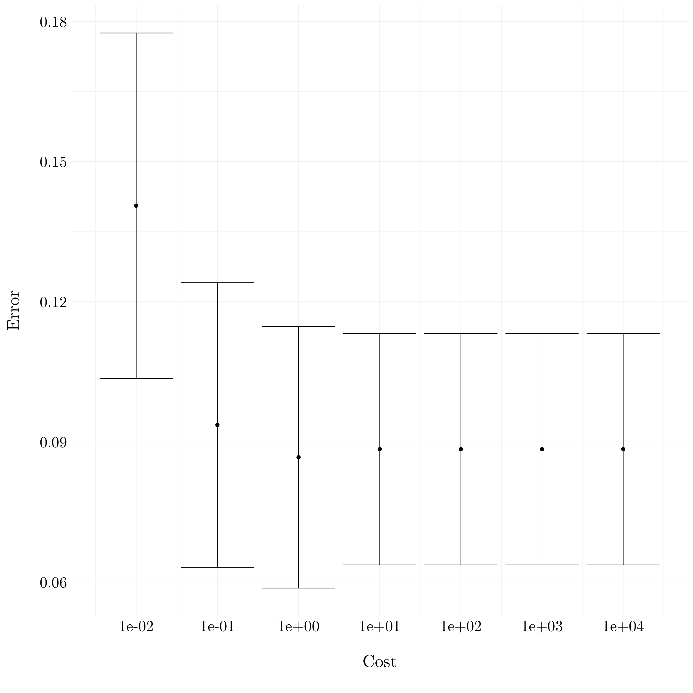

# Support Vector Machines


## Conceptual exercises

### Exercise 1.

This problem involves hyperplanes in two dimensions.

The blue line correspond to the hyperplane $1 + 3X_1 - X_2 = 0$ and the purple line correspond to the hyperplane $-2 + X_1 + 2X_2 = 0$. 

* The blue points are in the space where $1 + 3X_1 - X_2 > 0$ and $-2 + X_1 + 2X_2 > 0$. 
* The red points are in the space where $1 + 3X_1 - X_2 > 0$ and $-2 + X_1 + 2X_2 < 0$. 
* The green points are in the space where $1 + 3X_1 - X_2 < 0$ and $-2 + X_1 + 2X_2 < 0$. 
* The yellow points are in the space where $1 + 3X_1 - X_2 < 0$ and $-2 + X_1 + 2X_2 > 0$.

<div class="figure" style="text-align: center">

<p class="caption">(\#fig:ex1)Example of hyperplanes in two dimensions.</p>
</div>

### Exercise 2.

This problem involves non-linear decision boundary in two dimensions.

* *Question (a)* and *Question (b)*

Let's plot the curve $(1 + X_1)^2 + (2 - X_2)^2 = 4$. The blue points refer to the space where $(1 + X_1)^2 + (2 - X_2)^2 > 4$ and the red points to $(1 + X_1)^2 + (2 - X_2)^2 \leq 4$.

<div class="figure" style="text-align: center">

<p class="caption">(\#fig:ex2)Example of non-linear decision boundary</p>
</div>

* *Question (c)*

The observation $(0, 0)$ will be blue, $(-1, 1)$ red, $(2, 2)$ blue and $(3, 8)$ also blue.

* *Question (d)*

Let's expand the formula $(1 + X_1)^2 + (2 - X_2)^2$.

$$(1 + X_1)^2 + (2 - X_2)^2 = 5 + 2X_1 + X_1^2 + 4 - 4X_2 + X_2^2$$

This expression is linear in terms of $X_1$, $X_2$, $X_1^2$ and $X_2^2$.

### Exercise 3.

We explore the maximal margin classifier on a toy data set.

* *Question (a)* and *Question (b)*

The optimal separating hyperplane aims to separate the two classes by maximising the distance between the closest points of the different classes. So, it has to pass though the middle of the observations $2$ and $5$ which is the point $(2, 1.5)$ and $3$ and $6$ which is the point $(4, 3.5)$. Thus, it leads to the equation $y: x \mapsto x - 0.5$ 


```r
df <- tibble(X1 = c(3, 2, 4, 1, 2, 4, 4),
             X2 = c(4, 2, 4, 4, 1, 3, 1),
             Y = c('R', 'R', 'R', 'R', 'B', 'B', 'B'))
```

<div class="figure" style="text-align: center">

<p class="caption">(\#fig:ex3b)Example of toy dataset with a separating hyperplane</p>
</div>

* *Question (c)*

We rewrite the equation found in the previous question as:
$$0.5 - X_1 + X_2 = 0$$

Then, classify to Red if $0.5 - X_1 + X_2 > 0$, and classify to Blue otherwise.

* *Question (d)*

<div class="figure" style="text-align: center">

<p class="caption">(\#fig:ex3d)Example of the margins</p>
</div>

* *Question (e)*

<div class="figure" style="text-align: center">

<p class="caption">(\#fig:ex3e)Example of the support vectors</p>
</div>

* *Question (f)*

The seventh observation, which is the point $(4, 1)$ do not affect the maximal margin hyperplane because it does not belong to the margins.

* *Question (g)*

A non-optimal separating hyperplane would be 
$$0.1 - 0.8X_1 + X_2 = 0.$$
<div class="figure" style="text-align: center">

<p class="caption">(\#fig:ex3g)Example of the non-optimal hyperplane</p>
</div>

* *Question (h)*

<div class="figure" style="text-align: center">

<p class="caption">(\#fig:ex3h)Example of the non-separable points</p>
</div>

## Applied exercises

### Exercise 4.

We simulate a two-class data set with $100$ observations and two features in which there is a visible but non-linear separation between the two classes.


```r
set.seed(42)
t <- seq(0, 1, length.out = 50)
X_1 <- sin(2*pi*t) + rnorm(50, 0, 0.25)
X_2 <- sin(2*pi*t) + 1 + rnorm(50, 0, 0.25)
df <- tibble(t = c(t, t), X = c(X_1, X_2), cl = as.factor(c(rep(-1, 50), rep(1, 50))))

idx <- sample(1:nrow(df), 50)
train <- df %>% slice(idx)
test <- df %>% slice(-idx)
```

<div class="figure" style="text-align: center">

<p class="caption">(\#fig:ex4data)Simulated data</p>
</div>
The boundary between the two classes is clearly non-linear.

* Linear SVM


```r
svm_linear <- tune('svm', cl ~ ., data = train, 
                       kernel = 'linear', 
                       ranges = list(gamma = 2^(-1:1), cost = 2^(2:4)))
svm_linear_best <- svm_linear$best.model
preds_train <- predict(svm_linear_best, train)
preds_test <- predict(svm_linear_best, test)
```

Around 16% of the train observations are misclassified and 18% of the test observations.

<div class="figure" style="text-align: center">

<p class="caption">(\#fig:ex4plotlinear)Results of linear SVM</p>
</div>

* Polynomial SVM


```r
svm_poly <- tune('svm', cl ~ ., data = train, 
                       kernel = 'polynomial', 
                       ranges = list(gamma = 2^(-1:1), cost = 2^(2:4), degree = 2:5))
svm_poly_best <- svm_poly$best.model
preds_train <- predict(svm_poly_best, train)
preds_test <- predict(svm_poly_best, test)
```

Around 22 of the train observations are misclassified and 22% of the test observations.

<div class="figure" style="text-align: center">

<p class="caption">(\#fig:ex4plotpoly)Results of polynomial SVM</p>
</div>

* Radial SVM


```r
svm_radial <- tune('svm', cl ~ ., data = train, 
                       kernel = 'radial', 
                       ranges = list(gamma = 2^(-1:1), cost = 2^(2:4)))
svm_radial_best <- svm_radial$best.model
preds_train <- predict(svm_radial_best, train)
preds_test <- predict(svm_radial_best, test)
```

Around 4 of the train observations are misclassified and 10% of the test observations.

<div class="figure" style="text-align: center">

<p class="caption">(\#fig:ex4plotradial)Results of radial SVM</p>
</div>

* Conclusion 

Here, the radial kernel shows the best results in term of misclassification error rate. Of course, it was expected because the generating process was a sinus.

### Exercise 5.

We will now see that we can also obtain a non-linear decision boundary by performing logistic regression using non-linear transformations of the features.

* *Question (a)*


```r
X1 <- runif(500) - 0.5
X2 <- runif(500) - 0.5
Y <- as.factor(1 * (X1**2 - X2**2 > 0))
df <- tibble(X1, X2, Y)
```

* *Question (b)*

<div class="figure" style="text-align: center">

<p class="caption">(\#fig:ex5b)Plot of the observations with true classes</p>
</div>

* *Question (c)*


```r
lm_model <- glm(Y ~ ., data = df, family = 'binomial')
```

* *Question (d)*


```r
pred_lm <- predict(lm_model, df, type = 'response')
```

<div class="figure" style="text-align: center">

<p class="caption">(\#fig:ex5di)Plot of the observations with predicted classes for LM model</p>
</div>

The decision boundary is linear and do not fit to the true regression line.

* *Question (e)*


```r
glm_model <- glm(Y ~ poly(X1, 2) + poly(X2, 2) + I(X1 * X2), data = df, family = 'binomial')
```

* *Question (f)*


```r
pred_glm <- predict(glm_model, df, type = 'response')
```

<div class="figure" style="text-align: center">

<p class="caption">(\#fig:ex5fi)Plot of the observations with predicted classes for GLM model</p>
</div>

The decision boundary is not linear and looks like the true decision boundary.

* *Question (g)*


```r
svm_poly <- tune('svm', Y ~ ., data = df, 
                       kernel = 'polynomial', 
                       ranges = list(cost = 2^(2:4)))
svm_poly_best <- svm_poly$best.model
preds_svm <- predict(svm_poly_best, df)
```

<div class="figure" style="text-align: center">

<p class="caption">(\#fig:ex5gi)Results of polynomial SVM</p>
</div>

A linear kernel fails to find non linear boundary.

* *Question (h)*


```r
svm_radial <- tune('svm', Y ~ ., data = df, 
                       kernel = 'radial', 
                       ranges = list(cost = 2^(2:4)))
svm_radial_best <- svm_radial$best.model
preds_svm <- predict(svm_radial_best, df)
```

<div class="figure" style="text-align: center">

<p class="caption">(\#fig:ex5hi)Results of kernel SVM</p>
</div>

A radial kernel performs way better on this data. The prediction boundary seems to be quite close to the true boundary.

* *Question (i)*

So, the support vector machine, with radial kernel, appears to be very good to find non-linear decision boundary. However, even if logistic regression may also found out this kind of boundary, it requires to add non linear transformation of the features to find it. 

### Exercise 6.

* *Question (a)*


```r
set.seed(42)
X1 <- runif(500, 0, 1)
X2 <- c(runif(250, X1[1:250] + 0.05), runif(250, 0, X1[251:500] - 0.05))
noise_X1 <- runif(100, 0.1, 0.9)
noise_X2 <- 0.8 * noise_X1 + 0.1

Y <- as.factor(1 * (X1 - X2 > 0))
noise_Y <- as.factor(sample(c(0, 1), size = 100, replace = TRUE))

df <- tibble(X1, X2, Y) %>% 
  bind_rows(tibble(X1 = sort(noise_X1), X2 = sort(noise_X2), Y = noise_Y)) %>% 
  filter(!is.na(Y))
```

<div class="figure" style="text-align: center">

<p class="caption">(\#fig:ex6ai)Plot of the observations with true classes</p>
</div>

* *Question (b)*


```r
svm_poly <- tune('svm', Y ~ ., data = df, 
                       kernel = 'linear', 
                       ranges = list(cost = 10^(-2:4)))
```

<div class="figure" style="text-align: center">

<p class="caption">(\#fig:ex6bi)Plot of the errors from cross-validation</p>
</div>

* *Question (c)*


```r
set.seed(43)
X1 <- runif(500, 0, 1)
X2 <- runif(500, 0, 1)
Y <- as.factor(1 * (X1 - X2 > 0))
df_test <- tibble(X1, X2, Y)
```


```r
costs = 10**(-2:4)
errors_test <- rep(NA, length(costs))
for(i in 1:length(costs)){
  model_svm <- svm(Y ~ ., data = df, kernel = 'linear', cost = costs[i])
  pred <- predict(model_svm, df_test)
  errors_test[i] <- mean(df_test$Y != pred)
}
```

<div class="figure" style="text-align: center">

<p class="caption">(\#fig:ex6cii)Plot of the errors on the test set</p>
</div>

* *Question (d)*

Here, we see that a smaller cost performs better on the test dataset. But, we do not point out the overfitting phenomenon of a high cost on the train dataset.

### Exercise 7.

We will use support vector approaches in order to predict whether a given car gets high or low gas mileage based on the `Auto` dataset.


```r
auto <- as_tibble(Auto) %>% select(-c('name', 'year', 'origin', 'weight', 'cylinders'))
```

* *Question (a)*

We create a binary variable that takes on a $1$ for cars with gas mileage above the median, and a $0$ for cars with gas mileage below the median.


```r
Y <- 1 * (auto$mpg > median(auto$mpg))
auto <- auto %>% 
  add_column(Y) %>% 
  select(-c('mpg')) %>% 
  mutate_at(vars(Y), funs(as.factor(.)))
```

* *Question (b)*


```r
svm_linear <- tune('svm', Y ~ ., data = auto, 
                       kernel = 'linear', 
                       ranges = list(cost = 10^(-2:4)))
```

<div class="figure" style="text-align: center">

<p class="caption">(\#fig:ex7bi)Plot of the errors from cross-validation</p>
</div>

The lowest cross-validation error is obtained for `cost = 0.1`.

* *Question (c)*


```r
svm_radial <- tune('svm', Y ~ ., data = auto, 
                       kernel = 'radial', 
                       ranges = list(cost = 10^(-2:4),
                                     gamma = 10^(-2:4)))
```

<div class="figure" style="text-align: center">

<p class="caption">(\#fig:ex7ci)Plot of the errors from cross-validation</p>
</div>

The lowest cross-validation error is obtained for `cost = 10000` and `gamma = 0.01`.


```r
svm_poly <- tune('svm', Y ~ ., data = auto, 
                       kernel = 'polynomial', 
                       ranges = list(cost = 10^(-2:4),
                                     degree = 1:4))
```

<div class="figure" style="text-align: center">

<p class="caption">(\#fig:ex7ciii)Plot of the errors from cross-validation</p>
</div>

The lowest cross-validation error is obtained for `cost = 0.1` and `degree = 1`.

* *Question (d)*

<div class="figure" style="text-align: center">

<p class="caption">(\#fig:ex7d)Results based on displacement x horsepower</p>
</div>

### Exercise 8.

The problem involves the `OJ` dataset.


```r
df <- as_tibble(OJ)
```

* *Question (a)*


```r
set.seed(42)
idx <- sample(1:nrow(df), 800)
train <- df %>% slice(idx)
test <- df %>% slice(-idx)
```

* *Question (b)*

Let's fit a support vector classifier to the training data using `cost = 0.01` with `Purchase` as the response and the other variables as predictors.


```r
svm_linear <- svm(Purchase ~ ., data = train, kernel = 'linear', cost = 0.01)
```

Its prodoces 432 supports vectors out of $800$ training points. Out of these, 215 belong to level CH and 217 belong to level MM.

* *Question (c)*


```r
train_error <- mean(train$Purchase != predict(svm_linear, train))
test_error <- mean(test$Purchase != predict(svm_linear, test))
```

The training error rate is 17.12% and the test error rate is 16.3%.

* *Question (d)*


```r
svm_linear <- tune('svm', Purchase ~ ., data = train, 
                       kernel = 'linear', 
                       ranges = list(cost = 10^(seq(-2, 1, by = 0.1))))
```

The optimal `cost` found is 1.

* *Question (e)*


```r
train_error <- mean(train$Purchase != predict(svm_linear$best.model, train))
test_error <- mean(test$Purchase != predict(svm_linear$best.model, test))
```

The training error rate is 16.75% and the test error rate is 16.3%.

* *Question (f)*

We do the same process using support vector machine with radial kernel.


```r
svm_radial <- tune('svm', Purchase ~ ., data = train, 
                       kernel = 'radial', 
                       ranges = list(cost = 10^(seq(-2, 1, by = 0.1))))
```

The optimal `cost` found is 0.6309573.


```r
train_error <- mean(train$Purchase != predict(svm_radial$best.model, train))
test_error <- mean(test$Purchase != predict(svm_radial$best.model, test))
```

The training error rate is 15.25% and the test error rate is 15.56%.

* *Question (f)*

We do the same process using support vector machine with radial kernel.


```r
svm_poly <- tune('svm', Purchase ~ ., data = train, 
                       kernel = 'polynomial', 
                       ranges = list(cost = 10^(seq(-2, 1, by = 0.1)),
                                     degree = 2))
```

The optimal `cost` found is 5.0118723.


```r
train_error <- mean(train$Purchase != predict(svm_poly$best.model, train))
test_error <- mean(test$Purchase != predict(svm_poly$best.model, test))
```

The training error rate is 14.75% and the test error rate is 16.67%.

* *Question (h)*

In this case, it appears that the support vector classifier with radial kernel give the best results in terms of percentage error on the test set for this dataset. However, all the results are pretty close.
