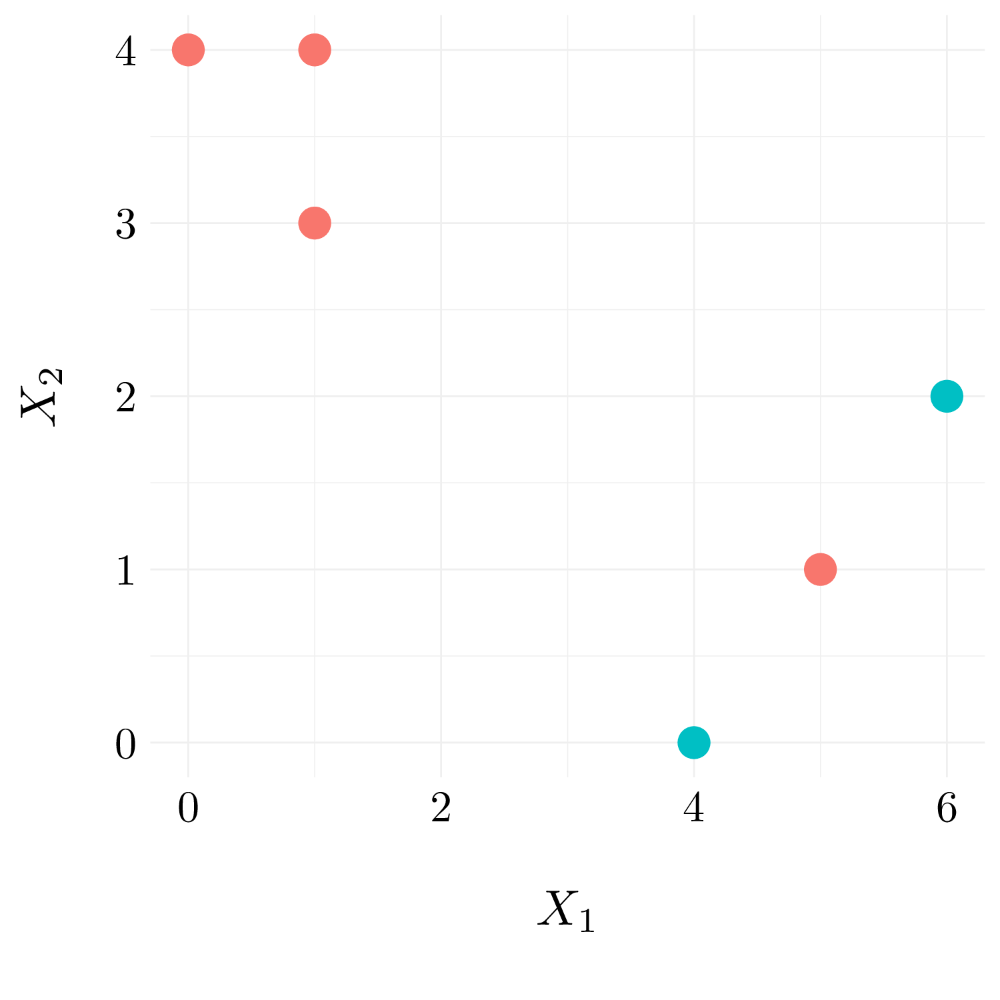
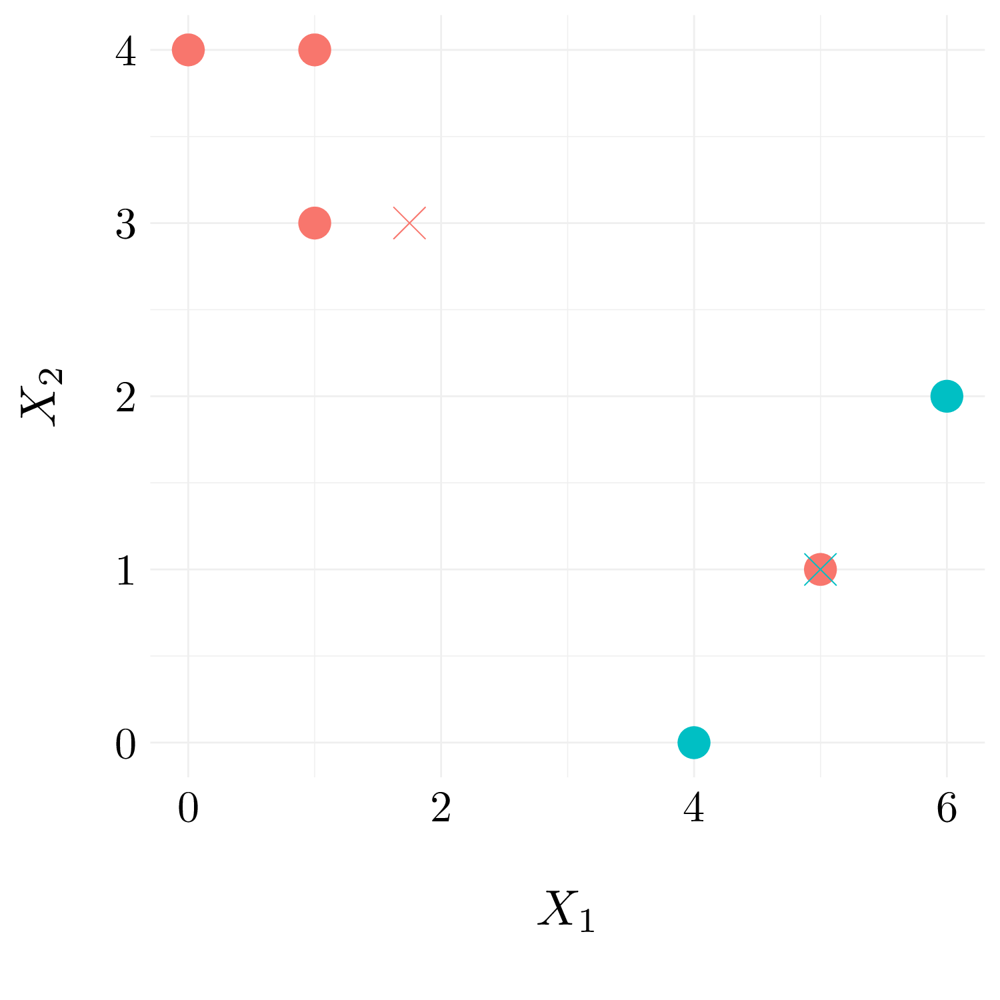
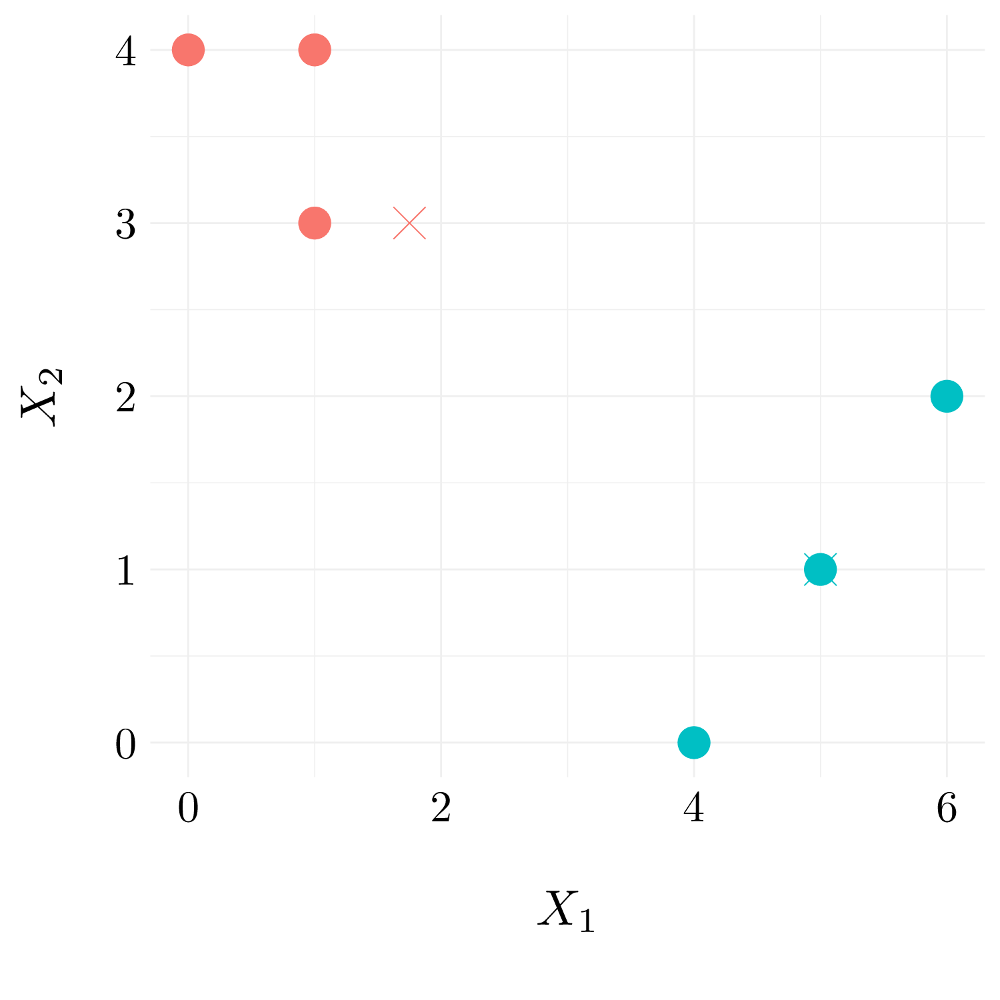
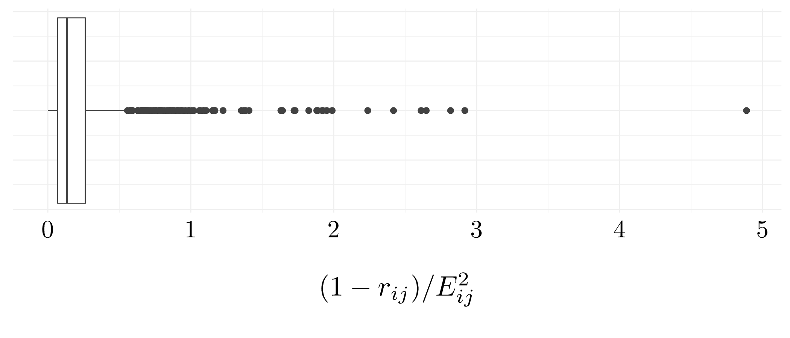
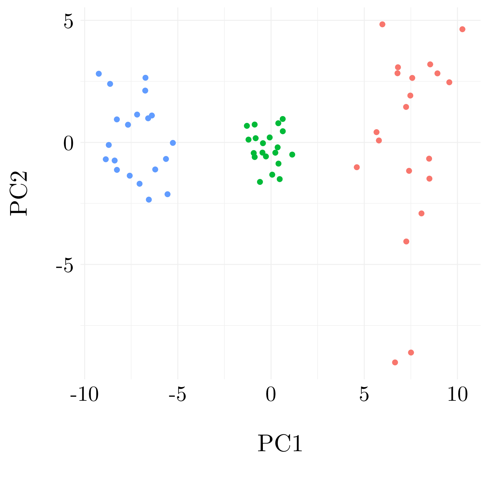

# Unsupervised Learning


## Conceptual exercises

### Exercise 1.

This problem involves the $K$-means clustering algorithm.

* *Question (a)*

We want to prove that 
$$\frac{1}{\lvert C_k \rvert}\sum_{i, i^\prime \in C_k} \sum_{j=1}^p (x_{ij} - x_{i^\prime j})^2 = 2 \sum_{i \in C_k}\sum_{j = 1}^p(x_{ij} - \bar{x}_{kj})^2 \quad\text{where}\quad \bar{x}_{kj} = \frac{1}{\lvert C_k \rvert}\sum_{i \in C_k} x_{ij}.$$

\begin{align*}
\frac{1}{\lvert C_k \rvert}\sum_{i, i^\prime \in C_k} \sum_{j=1}^p (x_{ij} - x_{i^\prime j})^2 
  &= \frac{1}{\lvert C_k \rvert}\sum_{i, i^\prime \in C_k} \sum_{j=1}^p (x_{ij} - \bar{x}_{kj} + \bar{x}_{kj} - x_{i^\prime j})^2 \\
  &= \frac{1}{\lvert C_k \rvert}\sum_{i, i^\prime \in C_k} \sum_{j=1}^p \left((x_{ij} - \bar{x}_{kj})^2 + (x_{i^\prime j} - \bar{x}_{kj})^2 - 2(x_{ij} - \bar{x}_{kj})(x_{i^\prime j} - \bar{x}_{kj})\right) \\
  &= \frac{1}{\lvert C_k \rvert} \sum_{j=1}^p \left(2\lvert C_k \rvert \sum_{i \in C_k}(x_{ij} - \bar{x}_{kj})^2 - 2\sum_{i, i^\prime \in C_k}(x_{ij} - \bar{x}_{kj})(x_{i^\prime j} - \bar{x}_{kj})\right) \\
  &=  2 \sum_{i \in C_k}\sum_{j = 1}^p(x_{ij} - \bar{x}_{kj})^2 - \frac{2}{\lvert C_k \rvert}\sum_{j = 1}^p \sum_{i, i^\prime \in C_k}(x_{ij} - \bar{x}_{kj})(x_{i^\prime j} - \bar{x}_{kj})
\end{align*}

Moreover, 
$$\sum_{j = 1}^p \sum_{i, i^\prime \in C_k}(x_{ij} - \bar{x}_{kj})(x_{i^\prime j} - \bar{x}_{kj}) = 0 \quad\text{because}\quad \sum_{i \in C_k}(x_{ij} - \bar{x}_{kj}) = 0$$

So, the equality is proved.

* *Question (b)*

The previous equation show that minimizing the total within-cluster variation is equivalent to minimize the sum of the Euclideans square distance for each cluster. And thus, assigning each observation to the cluster whise centroid is closest will decrease the objective (10.11).

### Exercise 2.

Suppose that we have four observations, for which we compute a dissimilarity matrix given by
$$\begin{pmatrix}
    & 0.3 & 0.4 & 0.7 \\
0.3 &     & 0.5 & 0.8 \\
0.4 & 0.5 &     & 0.45 \\
0.7 & 0.8 & 0.45 &  \\
\end{pmatrix}.$$


```r
D <- as.dist(matrix(c(0, 0.3, 0.4, 0.7,
                      0.3, 0, 0.5, 0.8,
                      0.4, 0.5, 0, 0.45,
                      0.7, 0.8, 0.45, 0), nrow = 4))
```


* *Question (a)*

<div class="figure" style="text-align: center">

<p class="caption">(\#fig:ex2a)Dendrogram using complete linkage.</p>
</div>

* *Question (b)*

<div class="figure" style="text-align: center">

<p class="caption">(\#fig:ex2b)Dendrogram using single linkage.</p>
</div>

* *Question (c)*

If we cut the dendrogram obtained in question (a) such that two clusters results, we will have one cluster with $1$ and $2$ and the other one will have $3$ and $4$.

* *Question (d)*

If we cut the dendrogram obtained in question (b) such that two clusters results, we will have one cluster with $1$, $2$ and $3$ and the other one will only contain $4$.

* *Question (e)*

<div class="figure" style="text-align: center">

<p class="caption">(\#fig:ex2e)Dendrogram using complete linkage.</p>
</div>

### Exercise 3.

In this problem, we will perform $K$-means clustering manually, with $K = 2$, on a small example with $n = 6$ observations and $p = 2$ features. 


| Obs | $X_1$ | $X_2$ |
| :---: | :---: | :---: |
| 1 | 1 | 4|
| 2 | 1 | 3|
| 3 | 0 | 4|
| 4 | 5 | 1|
| 5 | 6 | 2|
| 6 | 4 | 0|


```r
df <- as_tibble(matrix(c(1, 4, 1, 3, 0, 4, 5, 1, 6, 2, 4, 0), ncol = 2, byrow = TRUE))
```

* *Question (a)*

<div class="figure" style="text-align: center">

<p class="caption">(\#fig:ex3a)Observations.</p>
</div>

* *Question (b)*


```r
set.seed(42)
labels <- sample(c(0, 1), nrow(df), replace = TRUE)
df <- df %>% add_column(label = as.factor(labels))
```

<div class="figure" style="text-align: center">

<p class="caption">(\#fig:ex3bi)Observation with random cluster labels.</p>
</div>

* *Question (c)*


```r
df_centroid <- group_by(df, label) %>% summarise(V1 = mean(V1), V2 = mean(V2))
```

<div class="figure" style="text-align: center">

<p class="caption">(\#fig:ex3c)Observation with random cluster labels and centroid.</p>
</div>

* *Question (d)*

We reassign the observations to their closest centroid.


```r
dist_mat <- df %>% bind_rows(df_centroid) %>% dist() %>% as.matrix()
df$label2 <- 1 * (dist_mat[7, 1:6] > dist_mat[8, 1:6])
```

<div class="figure" style="text-align: center">

<p class="caption">(\#fig:ex3di)Observation with cluster labels.</p>
</div>

* *Question (e) and (f)*

Finally, we recompute the centroid.


```r
df_centroid <- group_by(df, label2) %>% summarise(V1 = mean(V1), V2 = mean(V2))
```

<div class="figure" style="text-align: center">

<p class="caption">(\#fig:ex3e)Observation with random cluster labels and centroid.</p>
</div>

### Exercise 4.

* *Question (a)*

There is not enough information to tell because maximal intercluster dissimilarity could be equal to the mimimal intercluster dissimilarity. However, this case will be very unlikel to happened. Most of the time, the single linkage will fused at a lower height than the complete linkage.

* *Question (b)*

They will fuse at the same height because there is only one observation in each of the cluster.

### Exercise 5.

First, let's consider the case of number of item purchases. The number of computers sold is 0 or 1, and thus will have no impact on the results of $K$-means clustering with Euclidean distance. The two classes will result on the clustering of the number of socks sold. The orange seller will be alone in his cluster and the remaining ones are the other cluster.

When we scales each variable by its standard deviation, the $K$-means clustering result in a clustering computer purchase / no computer purchase because the Euclidean distance in the computer dimension in greater than the one in the socks dimension.

The last scalling give all the weight to the computer, so it will result in a clustering computer purchase / no computer purchase.

### Exercise 6.

* *Question (a)*

The first principal component explains $10\%$ of the variance means that by projecting the data onto the first principal components, the information contains within this projected data corresponds to $10\%$ of the total variation presents in the raw data. We can also say that $90\%$ of the variance is lost by projeting the data onto the first principal component. The first component mostly carries the information of the machine used to perform the test.

* *Question (b)*

We can try to guess why the researcher decides to replace the $(j,i)$th element of $X$ with $x_{ji} - \phi_{j1}z_{i1}$. We would say that we want to remove the information of the machine used for the test from the data. However, ${x_{ij}} - {z_{i1}}{\phi _{j1}}$ corresponds to the remaning information after projecting observations onto the first principal and the remaining information without the machine used.

For the analysis of the PCA, it is suggested to firstly plot a scree plot w.r.t. number of principal components used, find the elbow point at which the number of principal components are preferred, say it is $T$. Then, we can replace the $i$ th original observation $x_i$ in predictor space of dimension $p = 100$ with $z_i$ in reduced predictor space of dimention $T$ which contains sufficient information (whether it is good approximating original observations using such an elbow point depends on the data set). Afterwards, instead of analyzing on a $1000 \times 100$ matrix, we are now able to reduce its size to $1000 \times T$ where $T \ll 100$. 

But, here, analyzing the components of the PCA with two samples $t$-test in not feasible because the information of conditions is lost. 

For the analysis, it may be better to split the dataframe considering the machine used (maybe, perform a $K$-means clustering to retrieve the group). And, then perform the two samples $t$-test on the two group separately.

* *Question (c)*

We will the data `Ch10Ex11.csv` from the book website with some small modification in order to show our method. This dataset consists of $40$ tissue samples with measurements on $1000$ genes. The first $20$ samples are from healthy patients, while the second $20$ are from a diseased group. So, we can consider the first $20$ as the control group and the other $20$ as the treatment group.


```r
df <- read_csv('data/Ch10Ex11.csv', col_names = FALSE)
df <- t(df) %>% as_tibble()
df <- df %>% 
  add_column(group = c(rep('C', 20), rep('T', 20)), .before = 1) %>% # Add group
  sample_frac(1, replace = FALSE) %>% # Random the group
  add_column(machine = c(sample(c(0, 10), 20, replace = TRUE, prob = c(0.8, 0.2)),
                         sample(c(0, 10), 20, replace = TRUE, prob = c(0.2, 0.8))), 
             .before = 1) %>% # Add the machine used
  mutate_at(vars(starts_with('V')), # Shift the mean for one machine
            funs(case_when(machine == 10 ~ . + 1, machine == 0 ~ .)))
```

- Method from the researcher


```r
pca <- prcomp(select(df, starts_with('V'))) # Perform the PCA
X <- select(df, starts_with('V')) - matrix(pca$x[,1], nrow = 40) %*% pca$rotation[,1]
X <- X %>% add_column(group = df$group, .before = 1)
test <- lapply(select(X, starts_with('V')), function(x) t.test(x ~ X$group))
```

The variance explained by the first components is 21.89%. Over the $1000$ genes, we found that 244 have a significative difference between the mean in the Control group and the Treatment group.

- Our method


```r
pca_our <- prcomp(select(df, -group))
test_A <- lapply(select(filter(df, machine == 0), starts_with('V')), 
                 function(x) t.test(x ~ filter(df, machine == 0)$group))
test_B <- lapply(select(filter(df, machine == 10), starts_with('V')), 
                 function(x) t.test(x ~ filter(df, machine == 10)$group))
```

The variance explained by the first components is 23.09% which is an improvement over the PCA without the feature `Machine`.

Over the $1000$ genes, we found that 154 have a significative difference between the mean in the Control group and the Treatment group for the machine A and 142 for the machine B. And they have 113 significative genes in common. This much less than the one wihtout the splitting in two groups, and probably more accurate.

## Applied exercises

### Exercise 7.


```r
df <- as_tibble(USArrests)
euclid_dist <- dist(scale(df))^2 # Compute Euclidean distance
cor_dist <- as.dist(1 - cor(t(scale(df)))) # Compute the correlation distance
```

<div class="figure" style="text-align: center">

<p class="caption">(\#fig:ex7i)Boxplot of Euclidean / Correlation</p>
</div>

### Exercise 8.


```r
df <- as_tibble(USArrests)
df_scaled <- scale(df, center = TRUE, scale = TRUE)
```

* *Question (a)*


```r
pca <- prcomp(df_scaled, center = FALSE, scale. = FALSE)
PVE_a <- pca$sdev**2 / sum(pca$sdev**2); PVE_a 
```

```
## [1] 0.62006039 0.24744129 0.08914080 0.04335752
```

* *Question (b)*


```r
PVE_b <- apply((df_scaled %*% pca$rotation)**2, 2, sum) / sum(df_scaled**2); PVE_b
```

```
##        PC1        PC2        PC3        PC4 
## 0.62006039 0.24744129 0.08914080 0.04335752
```

### Exercise 9.


```r
df <- USArrests
```

* *Question (a)*


```r
hclust_complete <- hclust(dist(df), method = 'complete')
```

<div class="figure" style="text-align: center">

<p class="caption">(\#fig:ex9ai)Dendrogram using complete linkage.</p>
</div>

* *Question (b)*


```r
cut <-  cutree(hclust_complete, 3)
```

The state in the first group: Alabama, Alaska, Arizona, California, Delaware, Florida, Illinois, Louisiana, Maryland, Michigan, Mississippi, Nevada, New Mexico, New York, North Carolina, South Carolina. The state in the second group: Arkansas, Colorado, Georgia, Massachusetts, Missouri, New Jersey, Oklahoma, Oregon, Rhode Island, Tennessee, Texas, Virginia, Washington, Wyoming. And the state in the third group: Connecticut, Hawaii, Idaho, Indiana, Iowa, Kansas, Kentucky, Maine, Minnesota, Montana, Nebraska, New Hampshire, North Dakota, Ohio, Pennsylvania, South Dakota, Utah, Vermont, West Virginia, Wisconsin.

* *Question (c)*


```r
hclust_complete <- hclust(dist(scale(df)), method = 'complete')
```

<div class="figure" style="text-align: center">

<p class="caption">(\#fig:ex9ci)Dendrogram using complete linkage.</p>
</div>

* *Question (d)*

After scaling the variables, measure of dissimilarities at which the fusion occured decreased. Moreover, it is clear that the data should be split in two or four groups, but not in three. The variables should probably be scaled before the inter-observation dissimilarities are computed because the variance is quite different between the variables (different units).

### Exercise 10.

Here, we will generate simulated data, and then perform PCA and $K$-means clustering on the data.

* *Question (a)*


```r
df_A <- matrix(rnorm(20 * 50, 0, 1.5), ncol = 50)
df_B <- matrix(rnorm(20 * 50, 1, 0.8), ncol = 50)
df_C <- matrix(rnorm(20 * 50, 2, 1.2), ncol = 50)
df <- rbind(df_A, df_B, df_C)
```

* *Question (b)*


```r
pca <- prcomp(df)
```

<div class="figure" style="text-align: center">

<p class="caption">(\#fig:ex10bi)Observations into the first principal plan</p>
</div>

* *Question (c)*


```r
clus <- kmeans(df, 3)
kable(table(df_plot$group, clus$cluster))
```

<table>
 <thead>
  <tr>
   <th style="text-align:left;">   </th>
   <th style="text-align:right;"> 1 </th>
   <th style="text-align:right;"> 2 </th>
   <th style="text-align:right;"> 3 </th>
  </tr>
 </thead>
<tbody>
  <tr>
   <td style="text-align:left;"> A </td>
   <td style="text-align:right;"> 20 </td>
   <td style="text-align:right;"> 0 </td>
   <td style="text-align:right;"> 0 </td>
  </tr>
  <tr>
   <td style="text-align:left;"> B </td>
   <td style="text-align:right;"> 0 </td>
   <td style="text-align:right;"> 0 </td>
   <td style="text-align:right;"> 20 </td>
  </tr>
  <tr>
   <td style="text-align:left;"> C </td>
   <td style="text-align:right;"> 0 </td>
   <td style="text-align:right;"> 20 </td>
   <td style="text-align:right;"> 0 </td>
  </tr>
</tbody>
</table>

The results are perfect.

* *Question (d)*


```r
clus <- kmeans(df, 2)
kable(table(df_plot$group, clus$cluster))
```

<table>
 <thead>
  <tr>
   <th style="text-align:left;">   </th>
   <th style="text-align:right;"> 1 </th>
   <th style="text-align:right;"> 2 </th>
  </tr>
 </thead>
<tbody>
  <tr>
   <td style="text-align:left;"> A </td>
   <td style="text-align:right;"> 0 </td>
   <td style="text-align:right;"> 20 </td>
  </tr>
  <tr>
   <td style="text-align:left;"> B </td>
   <td style="text-align:right;"> 20 </td>
   <td style="text-align:right;"> 0 </td>
  </tr>
  <tr>
   <td style="text-align:left;"> C </td>
   <td style="text-align:right;"> 20 </td>
   <td style="text-align:right;"> 0 </td>
  </tr>
</tbody>
</table>

Two of the classes almost fuse.

* *Question (e)*

```r
clus <- kmeans(df, 4)
kable(table(df_plot$group, clus$cluster))
```

<table>
 <thead>
  <tr>
   <th style="text-align:left;">   </th>
   <th style="text-align:right;"> 1 </th>
   <th style="text-align:right;"> 2 </th>
   <th style="text-align:right;"> 3 </th>
   <th style="text-align:right;"> 4 </th>
  </tr>
 </thead>
<tbody>
  <tr>
   <td style="text-align:left;"> A </td>
   <td style="text-align:right;"> 0 </td>
   <td style="text-align:right;"> 0 </td>
   <td style="text-align:right;"> 0 </td>
   <td style="text-align:right;"> 20 </td>
  </tr>
  <tr>
   <td style="text-align:left;"> B </td>
   <td style="text-align:right;"> 0 </td>
   <td style="text-align:right;"> 0 </td>
   <td style="text-align:right;"> 20 </td>
   <td style="text-align:right;"> 0 </td>
  </tr>
  <tr>
   <td style="text-align:left;"> C </td>
   <td style="text-align:right;"> 14 </td>
   <td style="text-align:right;"> 6 </td>
   <td style="text-align:right;"> 0 </td>
   <td style="text-align:right;"> 0 </td>
  </tr>
</tbody>
</table>

One of the true classe is splitted in two.

* *Question (f)*


```r
clus <- kmeans(pca$x[,1:2], 3)
kable(table(df_plot$group, clus$cluster))
```

<table>
 <thead>
  <tr>
   <th style="text-align:left;">   </th>
   <th style="text-align:right;"> 1 </th>
   <th style="text-align:right;"> 2 </th>
   <th style="text-align:right;"> 3 </th>
  </tr>
 </thead>
<tbody>
  <tr>
   <td style="text-align:left;"> A </td>
   <td style="text-align:right;"> 0 </td>
   <td style="text-align:right;"> 20 </td>
   <td style="text-align:right;"> 0 </td>
  </tr>
  <tr>
   <td style="text-align:left;"> B </td>
   <td style="text-align:right;"> 0 </td>
   <td style="text-align:right;"> 0 </td>
   <td style="text-align:right;"> 20 </td>
  </tr>
  <tr>
   <td style="text-align:left;"> C </td>
   <td style="text-align:right;"> 20 </td>
   <td style="text-align:right;"> 0 </td>
   <td style="text-align:right;"> 0 </td>
  </tr>
</tbody>
</table>

Once again, we found a perfect match!

* *Question (g)*


```r
clus <- kmeans(scale(df), 3)
kable(table(df_plot$group, clus$cluster))
```

<table>
 <thead>
  <tr>
   <th style="text-align:left;">   </th>
   <th style="text-align:right;"> 1 </th>
   <th style="text-align:right;"> 2 </th>
   <th style="text-align:right;"> 3 </th>
  </tr>
 </thead>
<tbody>
  <tr>
   <td style="text-align:left;"> A </td>
   <td style="text-align:right;"> 0 </td>
   <td style="text-align:right;"> 0 </td>
   <td style="text-align:right;"> 20 </td>
  </tr>
  <tr>
   <td style="text-align:left;"> B </td>
   <td style="text-align:right;"> 0 </td>
   <td style="text-align:right;"> 20 </td>
   <td style="text-align:right;"> 0 </td>
  </tr>
  <tr>
   <td style="text-align:left;"> C </td>
   <td style="text-align:right;"> 20 </td>
   <td style="text-align:right;"> 0 </td>
   <td style="text-align:right;"> 0 </td>
  </tr>
</tbody>
</table>

The results can be good of not depending on the initialization scheme.

### Exercise 11.

We will the data `Ch10Ex11.csv` from the book website. This dataset consists of $40$ tissue samples with measurements on $1000$ genes. The first $20$ samples are from healthy patients, while the second $20$ are from a diseased group.

* *Question (a)*


```r
df <- read_csv('data/Ch10Ex11.csv', col_names = FALSE)
```

* *Question (b)*


```r
cor_dist <- as.dist(1 - cor(df))
hclust_complete <- hclust(cor_dist, method = 'complete')
```

<div class="figure" style="text-align: center">

<p class="caption">(\#fig:ex11bi)Dendrogram using complete linkage.</p>
</div>


```r
cor_dist <- as.dist(1 - cor(df))
hclust_single <- hclust(cor_dist, method = 'single')
```

<div class="figure" style="text-align: center">

<p class="caption">(\#fig:ex11biii)Dendrogram using single linkage.</p>
</div>


```r
cor_dist <- as.dist(1 - cor(df))
hclust_average <- hclust(cor_dist, method = 'average')
```

<div class="figure" style="text-align: center">

<p class="caption">(\#fig:ex11bv)Dendrogram using average linkage.</p>
</div>

Depending on the linkage, the genes are splitted between two or three groups.

* *Question (c)*

In order to find the genes that differ the most across the two groups, we can run a $K$-means (with $K = 2$) in order to split the two groups and then perform a two samples $t$-test to find the genes that have significative difference between the groups.


```r
clus <- kmeans(t(df), 2)
df_clus <- as_tibble(t(df)) %>% add_column(group = clus$cluster, .before = 1)
test <- lapply(select(df_clus, starts_with('V')), 
                 function(x) t.test(x ~ df_clus$group))
```

Over the $1000$ genes, we found that 158 have a significative difference between the mean in the healthy and the diseased group. These genes are the following: V11, V12, V13, V14, V15, V16, V17, V18, V19, V20, V135, V156, V501, V502, V503, V504, V505, V506, V507, V508, V509, V510, V511, V512, V513, V514, V515, V516, V517, V518, V519, V520, V521, V522, V523, V524, V525, V526, V527, V528, V529, V530, V531, V532, V533, V534, V535, V536, V537, V538, V539, V540, V541, V542, V543, V544, V545, V546, V547, V548, V549, V550, V551, V552, V553, V554, V555, V556, V557, V558, V559, V560, V561, V562, V563, V564, V565, V566, V567, V568, V569, V570, V571, V572, V573, V574, V575, V576, V577, V578, V579, V580, V581, V582, V583, V584, V585, V586, V587, V588, V589, V590, V591, V592, V593, V594, V595, V596, V597, V598, V599, V600.
